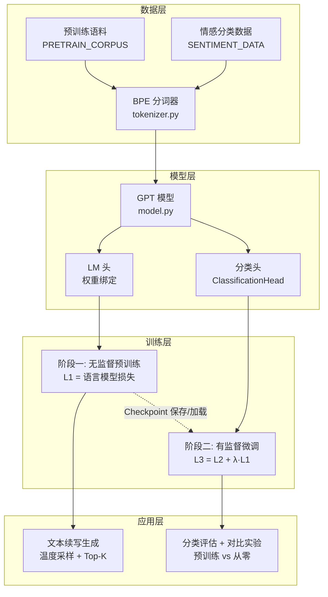

本页是 GPT-1 复现项目的总入口，面向初学者梳理 **"无监督预训练 → 有监督微调"** 这一开创性范式在本仓库中的整体落地方案。你将在此理解项目的核心动机、架构全貌、各文件职责以及与原始论文的对应关系，从而在后续阅读中建立清晰的导航坐标。

---

## 一、GPT-1 是什么？为什么它重要？

2018 年，OpenAI 发表论文 *Improving Language Understanding by Generative Pre-Training*（Radford et al.），提出了一个核心思想：**先在大规模无标注文本上做语言模型预训练，再用少量标注数据在下游任务上微调**。这一方法在自然语言推理、问答、分类等任务上取得了当时最优或接近最优的成绩，标志着 Transformer 生成式预训练范式的正式确立——它正是后来 GPT-2、GPT-3 乃至 ChatGPT 的技术起点。

传统的自然语言处理需要为每个任务设计专门的架构和特征工程，而 GPT-1 的贡献在于：**用统一的 Transformer 架构 + 统一的预训练目标，通过改变输入拼接方式即可适配多种任务**。本仓库将论文的核心方法忠实复现为一个自包含、可离线运行的最小教学项目。

Sources: [README.md](README.md#L1-L8)

---

## 二、核心复现目标

本项目的复现目标可以用以下三层结构概括：

| 层次 | 论文方法 | 本仓库对应 | 核心价值 |
|------|---------|-----------|---------|
| **架构对齐** | 仅解码器 Transformer（Pre-LN + GELU + 学习位置编码） | `model.py` 中 `GPTModel` / `Block` / `CausalSelfAttention` / `FeedForward` | 在可缩放配置上忠实还原论文架构 |
| **训练范式对齐** | 两阶段：L1 无监督预训练 → L3 微调（L2 + λ·L1） | `train.py` 中 `pretrain` / `finetune` | 验证辅助 LM 目标与预训练收益 |
| **任务适配对齐** | 论文 Figure 2 的四种输入变换 | `data.py` 中四种 `*_input` 函数 | 用序列拼接 + `[Extract]` 位置统一适配任务 |

为在普通电脑上快速运行，本实现采用**教学小规模配置**（4 层 / 128 维 / 4 头，内置小型语料），但架构、损失函数和训练配方均严格对齐论文与 OpenAI 官方实现 `openai/finetune-transformer-lm`。

Sources: [README.md](README.md#L6-L8), [model.py](model.py#L1-L11), [train.py](train.py#L1-L8)

---

## 三、系统架构全景

以下 Mermaid 图展示了从原始文本到训练完成的完整数据流，帮助你在进入任何单文件解析之前建立全局认知。



**阅读这张图的要点**：数据从左上角进入，先经 BPE 分词器转为 Token ID，然后被送入 GPT 模型。模型拥有两个出口——LM 头用于预训练阶段的"预测下一个 Token"，分类头用于微调阶段的下游任务。预训练权重的 Checkpoint 可被保存和重新加载，从而实现"预训练 → 微调"的分离式两阶段流程。

---

## 四、文件结构与职责划分

本项目仅由 **5 个 Python 文件**构成，没有任何外部框架依赖（除 PyTorch），结构极致简洁：

```
30_gpt1/
├── model.py       ← GPT 架构与任务头
├── tokenizer.py   ← 自包含 BPE 分词器
├── data.py        ← 语料、LM 批数据、四种任务变换
├── train.py       ← 预训练 / 微调 / 评估训练循环
├── main.py        ← 入口：编排全流程
└── README.md      ← 项目说明
```

每个文件的职责边界清晰，形成自底向上的依赖链：

| 文件 | 核心类/函数 | 职责 | 被谁依赖 |
|------|-----------|------|---------|
| `tokenizer.py` | `BPETokenizer` | 从零实现 BPE 训练、编码、解码，含 4 个特殊 Token | `main.py`, `data.py`(间接) |
| `data.py` | `PRETRAIN_CORPUS`, `SENTIMENT_DATA`, `lm_batch`, `classification_input` 等 | 内置语料、语言模型批采样、论文 Figure 2 四种任务变换、分类批整理 | `main.py`, `train.py` |
| `model.py` | `GPTConfig`, `GPTModel`, `Block`, `CausalSelfAttention`, `GPT`, `LMHead`, `ClassificationHead` | 完整 GPT 架构 + LM 头 + 分类头，权重初始化 N(0, 0.02) | `main.py`, `train.py` |
| `train.py` | `pretrain`, `finetune`, `evaluate`, `make_scheduler` | 预训练循环、微调循环（L3 = L2 + λ·L1）、评估、学习率调度 | `main.py` |
| `main.py` | `main`, `generate`, `save_checkpoint`, `load_gpt` | 编排：分词 → 建模 → 预训练 → 微调 → 评估 → 演示 | 程序入口 |

Sources: [README.md](README.md#L37-L42), [main.py](main.py#L14-L17)

---

## 五、两阶段训练范式详解

GPT-1 的核心创新正是这两个阶段的分离设计。理解它，就理解了整个项目的灵魂。

### 阶段一：无监督预训练

模型在无标注文本上学习**预测下一个 Token**。给定上下文 $u_{i-k}, \dots, u_{i-1}$，模型最大化第 $i$ 个 Token 的对数似然：

$$L_1 = -\sum_i \log P(u_i \mid u_{i-k}, \dots, u_{i-1})$$

此阶段不依赖任何人工标注，仅需原始文本。预训练后的模型具备了通用的语言理解和生成能力。

### 阶段二：有监督微调

在少量标注数据上微调模型以适配具体任务。微调时，分类损失 $L_2$ 之外，**额外加入同一序列上的语言模型损失 $L_1$ 作为辅助目标**：

$$L_3 = L_2 + \lambda \cdot L_1 \quad (\lambda = 0.5)$$

辅助 LM 目标的作用是在微调过程中**保留预训练习得的通用语言能力**，防止模型在小数据上过拟合任务特有模式，从而加速收敛并提升泛化。本仓库中 `train.py` 的 `finetune` 函数完整实现了这一组合损失。

Sources: [train.py](train.py#L1-L8), [train.py](train.py#L83-L131)

---

## 六、教学规模 vs 论文配置

本项目在可运行性与忠实度之间做了精确取舍——架构和算法完全对齐论文，但规模缩小到可在普通电脑上秒级运行的级别：

| 配置项 | 本仓库（教学） | 论文 GPT-1 Small | 论文 GPT-1 Large |
|--------|-------------|-----------------|-----------------|
| 层数 | 4 | 12 | 12 |
| 隐藏维度 | 128 | 768 | 1024 |
| 注意力头数 | 4 | 12 | 16 |
| 最大序列长度 | 64 | 512 | 512 |
| 参数量 | ~10 万级 | ~117M | ~340M |
| 预训练语料 | 内置约 60 句英文文本 | BooksCorpus (7000+ 本书) | BooksCorpus |
| 训练设备 | CPU / MPS / CUDA 均可 | 多 GPU | 多 GPU |

模型配置在 `GPTConfig` 数据类中统一管理，只需修改几个数字即可缩放到论文级别的规模。

Sources: [model.py](model.py#L20-L31), [main.py](main.py#L124-L127)

---

## 七、论文要点与代码对照速查

下表是快速定位论文概念在代码中实现位置的导航索引，更详细的逐条解析请参阅 [论文要点与代码对照表](3-lun-wen-yao-dian-yu-dai-ma-dui-zhao-biao-cong-li-lun-dao-shi-xian)。

| 论文要点 | 代码位置 | 说明 |
|---------|---------|------|
| 仅解码器 Transformer（Pre-LN 残差） | `model.py` Block#L100-L110 | LayerNorm 在子层之前 |
| 因果多头自注意力（掩码） | `model.py` CausalSelfAttention#L41-L77 | 上三角 -inf 掩码 |
| 学习的位置编码（非正弦） | `model.py` GPTModel#L123 | `nn.Embedding(n_ctx, n_embd)` |
| GELU 前馈网络 | `model.py` FeedForward#L79-L90 | 内层维度 4×n_embd |
| 权重初始化 N(0, 0.02) | `model.py` _init_weights#L129-L139 | Linear / Embedding 均适用 |
| LM 头权重绑定 | `model.py` LMHead#L151-L159 | `hidden @ wte.weight.t()` |
| 无监督预训练 L1 | `train.py` pretrain#L49-L77 | 下一个 Token 交叉熵 |
| 微调 L3 = L2 + λ·L1 | `train.py` finetune#L83-L131 | λ = 0.5，辅助 LM 损失 |
| 学习率线性 Warmup + 余弦/线性衰减 | `train.py` make_scheduler#L40-L43 | 预训练余弦，微调线性 |
| 论文 Figure 2 四种任务变换 | `data.py`#L195-L231 | 分类 / 蕴含 / 相似度 / 多选 |
| BPE 子词分词 | `tokenizer.py` BPETokenizer#L27-L121 | 自包含，无外部依赖 |

---

## 八、建议阅读路径

本 Wiki 分为 **"快速上手"** 和 **"深度解析"** 两大板块。作为初学者，建议按以下顺序推进：

### 第一步：让项目跑起来

👉 [快速启动：环境要求与一键运行](2-kuai-su-qi-dong-huan-jing-yao-qiu-yu-jian-yun-xing) — 了解依赖安装和运行方式，亲手体验完整训练流程。

### 第二步：建立理论-代码映射

👉 [论文要点与代码对照表：从理论到实现](3-lun-wen-yao-dian-yu-dai-ma-dui-zhao-biao-cong-li-lun-dao-shi-xian) — 系统性地把论文每个核心概念定位到代码，构建全局理解。

### 第三步：逐模块深度精读

进入 **深度解析** 板块，按以下推荐顺序阅读各系列：

1. **模型架构**（`model.py`）：从 [整体设计：仅解码器 Transformer 的层叠结构](4-zheng-ti-she-ji-jin-jie-ma-qi-transformer-de-ceng-die-jie-gou) 开始，理解 GPT 的骨架
2. **BPE 分词器**（`tokenizer.py`）：从 [BPE 训练算法：从字符到子词的迭代合并](12-bpe-xun-lian-suan-fa-cong-zi-fu-dao-zi-ci-de-die-dai-he-bing) 开始，理解文本如何变成数字
3. **数据构建**（`data.py`）：从 [预训练语料与情感分类数据集设计](15-yu-xun-lian-yu-liao-yu-qing-gan-fen-lei-shu-ju-ji-she-ji) 开始，理解数据的组织方式
4. **训练流程**（`train.py`）：从 [学习率调度：线性 Warmup + 余弦/线性衰减](19-xue-xi-lu-diao-du-xian-xing-warmup-yu-xian-xing-shuai-jian) 开始，理解模型如何学习
5. **实验与应用**（`main.py`）：从 [完整训练管线：预训练 → 微调 → 评估的编排逻辑](23-wan-zheng-xun-lian-guan-xian-yu-xun-lian-wei-diao-ping-gu-de-bian-pai-luo-ji) 开始，理解全流程编排

---

## 小结

本仓库用一个约 800 行代码的自包含项目，完整还原了 GPT-1 论文的核心方法论：**生成式预训练的语言理解框架**。它对初学者的价值在于——你可以在几分钟内跑通"训练分词器 → 预训练语言模型 → 微调分类器 → 观察预训练收益"的完整链路，用极低的门槛触及现代大语言模型的底层架构。理解了这个项目，你就拥有了通往 GPT-2/3 乃至 Transformer 全生态的认知基座。