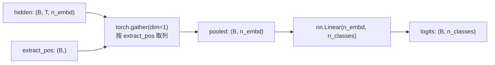
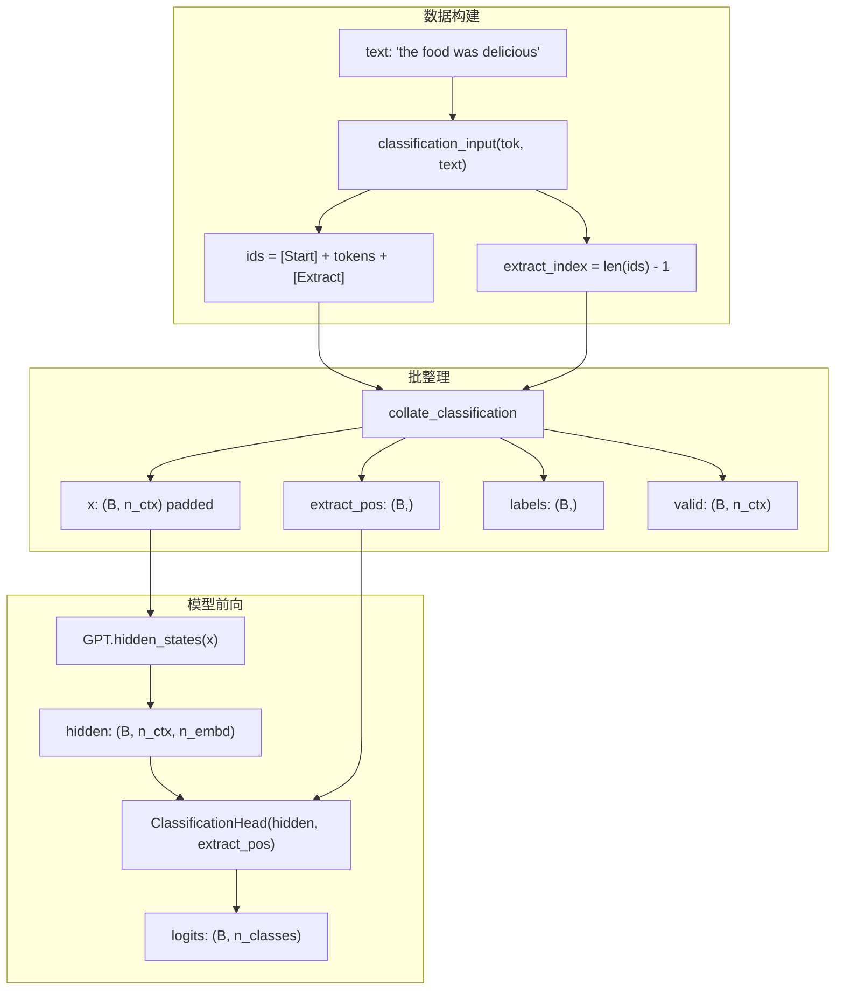
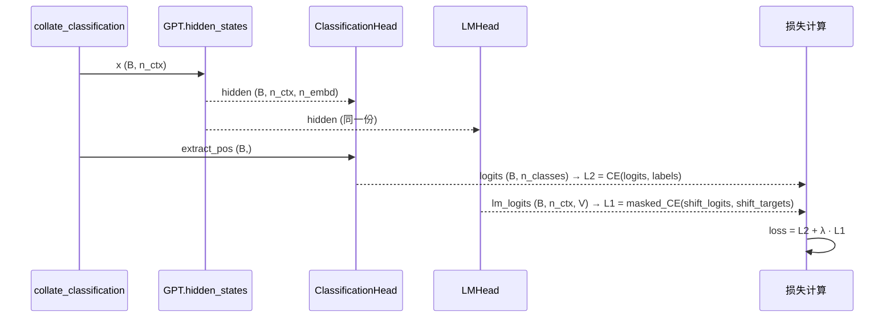

GPT-1 在预训练阶段是一个纯生成式语言模型——它逐 token 预测下一个词，输出的是整个词表上的概率分布。当下游需要执行分类任务时，模型必须把变长序列压缩成一个固定维度的语义表征，再映射到离散类别。GPT-1 论文给出的方案极为简洁：在输入末尾追加一个特殊 token `[Extract]`，取该位置的最终隐藏向量，过一个单层线性投影，直接输出类别 logits。本页聚焦于 `ClassificationHead` 的结构设计、`[Extract]` 位置索引在数据管线中的传递机制，以及该头在不同任务类型上的复用模式。

## 设计动机：从因果注意力的"终点"提取序列表征

理解为什么 GPT-1 选择序列末尾而非开头来提取表征，需要回到**因果自注意力**的掩码特性。在仅解码器 Transformer 中，每个位置只能关注自身及之前的位置——位置 $t$ 的隐藏向量聚合了 $u_1, u_2, \ldots, u_t$ 的全部信息，但对 $u_{t+1}, \ldots, u_T$ 毫无所知。这意味着序列中**越靠后的位置，其隐藏表示覆盖的上下文越完整**。

BERT 等双向编码器使用序列首部的 `[CLS]` token 作为全局表征池化点，因为双向注意力允许首部位置"看到"全部后续 token。GPT-1 采用因果掩码，首部位置的信息视野最窄，末尾位置的信息视野最宽。因此，将 `[Extract]` 追加在序列最后，使其隐藏向量经过全部 Transformer 层后自然成为整个输入的**信息汇合点**。

这种设计还有一个工程优势：`[Extract]` 永远是序列的最后一个真实 token（Padding 之前），其位置索引可通过简单的序列长度计算获得，无需额外的位置检测逻辑。数据构建函数 `classification_input` 正是这样做的——构造 `[Start] text [Extract]` 序列后，直接返回 `len(ids) - 1` 作为提取位置。

Sources: [data.py](data.py#L195-L198), [model.py](model.py#L41-L76)

## ClassificationHead 的结构与前向传播

`ClassificationHead` 的实现刻意保持极简：一个 `nn.Linear` 层，无激活函数、无 dropout、无非线性变换。这种"一拳到肉"的线性设计是 GPT-1 论文的明确选择——所有非线性表达能力已被 Transformer 主体充分承担，分类头仅需做维度匹配。

```python
class ClassificationHead(nn.Module):
    def __init__(self, n_embd: int, n_classes: int):
        super().__init__()
        self.linear = nn.Linear(n_embd, n_classes)

    def forward(self, hidden, extract_pos):
        B = hidden.size(0)
        idx = extract_pos.view(B, 1, 1).expand(B, 1, hidden.size(-1))
        pooled = hidden.gather(1, idx).squeeze(1)     # (B, n_embd)
        return self.linear(pooled)                     # (B, n_classes)
```

前向传播分为两步：**位置提取**和**线性投影**。`extract_pos` 是形状为 `(B,)` 的张量，记录每个样本中 `[Extract]` token 的下标位置。由于 batch 内不同样本的序列长度各异（经 padding 后对齐到 `n_ctx`），每个样本需要从各自不同的位置提取隐藏向量。代码用 `torch.gather` 实现这一操作——先将 `extract_pos` 扩展为 `(B, 1, n_embd)` 的索引张量，在序列维度（dim=1）上精确取出目标位置的 `n_embd` 维隐藏向量，再 `squeeze` 掉中间维度得到 `(B, n_embd)` 的池化矩阵。



线性层将 `n_embd` 维隐藏向量映射为 `n_classes` 个 logit 值。在本项目的情感分类示例中，`n_classes = 2`（正面/负面），`n_embd = 128`（教学规模）。论文规模下则为 `768 → n_classes`。权重按 `_init_weights` 策略初始化为 $\mathcal{N}(0, 0.02)$，与 Transformer 主体的初始化标准一致。

Sources: [model.py](model.py#L185-L201), [main.py](main.py#L157-L158)

## [Extract] 位置的构建：从文本到索引的完整链路

`[Extract]` 位置索引不是模型自动推断的，而是在**数据预处理阶段**显式计算并随 batch 一路传递到分类头的。理解这条索引传递链路是掌握分类头工作机制的关键。

入口函数 `classification_input` 接收原始文本，拼接特殊 token 后返回 `(ids, extract_index)` 元组。对于分类任务，序列格式为 `[Start] + encode(text) + [Extract]`，`extract_index` 始终等于 `len(ids) - 1`——即 `[Extract]` 在 token id 列表中的下标。这个设计确保无论输入文本多长，提取位置都能通过 $O(1)$ 计算确定。



`collate_classification` 函数承担批整理职责。它遍历 batch 中每条 `(text, label)` 样本，调用 `classification_input` 得到 token 序列和提取位置，然后处理两个边界情况：**截断**（`ids = ids[:n_ctx]`，`ext = min(ext, n_ctx - 1)`）确保序列不超出模型最大上下文窗口；**Padding**（用 `pad_id` 填充至 `n_ctx`）使 batch 内所有序列等长。提取位置数组 `positions` 与 token 序列一一对应，在 padding 之后仍然有效，因为 padding 只在序列右侧追加——`[Extract]` 的位置不受影响。

`valid` 掩码矩阵标记每个位置是否为真实 token（非 padding），它被用于辅助 LM 损失的计算中过滤 padding 位置的梯度，但分类头本身**不依赖 valid**——它只通过 `extract_pos` 精确定位。

Sources: [data.py](data.py#L195-L198), [data.py](data.py#L237-L257)

## 与语言模型头的架构对比

`ClassificationHead` 与 `LMHead` 是 GPT-1 中两个并行的任务输出头，它们共享同一个 Transformer 主体产生的隐藏表示，但在权重来源、输出维度和作用范围上存在本质差异。

| 维度 | LMHead | ClassificationHead |
|---|---|---|
| **权重来源** | 与 token 嵌入权重绑定（weight tying） | 独立学习的线性层参数 |
| **输出维度** | `(B, T, vocab_size)` — 全部位置 | `(B, n_classes)` — 仅 `[Extract]` 位置 |
| **输入范围** | 对序列中**每个时间步**做投影 | 仅对**单个指定位置**做投影 |
| **参数量** | 0 额外参数（复用 `wte.weight`） | `n_embd × n_classes + n_classes` |
| **用途** | 语言建模 / 辅助 LM 损失 | 下游分类任务的判别输出 |
| **激活函数** | 无（logits 直接送交叉熵） | 无（logits 直接送交叉熵） |

权重绑定是 `LMHead` 的标志性特征：它不拥有独立参数，而是复用 Transformer 的 token 嵌入矩阵 $E \in \mathbb{R}^{V \times d}$，通过 $H \cdot E^\top$ 将隐藏向量映射回词表空间。`ClassificationHead` 则完全独立，其线性层参数与 GPT 主体分离，在微调阶段与主体参数**联合优化**（`params = list(model.parameters()) + list(classifier.parameters())`）。

在微调训练循环中，两个头**同时被调用**：分类头产生有监督损失 $L_2$，语言模型头产生辅助损失 $L_1$，最终目标为 $L_3 = L_2 + \lambda \cdot L_1$。分类头从 `hidden_states` 接收隐藏向量并按位置提取，语言模型头从同一份 `hidden` 接收全部位置但只计算有效 token 的损失——两者共享底层的 Transformer 前向计算，实现了一次前向、双重监督。

Sources: [model.py](model.py#L151-L159), [model.py](model.py#L185-L201), [train.py](train.py#L108-L123)

## 多任务复用：同一头适配四种下游任务

GPT-1 论文 Figure 2 定义了四种下游任务的输入变换，它们的共同点是**都以 `[Extract]` 作为表征提取锚点，共享同一个 `ClassificationHead` 结构**。不同任务的区别仅在于序列如何拼接以及分类头映射到几个类别。

| 任务类型 | 输入序列格式 | 类别数 | `[Extract]` 位置 |
|---|---|---|---|
| **文本分类** | `[Start]` text `[Extract]` | 由任务决定 | `len(ids) - 1` |
| **文本蕴含** | `[Start]` premise `[Delim]` hypothesis `[Extract]` | 3（蕴含/矛盾/中立） | `len(ids) - 1` |
| **语义相似度** | 正序 + 逆序两条序列，各自取 `[Extract]` 后求和 | 由任务决定 | 两条序列各自的末尾 |
| **多项选择** | 每个候选构造一条序列，分别打分后 softmax | 候选答案数 | 每条序列各自的末尾 |

蕴含任务（`entailment_input`）在前提和假设之间插入 `[Delim]` 分隔符，但 `[Extract]` 仍在末尾，提取位置仍为 `len(ids) - 1`。语义相似度任务（`similarity_inputs`）调用 `entailment_input` 两次（正序和逆序），返回两组 `(ids, extract_index)`，使用方分别前向后将两个 `[Extract]` 位置的隐藏向量相加——这是一个对称化操作，消除拼接顺序带来的偏差。多项选择任务（`multiple_choice_input`）对每个候选答案独立构造序列，每条序列末尾的 `[Extract]` 位置各自过分类头（此时分类头输出维度为 1，作为标量打分），再对所有候选做 softmax 选择最高分。

这一设计揭示了 GPT-1 的架构哲学：**Transformer 主体是通用的序列理解引擎，特殊 token 定义任务结构，线性分类头负责最终映射**。切换任务类型只需更换输入变换函数和分类头的输出维度，模型主体结构完全不变。

Sources: [data.py](data.py#L195-L231), [model.py](model.py#L185-L201)

## 在训练与评估中的调用链路

分类头在微调阶段被实例化并绑定到 GPT 主体。`main.py` 中，`ClassificationHead(cfg.n_embd, n_classes)` 接收两个参数：嵌入维度 `n_embd`（与 GPT 主体的隐藏维度一致）和类别数 `n_classes`（由数据集标签种类数决定）。分类头作为**独立模块**存在，不嵌入 GPT 类内部——这是为了让同一 GPT 主体可以灵活对接不同任务的不同分类头，也符合论文中预训练模型作为通用特征提取器的设计意图。

微调训练循环中，每个 batch 的数据流为：



评估阶段（`evaluate` 函数）的逻辑更简单：前向计算得到分类 logits 后，直接取 `argmax(dim=-1)` 作为预测类别，统计与真实标签的匹配数计算准确率。此时不需要辅助 LM 损失，也不需要梯度回传。

Sources: [main.py](main.py#L157-L163), [train.py](train.py#L83-L131), [train.py](train.py#L134-L148)

## 延伸阅读

- **分类头在微调损失中的角色**：分类头产生的 $L_2$ 如何与辅助 LM 损失 $L_1$ 组合成 $L_3 = L_2 + \lambda \cdot L_1$，详见 [有监督微调目标 L3 = L2 + λ·L1：辅助语言模型损失](21-you-jian-du-wei-diao-mu-biao-l3-l2-l-l1-fu-zhu-yu-yan-mo-xing-sun-shi)。
- **输入序列如何拼接**：四种任务对应的序列格式和 `[Extract]` 位置计算的完整说明，详见 [论文 Figure 2 四种任务输入变换：分类、蕴含、相似度、多选](17-lun-wen-figure-2-si-chong-ren-wu-shu-ru-bian-huan-fen-lei-yun-han-xiang-si-du-duo-xuan)。
- **Padding 与位置索引的批整理细节**：`collate_classification` 如何处理变长序列、截断和有效位置掩码，详见 [分类批整理：Padding、有效位置与 [Extract] 索引](18-fen-lei-pi-zheng-li-padding-you-xiao-wei-zhi-yu-extract-suo-yin)。
- **分类头权重初始化标准**：线性层的 $\mathcal{N}(0, 0.02)$ 初始化策略及其对微调稳定性的影响，详见 [权重初始化策略 N(0, 0.02) 及其对训练稳定性的影响](11-quan-zhong-chu-shi-hua-ce-lue-n-0-0-02-ji-qi-dui-xun-lian-wen-ding-xing-de-ying-xiang)。
- **预训练初始化 vs 从零训练的收益**：分类头在预训练初始化模型与随机初始化模型上的性能对比，详见 [预训练初始化 vs 从零训练：对照实验设计与收益分析](24-yu-xun-lian-chu-shi-hua-vs-cong-ling-xun-lian-dui-zhao-shi-yan-she-ji-yu-shou-yi-fen-xi)。