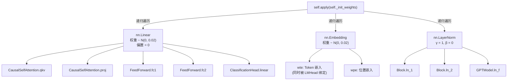
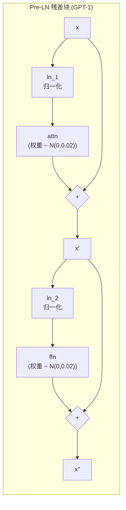

权重初始化决定了 Transformer 在训练前几步中激活值的方差分布和梯度流的行为。GPT-1 复现项目采用一个统一的正态分布 $\mathcal{N}(0, 0.02)$ 对所有 Linear 层和 Embedding 层进行初始化，同时将 LayerNorm 参数设为单位增益、零偏移。本文档深入解析该策略的实现机制、数学依据，以及它与 Pre-LN 残差结构、梯度裁剪和学习率 Warmup 之间的协同关系——这些机制共同构成了 GPT-1 训练稳定性的工程基础。

## 统一初始化器 `_init_weights` 的分发逻辑

GPT 模型在构造完成后，通过 PyTorch 的 `nn.Module.apply` 方法递归遍历所有子模块，将统一的初始化函数注册到每一个叶子节点上。`GPTModel.__init__` 的最后一行调用 `self.apply(self._init_weights)`，该调用以深度优先方式遍历整棵模块树，对每个子模块执行类型分发式的初始化。

```python
@staticmethod
def _init_weights(module):
    if isinstance(module, nn.Linear):
        nn.init.normal_(module.weight, mean=0.0, std=0.02)
        if module.bias is not None:
            nn.init.zeros_(module.bias)
    elif isinstance(module, nn.Embedding):
        nn.init.normal_(module.weight, mean=0.0, std=0.02)
    elif isinstance(module, nn.LayerNorm):
        nn.init.ones_(module.weight)
        nn.init.zeros_(module.bias)
```

该分发器按三种模块类型施加不同的初始化规则：**Linear 层**的权重采样自 $\mathcal{N}(0, 0.02)$，偏置归零；**Embedding 层**的权重同样采样自 $\mathcal{N}(0, 0.02)$，无偏置；**LayerNorm 层**的缩放因子 $\gamma$ 初始化为 1（单位增益），平移因子 $\beta$ 初始化为 0。这种设计确保 LayerNorm 在训练初期表现为恒等变换——对输入做归一化后按原始尺度输出，不引入额外的缩放偏移。



值得注意的是，`apply` 机制确保了**无论模型被缩放到多少层、多少维**，所有同类型子模块都获得一致的初始化统计特性。在本项目的教学配置（4 层 / 128 维 / 4 头）和论文配置（12 层 / 768 维 / 12 头）下，初始化逻辑完全相同——`std=0.02` 是一个与模型规模无关的常数。

Sources: [model.py](model.py#L127-L139)

## 为什么是 0.02？——固定标准差的数学依据

经典的初始化理论（Xavier/Glorot 和 Kaiming/He）主张标准差应随层的 fan_in/fan_out 自适应缩放，以在正向传播和反向传播中同时维持激活方差的稳定。然而 GPT-1 选择了与维度无关的固定 $\text{std}=0.02$，这是一个有意为之的工程决策。下表将 0.02 与各层在论文配置 ($d_{\text{model}}=768$) 下的 Xavier 等效标准差进行对比：

| 模块 | fan_in | fan_out | Xavier std | Kaiming std | GPT std | 与 Xavier 的比值 |
| --- | --- | --- | --- | --- | --- | --- |
| QKV 投影 | 768 | 2304 | 0.0255 | 0.051 | 0.02 | 0.78× |
| 注意力输出投影 | 768 | 768 | 0.0361 | 0.051 | 0.02 | 0.55× |
| FFN 第一层 | 768 | 3072 | 0.0225 | 0.051 | 0.02 | 0.89× |
| FFN 第二层 | 3072 | 768 | 0.0225 | 0.026 | 0.02 | 0.89× |
| Token 嵌入 | — | 768 | — | — | 0.02 | — |

从表中可以看出，0.02 对于大多数层而言**保守于 Xavier 初始化**（比值小于 1），这意味着初始权重的绝对值更小、激活值的方差更低。这种保守性带来了两个关键优势：

**防止注意力分布过早尖锐化。** 注意力分数的计算为 $\text{att} = \frac{QK^T}{\sqrt{d_k}}$，其中 $Q$ 和 $K$ 都由输入经 QKV 投影产生。若初始权重的标准差过大，$\text{att}$ 矩阵的方差将随之增大，导致 softmax 后的注意力权重高度集中于少数位置（即接近 one-hot 分布），梯度几乎无法从被忽略的位置回传。0.02 的保守取值将初始注意力分布保持在接近均匀的状态，使梯度能够均匀地流经所有位置。

**控制残差流的方差累积。** GPT 采用 Pre-LN 残差结构，每一层的输出为 $x = x + f(\text{LN}(x))$。子层输出 $f(\text{LN}(x))$ 的方差正比于权重标准差的平方。若每层子层贡献的方差为 $\sigma_f^2$，经过 $N$ 层后残差流的累积方差约为 $N \cdot \sigma_f^2$（假设子层贡献近似独立）。较小的 $\sigma_f$ 使得即使堆叠 12 层，残差流的方差也不会爆炸，这是深层 Transformer 能稳定训练的前提之一。

Sources: [model.py](model.py#L10-L11), [model.py](model.py#L129-L139)

## 初始化与 Pre-LN 残差结构的协同

GPT-1 采用 **Pre-LN**（也称 Pre-Norm）架构：在每个子层（注意力和 FFN）之前施加 LayerNorm，而非在之后。具体而言，Block 的前向计算为 `x = x + attn(ln_1(x))` 和 `x = x + ffn(ln_2(x))`。这一架构选择对权重初始化提出了与 Post-LN（原始 Transformer）不同的要求。



Pre-LN 的关键特性在于：**残差路径是旁路的**。由于 LayerNorm 位于子层之前，梯度可以通过残差连接直接流回输入端，不受子层权重大小的制约。这意味着即使子层权重很小（如 0.02），反向传播时梯度仍能通过残差路径无损传播——这与 Post-LN 形成鲜明对比，后者中子层权重直接影响梯度路径的缩放。

然而，Pre-LN 也有一个代价：由于 LayerNorm 在子层前将输入归一化到单位方差，子层的有效输入方差被「锁定」为约 1.0，这使得**初始权重的方差直接决定了子层输出的方差**（而非像 Post-LN 那样受到输入分布的调制）。因此，0.02 的小标准差在这里扮演了更加直接的角色——它确保子层的初始贡献远小于残差信号，使网络在训练初期近似于恒等映射，然后随着训练逐步学习到有意义的变换。

末层 LayerNorm `ln_f` 的存在是 Pre-LN 架构的必要补充。由于残差流的方差未被逐层归一化（仅在子层前归一化），最终隐藏表示的方差可能较大。`ln_f` 在送入 LM 头之前做一次归一化，确保 logits 的尺度可控，与初始化时 LM 头权重的小标准差协同工作。

Sources: [model.py](model.py#L93-L110), [model.py](model.py#L126-L148)

## 与训练稳定机制的联动

权重初始化并非孤立起效——它与 GPT-1 训练管线中的多项稳定机制共同作用。以下分析三个关键联动点。

### 与梯度裁剪的联动

训练循环中每一步都执行 `nn.utils.clip_grad_norm_(model.parameters(), 1.0)`，将所有参数梯度的全局 L2 范数裁剪到 1.0 以内。初始化时权重标准差为 0.02 意味着参数空间中各维度的初始尺度很小，梯度裁剪阈值 1.0 相对于这些小参数而言是一个较为宽松的约束。在训练初期，前几个 batch 的梯度可能因为随机初始化而产生较大波动，裁剪机制提供了额外的安全网。两者配合的效果是：初始化保证前向传播的数值稳定，裁剪保证反向传播的梯度不会导致参数更新的幅度过大。

### 与学习率 Warmup 的联动

GPT-1 使用线性 Warmup 策略，在前 10% 的训练步中学习率从 0 线性增长到峰值。这与小标准差初始化形成互补关系：初始化时权重极小，网络的行为接近随机，此时用大学习率更新可能导致权重过早偏离良好的优化区域。Warmup 给予 Adam 优化器足够的时间积累梯度的一阶和二阶矩估计（尤其是二阶矩在初期的偏差较大），同时让小权重在低学习率下温和地调整到合理的方向，然后再逐步提高学习率以加速收敛。

### 与权重绑定的联动

LM 头通过权重绑定（weight tying）直接复用 token 嵌入矩阵 `wte` 的权重：`logits = hidden @ wte.weight.T`。这意味着嵌入层的权重 $\mathcal{N}(0, 0.02)$ 同时承担了两个功能：作为词元的向量表示和作为 LM 头的分类权重。小标准差使得初始 logits 的尺度较小，softmax 后的初始概率分布接近均匀——这正是语言模型在训练初期应有的状态（对词表中所有词的预测概率接近 $1/V$）。若初始化标准差过大，初始 logits 的方差将导致 softmax 分布过于尖锐，使得交叉熵损失在初期极高且梯度不稳定。

Sources: [model.py](model.py#L151-L159), [model.py](model.py#L173), [train.py](train.py#L69), [train.py](train.py#L126), [train.py](train.py#L27-L43)

## 与其他初始化策略的对比

| 维度 | N(0, 0.02) 固定标准差 | Xavier / Glorot | Kaiming / He |
| --- | --- | --- | --- |
| **标准差计算** | 固定 $\sigma = 0.02$ | $\sqrt{2 / (\text{fan\_in} + \text{fan\_out})}$ | $\sqrt{2 / \text{fan\_in}}$ |
| **维度依赖** | 否 | 是（依赖 fan_in 和 fan_out） | 是（依赖 fan_in） |
| **设计目标** | 激活保守、注意力均匀、残差稳定 | 维持正向/反向方差不变 | 适配 ReLU 的稀疏激活 |
| **对深层 Transformer** | 保守但稳定，需配合 Warmup | 理论上更优但 Post-LN 下易梯度爆炸 | 不直接适用于注意力机制 |
| **GPT-1 选择原因** | 对齐 OpenAI 官方实现，经验证稳定 | — | — |

GPT-1 选择固定标准差而非 fan_in 自适应策略的核心原因在于：Transformer 中同时存在多种维度关系不同的线性层（QKV 投影从 $d$ 到 $3d$，FFN 从 $d$ 到 $4d$，输出投影从 $d$ 到 $d$），统一的 Xavier 理论在这些层的标准差之间存在差异（0.0225 ~ 0.0361），而 0.02 作为它们的保守下界，牺牲了理论最优性换取了实现简洁性和跨层的均匀性。这种「宁可保守也不冒险」的策略在大规模深度模型中尤为重要——一个稍大但稳定的初始化远胜于理论最优但偶发不稳定的方案。

Sources: [model.py](model.py#L10-L11), [README.md](README.md#L16-L16)

## 延伸阅读

- 初始化函数在整体模型架构中的调用位置参见 [整体设计：仅解码器 Transformer 的层叠结构](4-zheng-ti-she-ji-jin-jie-ma-qi-transformer-de-ceng-die-jie-gou)
- 初始化所作用的 Pre-LN 残差块的详细机制参见 [Pre-LN 残差块与末层 LayerNorm](7-pre-ln-can-chai-kuai-yu-mo-ceng-layernorm)
- 与权重初始化紧密关联的权重绑定机制参见 [语言模型头与权重绑定 (Weight Tying)](9-yu-yan-mo-xing-tou-yu-quan-zhong-bang-ding-weight-tying)
- 与初始化协同的训练稳定机制（Warmup、梯度裁剪）参见 [学习率调度：线性 Warmup + 余弦/线性衰减](19-xue-xi-lu-diao-du-xian-xing-warmup-yu-xian-xian-xing-shuai-jian)