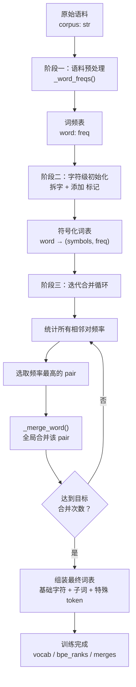
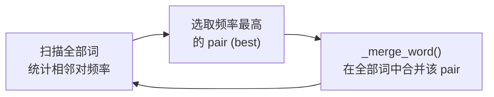

Byte Pair Encoding（字节对编码）的核心思想简洁而强大：**反复合并语料中出现频率最高的相邻符号对**，从单字符逐步生长出更有语义的子词单元。本页深入解析 GPT-1 复现项目中 `BPETokenizer.train()` 的完整训练流程——从语料预处理、字符级初始化，到贪心合并循环与最终词表组装，逐行拆解每个环节的设计逻辑与工程取舍。

## 算法全景：BPE 训练的三个阶段

BPE 训练可归纳为三个清晰的阶段，每个阶段的输出作为下一阶段的输入，形成一条流水线：



这张流程图刻画了 BPE 的本质——一个**自底向上**的聚类过程：起初每个符号都是一个字符，随着高频对不断合并，短的频繁片段被"吸收"进更长的子词，低频片段则保持为独立字符。这种机制天然平衡了词表大小与序列长度的矛盾。

Sources: [tokenizer.py](tokenizer.py#L1-L9)

## 阶段一：语料预处理与词频统计

BPE 的合并决策基于**频率**，因此第一步是将原始文本转化为词频表。`_word_freqs()` 函数完成这一预处理：

```python
def _word_freqs(corpus: str) -> Counter:
    freqs: Counter = Counter()
    for raw in corpus.split():
        w = "".join(c.lower() if c.isalnum() else " " for c in raw).replace(" ", "")
        if w:
            freqs[w] += 1
    return freqs
```

该函数的处理逻辑包含三个关键步骤：

| 步骤 | 操作 | 示例 | 设计意图 |
|------|------|------|----------|
| 切词 | `corpus.split()` | `"the cat"` → `["the", "cat"]` | 按空格分词，空格作为天然词界 |
| 归一化 | `c.lower() if c.isalnum()` | `"The!"` → `"the"` | 大小写统一、去除标点 |
| 统计 | `freqs[w] += 1` | `{"the": 50, "cat": 3, ...}` | 聚合同一词的所有出现次数 |

预处理中的 `.replace(" ", "")` 看似多余，实则应对一个微妙边界：当原始词中混有标点时（如 `"don't"`），非字母数字字符被替换为空格后立即删除，使得 `"don't"` 被规整为 `"dont"`。这种简化在项目的小规模内置语料上是合理的——它消除了标点变体，让 BPE 聚焦于字母组合。

Sources: [tokenizer.py](tokenizer.py#L17-L24)

## 阶段二：字符级初始化——拆字与词尾标记

有了词频表后，`train()` 方法将每个词拆解为**符号列表**，并在末尾追加特殊的词尾标记 `</w>`：

```python
vocab = {w: (list(w) + [WORD_END], f) for w, f in word_freqs.items()}
```

以语料中高频词 `"the"` 为例，初始化后变为：

```
"the" → (["t", "h", "e", "</w>"], freq=50)
```

`</w>` 标记的设计意图至关重要：它**编码了词边界信息**。没有这个标记，BPE 无法区分词内合并与跨词合并——例如 `"the"` 末尾的 `"e"` 和下一个词 `"end"` 开头的 `"e"` 不应被视为同一合并单元。`</w>` 的存在确保所有合并都严格在词内进行，使得编码阶段可以无损还原词边界。

紧接着，代码收集所有出现过的独立字符构建基础符号集：

```python
base_symbols = set()
for symbols, _ in vocab.values():
    base_symbols.update(symbols)
base_symbols = sorted(base_symbols)
```

排序保证了词表构建的确定性——相同的语料和参数始终产生相同的 id 分配。`base_symbols` 包含了语料中出现的所有字母字符以及 `</w>` 标记本身。

Sources: [tokenizer.py](tokenizer.py#L46-L55)

## 阶段三：迭代合并循环——BPE 的核心引擎

合并循环是整个算法的心脏。在进入循环前，代码计算了需要执行多少次合并操作：

```python
target_merges = max(0, target_size - len(SPECIALS) - len(base_symbols))
```

这个公式直接对应词表的构成结构：**最终词表 = 基础字符 + 合并产生的子词 + 特殊 token**。当用户指定 `target_size=300`、基础字符有 27 个（a-z 加 `</w>`）、特殊 token 有 4 个时，`target_merges` 为 269，即算法将执行 269 轮合并。

### 合并循环的三步逻辑

每一轮迭代执行以下三个步骤：



**步骤 1 — 频率统计**：遍历当前 vocab 中所有词的符号列表，对每一对相邻符号 `(symbols[i], symbols[i+1])` 累加该词的词频 `freq`。注意，频率不是简单的出现次数，而是**加权出现次数**——出现 50 次的词 `"the"` 中的相邻对 `(t, h)` 会贡献 50 的频率。

**步骤 2 — 选取最优对**：`best = max(pairs, key=pairs.get)` 选出频率最高的相邻对。例如首轮很可能选出 `("t", "h")`，因为 `"the"`、`"that"`、`"this"` 等高频词都以 `th` 开头。

**步骤 3 — 全局合并**：调用 `_merge_word(best, vocab)` 在所有词中执行合并，将匹配的相邻对替换为拼接后的单一符号。合并后的符号将参与下一轮的频率统计，可能形成更长的子词。

### `_merge_word` 的实现细节

```python
def _merge_word(pair: tuple, vocab: Dict[str, tuple]) -> Dict[str, tuple]:
    bigram = pair[0] + pair[1]
    new_vocab = {}
    for word, (symbols, freq) in vocab.items():
        merged, i = [], 0
        while i < len(symbols):
            if i < len(symbols) - 1 and (symbols[i], symbols[i + 1]) == pair:
                merged.append(bigram)
                i += 2
            else:
                merged.append(symbols[i])
                i += 1
        new_vocab[word] = (merged, freq)
    return new_vocab
```

该函数通过双指针遍历每个词的符号列表：当遇到目标 pair 时，拼接为 `bigram` 并跳过两个位置；否则保留当前符号并前进一位。**一次合并会处理词内所有出现该 pair 的位置**——例如合并 `("e", "</w>")` 后，符号列表 `["s", "e", "</w>", "t", "h", "e", "</w>"]` 中两个 `"e</w>"` 都会被合并。

每轮合并的 pair 被记录在 `self.merges` 列表中：

```python
self.merges.append(best)
```

这个列表的**索引顺序即为合并优先级**——先记录的 pair 优先级更高，在编码阶段会被优先应用。

Sources: [tokenizer.py](tokenizer.py#L57-L68), [tokenizer.py](tokenizer.py#L124-L138)

## 合并实例推演：`"the"` 的演化过程

用项目语料中的超高频词 `"the"`（出现约 50 次）来推演合并过程：

| 轮次 | 选中 pair | `"the"` 的符号列表 | 说明 |
|------|-----------|---------------------|------|
| 初始 | — | `["t", "h", "e", "</w>"]` | 纯字符状态 |
| 第 1 轮 | `("t", "h")` | `["th", "e", "</w>"]` | `"th"` 跨语料频率最高 |
| 第 N 轮 | `("th", "e")` | `["the", "</w>"]` | `"the"` 作为整体子词形成 |
| 第 M 轮 | `("the", "</w>")` | `["the</w>"]` | 词尾标记被吸收 |

到第 M 轮时，`"the"` 被编码为单个子词 token，极大压缩了序列长度。而低频词如 `"sandcastle"` 可能在训练结束时仍保持为 `["s", "a", "n", "d", "c", "a", "s", "t", "le", "</w>"]`，只有部分高频片段（如 `"le"`、`"st"`）被合并。

这种**频率驱动的自适应分段**正是 BPE 的核心优势：常见词获得紧凑表示，罕见词通过字符级回退仍可编码。

## 训练收尾：词表组装与优先级映射

合并循环结束后，代码将三部分组装为最终词表并构建编码所需的优先级映射：

```python
tokens: List[str] = list(base_symbols)         # 1. 基础字符 (排序后)
for a, b in self.merges:                        # 2. 合并产生的子词
    tokens.append(a + b)
for i, tok in enumerate(SPECIALS):              # 3. 特殊 token
    self.special_to_id[tok] = len(tokens) + i
self.vocab = {t: i for i, t in enumerate(tokens)}
self.bpe_ranks = {pair: i for i, pair in enumerate(self.merges)}
self.id_to_token = {i: t for t, i in self.vocab.items()}
self.id_to_token.update({i: t for t, i in self.special_to_id.items()})
self._cache.clear()
```

最终词表的 ID 分配遵循严格顺序：

```
[0 .. K-1]    基础字符 (a, b, c, ..., z, </w>)
[K .. K+M-1]  合并子词 (th, the, the</w>, re, ...)
[K+M .. K+M+3] 特殊 token ([Pad], [Start], [Delim], [Extract])
```

其中 `K` 为基础字符数，`M` 为合并次数。两个关键数据结构在此刻诞生：

- **`self.vocab`**（`Dict[str, int]`）：符号到 ID 的正向映射，编码时用于将子词符号转为模型输入的整数索引。
- **`self.bpe_ranks`**（`Dict[tuple, int]`）：合并对到优先级序号的映射。在编码阶段，当面对一个新词的多对相邻符号时，`bpe_ranks` 决定了哪个 pair 应当被优先合并——序号越小（即训练时越早被合并的 pair），优先级越高。

`_cache.clear()` 确保如果实例被重复训练，旧的编码缓存不会残留。

Sources: [tokenizer.py](tokenizer.py#L70-L80)

## 训练参数与项目集成

`train()` 方法暴露了两个关键参数：

| 参数 | 类型 | 默认值 | 作用 |
|------|------|--------|------|
| `corpus` | `str` | 必填 | 训练语料文本 |
| `target_size` | `int` | `400` | 目标词表大小（含基础字符 + 子词 + 特殊 token） |

在项目的实际调用中，`main.py` 通过环境变量 `BPE_VOCAB`（默认 300）控制词表规模：

```python
tok = BPETokenizer()
tok.train(data.PRETRAIN_CORPUS, target_size=bpe_vocab)
```

`target_size` 设置越大，合并次数越多，词表中长子词比例越高，序列越短但词表越庞大；设置越小，更多词被拆为字符，序列变长但词表更紧凑。在 300 的默认配置下，基于约 80 句小型英文语料，训练后会产生约 269 个子词合并，使常见英文词（如 `"the"`、`"and"`、`"was"`）获得紧凑的子词表示。

Sources: [main.py](main.py#L107-L118), [tokenizer.py](tokenizer.py#L46-L48)

## 设计取舍总结

| 设计决策 | 实现方式 | 优势 | 局限 |
|----------|----------|------|------|
| 词尾标记 `</w>` | 每个词末尾追加 | 精确编码词边界，支持无损还原 | 增加基础符号数量 |
| 频率加权统计 | `pairs[pair] += freq` | 高频词的合并被优先考虑 | 低频但有语义的 pair 可能被忽略 |
| 全局单对合并 | 每轮只合并一个 pair | 确定性、可复现 | 训练复杂度 O(M·N)，M 为合并轮数 |
| 排序基础字符 | `sorted(base_symbols)` | 保证词表确定性 | 无语义影响，纯工程考量 |
| 合并优先级 = 列表索引 | `bpe_ranks[pair] = i` | 编码时 O(1) 查找优先级 | 需要 `_encode_word` 配合贪心策略 |

## 延伸阅读

- 训练完成后，**编码与解码如何使用这些合并规则**？参见 [编码与解码流程：文本与 Token ID 的双向转换](13-bian-ma-yu-jie-ma-liu-cheng-wen-ben-yu-token-id-de-shuang-xiang-zhuan-huan)
- **特殊 token 的 ID 分配与 OOV 回退**机制如何与训练结果衔接？参见 [特殊 Token 与 OOV 回退机制](14-te-shu-token-yu-oov-hui-tui-ji-zhi)
- 词表大小如何影响 **GPT 模型的嵌入层维度**？参见 [嵌入层：Token 嵌入、学习的位置编码与 Dropout](8-qian-ru-ceng-token-qian-ru-xue-xi-de-wei-zhi-bian-ma-yu-dropout)