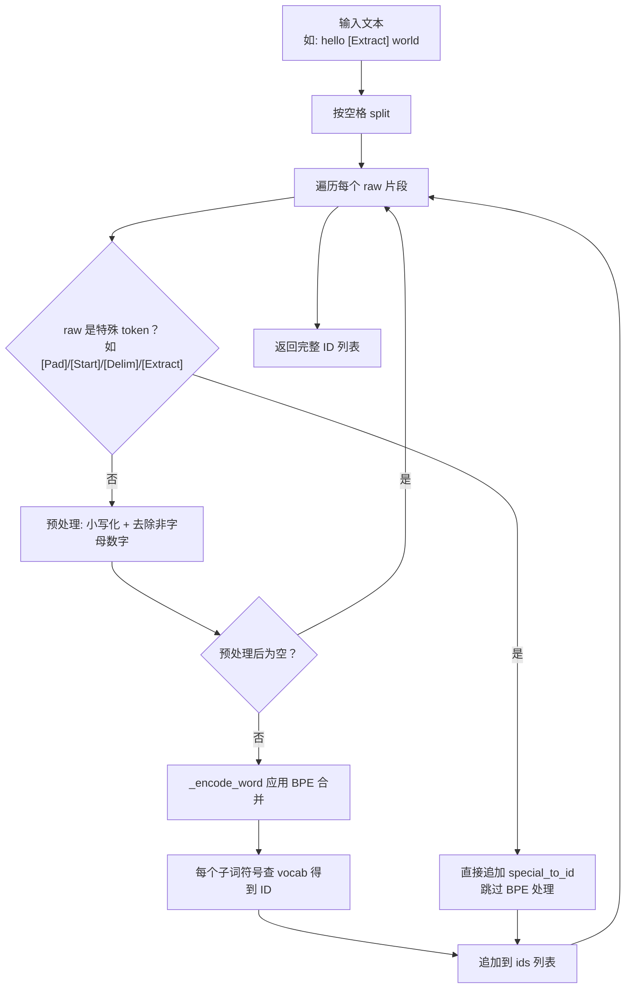
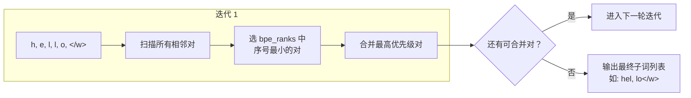
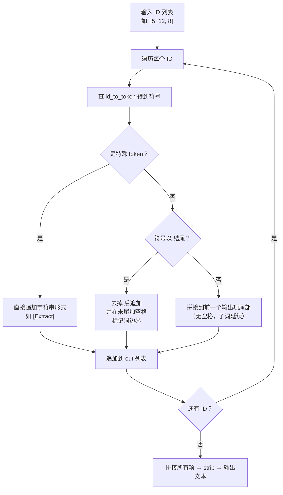
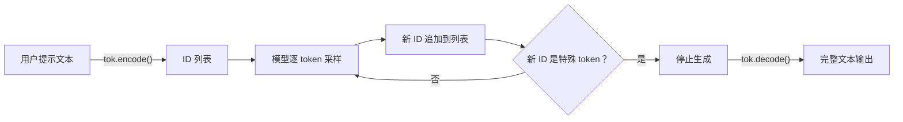

BPE 分词器训练完成后，词表（`vocab`）与合并优先级表（`bpe_ranks`）便固化在分词器实例中。它们是两条核心管线的基石：**编码（encode）**——将自然语言文本压缩为整数 ID 序列，供模型消费；**解码（decode）**——将模型输出的 ID 序列还原为人类可读文本。本页深入剖析这两条管线在 `BPETokenizer` 中的实现细节，包括文本预处理、优先级贪心合并、`</w>` 词尾标记的编码与还原策略，以及缓存机制带来的性能收益。

## 核心数据结构回顾

在深入编码/解码流程之前，需要明确分词器内部维护的几张关键映射表。它们在 [BPE 训练算法](12-bpe-xun-lian-suan-fa-cong-zi-fu-dao-zi-ci-de-die-dai-he-bing) 的 `train()` 方法中构建完成，是编码与解码操作的全部信息来源：

| 数据结构 | 类型 | 作用 | 编码用 | 解码用 |
|---|---|---|---|---|
| `vocab` | `Dict[str, int]` | 子词符号 → ID | ✅ | — |
| `id_to_token` | `Dict[int, str]` | ID → 子词符号（含特殊 token） | — | ✅ |
| `bpe_ranks` | `Dict[tuple, int]` | 合并对 → 优先级序号 | ✅ | — |
| `special_to_id` | `Dict[str, int]` | 特殊 token 名称 → ID | ✅ | ✅ |
| `_cache` | `Dict[str, List[str]]` | 原始词 → 编码后子词列表 | ✅ | — |

Sources: [tokenizer.py](tokenizer.py#L30-L36)

## 编码流程：文本 → Token ID 列表

`encode()` 方法是整个分词器对外的核心入口。它的处理逻辑可以概括为三个阶段：**空格切分 → 特殊 token 拦截 → 逐词 BPE 编码**。



Sources: [tokenizer.py](tokenizer.py#L96-L108)

### 文本预处理：与训练保持一致的一致性

`encode()` 内部的预处理逻辑必须与 `_word_freqs()` 中训练阶段的预处理完全一致——否则训练时学到的合并规则在推理时会失效。两者的共同操作是：逐字符遍历，仅保留字母和数字（`c.isalnum()`），其余字符一律替换为空格后删除，再统一转为小写。这意味着标点符号、特殊符号在编码时会被静默丢弃。

Sources: [tokenizer.py](tokenizer.py#L18-L24), [tokenizer.py](tokenizer.py#L96-L108)

### 特殊 token 拦截：优先级最高

编码流程对每个空格分隔的片段首先检查它是否匹配 `special_to_id` 中的键（如 `[Pad]`、`[Start]`、`[Delim]`、`[Extract]`）。如果命中，则直接输出对应的 ID，**跳过所有 BPE 处理**。这一设计确保特殊标记在输入序列中占据精确的、语义独立的 token 位置——这在分类任务中尤为关键，因为 `[Extract]` 的位置索引直接决定了模型从哪里提取分类特征。

Sources: [tokenizer.py](tokenizer.py#L99-L101)

### 单词级 BPE 编码：`_encode_word()`

这是编码流程的算法核心。对于一个预处理后的词（如 `"hello"`），`_encode_word` 将其拆为字符列表并附加 `</w>` 词尾标记，然后**迭代执行贪心优先级合并**：



每一轮迭代中，算法遍历当前符号列表的所有相邻对，选择 `bpe_ranks` 中**优先级序号最小（即训练时最早学到）**的对进行合并。这一贪心策略确保编码结果与训练阶段的合并顺序严格一致——先合并的子词优先级更高，意味着它在语料中出现的频率更大，应该被优先识别为整体。

当没有任何相邻对出现在 `bpe_ranks` 中时（即所有剩余对都是训练时从未合并过的），算法停止并返回当前符号列表。由于基础字符集覆盖了训练语料中出现的所有字符，且任何字符本身就在 `vocab` 中，因此**编码永远不会失败**——最差情况下退化为逐字符的子词序列。

Sources: [tokenizer.py](tokenizer.py#L82-L94)

### 合并操作：`_merge_symbol()`

`_merge_symbol` 是 `_encode_word` 内部调用的辅助函数，负责在单个词的符号列表上将指定的合并对 `(a, b)` 替换为拼接结果 `a+b`。它扫描整个符号列表，**一次性合并所有出现的位置**（不仅是第一处），然后返回新的列表：

| 输入 | 合并对 | 输出 |
|---|---|---|
| `['l', 'o', 'o', '</w>']` | `('o', '</w>')` | `['l', 'o', 'o</w>']` |
| `['l', 'o', 'o</w>']` | `('l', 'o')` | `['lo', 'o</w>']` |

Sources: [tokenizer.py](tokenizer.py#L141-L151)

### 编码缓存：`_cache` 的性能优化

`_encode_word` 在执行完合并后会将结果缓存到 `self._cache[word]` 中。由于 BPE 合并是确定性操作——相同的词永远产生相同的子词序列——缓存可以避免对高频词的重复计算。在自然语言中，高频词（如 `the`、`a`、`is`）占比极高，这一缓存对大规模语料的编码速度有显著提升。缓存在 `train()` 结束时会被清空（`self._cache.clear()`），确保重新训练后不会使用过期的合并结果。

Sources: [tokenizer.py](tokenizer.py#L84-L85), [tokenizer.py](tokenizer.py#L93), [tokenizer.py](tokenizer.py#L80)

## 解码流程：Token ID 列表 → 文本

`decode()` 方法实现编码的逆操作。它的核心挑战在于：编码时附加的 `</w>` 词尾标记编码在子词符号内部（如 `lo</w>`），解码时需要据此正确**还原词间空格**和**拼接连续子词**。



Sources: [tokenizer.py](tokenizer.py#L110-L121)

### `</w>` 标记的关键作用

理解解码逻辑的关键在于 `</w>` 词尾标记的语义：它标记了一个**完整词的结束**。解码时的三种情况可以这样理解：

- **特殊 token**：直接以字符串形式输出（如 `[Extract]`），作为独立词。
- **以 `</w>` 结尾的子词**（如 `lo</w>`）：去掉 `</w>` 后追加到输出，末尾加空格——表示这个词到此结束，后面是新词。
- **不以 `</w>` 结尾的子词**（如 `hel`）：**拼接到前一个输出项的尾部**，不加空格——表示这是当前词的延续片段。

举一个完整的例子，假设 ID 序列解码后得到的符号序列是 `['hel', 'lo</w>', 'wor', 'ld</w>']`：

| 步骤 | 当前符号 | 动作 | `out` 列表 |
|---|---|---|---|
| 1 | `hel` | 新项（无前项） | `['hel']` |
| 2 | `lo</w>` | 去标记 + 加空格 | `['hel', 'lo ']` |
| 3 | `wor` | 追加到前项 | `['hel', 'lo ', 'wor']` |
| 4 | `ld</w>` | 去标记 + 加空格 | `['hel', 'lo ', 'world ']` |

最终 `"".join(out).strip()` 得到 `"hello world"`。

Sources: [tokenizer.py](tokenizer.py#L110-L121)

### 未知 ID 的安全回退

当解码时遇到 `id_to_token` 中不存在的 ID（理论上不应发生），`decode` 返回 `"<unk>"` 作为占位符而非抛出异常。这是一种防御性编程策略，确保即使模型输出了训练时从未见过的 ID（如数值溢出导致的无意义 logits），解码管线也不会中断。

Sources: [tokenizer.py](tokenizer.py#L114)

## 端到端示例：生成管线中的编解码协作

在 `main.py` 的 `generate()` 函数中，编码与解码形成了一个完整的闭环：



编码阶段，`tok.encode(prompt)` 将用户输入转为初始 ID 序列。模型随后逐 token 预测，每次将新采样到的 ID 追加到序列尾部。当采样到特殊 token（如 `[Extract]`）时，生成终止。最后 `tok.decode(ids)` 将整个序列一次性还原为文本。

Sources: [main.py](main.py#L28-L44)

## 分类任务中的编码应用

在 `data.py` 的任务特定编码函数中，`encode()` 被嵌入到结构化的模板填充中。以分类任务为例：

```python
ids = [_special(tok, "[Start]")] + tok.encode(text) + [_special(tok, "[Extract]")]
```

这条语句将三个部分拼接为一条完整序列：`[Start]` 标记序列开头，`encode(text)` 产出正文的 ID 列表，`[Extract]` 标记序列末尾。特殊 token 通过 `special_to_id` 直接获取 ID，正文通过 `encode` 经历完整的 BPE 编码管线。这种设计使得同一个 `encode()` 方法可以无缝服务于 [论文 Figure 2 四种任务输入变换](17-lun-wen-figure-2-si-chong-ren-wu-shu-ru-bian-huan-fen-lei-yun-han-xiang-si-du-duo-xuan) 中的所有任务格式。

Sources: [data.py](data.py#L195-L198), [data.py](data.py#L219-L231)

## 编码与解码的对称性保证

| 维度 | 编码 (encode) | 解码 (decode) | 对称性来源 |
|---|---|---|---|
| 空格处理 | 按空格 split 成词 | `</w>` 标记还原空格 | 词尾标记编码在子词中 |
| 大小写 | 统一小写化 | 无需恢复（信息丢失） | 有损转换，接受 |
| 特殊 token | 优先识别并直接映射 | 按 ID 还原字符串 | `special_to_id` 双向查询 |
| 非字母数字 | 静默丢弃 | 无法恢复 | 有损转换，接受 |
| OOV 词 | 退化为字符级子词 | 子词拼接自动还原 | 字符集全覆盖保证 |

需要特别注意的是，编码是有损的——标点符号被丢弃、大小写被统一。因此 `decode(encode(text)) == text` **不保证成立**。例如 `"Hello, World!"` 编码后可能变为 `['hel', 'lo</w>', 'wor', 'ld</w>']`，解码后得到 `"hello world"`——标点消失，大小写归一。这是本实现刻意的设计简化，将分词器聚焦于教学目的的最小可运行 BPE。

Sources: [tokenizer.py](tokenizer.py#L96-L121)

## 进一步阅读

- **前序知识**：理解编码中 `bpe_ranks` 的来源，请参阅 [BPE 训练算法：从字符到子词的迭代合并](12-bpe-xun-lian-suan-fa-cong-zi-fu-dao-zi-ci-de-die-dai-he-bing)
- **特殊 token 语义**：`[Pad]`/`[Start]`/`[Delim]`/`[Extract]` 的设计与 OOV 回退策略，请参阅 [特殊 Token 与 OOV 回退机制](14-te-shu-token-yu-oov-hui-tui-ji-zhi)
- **任务级编码模板**：编码方法如何被包装为分类、蕴含、相似度、多选任务的输入格式，请参阅 [论文 Figure 2 四种任务输入变换](17-lun-wen-figure-2-si-chong-ren-wu-shu-ru-bian-huan-fen-lei-yun-han-xiang-si-du-duo-xuan)
- **生成解码应用**：`encode` + `decode` 在温度采样管线中的协作，请参阅 [文本续写生成：温度采样与 Top-K 截断解码](25-wen-ben-xu-xie-sheng-cheng-wen-du-cai-yang-yu-top-k-jie-duan-jie-ma)