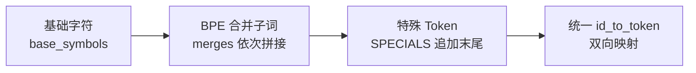
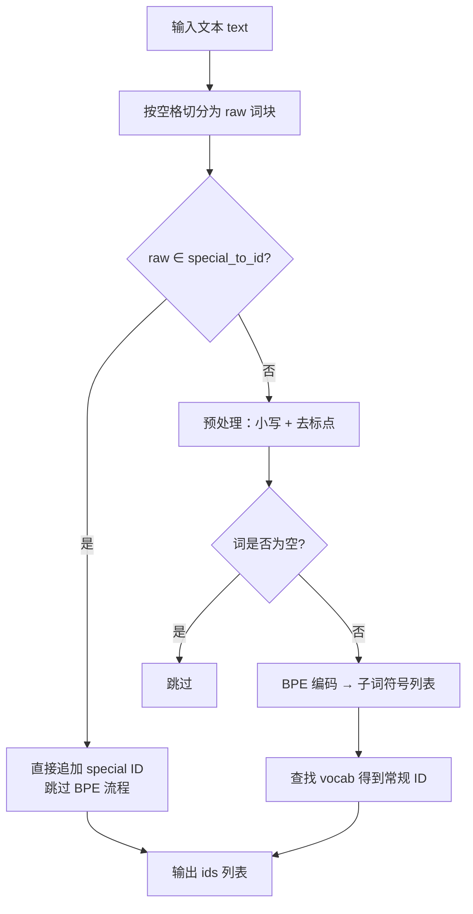
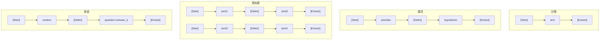

BPE 分词器的强大之处不仅在于将文本分解为子词单元，更在于它通过一套精心设计的特殊 Token 体系和字符级回退策略，为下游任务的结构化输入提供了统一的语义锚点，同时保证任何未见词汇都不会导致编码崩溃。本文深入剖析本项目中四种特殊 Token 的定义、注册、识别与使用方式，以及 BPE 编码器如何通过字符级分解天然实现 OOV 兼容。

## 特殊 Token 的定义与语义角色

项目在模块级别定义了四个特殊 Token，分别服务于预训练和微调阶段的不同需求。它们与普通子词共享同一张 ID 映射表，但具有不可拆分的原子性——编码器遇到这些字符串时直接映射为对应 ID，不会执行 BPE 合并流程。

| 特殊 Token | 语义角色 | 主要使用场景 |
|:---:|:---|:---|
| `[Pad]` | 填充占位符，用于将变长序列对齐到统一长度 | 分类批整理 `collate_classification` |
| `[Start]` | 序列起始标记，标记输入序列的边界起点 | 所有四种下游任务输入变换 |
| `[Delim]` | 分隔符，在单条序列内区分两段不同来源的文本 | 蕴含、相似度、多选任务中的文本拼接 |
| `[Extract]` | 提取标记，其所在位置的隐藏向量被送入分类头 | 所有四种下游任务的分类决策点 |

这四个 Token 的定义集中在一行常量中，清晰可见：
```python
SPECIALS: List[str] = ["[Pad]", "[Start]", "[Delim]", "[Extract]"]
```

其中 `[Extract]` 的设计尤为关键——它并非如传统 BERT 的 `[CLS]` 放在序列首部，而是放在序列尾部，其位置索引被显式记录并传给 `ClassificationHead`，通过 `gather` 操作提取该位置的隐藏表示进行分类预测。这一设计直接对齐 GPT-1 论文 Figure 2 中的任务输入变换方案。

Sources: [tokenizer.py](tokenizer.py#L13-L14), [model.py](model.py#L185-L200), [data.py](data.py#L1-L7)

## 特殊 Token 的词表注册：追加到末尾的固定 ID

在 BPE 训练完成后，特殊 Token 被追加到词表的末尾，占据连续的 ID 区间。这一注册过程发生在 `train()` 方法的收尾阶段，具体分为三步：



关键代码逻辑如下：首先，基础字符（如 `t`、`h`、`e`、`</w>` 等）占据词表的前 N 个位置；然后，每一次 BPE 合并产生的子词依次追加；最后，四个特殊 Token 在所有子词之后获得连续 ID。`special_to_id` 字典记录这一映射，而 `id_to_token` 字典则合并常规词表和特殊 Token，形成完整的逆向查找表。

这种设计保证了特殊 Token 的 ID 永远在词表的高端区域，且彼此相邻。通过 `vocab_size` 属性可以验证：总词表大小等于常规子词数量加上特殊 Token 数量（4 个）。同时，`pad_id` 属性直接从 `special_to_id["[Pad]"]` 取值，为批整理函数提供了便捷的填充 ID 访问入口。

Sources: [tokenizer.py](tokenizer.py#L70-L80), [tokenizer.py](tokenizer.py#L38-L44)

## 编码流程中的特殊 Token 优先识别

在 `encode()` 方法中，特殊 Token 的识别拥有最高优先级。编码器按空格切分文本后，对每个原始词块先检查是否匹配 `special_to_id` 字典：



这一优先匹配机制意味着：当输入文本包含字符串 `"[Start]"` 时，编码器不会将其拆分为 `[`、`S`、`t`、`a`、`r`、`t`、`]` 等字符，而是直接输出对应的特殊 ID。这对于 `data.py` 中构造分类序列至关重要——例如 `classification_input` 通过 `[_special(tok, "[Start]")]` 和 `[_special(tok, "[Extract]")]` 显式地插入特殊 Token ID，确保它们以原子单位进入模型。

值得注意的是，特殊 Token 的字符串形式（如 `[Start]`）在训练语料中并不出现，它们纯粹是工程层面添加的结构标记，而非从数据中学习得到的子词。

Sources: [tokenizer.py](tokenizer.py#L96-L108), [data.py](data.py#L191-L198)

## OOV 回退：字符级分解实现天然兼容

BPE 分词器对 OOV（Out-of-Vocabulary）词汇的处理策略，是其相对于 word-level 分词器的核心优势。本项目的回退机制分为两个层次：

**第一层：未见词的子词分解。** 当遇到训练语料中未曾出现的完整词（例如微调阶段情感数据集中的 `"unforgettable"`），`_encode_word` 方法会将该词拆分为字符序列并附加 `</w>` 词尾标记，然后贪心地应用所有在训练阶段学到的合并规则。即使无法将整个词合并为一个子词，编码器仍然能将其分解为已知子词片段的组合（如 `un` + `forget` + `ta` + `ble` + `</w>`），每个片段都在 `self.vocab` 中拥有合法 ID。

**第二层：编码缓存优化。** `_encode_word` 使用 `self._cache` 字典缓存已编码词的子词分解结果。由于同一语料中许多词会反复出现，缓存避免了重复执行 BPE 合并循环，显著提升了批量编码效率。缓存在每次 `train()` 调用时被清空，保证词表更新后不会使用过期的分解结果。

不过，本实现存在一个边界限制：如果输入文本包含训练语料中从未出现过的**字符**（如某些 Unicode 字符），该字符将不在 `base_symbols` 中，也不在 `self.vocab` 中，`encode()` 在执行 `self.vocab[sym]` 时会抛出 `KeyError`。这是最小化实现的有意简化——生产级分词器（如 GPT-2 的 byte-level BPE）通过将所有 256 个字节值纳入基础词表来彻底消除这一问题。

Sources: [tokenizer.py](tokenizer.py#L82-L94), [tokenizer.py](tokenizer.py#L96-L108)

## 解码时的 `<unk>` 兜底

`decode()` 方法在将 ID 序列还原为文本时，实现了双层兜底机制。对于每个 ID，首先通过 `id_to_token.get(i, "<unk>")` 查找对应的 Token 字符串；如果 ID 超出已知范围（例如模型生成了一个不在词表中的 ID），则回退为 `<unk>` 占位符。

解码逻辑根据 Token 类型分为三种处理路径：

| Token 类型 | 判断条件 | 解码行为 |
|:---|:---|:---|
| 特殊 Token | `i ∈ special_to_id.values()` | 直接输出 Token 字符串（如 `[Extract]`） |
| 带词尾标记的子词 | `tok.endswith("</w>")` | 去掉 `</w>` 后追加空格（标记词边界） |
| 不带词尾标记的子词 | 其他情况 | 拼接到前一个输出片段（续接同一词内的子词） |

第三种情况的处理尤为精妙：当 BPE 将一个词分解为多个子词时，只有最后一个子词携带 `</w>` 标记，前面的子词需要无缝拼接才能还原原始词汇。`out[-1] = out[-1] + tok` 实现了这一续接逻辑，确保 `de` + `li` + `cious</w>` 正确还原为 `delicious `。

Sources: [tokenizer.py](tokenizer.py#L110-L121)

## 特殊 Token 在生成流程中的截断作用

在文本续写生成（`generate` 函数）中，特殊 Token 承担了一个额外的运行时角色：**生成终止信号**。自回归生成循环在每一步采样下一个 Token 后，会检查该 Token 是否属于特殊 Token 集合：

```python
if nxt in tok.special_to_id.values():
    break
```

这意味着如果模型在续写过程中生成了 `[Start]`、`[Delim]` 或 `[Extract]` 等特殊 Token，生成将立即终止。这一设计防止了模型在无监督生成中输出无意义的结构化标记，保持生成文本的自然性。注意 `[Pad]` 同样会触发终止，这在逻辑上是合理的——填充符不应出现在自然语言中。

Sources: [main.py](main.py#L28-L44)

## 四种下游任务中特殊 Token 的拼接模式

特殊 Token 的真正价值在下游任务的输入变换中得以充分体现。`data.py` 中四种任务的输入构造，本质上是 `[Start]`、`[Delim]`、`[Extract]` 三个标记的排列组合，形成统一的序列模板：



每个函数都返回 `(ids, extract_index)` 元组，其中 `extract_index` 始终指向 `[Extract]` 在序列中的位置（通常为 `len(ids) - 1`，即末尾）。`ClassificationHead` 使用这个索引通过 `gather` 操作提取对应位置的隐藏向量，再送入线性层进行分类。这一设计使得同一个分类头可以复用于所有四种任务——只需改变输入序列的拼接方式，模型架构本身无需任何修改。

`[Pad]` Token 则在 `collate_classification` 中发挥作用：当不同样本的序列长度不一致时，短序列用 `pad_id` 填充至 `n_ctx`，同时 `valid` 掩码矩阵记录哪些位置是真实 Token、哪些是填充，确保辅助 LM 损失只在有效位置上计算。

Sources: [data.py](data.py#L195-L231), [data.py](data.py#L237-L257), [train.py](train.py#L112-L121)

## 设计取舍与局限性总结

本项目的特殊 Token 与 OOV 机制是一个面向教学的最小化实现，其设计取舍值得关注：

| 维度 | 当前实现 | 生产级方案（如 GPT-2 tiktoken） | 影响 |
|:---|:---|:---|:---|
| 特殊 Token 管理 | 硬编码常量列表 | 可配置、支持自定义添加 | 灵活性受限但逻辑清晰 |
| OOV 字符处理 | 仅限训练语料中出现的字符 | Byte-level 覆盖全部 256 字节值 | 罕见 Unicode 字符可能触发 `KeyError` |
| 解码兜底 | `<unk>` 占位符 | 严格可逆的 byte-level 解码 | 无法恢复未知 ID 的原始内容 |
| Token 边界 | `</w>` 词尾标记 | Byte-level 自然边界 | 词边界信息依赖训练时学习 |

这些简化使得整个分词器在不到 150 行代码内实现了完整的训练-编码-解码闭环，同时保留了 BPE 核心的子词分解能力和特殊 Token 的结构化输入支持。理解这些机制的运作原理，是阅读后续 [编码与解码流程：文本与 Token ID 的双向转换](13-bian-ma-yu-jie-ma-liu-cheng-wen-ben-yu-token-id-de-shuang-xiang-zhuan-huan) 和 [论文 Figure 2 四种任务输入变换](17-lun-wen-figure-2-si-chong-ren-wu-shu-ru-bian-huan-fen-lei-yun-han-xiang-si-du-duo-xuan) 的关键基础。