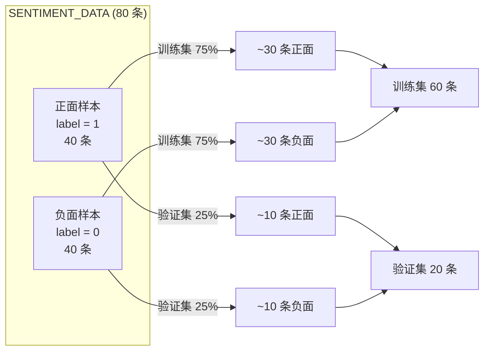

GPT-1 的核心思想是"生成式预训练 + 判别式微调"——先用无标签语料训练语言模型，再在有标签任务上微调。本项目的 `data.py` 恰好为这一两阶段流程提供了两份精心设计的数据集：一份用于无监督预训练的英文语料（`PRETRAIN_CORPUS`），一份用于下游情感二分类的标注数据（`SENTIMENT_DATA`）。两者并非孤立存在，而是在词汇分布和语义领域上刻意保持重叠，使预训练阶段习得的语言知识能够有效迁移到微调阶段。本文聚焦于这两份数据集的设计理念、结构特征与数据划分机制。

## 预训练语料 PRETRAIN_CORPUS：无监督语言模型的数据源

预训练语料被定义为一个多行字符串常量 `PRETRAIN_CORPUS`，包含 **61 个英文短句、约 742 个单词**。每一行是一个完整的、语法正确的陈述句或评论句，涵盖日常生活、自然风景、食物评价、出行体验等主题。这种设计并非随意堆砌，而是蕴含三层考量：

**第一层：对齐论文的大规模语料理念。** GPT-1 原论文使用 BooksCorpus（约 7000 本未出版书籍）进行预训练，其核心在于让模型在连续长文本中学习语言的统计规律。本项目虽然仅为演示用途，语料体量极小，但同样遵循"连续流畅文本"的原则——每行都是一个语法完整、语义自洽的句子，而非随机词袋，使语言模型能够捕获词与词之间的共现关系和句法结构。

**第二层：覆盖正向与负向情感表达。** 语料中既有 "the food was delicious and i love every bite of it" 这样的正面描述，也有 "the movie was long and boring and many people left early" 这样的负面表达。这种正负情感的均衡分布使得 BPE 分词器在训练时能够学习到情感相关词汇（如 *delicious, wonderful, boring, terrible*）的子词单元，为后续情感分类微调奠定词汇基础。

**第三层：构建可复现的实验环境。** 作为内置常量，语料以源码形式直接嵌入 `data.py`，无需下载外部文件即可运行。代码注释中明确说明 "真实复现需用 BooksCorpus 等大规模语料"，帮助开发者理解演示数据与论文设定之间的差距。

Sources: [data.py](data.py#L19-L81)

## 情感分类数据集 SENTIMENT_DATA：二分类监督信号

下游任务数据被定义为 `SENTIMENT_DATA`，类型标注为 `List[Tuple[str, int]]`——即"文本字符串 + 整数标签"的元组列表，共 **80 条样本，其中正面（label=1）和负面（label=0）各 40 条**，实现了严格的类别均衡。



每条样本的文本经过精心构造，正面和负面样本在主题上形成镜像对照——例如正面集中有 "the food was delicious and i loved every bite"，负面集中则有 "the meal was cold bland and truly disappointing"；正面有 "the coffee was rich and warm and perfectly brewed"，负面则有 "the coffee tasted bitter and was served cold"。这种**主题对齐**的设计确保分类任务考察的是"情感极性"而非"主题差异"，避免模型通过题材投机取巧而非真正理解情感语义。

数据集覆盖的主题领域包括：餐饮评价、酒店服务、影视评论、商品体验、交通出行、教育场景等，与预训练语料 `PRETRAIN_CORPUS` 的主题分布高度重合。这种重合是有意为之的——它使微调阶段遇到的大部分词汇在预训练阶段已被充分建模，从而最大化预训练知识的迁移效率。

Sources: [data.py](data.py#L87-L168)

## 预训练语料与情感数据的领域对齐设计

理解这两份数据集之间的关系，是理解 GPT-1 迁移学习机制的关键。下表从五个维度对比两者，揭示设计者如何通过领域对齐来强化迁移效果：

| 维度 | PRETRAIN_CORPUS | SENTIMENT_DATA | 对齐效果 |
|------|----------------|----------------|---------|
| **数据量** | 61 句 / ~742 词 | 80 条标注样本 | 语料提供语言基础，标注提供监督信号 |
| **标注** | 无标签（仅原始文本） | 二分类标签（0/1） | 无监督 → 有监督的标准范式 |
| **用途** | 语言模型预训练（L1 损失） | 情感分类微调（L2 + λ·L1） | 两阶段训练流水线 |
| **主题领域** | 日常生活、食物、出行、评价 | 食物、酒店、影视、商品 | **高度重叠**，词汇迁移友好 |
| **情感极性** | 正负情感自然混合 | 严格均衡（40:40） | 预训练覆盖情感词汇，微调学习判别边界 |

以具体词汇为例，`delicious`、`wonderful`、`boring`、`terrible` 等情感色彩强烈的词同时出现在两份数据中。当 BPE 分词器在预训练语料上训练时，这些词被分解为合适的子词单元（如 `delicious` 可能被拆为 `delic` + `ious` 或保持完整，取决于词表大小），使得微调阶段无需面对未登录词（OOV）问题。这一设计哲学与论文使用同一分词器处理所有任务的做法一致。

在 `main.py` 中，预训练和微调的数据消费流程清晰可见：预训练阶段调用 `tok.encode(data.PRETRAIN_CORPUS)` 将整个语料编码为扁平的 token ID 流；微调阶段则调用 `data.split_data(data.SENTIMENT_DATA, frac=0.75)` 划分训练/验证集。

Sources: [data.py](data.py#L19-L168), [main.py](main.py#L114-L152)

## 数据划分函数 split_data：可复现的训练/验证集切分

`split_data` 是一个通用的数据划分工具函数，负责将标注数据集按比例切分为训练集和验证集：

```python
def split_data(data, frac=0.75, seed=42):
    rng = random.Random(seed)
    shuffled = data[:]
    rng.shuffle(shuffled)
    k = int(len(shuffled) * frac)
    return shuffled[:k], shuffled[k:]
```

该函数的设计要点包括：**先复制再打乱**（`data[:]` 避免修改原始列表），**固定随机种子**（`seed=42` 保证每次运行结果完全一致，满足科学复现要求），以及**按比例切分**（`frac=0.75` 意味着 75% 用于训练、25% 用于验证）。以 80 条情感数据为例，划分结果为 **训练集 60 条 / 验证集 20 条**。

在 `main.py` 的实际调用中，划分后的训练集被传入 `train.finetune()` 进行微调，验证集则传入 `train.evaluate()` 计算分类准确率，同时与从零训练的对照组进行性能比较。

Sources: [data.py](data.py#L260-L266), [main.py](main.py#L150-L152)

## 从原始文本到模型输入的完整数据流

理解数据集设计之后，值得用一张全景图展示数据如何从原始文本流向模型：

```mermaid
flowchart TD
    A["PRETRAIN_CORPUS<br/>无标签语料 (61 句)"] -->|tok.train()| B["BPE 分词器<br/>词表 ~300"]
    A -->|tok.encode()| C["扁平 Token ID 流"]
    C -->|lm_batch()| D["预训练 Batch<br/>(x, y) 右移一位"]
    D -->|train.pretrain()| E["预训练 GPT 模型"]
    
    F["SENTIMENT_DATA<br/>80 条标注样本"] -->|split_data(0.75)| G["训练集 60 条"]
    F -->|split_data(0.75)| H["验证集 20 条"]
    G -->|classification_input()| I["分类序列<br/>[Start] text [Extract]"]
    I -->|collate_classification()| J["分类 Batch<br/>(x, extract_pos, labels, valid)"]
    J -->|train.finetune()| K["微调后的分类模型"]
    H -->|train.evaluate()| L["分类准确率"]
    
    E -->|权重初始化| K
    
    style A fill:#e1f5fe
    style F fill:#fff3e0
    style E fill:#e8f5e9
    style K fill:#e8f5e9
```

上图清晰展示了数据的两条路径：上方蓝色路径是预训练流程，语料经 BPE 编码后由 `lm_batch` 采样为语言模型批次（详情参见 [语言模型批数据采样策略](16-yu-yan-mo-xing-pi-shu-ju-cai-yang-ce-lue)）；下方橙色路径是微调流程，标注样本经分类输入变换和批整理后送入微调循环（详情参见 [分类批整理：Padding、有效位置与 [Extract] 索引](18-fen-lei-pi-zheng-li-padding-you-xiao-wei-zhi-yu-extract-suo-yin)）。两条路径的交汇点是预训练模型的权重——这正是迁移学习的关键传递通道。

Sources: [data.py](data.py#L1-L267), [main.py](main.py#L114-L178)

## 延伸阅读

- 要了解预训练阶段的批数据如何从 token ID 流中随机采样，请参阅 [语言模型批数据采样策略](16-yu-yan-mo-xing-pi-shu-ju-cai-yang-ce-lue)
- 要了解分类任务的输入序列如何拼接特殊 Token 并定位 `[Extract]` 位置，请参阅 [论文 Figure 2 四种任务输入变换：分类、蕴含、相似度、多选](17-lun-wen-figure-2-si-chong-ren-wu-shu-ru-bian-huan-fen-lei-yun-han-xiang-si-du-duo-xuan)
- 要了解分类 Batch 的 Padding 机制与有效位置掩码，请参阅 [分类批整理：Padding、有效位置与 [Extract] 索引](18-fen-lei-pi-zheng-li-padding-you-xiao-wei-zhi-yu-extract-suo-yin)
- 要了解预训练权重如何被加载并用于微调对照实验，请参阅 [预训练初始化 vs 从零训练：对照实验设计与收益分析](24-yu-xun-lian-chu-shi-hua-vs-cong-ling-xun-lian-dui-zhao-shi-yan-she-ji-yu-shou-yi-fen-xi)