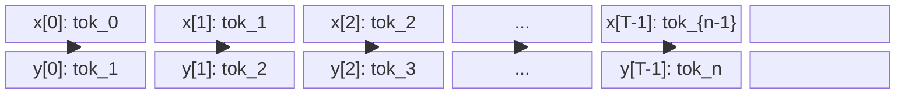
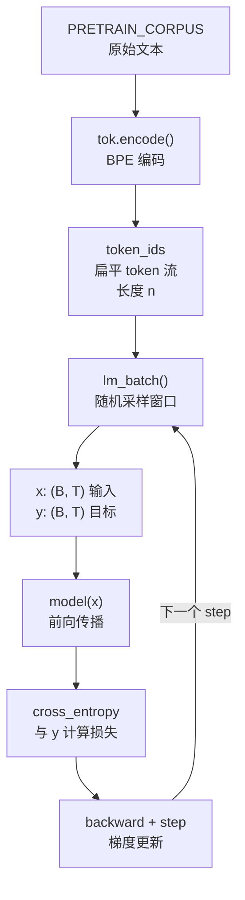

`lm_batch()` 函数是整个无监督预训练管线的数据入口。它将一篇完整的语料编码为扁平 token 流，再以"随机滑动窗口"的方式不断切取训练样本——每一次前向传播看到的都是语料中一段随机的连续子序列，模型从中学习"给定前文，预测下一个 token"的能力。本文解析该函数的设计动机、实现细节及其在训练循环中的集成方式。

## 核心理念：从扁平 Token 流中采样连续窗口

GPT-1 的预训练目标（论文公式 L1）是标准自回归语言模型：

$$L_1 = -\sum_i \log P(u_i \mid u_{i-k}, \dots, u_{i-1})$$

要实现这一目标，需要从语料中反复取出长度为 `block_size` 的连续片段作为模型输入，并将同一片段右移一位作为预测目标。本项目的做法不是按句子或文档边界划分样本，而是将**全部预训练语料拼接为一条扁平的 token id 序列**，再从中随机抽取起始位置，截取固定长度的连续窗口。这种设计的好处在于：

- **打破句子边界**：模型在预训练阶段看到的是跨句的连续上下文，与论文使用 BooksCorpus（连续文本流）的设定一致。
- **无限数据增强**：每一步采样的起始位置都是随机的，同一语料可以在不同 step 产生不同的 batch，有效利用有限的语料。
- **实现极简**：无需预处理切片、无需维护样本索引列表，一个 `randint` + 两次切片即完成。

在 `main.py` 中，语料经过 BPE 分词器编码后得到这条扁平序列，随后传给预训练循环。[main.py](main.py#L120-L121)

Sources: [main.py](main.py#L120-L121), [train.py](train.py#L3-L7)

## `lm_batch` 函数逐行解析

函数签名接受五个参数：

| 参数 | 类型 | 作用 |
|------|------|------|
| `token_ids` | `List[int]` | 整篇语料编码后的扁平 token id 列表 |
| `block_size` | `int` | 窗口长度（等于模型 `n_ctx`，本项目为 64） |
| `batch_size` | `int` | 每个 batch 的样本数 |
| `device` | `torch.device` | 目标设备（CPU / CUDA / MPS） |
| `generator` | `torch.Generator` | 控制随机种子，保证可复现 |

其核心逻辑分为三步：

**第一步——随机选取起始位置。** 使用 `torch.randint` 在合法区间内均匀采样 `batch_size` 个起始索引。上界 `max(1, n - block_size - 1)` 保证截取的窗口不会越界：当起始位置为 `i` 时，输入窗口取 `token_ids[i : i+block_size]`，目标窗口取 `token_ids[i+1 : i+1+block_size]`，后者末尾需要到 `i+block_size`，因此 `i` 最大只能取 `n - block_size - 1`。当语料极短（`n ≤ block_size`）时，`max(1, ...)` 确保上界至少为 1，避免 `randint` 报错。

**第二步——构造输入张量 `x`。** 对每个起始索引 `i`，从 `token_ids` 中截取 `[i, i+block_size)` 范围的子序列，转为 `long` 型张量，然后用 `torch.stack` 堆叠成 `(B, block_size)` 的矩阵。

**第三步——构造目标张量 `y`。** 对同一个 `i`，截取 `[i+1, i+1+block_size)` 范围——即输入窗口整体右移一位。这样 `x[b, t]` 的预测目标恰好是 `y[b, t]`，构成了标准的 next-token prediction 配对。

Sources: [data.py](data.py#L174-L184)

## 下一步预测的张量对齐关系

下面的图示展示了输入 `x` 与目标 `y` 之间的错位关系——这是自回归语言模型的核心训练信号：



对于输入序列中的每一个时间步 `t`，模型利用因果掩码只能看到位置 `0` 到 `t` 的 token，然后预测位置 `t+1` 的 token。由于 `y` 的构造方式恰好是 `x` 右移一位，`y[b, t]` 就是 `x[b, t]` 在原始语料中的下一个 token——训练时直接对 `model(x)` 的输出 logits 和 `y` 计算交叉熵即可。

Sources: [data.py](data.py#L182-L183), [train.py](train.py#L65-L66)

## 可复现性设计：Generator 与种子控制

采样函数接收一个外部传入的 `torch.Generator` 对象，而非在内部创建随机状态。在 `train.py` 的预训练循环中，该 generator 以固定种子初始化：

```python
gen = torch.Generator(device="cpu").manual_seed(0)
```

这一设计带来两个关键好处：

- **跨运行复现**：相同种子下，每一步采样的窗口位置完全一致，便于调试和对比实验。
- **与模型种子解耦**：模型初始化（`torch.manual_seed(42)`）与数据采样（`manual_seed(0)`）使用独立种子，互不干扰。

Sources: [train.py](train.py#L59), [main.py](main.py#L102)

## 在预训练循环中的集成

`lm_batch` 被 `train.pretrain()` 在每个优化步骤调用。预训练循环不使用 epoch 遍历数据集的概念——它没有"一个 epoch 看完所有数据一次"的语义，而是固定每 epoch 采样 100 个 step，总共运行 `epochs × 100` 个优化步骤。每个步骤独立调用 `lm_batch` 获取一个全新的随机 batch：



这种"每步独立采样"的模式意味着同一个 epoch 内的不同 step 可能采到高度重叠的窗口（因为起始位置完全随机），也可能采到完全不同的语料片段。对于大规模语料（如论文使用的 BooksCorpus，约 7000 万唯一 token），这种重叠概率极低；但本项目的小型语料（约 1200+ token）会产生频繁重叠，这是教学规模下可接受的折中。

Sources: [train.py](train.py#L49-L77), [data.py](data.py#L19-L81)

## 与分类批整理的对比

预训练阶段和微调阶段使用了截然不同的批数据构建策略。理解两者的差异有助于把握"预训练 vs 微调"范式的本质区别：

| 维度 | 预训练 `lm_batch` | 微调 `collate_classification` |
|------|-------------------|-------------------------------|
| 数据来源 | 扁平 token 流 | 逐条 `(text, label)` 样本列表 |
| 采样方式 | 随机窗口（可重叠） | 逐条顺序遍历（每 epoch 打乱） |
| 序列长度 | 固定 `block_size` | 可变，padding 到 `n_ctx` |
| 目标构造 | 右移一位的 next-token | 分类标签 + 辅助 LM 目标 |
| epoch 语义 | 固定 step 数，无遍历概念 | 每个 sample 恰好看一次 |

预训练的随机窗口采样侧重于**从连续文本中学习语言规律**，而微调的逐条遍历侧重于**在有标签任务上优化决策边界**。两种策略分别服务于无监督目标 L1 和有监督目标 L2，共同构成了 GPT-1 的训练范式。

Sources: [data.py](data.py#L174-L184), [data.py](data.py#L237-L257), [train.py](train.py#L49-L77), [train.py](train.py#L83-L131)

## 设计要点总结

`lm_batch` 虽然仅有 10 行代码，但其设计凝聚了三个关键决策：

**连续窗口而非离散句子。** 语言模型的本质是建模连续文本的转移概率，强行按句号切分反而会丢失跨句上下文信息。扁平流采样让模型自然地学到跨句的模式。

**可重叠随机采样而非不重叠分块。** 如果将语料划分为不重叠的 `block_size` 大小的块并逐一遍历，每个样本只会被看到一次（除非增加 epoch）。随机重叠采样使得同一段语料在不同 step 中以不同的起点被反复学习，这在小语料场景下尤为重要。

**输入/目标的错位构造通过索引偏移实现。** 没有使用额外的 mask 或 padding——`y` 直接通过 `i+1` 偏移索引获得，与 `x` 形成完美的 next-token 配对，这种实现方式简洁且无信息损失。

Sources: [data.py](data.py#L174-L184)

---

**延伸阅读：**

- [预训练语料与情感分类数据集设计](15-yu-xun-lian-yu-liao-yu-qing-gan-fen-lei-shu-ju-ji-she-ji) — 了解 `lm_batch` 所消费的语料是如何构建的
- [无监督预训练目标 L1：下一个 Token 语言模型](20-wu-jian-du-yu-xun-lian-mu-biao-l1-xia-ge-token-yu-yan-mo-xing) — `lm_batch` 产出的 `x/y` 对如何在损失函数中使用
- [分类批整理：Padding、有效位置与 [Extract] 索引](18-fen-lei-pi-zheng-li-padding-you-xiao-wei-zhi-yu-extract-suo-yin) — 微调阶段的批数据策略对照
- [完整训练管线：预训练 → 微调 → 评估的编排逻辑](23-wan-zheng-xun-lian-guan-xian-yu-xun-lian-wei-tiao-ping-gu-de-bian-pai-luo-ji) — `lm_batch` 在整个管线中的调用位置