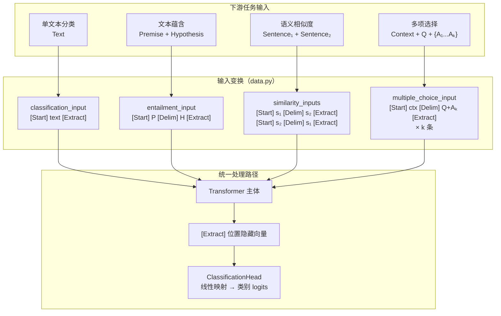

GPT-1 的核心洞见之一，在于将形态各异的 NLP 下游任务——文本分类、自然语言推断、语义相似度、多项选择——统一映射到同一个「Transformer 主体 + 线性分类头」架构上。实现这一统一的关键，正是论文 Figure 2 所描述的**任务特定输入变换**（task-specific input transformations）：通过精心设计的特殊 token 拼接规则，将不同结构的任务输入转化为单一序列，再从固定位置的隐藏向量中提取任务特征送入分类头。本页将深入解析 `data.py` 中四种变换函数的实现细节、设计意图与相互关系。

## 统一架构的基石：三个特殊 Token

在深入四种变换之前，需要先理解支撑整个统一范式的三个特殊 token。它们定义在 [tokenizer.py](tokenizer.py#L13-L14) 的 `SPECIALS` 列表中，在 BPE 词表训练完成后被追加到词表末尾，各自承担明确的结构职能。

| 特殊 Token | 词表来源 | 功能 |
|:---:|:---:|:---|
| `[Start]` | `tokenizer.py:14` | 标记序列的起始位置，为所有变换提供统一的序列开头锚点 |
| `[Delim]` | `tokenizer.py:14` | **分隔符**，用于在序列中划分两段文本（如前提与假设、上下文与问题），使模型能感知段间边界 |
| `[Extract]` | `tokenizer.py:14` | **特征提取标记**，其所在位置的隐藏向量被送入分类头，是任务输出与模型内部表示之间的唯一桥梁 |

这三个 token 的设计体现了 GPT-1 论文的精妙之处：不改变 Transformer 主体结构，仅通过输入端的 token 编排即可适配多种任务。[ClassificationHead](model.py#L185-L201) 从 `[Extract]` 位置提取特征的操作，是所有四种变换共享的下游接口。

Sources: [tokenizer.py](tokenizer.py#L13-L14), [model.py](model.py#L185-L201)

## 四种变换的全景架构

下图展示了四种任务输入如何通过各自的拼接规则生成统一的序列格式，最终汇聚到同一个 Transformer + 分类头的处理路径上：



每种变换都返回一个 `(ids, extract_index)` 元组——前者是完整的 token ID 序列，后者是 `[Extract]` 在序列中的位置下标。这一设计使得下游处理（padding、批整理、特征提取）可以在完全统一的接口上工作，无需为不同任务编写不同的批处理逻辑。

Sources: [data.py](data.py#L188-L198)

## 变换一：文本分类——最简形式

文本分类是四种变换中最基础的形式，也是本项目实际实现微调演示的变换。其函数签名和实现如下：

```python
def classification_input(tok, text: str) -> Tuple[List[int], int]:
    """分类任务：[Start] text [Extract] -> 用 [Extract] 位置做分类。"""
    ids = [_special(tok, "[Start]")] + tok.encode(text) + [_special(tok, "[Extract]")]
    return ids, len(ids) - 1
```

序列结构为 `[Start] text [Extract]`，`[Extract]` 被放置在序列最末尾。由于因果注意力掩码的存在，`[Extract]` 位置的隐藏向量能够聚合整条序列的全部信息——这正是一个理想的分类特征聚合点。`extract_index` 返回 `len(ids) - 1`，即 `[Extract]` 在序列中的精确下标。

这一变换在本项目中被 [sentiment data](data.py#L87-L168) 上的二分类微调所使用。[collate_classification](data.py#L237-L257) 函数内部调用 `classification_input` 将每条 `(text, label)` 转换为模型可消费的格式，并处理 padding 和有效位置掩码。

Sources: [data.py](data.py#L195-L198), [data.py](data.py#L237-L257)

## 变换二：文本蕴含——双段文本拼接

文本蕴含任务（如 SNLI/MultiNLI）的输入包含两段有逻辑关系的文本：前提和假设。变换通过 `[Delim]` token 在两者之间建立结构化边界：

```python
def entailment_input(tok, premise: str, hypothesis: str) -> Tuple[List[int], int]:
    """文本蕴含：[Start] 前提 [Delim] 假设 [Extract] -> 用 [Extract] 位置分类 (3 类)。"""
    ids = ([_special(tok, "[Start]")] + tok.encode(premise) + [_special(tok, "[Delim]")]
           + tok.encode(hypothesis) + [_special(tok, "[Extract]")])
    return ids, len(ids) - 1
```

序列结构为 `[Start] premise [Delim] hypothesis [Extract]`。`[Delim]` 的作用是让模型在注意力计算中显式地「感知」到文本段之间的切换点——由于模型通过预训练已经学会了 `[Delim]` 在语义上的分隔含义，微调时它能自然地将前提和假设作为两个相关但又独立的语义单元来理解。同样地，`[Extract]` 位于序列末尾，汇总两段文本的联合特征后送入分类头（论文中为三分类：蕴含、矛盾、中立）。

Sources: [data.py](data.py#L201-L205)

## 变换三：语义相似度——对称化设计

语义相似度任务（如 STS / Quora Question Pairs）需要判断两句话的语义等价程度。该任务的核心挑战在于**顺序敏感性**：`s₁ [Delim] s₂` 和 `s₂ [Delim] s₁` 在因果 Transformer 中会产生不同的隐藏表示（因为位置编码不同、注意力流方向不同）。GPT-1 的解决方案是对称化——同时构造两种顺序，分别前向后取和：

```python
def similarity_inputs(tok, sent1: str, sent2: str):
    """语义相似度：拼接两种顺序，各自过模型后求和 (对称化)，再做回归/分类。
    返回两个 (ids, extract_index)，使用方分别前向后相加。
    """
    return [
        entailment_input(tok, sent1, sent2),
        entailment_input(tok, sent2, sent1),
    ]
```

注意这里直接复用了 `entailment_input` 的拼接逻辑——两种顺序分别产生 `[Start] s₁ [Delim] s₂ [Extract]` 和 `[Start] s₂ [Delim] s₁ [Extract]`。调用方需对两条序列分别通过模型前向传播，在 `[Extract]` 位置各取一个隐藏向量，相加后送入输出层。这个设计确保了模型对输入对的顺序不变性（permutation invariance），这是语义相似度任务的内在要求。

从工程角度看，这一复用体现了良好的抽象层次设计：`entailment_input` 作为「双段文本 + 分隔符」的通用拼接器，被相似度变换直接调用，避免了代码重复。

Sources: [data.py](data.py#L208-L216)

## 变换四：多项选择——逐答案评分

多项选择任务（如 RACE / SWAG）的输入包含一个共享的上下文/问题和多个候选答案。GPT-1 的策略是为每个候选答案构造一条独立的序列，分别打分后做 softmax 选择：

```python
def multiple_choice_input(tok, context: str, question: str, answers: List[str]):
    """多项选择 (阅读理解)：对每个候选答案构造一条序列，分别打分后 softmax。
        [Start] context [Delim] question + answer_k [Extract]
    返回 answers 条 (ids, extract_index)。
    """
    seqs = []
    for ans in answers:
        body = tok.encode(question + " " + ans)
        ids = ([_special(tok, "[Start]")] + tok.encode(context) + [_special(tok, "[Delim]")]
               + body + [_special(tok, "[Extract]")])
        seqs.append((ids, len(ids) - 1))
    return seqs
```

序列结构为 `[Start] context [Delim] question + answer_k [Extract]`，其中问题和候选答案 `answer_k` 被拼接为一段文本放置在 `[Delim]` 之后。函数返回 `len(answers)` 条序列，每条对应一个候选答案。调用方对每条序列独立前向传播，在 `[Extract]` 位置提取标量分数（或隐藏向量经线性层映射为标量），对 k 个分数做 softmax 得到选择概率分布。

一个值得注意的实现细节是 `body = tok.encode(question + " " + ans)`——问题与答案被拼接为一个字符串后一次性编码，而非分别编码再拼接。这样做确保了 BPE 分词器在拼接边界处能正确进行子词合并，避免因人为断句导致的次优切分。

Sources: [data.py](data.py#L219-L231)

## 四种变换的结构对比

| 维度 | 分类 (Classification) | 蕴含 (Entailment) | 相似度 (Similarity) | 多选 (Multiple Choice) |
|:---|:---|:---|:---|:---|
| **序列模板** | `[Start] text [Extract]` | `[Start] P [Delim] H [Extract]` | `[Start] s₁ [Delim] s₂ [Extract]` ×2 | `[Start] ctx [Delim] Q+Aₖ [Extract]` ×k |
| **输入文本段数** | 1 | 2 (前提 + 假设) | 2 (两句话) | 2+ (上下文 + Q+Aₖ) |
| **`[Delim]` 使用** | ✗ | ✓ | ✓ | ✓ |
| **序列条数** | 1 | 1 | 2 (正反两种顺序) | k (每个候选一条) |
| **对称化** | 不需要 | 不需要 | ✓ (双顺序求和) | 不需要 |
| **分类头** | 线性 → n_classes | 线性 → 3 | 线性 → n_classes | 线性 → 1 (标量评分) |
| **最终决策** | argmax | argmax | 双序列表示相加后 argmax | softmax over k scores |
| **代码复用** | 基础形式 | 被相似度复用 | 调用 `entailment_input` | 独立实现 |

Sources: [data.py](data.py#L188-L231)

## 统一接口设计：`(ids, extract_index)` 元组

四种变换函数虽然在序列拼接逻辑上各不相同，但它们共享同一套返回值契约：`Tuple[List[int], int]`（多选返回该元组的列表）。这一设计选择使下游的批整理（`collate_classification`）和分类头（`ClassificationHead`）可以在完全统一的接口上工作。

`ClassificationHead` 的实现通过 `torch.gather` 从 `(B, T, n_embd)` 的隐藏张量中精确提取每个样本在 `extract_pos` 位置的表示：

```python
def forward(self, hidden, extract_pos):
    B = hidden.size(0)
    idx = extract_pos.view(B, 1, 1).expand(B, 1, hidden.size(-1))
    pooled = hidden.gather(1, idx).squeeze(1)   # (B, n_embd)
    return self.linear(pooled)                    # (B, n_classes)
```

`extract_pos` 是一个 `(B,)` 张量，每个样本可以有**不同的** `[Extract]` 位置——这是因为不同样本的文本长度不同，`[Extract]` 总是在序列末尾，其绝对位置因样本而异。`gather` 操作以向量化方式高效完成了这种「每行取不同列」的索引。

Sources: [model.py](model.py#L196-L201), [data.py](data.py#L188-L189)

## main.py 中的演示与验证

在 [main.py](main.py#L181-L188) 的步骤 6 中，项目以实际代码演示了四种变换的输出，直观展示了序列拼接与 `[Extract]` 位置：

```python
print("  分类:   ", data.classification_input(tok, "the food was delicious"))
print("  蕴含:   ", data.entailment_input(tok, "a dog runs", "an animal moves"))
print("  相似度:  ", data.similarity_inputs(tok, "it is sunny", "the sun is out"))
print("  多选:   ", data.multiple_choice_input(tok, "paris is the capital",
                                                "the capital of france is",
                                                ["london", "paris", "berlin"]))
```

这段演示代码不涉及训练，仅打印各变换的 `(ids, extract_index)` 输出，帮助开发者理解每种变换如何将自然语言文本转换为带有结构标记的 token 序列。多选变换会为三个候选答案各生成一条序列，相似度变换会生成两种顺序的序列，可以直接观察输出的数据结构差异。

Sources: [main.py](main.py#L181-L188)

## 设计哲学：最小架构改动，最大任务覆盖

GPT-1 Figure 2 的四种变换体现了一个深刻的工程哲学：**不在模型架构层面做任务适配，而是在数据层面做任务编码**。具体而言，这带来了三个关键优势：

第一，Transformer 主体完全不需要修改。无论面对哪种任务，模型始终接收一条 token 序列、做因果自注意力、输出隐藏向量。这种不变性使同一套预训练权重可以无缝迁移到任意下游任务。

第二，任务特定的信息被编码在特殊 token 的位置和排列中，而非模型参数中。`[Start]`、`[Delim]`、`[Extract]` 这三个 token 在预训练阶段就已经被模型学习过（它们出现在词表的嵌入矩阵中），微调时只需少量样本即可让模型理解它们在新任务中的角色。

第三，所有任务共享同一个简单的分类头（单层线性映射），唯一的区别在于隐藏向量的提取方式（单位置 gather、双位置求和、多位置 softmax）。这种极简的设计选择是 GPT-1 区别于 BERT（使用 `[CLS]` token）和后续任务特定架构的关键特征之一。

Sources: [data.py](data.py#L1-L7), [model.py](model.py#L185-L201)

## 延伸阅读

- 四种变换中 `[Extract]` 位置的 token 序列如何被整理为批量数据，请参阅 [分类批整理：Padding、有效位置与 [Extract] 索引](18-fen-lei-pi-zheng-li-padding-you-xiao-wei-zhi-yu-extract-suo-yin)。
- 分类头如何从 `[Extract]` 位置提取隐藏向量并完成线性分类，请参阅 [分类头：基于 [Extract] 位置的线性分类](10-fen-lei-tou-ji-yu-extract-wei-zhi-de-xian-xing-fen-lei)。
- 微调阶段如何在分类损失之外叠加辅助语言模型损失，请参阅 [有监督微调目标 L3 = L2 + λ·L1：辅助语言模型损失](21-you-jian-du-wei-diao-mu-biao-l3-l2-l-l1-fu-zhu-yu-yan-mo-xing-sun-shi)。