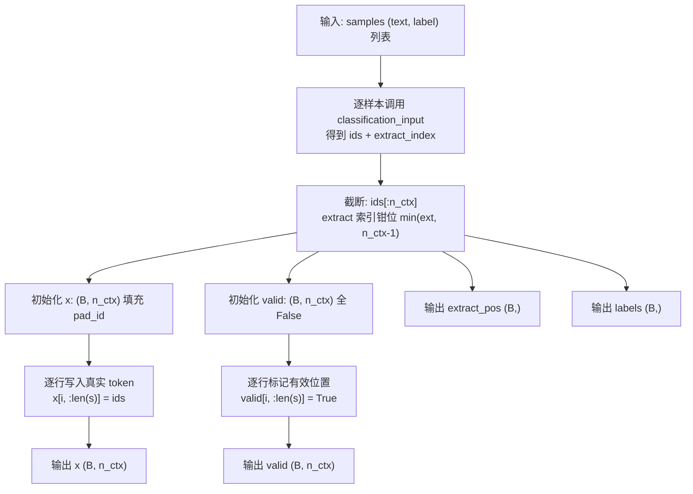

在 GPT-1 的有监督微调阶段，模型需要从变长的文本输入中提取一个固定维度的语义向量来做分类。`collate_classification` 函数承担了这个桥梁角色：它把一批长度各异的 `(text, label)` 样本整理成四个对齐的张量——padding 后的 token 矩阵、`[Extract]` 位置索引、标签、以及有效位置掩码。本文将逐一拆解这四个输出张量的构造逻辑、它们在下游训练流程中的具体消费方式，以及几个关键的工程细节。

Sources: [data.py](data.py#L234-L257)

## 序列构造：classification_input 的输出格式

批整理的第一步是为每个样本调用 `classification_input`，将原始文本转换为 token id 序列。该函数在文本前后分别插入 `[Start]` 和 `[Extract]` 两个特殊 token，形成一个结构为 `[Start] text [Extract]` 的序列。函数返回一个元组 `(ids, extract_index)`，其中 `extract_index` 被设为 `len(ids) - 1`——即 `[Extract]` 恰好位于序列最后一个位置。这个索引的设计意图是：让分类头读取 `[Extract]` token 经 Transformer 层叠处理后的隐藏表示，该表示聚合了整个序列的语义信息。

```python
def classification_input(tok, text: str) -> Tuple[List[int], int]:
    """分类任务：[Start] text [Extract] -> 用 [Extract] 位置做分类。"""
    ids = [_special(tok, "[Start]")] + tok.encode(text) + [_special(tok, "[Extract]")]
    return ids, len(ids) - 1
```

这种设计直接对应 GPT-1 论文 Section 3.3 中的 Task Specific Input Transformations——对于单文本分类任务，在输入序列末尾追加一个特殊 token，将其 Transformer 最后一层的激活值作为分类器的输入。

Sources: [data.py](data.py#L195-L198)

## 四个输出张量的构造过程

`collate_classification` 接收一组 `(text, label)` 样本、分词器 `tok` 和上下文窗口长度 `n_ctx`，经过三步处理输出四个张量。以下流程图展示了完整的构造管线：



具体来看，截断处理是一个容易被忽略但至关重要的安全措施。当编码后的序列超过 `n_ctx` 时，`ids` 被截断到 `n_ctx` 长度，同时 `extract_index` 通过 `min(ext, n_ctx - 1)` 钳位。这保证 `[Extract]` 位置索引永远落在合法范围内，避免后续 `gather` 操作越界。

张量填充采用**右侧 padding**策略：先用 `torch.full` 将整个 `(B, n_ctx)` 矩阵填充为 `pad_id`，再逐行把真实 token 写入前 `len(s)` 个位置。`valid` 掩码同步标记这些真实位置为 `True`，padding 区域保持 `False`。

| 输出张量 | 形状 | 数据类型 | 语义 |
|---------|------|---------|------|
| `x` | `(B, n_ctx)` | `torch.long` | Padding 后的 token id 矩阵 |
| `extract_pos` | `(B,)` | `torch.long` | 每个样本 `[Extract]` token 的列索引 |
| `labels` | `(B,)` | `torch.long` | 分类标签（如情感二分类中 0/1） |
| `valid` | `(B, n_ctx)` | `torch.bool` | True 表示该位置为真实 token，False 为 padding |

Sources: [data.py](data.py#L237-L257)

## extract_pos 在分类头中的消费

`extract_pos` 张量的唯一消费者是 `ClassificationHead`。该模块通过 `torch.gather` 从隐藏状态矩阵中精确提取每个样本在 `[Extract]` 位置的向量：

```python
def forward(self, hidden, extract_pos):
    B = hidden.size(0)
    idx = extract_pos.view(B, 1, 1).expand(B, 1, hidden.size(-1))
    pooled = hidden.gather(1, idx).squeeze(1)     # (B, n_embd)
    return self.linear(pooled)                      # (B, n_classes)
```

`gather` 操作沿着序列维度（dim=1）按照 `extract_pos` 指定的索引提取一行完整的隐藏向量，结果形状从 `(B, T, n_embd)` 压缩为 `(B, 1, n_embd)`，再 squeeze 为 `(B, n_embd)`。这个向量随后经过一个线性层映射到类别 logits。由于每个样本的 `[Extract]` 位置可能不同（取决于文本长度），`gather` 天然支持批内不同索引的并行提取，无需逐样本循环。

Sources: [model.py](model.py#L196-L201), [train.py](train.py#L108-L110)

## valid 掩码在辅助语言模型损失中的作用

GPT-1 的微调采用联合损失 `L3 = L2 + λ·L1`，其中 `L2` 是分类交叉熵损失，`L1` 是辅助语言模型损失。`valid` 掩码的唯一用途就是确保 `L1` **仅在真实 token 位置上计算**，而非 padding 区域。

具体实现在 `finetune` 函数中，语言模型损失的计算需要对齐"预测下一个 token"的目标。`valid` 掩码右移一位后（`shift_valid = valid[:, 1:]`），精确标记了哪些预测位置对应的真实标签存在：

```python
shift_valid = valid[:, 1:].reshape(-1)
if shift_valid.any():
    lm_losses = F.cross_entropy(shift_logits, shift_targets, reduction="none")
    l1 = (lm_losses * shift_valid).sum() / shift_valid.sum()
```

关键在于 `reduction="none"`——先逐位置计算损失，再用 `shift_valid` 做逐元素掩码相乘，最后对有效位置求均值。这避免了 padding token 的预测误差污染辅助损失信号。值得注意的是，**分类损失 `L2` 不受 `valid` 影响**，因为它只读取 `[Extract]` 位置的隐藏表示，而该位置始终是真实 token。

在评估阶段，`valid` 被丢弃（`evaluate` 中以 `_` 接收），因为评估只关注分类准确率，不涉及辅助 LM 损失。

Sources: [train.py](train.py#L112-L121), [train.py](train.py#L142-L143)

## Padding 与因果注意力的交互

一个值得关注的工程细节是：本实现中的因果注意力掩码仅做下三角掩码（防止 token 关注未来位置），**没有额外屏蔽 padding 位置**。这意味着 padding token 的嵌入向量会通过注意力机制"混入"真实 token 的隐藏表示中。

这在实践中通常不会造成严重问题，原因有两点：第一，GPT 的因果掩码保证 padding token（位于序列右侧）永远不会被真实 token 之后的位置关注——但真实 token **确实会**关注到 padding 位置。第二，在分类任务中，最终读取的是 `[Extract]` 位置的隐藏表示，而 `[Extract]` 恰好位于真实 token 的末尾（padding 之前），其表示已经在因果掩码下聚合了所有左侧真实 token 的信息。

更严谨的做法是引入额外的 padding 掩码（在注意力分数中将 padding 列设为 `-inf`），但本最小化实现选择了简洁性优先的策略。这一设计取舍在项目内置的小数据集上表现良好，因为序列长度普遍较短（远小于 `n_ctx=64`），padding 的比例和影响有限。

Sources: [model.py](model.py#L58-L72), [model.py](model.py#L24-L25)

## collate_classification 的调用上下文

`collate_classification` 在训练管线中被两处调用——微调训练循环和评估循环。下表对比了两种调用场景对四个输出张量的消费差异：

| 消费者 | `x` | `extract_pos` | `labels` | `valid` |
|--------|-----|--------------|----------|---------|
| `finetune`（训练） | ✅ 前向传播 + LM 目标 | ✅ 分类头 gather | ✅ L2 交叉熵 | ✅ L1 掩码 |
| `evaluate`（评估） | ✅ 前向传播 | ✅ 分类头 gather | ✅ 准确率统计 | ❌ 丢弃 |

这种统一的批整理接口使得训练和评估使用完全相同的数据预处理流程，避免了训练-评估偏差（train-eval skew）。在 `main.py` 的完整管线中，`n_ctx` 由模型配置 `GPTConfig.n_ctx` 统一控制，保证 `collate` 输出的张量宽度与模型的位置嵌入矩阵和因果掩码尺寸一致。

Sources: [train.py](train.py#L105-L106), [train.py](train.py#L142-L143), [main.py](main.py#L124)

## 进一步阅读

- **分类头的完整实现**：包括线性投影与 gather 细节，详见 [分类头：基于 [Extract] 位置的线性分类](10-fen-lei-tou-ji-yu-extract-wei-zhi-de-xian-xing-fen-lei)
- **四种任务输入变换的统一设计**：分类、蕴含、相似度、多选共享相同的 `[Extract]` 索引模式，详见 [论文 Figure 2 四种任务输入变换：分类、蕴含、相似度、多选](17-lun-wen-figure-2-si-chong-ren-wu-shu-ru-bian-huan-fen-lei-yun-han-xiang-si-du-duo-xuan)
- **辅助 LM 损失的完整计算逻辑**：`valid` 掩码如何参与 `L3 = L2 + λ·L1`，详见 [有监督微调目标 L3 = L2 + λ·L1：辅助语言模型损失](21-you-jian-du-wei-diao-mu-biao-l3-l2-l-l1-fu-zhu-yu-yan-mo-xing-sun-shi)