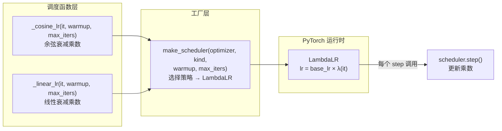
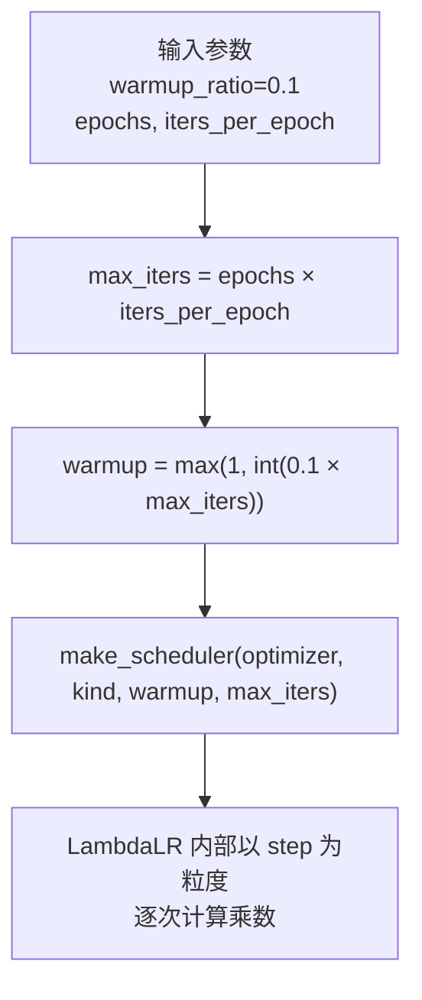
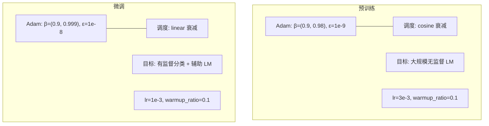

学习率调度是 Transformer 训练稳定性与最终收敛质量的关键控制器。本项目忠实复现了 GPT-1 论文的调度配方——**线性 warmup 阶段**后接**余弦衰减**（预训练）或**线性衰减**（微调），通过 PyTorch 的 `LambdaLR` 机制以 lambda 函数定义逐 step 的学习率乘数。本文将逐层拆解调度函数的数学定义、LambdaLR 的乘数语义、两个训练阶段对衰减策略的差异化选择，以及 `scheduler.step()` 的正确调用时序。

## 调度架构总览

整个学习率调度系统由三个函数构成，职责分离清晰：



`make_scheduler` 是唯一的对外接口，它接收优化器引用、调度类型（`"cosine"` 或 `"linear"`）、warmup 步数和总步数，返回一个 `LambdaLR` 实例。调用方无需关心乘数计算的数学细节——调度函数负责输出 `[0, 1]` 区间的乘数，PyTorch 框架负责将其乘到优化器的 `base_lr` 上。

Sources: [train.py](train.py#L24-L43)

## 逐函数解析：乘数的数学定义

两个调度函数共享相同的 warmup 逻辑，差异仅在衰减阶段。

### 线性 Warmup（两函数共用）

```python
if it < warmup:
    return it / max(1, warmup)
```

当迭代步 `it` 在 `[0, warmup)` 区间内时，返回 `it / warmup`。这意味着 step 0 的乘数为 0（学习率实际为零），随后线性攀升，到 step `warmup` 时恰好达到 1.0（即满学习率）。`max(1, warmup)` 是防御性除零保护，确保即使 `warmup` 参数被错误传入 0 也不会抛出异常。GPT-1 论文对所有训练阶段均采用 10% 的 warmup 比例（`warmup_ratio=0.1`），这个值在 `pretrain` 和 `finetune` 的调用处统一传入。

Sources: [train.py](train.py#L27-L37), [main.py](main.py#L131-L133)

### 余弦衰减（`_cosine_lr`）

```python
progress = (it - warmup) / max(1, max_iters - warmup)
return 0.5 * (1.0 + math.cos(math.pi * progress))
```

warmup 结束后，将剩余迭代区间 `[warmup, max_iters]` 归一化为进度变量 `progress ∈ [0, 1]`，然后套用经典的余弦半周期公式 `0.5 × (1 + cos(π × progress))`。当 `progress = 0`（衰减刚开始）时乘数为 1.0，与 warmup 终点平滑衔接；当 `progress = 1`（训练结束）时乘数为 0.0。余弦曲线的 S 型下降特性意味着：**衰减初期下降缓慢、中期加速、末期再次趋缓**，这比线性衰减更温和，有利于模型在训练后期做精细的参数微调。

Sources: [train.py](train.py#L27-L31)

### 线性衰减（`_linear_lr`）

```python
return max(0.0, 1.0 - (it - warmup) / max(1, max_iters - warmup))
```

衰减阶段用简单的线性递减公式，乘数从 1.0 匀速降至 0.0。`max(0.0, ...)` 裁剪确保乘数不会变为负值（若训练循环意外超出 `max_iters` 步，学习率会稳定在零而非负数）。线性衰减的实现更简单、计算开销更低，在微调阶段——此时模型已具备预训练知识、只需在小规模下游数据上做有限调整——这种更"激进"的匀速衰减是完全合理的。

Sources: [train.py](train.py#L34-L37)

### 两种衰减策略的乘数曲线对比

| 维度 | 余弦衰减 (`_cosine_lr`) | 线性衰减 (`_linear_lr`) |
|---|---|---|
| **数学形式** | `0.5(1 + cos(πp))`，p 为归一化进度 | `1 - p`，p 为归一化进度 |
| **衰减速率** | 慢→快→慢（S 型） | 恒定匀速 |
| **末段行为** | 平滑趋近零 | 直接截止 |
| **适用阶段** | 预训练（大规模、长周期） | 微调（小规模、短周期） |
| **设计动机** | 长训练需要尾部精修空间 | 微调时希望快速降学习率以锁定参数 |
| **PyTorch LambdaLR kind** | `"cosine"` | `"linear"` |

## LambdaLR 的乘数语义与集成

`make_scheduler` 的核心是一行代码，但它蕴含了一个关键的 PyTorch 语义：**LambdaLR 接收一个 lambda 函数，该函数以 epoch 内的 step 计数为参数，返回一个乘数**。实际的优化器学习率等于 `base_lr × λ(step)`。

```python
fn = _cosine_lr if kind == "cosine" else _linear_lr
return torch.optim.lr_scheduler.LambdaLR(optimizer, lambda it: fn(it, warmup, max_iters))
```

这里有一个容易被忽略的实现细节：PyTorch 的 `LambdaLR` 中传入 lambda 的 `it` 参数并非原始 step 编号，而是 `last_epoch`——在**单 step 调用**模式（即每次 `scheduler.step()` 对应一次 `optimizer.step()`）下，它恰好等于当前已完成的 step 数，从 0 开始递增。本项目的训练循环正是这种单 step 模式，因此 `_cosine_lr` 和 `_linear_lr` 中的 `it` 能正确映射到 `[0, max_iters)` 区间。

Sources: [train.py](train.py#L40-L43)

### warmup 与 max_iters 的推导链

调用方传入的是 `warmup_ratio`（比例）和 `epochs`，调度器内部将其转换为绝对步数：



在预训练中，`iters_per_epoch` 被硬编码为 100（`max(1, 100)`）；在微调中，它根据训练样本数和 batch_size 动态计算（`len(samples) // batch_size`）。两者均通过 `max(1, ...)` 保证至少为 1，避免空训练循环。

Sources: [train.py](train.py#L55-L58), [train.py](train.py#L93-L96)

## 两阶段调度的差异化配置

GPT-1 论文为预训练和微调选择了不同的衰减策略，同时配套了不同的 Adam 超参数。这种差异并非随意，而是反映了两阶段的训练目标本质不同：



| 配置项 | 预训练 (`pretrain`) | 微调 (`finetune`) |
|---|---|---|
| **调度类型** | `"cosine"` | `"linear"` |
| **Adam β2** | 0.98（更小的二阶矩衰减率） | 0.999（PyTorch 默认值） |
| **Adam ε** | 1e-9（极小） | 1e-8（标准值） |
| **Base LR** | 3e-3 | 1e-3 |
| **warmup_ratio** | 0.1 | 0.1 |
| **代码位置** | `train.py` L54-58 | `train.py` L92-96 |

预训练使用 β2=0.98 而非默认的 0.999，这是一个来自原始 Transformer 论文的经典选择。较小的 β2 使得二阶矩估计的滑动窗口更短，对梯度的变化更敏感，在大规模无监督训练的初期——尤其是 warmup 阶段——能更快地适应参数空间的几何结构。配合极小的 ε=1e-9，分母修正几乎不影响有效学习率，让调度器对学习率的控制更加精确。微调阶段则回归标准 Adam 配置（β2=0.999），因为此时模型已处于良好的参数区域，优化器动量的稳定性比响应速度更重要。

Sources: [train.py](train.py#L52-L58), [train.py](train.py#L89-L96), [main.py](main.py#L131-L133), [main.py](main.py#L158-L159)

## scheduler.step() 的调用时序

在本项目的两个训练循环中，`scheduler.step()` 的调用位置完全一致——紧跟在 `optimizer.step()` 之后：

```python
optimizer.zero_grad()
loss.backward()
nn.utils.clip_grad_norm_(model.parameters(), 1.0)
optimizer.step()
scheduler.step()      # ← 更新学习率乘数，为下一个 step 准备
```

这个顺序至关重要：先完成当前 step 的梯度更新，再推进学习率调度器的内部计数器。PyTorch 1.1+ 以后，`scheduler.step()` 应当在 epoch 循环之后或在每个 optimizer step 之后调用，而非之前。本项目的单 step 调用模式意味着每个 optimizer step 都对应一次 scheduler 更新，因此学习率在每个迭代步都按余弦/线性曲线精确变化，而非按 epoch 粒度跳变。

Sources: [train.py](train.py#L67-L72), [train.py](train.py#L124-L128)

## 设计合理性总结

这套调度系统的精巧之处在于其**简洁性与忠实性**——用两个不到 10 行的数学函数和一个 LambdaLR 包装，精确复现了 GPT-1 论文的训练配方。warmup 阶段防止随机初始化的模型在训练初期被过大的梯度推离最优区域；余弦衰减在预训练的长周期中提供了平滑的退火曲线，使模型在训练末期能以极小学习率做精细收敛；线性衰减在微调的短周期中则以更直接的匀速退火满足快速锁定参数的需求。所有超参数的选择——从 warmup 比例到 Adam 的 β2——都可在源码中追溯到具体的论文出处和工程考量。

建议接下来阅读 [无监督预训练目标 L1](20-wu-jian-du-yu-xun-lian-mu-biao-l1-xia-ge-token-yu-yan-mo-xing) 了解学习率调度服务的训练目标函数，以及 [有监督微调目标 L3 = L2 + λ·L1](21-you-jian-du-wei-diao-mu-biao-l3-l2-l-l1-fu-zhu-yu-yan-mo-xing-sun-shi) 了解微调阶段中辅助 LM 损失如何与学习率调度协同工作。