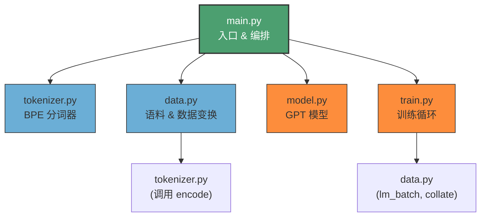
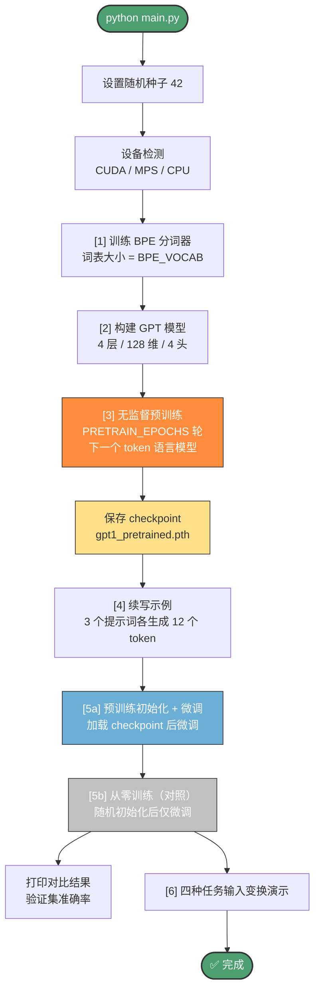

本页面是 GPT-1 复现项目的**唯一入口指南**——从环境检查到一键运行，帮助你最快地跑通完整的「预训练 → 微调 → 评估」管线。无需下载数据集、无需外部语料，所有训练数据均内置于代码中。阅读完本页面，你将对项目的运行方式、可调参数和预期输出有清晰的全景认识。

## 运行环境

### 硬件与设备

本项目采用**教学小规模**配置（4 层 / 128 维 / 4 头注意力），在普通笔记本的 CPU 上即可完成完整训练。同时支持 GPU 自动探测，按优先级依次检查 CUDA、Apple MPS（Metal Performance Shaders）和 CPU 三种后端。设备选择逻辑封装在 `pick_device()` 函数中：

```python
def pick_device() -> torch.device:
    if torch.cuda.is_available():           # 1. NVIDIA GPU 优先
        return torch.device("cuda")
    if getattr(torch.backends, "mps", None) \
       and torch.backends.mps.is_available():  # 2. Apple Silicon
        return torch.device("mps")
    return torch.device("cpu")              # 3. 兜底
```

| 设备类型 | 适用场景 | 相对训练速度 | 是否需额外配置 |
|---------|---------|------------|-------------|
| **CUDA** (NVIDIA GPU) | 桌面/服务器工作站 | 最快 | 安装 CUDA 版 PyTorch |
| **MPS** (Apple Silicon) | M1/M2/M3 Mac | 较快 | macOS 12.3+ 自带 |
| **CPU** | 任何机器 | 最慢（但可接受） | 无 |

Sources: [main.py](main.py#L20-L25)

### 软件依赖

整个项目的设计理念是**零外部数据依赖、最小安装即可运行**。唯一的核心依赖是 PyTorch，BPE 分词器、数据集和所有模型代码均为自包含实现，不依赖 `tiktoken`、`transformers` 或任何 NLP 库。

| 依赖包 | 用途 | 是否必需 | 安装方式 |
|-------|------|---------|---------|
| **Python 3.8+** | 运行时环境 | ✅ 必需 | — |
| **PyTorch ≥ 2.0** | 张量计算、自动微分、模型训练 | ✅ 必需 | `pip install torch` |
| **matplotlib** | 绘制预训练损失曲线与微调对比柱状图 | ❌ 可选 | `pip install matplotlib` |

若未安装 matplotlib，程序不会报错，而是优雅地跳过绘图并以纯文本输出训练结果。这一容错逻辑通过 `try/except` 包裹导入语句实现，打印 `(未安装 matplotlib，跳过绘图)` 提示后继续执行后续步骤。

Sources: [main.py](main.py#L59-L66)

## 项目文件全景

五个 Python 文件各司其职，`main.py` 作为唯一入口编排其余四个模块。理解文件间的调用关系，有助于你在后续深入阅读时快速定位实现细节。



| 文件 | 职责 | 行数 | 核心类/函数 |
|------|------|------|-----------|
| [main.py](main.py) | **入口**：设备选择、流程编排、续写生成、checkpoint 管理 | 195 | `main()`, `generate()`, `pick_device()` |
| [model.py](model.py) | GPT 架构：多头注意力、前馈网络、嵌入层、分类头 | 202 | `GPT`, `GPTConfig`, `ClassificationHead` |
| [tokenizer.py](tokenizer.py) | 自包含 BPE 分词器：训练、编码、解码 | 152 | `BPETokenizer` |
| [data.py](data.py) | 内置语料、情感数据集、论文 Figure 2 四种任务输入变换 | 267 | `PRETRAIN_CORPUS`, `SENTIMENT_DATA`, `lm_batch()` |
| [train.py](train.py) | 预训练、微调、评估循环及学习率调度 | 149 | `pretrain()`, `finetune()`, `evaluate()` |

## 一键运行

### 基本用法

只需一条命令即可启动完整的训练管线，无需传入任何参数：

```bash
cd zj_test/py/30_gpt1
python main.py
```

### 可调环境变量

训练规模通过环境变量控制，默认值已针对 CPU 快速运行优化。你可以按需增大 epoch 数以获得更好的训练效果：

```bash
# 示例：增加预训练轮数和微调轮数
PRETRAIN_EPOCHS=20 FINETUNE_EPOCHS=40 python main.py

# 同时增大 BPE 词表（默认 300）
PRETRAIN_EPOCHS=8 FINETUNE_EPOCHS=30 BPE_VOCAB=500 python main.py
```

| 环境变量 | 默认值 | 作用 | 影响范围 |
|---------|-------|------|---------|
| `PRETRAIN_EPOCHS` | 8 | 无监督语言模型预训练的 epoch 数 | 增大可降低 LM 损失，提升续写质量 |
| `FINETUNE_EPOCHS` | 60 | 情感分类微调的 epoch 数 | 增大可提升分类准确率，但可能过拟合 |
| `BPE_VOCAB` | 300 | BPE 分词器目标词表大小（含特殊 token） | 增大可生成更细粒度的子词，提升编码精度 |

这三个变量通过 `os.getenv()` 读取，并在程序启动时打印到控制台，便于确认当前运行配置。

Sources: [main.py](main.py#L105-L107)

### 默认模型配置

`main()` 中硬编码的 `GPTConfig` 采用教学小规模，与论文原版 GPT-1 形成鲜明对比。参数设置可在源码中直接修改，无需命令行传参：

| 参数 | 默认值（教学版） | 论文 GPT-1 | 说明 |
|------|---------------|-----------|------|
| `n_layer` | 4 | 12 | Transformer 解码块层数 |
| `n_embd` | 128 | 768 | 嵌入与隐藏维度 |
| `n_head` | 4 | 12 | 多头注意力头数 |
| `n_ctx` | 64 | 512 | 最大上下文长度（block size） |
| `vocab_size` | 由 BPE 决定 | ~40000 | 词表大小（运行时由分词器确定） |

Sources: [model.py](model.py#L20-L31), [main.py](main.py#L124)

## 执行流程

理解 `main()` 函数的六阶段流水线，对于预判运行时间和解读输出至关重要。以下流程图展示了从分词器训练到最终评估的完整路径：



| 阶段 | 编号 | 核心操作 | 预计耗时（CPU） |
|------|------|---------|---------------|
| BPE 训练 | [1] | 在内置语料上迭代合并子词，构建词表 | < 1 秒 |
| 模型构建 | [2] | 初始化 4 层 GPT，打印参数量 | < 1 秒 |
| 无监督预训练 | [3] | 800 步（8 epoch × 100 步），余弦衰减学习率 | 30–60 秒 |
| 续写演示 | [4] | 3 个提示词各采样 12 个 token | < 1 秒 |
| 微调（两条路线） | [5a]+[5b] | 各 60 epoch 的分类微调，含辅助 LM 损失 | 30–90 秒 |
| 任务变换演示 | [6] | 打印分类/蕴含/相似度/多选四种输入格式 | < 1 秒 |

Sources: [main.py](main.py#L101-L194)

## 输出产物

运行结束后，程序会在项目目录下生成以下文件。这些产物被 `.gitignore` 排除，不会纳入版本控制：

| 文件 | 生成条件 | 内容说明 |
|------|---------|---------|
| `gpt1_pretrained.pth` | 始终生成 | 预训练权重 checkpoint，含模型配置 `cfg` 和 `state_dict` |
| `pretrain_loss.png` | 需安装 matplotlib | 预训练 L1 损失曲线（按优化步数绘制） |
| `finetune_compare.png` | 需安装 matplotlib | 预训练初始化 vs 从零训练的验证集准确率柱状图 |

Checkpoint 采用 `torch.save` 序列化，文件结构为字典 `{"cfg": GPTConfig, "state_dict": OrderedDict}`。加载时通过 `load_gpt()` 从字典中恢复配置和权重，确保模型重建的完全一致性。

Sources: [main.py](main.py#L47-L56), [main.py](main.py#L136-L139), [.gitignore](.gitignore#L1-L5)

## 常见问题排查

| 症状 | 原因 | 解决方案 |
|------|------|---------|
| `ModuleNotFoundError: No module named 'torch'` | 未安装 PyTorch | 执行 `pip install torch`（CPU 版即可） |
| `(未安装 matplotlib，跳过绘图)` | 缺少可选依赖 | `pip install matplotlib` 或忽略（不影响核心功能） |
| 训练速度过慢 | 运行在 CPU 上 | 增大 `n_embd` / `n_layer` 无效；改用 GPU 或减少 epoch |
| `RuntimeError: ... MPS ...` | macOS MPS 后端偶尔不稳定 | 设环境变量 `PYTORCH_ENABLE_MPS_FALLBACK=1` 回退 CPU |
| 续写文本不连贯 | 预训练数据量和 epoch 太少 | 增大 `PRETRAIN_EPOCHS`，但本质受限于内置小语料 |
| 微调准确率接近随机 | 小数据集 + 少量 epoch | 增大 `FINETUNE_EPOCHS`；在真实复现中需用大规模数据集 |

> **提示**：本项目采用内置的 ~60 句预训练语料和 80 条情感分类数据（正负各 40），规模远小于论文使用的 BooksCorpus（~7000 本书）和 SST-2（~67k 条）。预训练在小数据上的收益有限是预期行为，详见论文对大规模语料的依赖性讨论。

Sources: [data.py](data.py#L19-L81), [data.py](data.py#L87-L168)

## 建议阅读路线

成功运行项目后，可以按照以下顺序深入理解各个模块的实现细节：

1. 先从**论文要点对照表**入手，建立论文与代码的整体映射关系：[论文要点与代码对照表：从理论到实现](3-lun-wen-yao-dian-yu-dai-ma-dui-zhao-biao-cong-li-lun-dao-shi-xian)
2. 进入**模型架构**系列，理解仅解码器 Transformer 的层叠设计：[整体设计：仅解码器 Transformer 的层叠结构](4-zheng-ti-she-ji-jin-jie-ma-qi-transformer-de-ceng-die-jie-gou)
3. 了解**训练管线**的完整编排逻辑：[完整训练管线：预训练 → 微调 → 评估的编排逻辑](23-wan-zheng-xun-lian-guan-xian-yu-xun-lian-wei-diao-ping-gu-de-bian-pai-luo-ji)