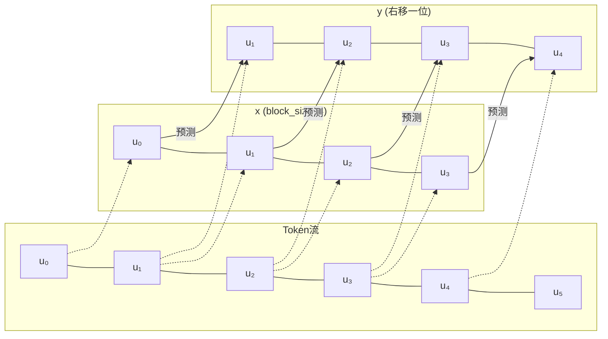
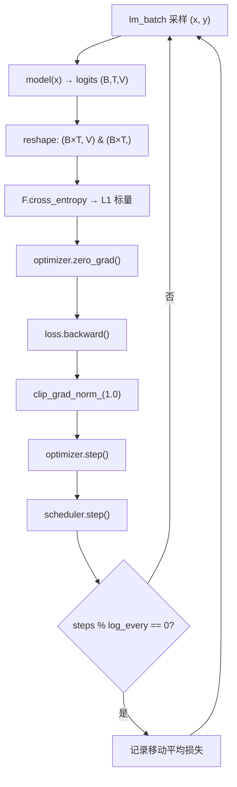

GPT-1 的核心创新在于两阶段训练范式：先通过无监督语言建模在海量无标注文本上学习通用表示，再将习得的语言能力迁移到下游有监督任务。本页聚焦第一阶段的目标函数 **L1**——标准的自回归下一个 Token 预测损失，深入解析其数学定义、数据构建、前向传播、损失计算及训练循环配置的完整实现链路。

## L1 目标函数的数学定义

GPT-1 论文将无监督预训练目标定义为给定上下文窗口内前 $k$ 个 Token 后，预测下一个 Token 的负对数似然：

$$L_1(\mathcal{U}) = \sum_i \log P(u_i \mid u_{i-k}, \ldots, u_{i-1}; \Theta)$$

其中 $\mathcal{U} = \{u_1, u_2, \ldots, u_n\}$ 是无标注 Token 序列，$k$ 是上下文窗口大小（对应代码中的 `block_size` / `n_ctx`），$\Theta$ 是模型参数。条件概率 $P(u_i \mid u_{i-k}, \ldots, u_{i-1})$ 由 Transformer 解码器建模，最终通过 softmax 在词表上归一化得到。代码文件顶部的注释精确复刻了论文公式，并明确了 L1 在两阶段范式中的角色：它是预训练的唯一目标，同时在微调阶段作为辅助损失被加权引入 L3。这一设计选择使模型在适应下游任务的同时保留通用语言理解能力。

Sources: [train.py](train.py#L1-L14)

## 数据管道：从 Token 流到 (x, y) 训练对

L1 的训练数据由 `lm_batch()` 函数从扁平化的 Token ID 流中采样构建。其核心逻辑极为简洁：在 Token 流的合法起始范围内随机抽取 `batch_size` 个偏移量，对每个偏移量 $i$，截取 `token_ids[i:i+block_size]` 作为输入 $x$，截取 `token_ids[i+1:i+1+block_size]` 作为目标 $y$——目标序列恰好是输入序列右移一位的结果。这种构造方式天然实现了下一个 Token 预测的监督信号：$x$ 的第 $t$ 个位置需要预测 $y$ 的第 $t$ 个位置，即原始序列中的第 $t+1$ 个 Token。随机偏移采样保证每个 mini-batch 覆盖语料的不同区段，有效利用了有限数据。值得注意的是，采样使用固定种子的 `torch.Generator`，确保实验可复现。

Sources: [data.py](data.py#L174-L184)

## 前向传播：因果掩码保障自回归性

`GPT.forward()` 方法接收 Token ID 张量，输出形状为 `(B, T, V)` 的 logits。内部流程依次为：Token 嵌入与学习的位置嵌入相加（不缩放，与原始 Transformer 不同），经嵌入层 Dropout 后送入 4 层 Transformer Block，最终通过末层 LayerNorm。每层 Block 内部的因果自注意力是 L1 目标能够成立的关键机制——通过上三角 $-\infty$ 掩码，位置 $t$ 只能关注 $0$ 到 $t$ 的 Token，确保模型无法"偷看"未来信息。LMHead 将隐藏向量通过与 Token 嵌入绑定的权重矩阵转置投影回词表空间，输出每个位置在词表上所有 Token 的未归一化分数。若无因果掩码，模型可以无损地读取目标 Token，L1 将退化到零，预训练完全失效。

Sources: [model.py](model.py#L141-L179), [model.py](model.py#L62-L76)

## 损失计算：展平的交叉熵

L1 的损失计算位于 `pretrain()` 函数内部，采用一行极为紧凑的实现。`model(x)` 输出形状为 `(B, T, V)` 的 logits，通过 `reshape(-1, V)` 将 batch 和序列维度展平为二维张量 $(B \times T, V)$；目标 $y$ 同样展平为 $(B \times T,)$ 的一维张量。`F.cross_entropy` 随后在展平的维度上计算平均交叉熵损失。这种展平策略等价于对 $B \times T$ 个独立预测位置取均匀平均，每个位置贡献相等的梯度信号。由于 $y$ 的构造保证了对每个输入位置 $t$，其对应目标是序列中的第 $t+1$ 个 Token，展平后的交叉熵精确对应论文中的 $L_1$ 公式。

Sources: [train.py](train.py#L65-L66)

## 预训练循环：优化器配置与梯度控制

`pretrain()` 函数封装了完整的无监督预训练循环，其优化配置严格对齐论文设定：

| 配置项 | 值 | 论文依据 |
|--------|------|----------|
| 优化器 | Adam | 论文使用 Adam |
| $\beta_1, \beta_2$ | (0.9, 0.98) | 论文预训练 $\beta_2=0.98$ |
| $\epsilon$ | 1e-9 | 论文设定 |
| 学习率调度 | 线性 Warmup → 余弦衰减 | 论文 warmup + 自定义衰减 |
| 梯度裁剪 | max_norm=1.0 | 论文梯度范数裁剪 |
| 每 epoch 步数 | 100 | 固定采样步数 |

每个训练步的流程清晰可控：`lm_batch` 采样数据 → 前向计算 logits → 展平交叉熵求损失 → 梯度清零 → 反向传播 → 梯度范数裁剪 → 优化器步进 → 学习率调度步进。损失每隔 `log_every`（默认 50）步记录一次移动平均，形成训练历史曲线。`main.py` 调用时传入 `lr=3e-3`、`warmup_ratio=0.1`、`batch_size=32`，在教学规模（4 层 / 128 维）下可快速收敛。

Sources: [train.py](train.py#L49-L77), [main.py](main.py#L131-L133)

## 因果掩码与 L1 的深层耦合

因果掩码不仅是架构选择，更是 L1 目标函数的数学前提。考虑一个 `block_size=4` 的输入序列 $[u_0, u_1, u_2, u_3]$，模型的输出 logits 在位置 $t$ 处表示 $P(u_t \mid u_0, \ldots, u_t)$，而 L1 要求的预测目标是 $u_{t+1}$。通过对 logits 和目标序列的错位设计（$x$ 与 $y$ 差一位），交叉熵损失自然计算 $-\log P(u_{t+1} \mid u_0, \ldots, u_t)$，这正是论文公式的逐项实现。因果掩码在此过程中确保了位置 $t$ 的注意力输出不包含 $u_{t+1}$ 及之后的信息，维护了条件概率的有效性。值得注意的是，由于目标 $y$ 直接从原始 Token 流偏移一位截取，位置 $t$ 的 logit 实际预测的是原始序列中的 $u_{i+t+1}$，而非掩码后序列的某个内部状态——这一数据与掩码的协同设计是 L1 正确实现的根基。

Sources: [model.py](model.py#L58-L76), [train.py](train.py#L64-L66)

## 与微调阶段辅助 LM 损失的差异

虽然本页聚焦预训练阶段的 L1，但理解它与微调阶段辅助 LM 损失（L3 = L2 + λ·L1）的差异有助于把握整体设计。预训练 L1 在**全部序列位置**上无差别计算损失，不涉及 padding 掩码——因为 `lm_batch` 采样的都是固定长度的真实 Token 片段。而微调阶段的辅助 LM 损失需要在 padding 填充的分类序列上计算，因此引入 `valid` 掩码，仅在真实 Token 位置（非 padding）上计算交叉熵并取加权平均。两者的数学形式相同（均为负对数似然），但作用域和工程处理因数据特性不同而存在关键区别。这一区别的详细解析见 [有监督微调目标 L3 = L2 + λ·L1：辅助语言模型损失](21-you-jian-du-wei-diao-mu-biao-l3-l2-l-l1-fu-zhu-yu-yan-mo-xing-sun-shi)。

Sources: [train.py](train.py#L112-L121)

## 后续阅读

- **预训练到微调的过渡**：理解 L1 如何作为辅助损失被加权引入有监督微调，参见 [有监督微调目标 L3 = L2 + λ·L1：辅助语言模型损失](21-you-jian-du-wei-diao-mu-biao-l3-l2-l-l1-fu-zhu-yu-yan-mo-xing-sun-shi)
- **语言模型数据的采样策略**：`lm_batch` 的采样逻辑属于更广泛的数据构建体系，参见 [语言模型批数据采样策略](16-yu-yan-mo-xing-pi-shu-ju-cai-yang-ce-lue)
- **学习率调度细节**：Warmup 与余弦衰减的数学实现，参见 [学习率调度：线性 Warmup + 余弦/线性衰减](19-xue-xi-lu-diao-du-xian-xing-warmup-yu-xian-xing-shuai-jian)
- **完整训练编排**：L1 在端到端管线中的位置与调用方式，参见 [完整训练管线：预训练 → 微调 → 评估的编排逻辑](23-wan-zheng-xun-lian-guan-xian-yu-xun-lian-wei-diao-ping-gu-de-bian-pai-luo-ji)