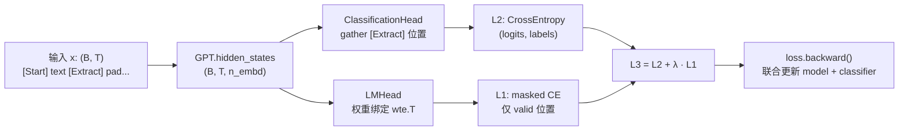
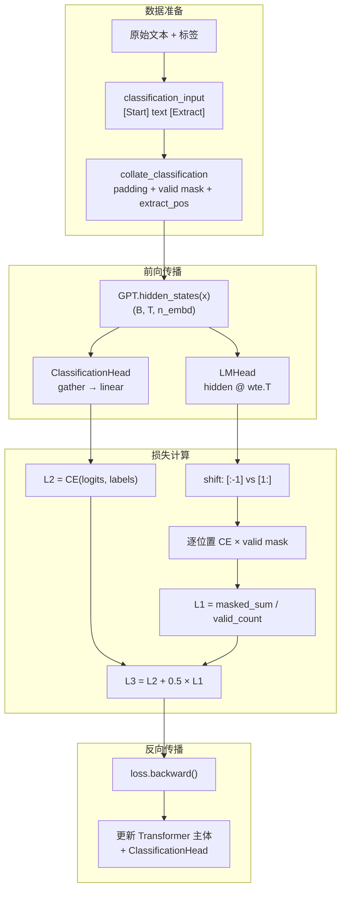

GPT-1 论文的核心创新之一，不在于"预训练→微调"这一范式本身，而在于微调阶段对损失函数的精心设计：**在下游任务的有监督目标之上，叠加一个来自预训练的语言建模辅助目标**，形成复合损失 `L3 = L2 + λ·L1`。这一设计以极低的实现代价（单次额外线性投影 + 交叉熵），换取了显著的泛化提升与灾难性遗忘抑制。本页将深入剖析该复合损失的理论动机、代码实现细节，以及在当前项目中的具体计算路径。

Sources: [train.py](train.py#L1-L8)

## 理论动机：为何微调时仍需语言建模？

当预训练好的 GPT 模型被迁移到下游分类任务时，若仅使用任务损失 `L2` 做梯度更新，模型参数会快速偏向任务特定的决策边界，导致**灾难性遗忘（Catastrophic Forgetting）**——预训练阶段习得的通用语言表示在微调中被侵蚀。GPT-1 论文（Radford et al., 2018, Section 3.3）的解决方案是：在微调时，对同一输入序列同时计算语言模型损失 `L1`，使其作为正则项约束隐含空间不偏离预训练的分布。

这一设计带来三重收益：

- **泛化增强**：辅助 LM 损失迫使模型在任务无关的 token 位置上仍保持预测下一个 token 的能力，保留了更丰富的语义表示，从而在小数据集上提升泛化。
- **收敛加速**：L1 梯度为 Transformer 主体提供了额外的、密集的监督信号（每个真实 token 位置都有一个），比仅依赖 [Extract] 单点的 L2 梯度更丰富，加速了参数空间的探索。
- **稳定性保障**：当 L2 梯度方向与预训练表示空间冲突时，L1 梯度起锚定作用，防止参数剧烈漂移。

Sources: [train.py](train.py#L1-L8)

## 复合损失的数学定义与实现映射

论文定义三个损失符号：

| 符号 | 含义 | 计算方式 | 代码位置 |
|------|------|----------|----------|
| **L1** | 无监督语言模型损失（自回归下一 token 交叉熵） | `CrossEntropy(shift_logits, shift_targets)` on valid positions | [train.py#L113-L121](train.py#L113-L121) |
| **L2** | 有监督任务损失（分类交叉熵） | `CrossEntropy(classifier_logits, labels)` | [train.py#L110](train.py#L110) |
| **L3** | 微调总损失 = L2 + λ·L1 | `loss = l2 + lm_weight * l1` | [train.py#L123](train.py#L123) |

其中 λ（代码中命名为 `lm_weight`）控制辅助目标的权重。论文在实验中使用 λ = 0.5，本项目同样采用该值（见 `main.py` 调用处 `lm_weight=0.5`）。

Sources: [train.py](train.py#L83-L131), [main.py](main.py#L148-L159)

## 单次前向传播的双头复用：架构精妙之处

复合损失最优雅的实现细节在于：L1 和 L2 共享同一次前向传播产生的隐藏状态，无需对 Transformer 主体做两次 forward。这一设计的关键是 `GPT` 类提供的 `hidden_states()` 方法，它返回所有位置经 `ln_f` 归一化后的隐含向量 `(B, T, n_embd)`，随后分别送入两个独立的任务头。



分类头 (`ClassificationHead`) 通过 `gather` 操作从隐藏序列中抽取 `[Extract]` 位置的单个向量，经线性层映射为类别 logits，计算 L2。语言模型头 (`LMHead`) 则对全部位置的隐藏向量做一次矩阵乘法 `hidden @ wte.weight.t()`，还原为词表维度 logits，计算 L1。两个头各司其职，但梯度回流共享同一个 Transformer 主体。

Sources: [train.py](train.py#L108-L123), [model.py](model.py#L151-L179), [model.py](model.py#L185-L201)

## L1 辅助损失的计算细节：Shift、Padding Mask 与 Valid 归一化

辅助语言模型损失的计算虽然只有数行代码，但每一行都承载着精确的工程考量。

### Shift 机制：自回归对齐

```python
shift_logits = lm_logits[:, :-1, :].reshape(-1, lm_logits.size(-1))   # 位置 0 ~ T-2
shift_targets = x[:, 1:].reshape(-1)                                   # 位置 1 ~ T-1
```

这是自回归语言模型的标准做法：用第 `t` 个位置的隐藏状态预测第 `t+1` 个 token。`lm_logits[:, :-1, :]` 丢弃最后一个位置的预测（它没有"下一个 token"可预测），`x[:, 1:]` 丢弃第一个 token 的标签（它不是由任何位置预测的）。两者展平后逐元素配对，构成 `(B×(T-1), V)` 的 logits 与 `(B×(T-1),)` 的目标。

Sources: [train.py](train.py#L114-L115)

### Valid Mask：排除 Padding 位置的污染

```python
shift_valid = valid[:, 1:].reshape(-1)
if shift_valid.any():
    lm_losses = F.cross_entropy(shift_logits, shift_targets, reduction="none")
    l1 = (lm_losses * shift_valid).sum() / shift_valid.sum()
else:
    l1 = torch.tensor(0.0, device=device)
```

`collate_classification` 在批整理时为每个样本生成 `valid` 掩码（`True` 表示真实 token，`False` 表示 padding），并将其右移一位与 shift 后的目标对齐。辅助 LM 损失的计算遵循三步流程：首先以 `reduction="none"` 获取每个位置的逐元素损失，再用 `shift_valid` 掩码将 padding 位置的损失置零，最后除以有效位置总数进行归一化。这确保 padding token 不对梯度产生任何贡献，避免无意义的噪声信号。`if shift_valid.any()` 的边界检查则处理退化情形（理论上不会发生，因为每个样本至少包含 `[Start]` 和 `[Extract]` 两个真实 token）。

Sources: [train.py](train.py#L116-L121), [data.py](data.py#L237-L257)

## λ 权重的经验设定与消融逻辑

论文报告 λ = 0.5 是在多个下游任务上的经验最优值。本项目的 `finetune` 函数将 λ 作为参数 `lm_weight` 暴露给调用方，`main.py` 在调用时显式传入 `lm_weight=0.5`，与论文设定一致。

从梯度视角分析 λ 的作用机制：总损失对 Transformer 主体参数 θ 的梯度为 `∂L3/∂θ = ∂L2/∂θ + λ · ∂L1/∂θ`。λ 过大时，辅助 LM 损失主导优化，模型倾向于继续做语言建模而忽略任务目标；λ 过小时，正则化效果消失，退化为纯有监督微调。λ = 0.5 的设定意味着两个损失项在梯度量级上处于可比的平衡区间，使得模型在适应任务的同时，保留了约一半的"语言能力维护"压力。

Sources: [train.py](train.py#L83-L123), [main.py](main.py#L148-L159)

## 微调优化器配置：与预训练的差异

微调阶段不仅在损失函数上引入了辅助目标，优化器超参数也与预训练阶段存在系统性差异：

| 配置项 | 预训练 | 微调 | 代码位置 |
|--------|--------|------|----------|
| **优化参数** | `model.parameters()` | `model.parameters() + classifier.parameters()` | [train.py#L54](train.py#L54) vs [train.py#L91](train.py#L91) |
| **Adam β2** | 0.98 | 0.999 | [train.py#L54](train.py#L54) vs [train.py#L92](train.py#L92) |
| **Adam ε** | 1e-9 | 1e-8 | [train.py#L54](train.py#L54) vs [train.py#L92](train.py#L92) |
| **LR 衰减策略** | 余弦衰减 (`cosine`) | 线性衰减 (`linear`) | [train.py#L58](train.py#L58) vs [train.py#L96](train.py#L96) |
| **梯度裁剪** | clip = 1.0 | clip = 1.0（相同） | [train.py#L69](train.py#L69) vs [train.py#L126](train.py#L126) |

β2 从 0.98 提高到 0.999 是一个微妙的调整：更大的 β2 意味着动量估计中对历史梯度平方的平滑更强，适合微调阶段更小的、更稳定的梯度分布。线性衰减替代余弦衰减则是为了让微调后期的学习率更平缓地趋近于零，有利于在任务边界附近做精细调整。

Sources: [train.py](train.py#L49-L131)

## 完整数据流：从原始文本到复合梯度

将辅助 LM 损失的完整计算链路从输入到反传展开，可以清晰看到每一步的输入输出关系与模块协作：



值得注意的是，分类头 (`ClassificationHead`) 的参数仅接收来自 L2 的梯度，而语言模型头 (`LMHead`) 由于与 token 嵌入权重绑定，其梯度会直接更新 `wte` 矩阵——这意味着辅助 LM 损失不仅约束了 Transformer 主体，还在一定程度上维护了嵌入空间的分布稳定性。

Sources: [train.py](train.py#L99-L131), [model.py](model.py#L151-L179)

## 对比实验设计：辅助损失 + 预训练的联合验证

`main.py` 中的实验编排采用 2×2 对照设计，将"是否有预训练"和"是否有辅助 LM 损失"两个因素通过消融来验证：

- **5a 路径**：预训练初始化 → 微调（含辅助 LM 损失）→ 评估
- **5b 路径**：随机初始化 → 微调（含辅助 LM 损失）→ 评估

两条路径均使用相同的 `lm_weight=0.5`，确保辅助损失作为常量因子。两者的准确率差异即纯粹反映预训练的价值。这种设计排除了辅助损失本身的影响变量，使对比结论更清晰。

Sources: [main.py](main.py#L154-L179)

## 与预训练损失 L1 的关键差异

尽管微调阶段的辅助 LM 损失与预训练的 L1 在数学形式上完全相同——都是自回归下一 token 交叉熵——但在实现上存在一个关键区别：**padding 掩码**。预训练阶段使用 `lm_batch` 采样固定长度 `block_size` 的连续片段，所有位置均为真实 token，无需掩码（[train.py#L66](train.py#L66)）。微调阶段使用 `collate_classification` 对变长序列做 padding，必须用 `valid` 掩码排除填充位置的假损失（[train.py#L117-L119](train.py#L117-L119)）。这一差异源于微调数据是真实的下游任务样本，长度参差不齐，而预训练数据是从扁平语料流中截取的等长窗口。

Sources: [train.py](train.py#L49-L77), [train.py](train.py#L108-L131), [data.py](data.py#L174-L184)

## 进一步阅读

- **无监督预训练目标 L1**：理解辅助损失在预训练阶段如何单独使用，参见 [无监督预训练目标 L1：下一个 Token 语言模型](20-wu-jian-du-yu-xun-lian-mu-biao-l1-xia-ge-token-yu-yan-mo-xing)
- **分类头设计**：了解 L2 所依赖的 [Extract] 位置提取机制，参见 [分类头：基于 [Extract] 位置的线性分类](10-fen-lei-tou-ji-yu-extract-wei-zhi-de-xian-xing-fen-lei)
- **权重绑定**：LMHead 如何复用 token 嵌入权重，参见 [语言模型头与权重绑定 (Weight Tying)](9-yu-yan-mo-xing-tou-yu-quan-zhong-bang-ding-weight-tying)
- **分类批整理**：valid 掩码与 extract_pos 的生成细节，参见 [分类批整理：Padding、有效位置与 [Extract] 索引](18-fen-lei-pi-zheng-li-padding-you-xiao-wei-zhi-yu-extract-suo-yin)
- **预训练 vs 从零训练对照**：辅助损失在两种初始化策略下的效果对比，参见 [预训练初始化 vs 从零训练：对照实验设计与收益分析](24-yu-xun-lian-chu-shi-hua-vs-cong-ling-xun-lian-dui-zhao-shi-yan-she-ji-yu-shou-yi-fen-xi)
- **模型评估**：微调后如何衡量分类性能，参见 [模型评估：分类准确率计算](22-mo-xing-ping-gu-fen-lei-zhun-que-lu-ji-suan)