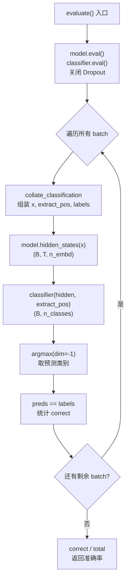

微调结束后，如何客观地衡量模型的分类能力？本项目的 `evaluate` 函数以**分类准确率（Accuracy）**作为核心评估指标，在训练集和验证集上分别度量模型的预测正确率。该函数设计精炼：推理模式下逐批前向计算，通过 `argmax` 取最大 logit 对应的类别，与真实标签比对后统计正确数占总数的比例。本文将完整拆解从批数据准备到最终准确率输出的全链路。

## 评估函数整体架构

评估过程遵循"准备数据 → 前向推理 → 统计正确数 → 返回比率"的四步管线，与训练循环共享相同的批数据组装逻辑（`collate_classification`），但严格禁用梯度计算和 Dropout，保证评估结果的确定性和可复现性。



该流程的核心设计原则是**推理纯粹性**：`@torch.no_grad()` 装饰器确保不构建计算图、不分配梯度缓冲区，从而节省显存并加速前向传播；`.eval()` 将模型切换到评估模式，使所有 Dropout 层变为恒等映射——这在 GPT 中尤为重要，因为预训练配置下三层 Dropout（嵌入层、注意力权重、FFN 残差）的 `pdrop` 均为 0.1，训练时随机丢弃会引入评估噪声。

Sources: [train.py](train.py#L134-L148), [model.py](model.py#L28-L30)

## 推理模式的关键设置

```python
@torch.no_grad()
def evaluate(model, classifier, samples, tok, *, n_ctx, batch_size, device):
    model.to(device).eval()
    classifier.to(device).eval()
```

两个关键设置协同工作，确保评估结果不受随机性影响：

| 设置 | 作用 | 若省略的后果 |
|------|------|-------------|
| `@torch.no_grad()` | 禁用自动微分，不记录中间梯度 | 显存浪费、速度变慢 |
| `model.eval()` | Dropout → 恒等，LayerNorm 用运行统计量 | 评估准确率每次不同，不可复现 |

**值得注意**的是，GPT 使用的是 Pre-LN 架构，LayerNorm 在子层**之前**应用。`eval()` 模式下 LayerNorm 会使用训练阶段累积的 `running_mean` 和 `running_var`（由 `nn.LayerNorm` 内部的统计机制在累积数据上计算），而非当前 batch 的即时统计量。不过在本实现中，`nn.LayerNorm` 始终基于当前输入计算均值和方差（与 `nn.BatchNorm1d` 不同），所以 `eval()` 对 LayerNorm 行为无实质影响——其核心作用仍在于关闭 Dropout。

Sources: [train.py](train.py#L134-L137), [model.py](model.py#93-L110)

## 批数据组装：collate_classification 的角色

评估函数与微调函数共享同一个批整理器 `collate_classification`，这保证了评估时数据的组装方式与训练时完全一致。该函数接收 `(text, label)` 样本列表，输出四个张量：

```python
x, extract_pos, labels, _ = collate(batch, tok, n_ctx)
```

| 输出张量 | 形状 | 含义 | 评估中的用途 |
|----------|------|------|-------------|
| `x` | `(B, n_ctx)` | 填充后的 token ID | 前向输入 |
| `extract_pos` | `(B,)` | [Extract] 位置下标 | 分类头取值索引 |
| `labels` | `(B,)` | 真实类别标签 | 与预测比对 |
| `valid` | `(B, n_ctx)` | 有效位置掩码 | **被丢弃**（`_`） |

在评估场景中，`valid` 掩码被显式忽略（变量名用 `_` 接收）。这是因为准确率只需比较模型预测和真实标签，不涉及辅助语言模型损失的掩码计算——在训练阶段，`valid` 用于过滤 padding 位置以正确计算辅助 LM 损失 `L1`。

Sources: [train.py](train.py#L140-L143), [data.py](data.py#L237-L257)

## 前向推理与预测提取

评估的前向传播路径与微调阶段的分类部分完全一致，区别仅在于不计算损失、不反向传播：

```python
hidden = model.hidden_states(x)                    # (B, T, n_embd)
preds = classifier(hidden, extract_pos).argmax(dim=-1)  # (B,)
```

**两步式前向传播**的设计意图在于解耦特征提取与分类决策：

1. **`model.hidden_states(x)`** 调用 GPT 主体（`GPTModel.forward`），输出经过全部 Transformer 层和末层 LayerNorm 的隐藏表示 `(B, T, n_embd)`。

2. **`classifier(hidden, extract_pos)`** 通过 `ClassificationHead` 完成"位置提取 → 线性投影"：
   - 使用 `hidden.gather(1, idx)` 精确抽取每个样本 `[Extract]` 位置的隐藏向量
   - 经线性层投影到类别空间，输出 logits `(B, n_classes)`

3. **`.argmax(dim=-1)`** 沿类别维度取最大值索引，得到每个样本的预测类别 ID。

`argmax` 是 `Softmax` 的决策版本：它不需要将 logits 转换为概率分布就能找到最大值（因为 `Softmax` 是单调函数，不改变排序），这避免了不必要的指数运算。

Sources: [train.py](train.py#L144-L145), [model.py](model.py#L175-L176), [model.py](model.py#L196-L201)

## 准确率统计逻辑

```python
correct += (preds == labels).sum().item()
total += labels.numel()
return correct / max(1, total)
```

准确率的计算简洁而严谨：

- **`(preds == labels)`** 生成布尔张量，逐元素比较预测与真实标签
- **`.sum().item()`** 统计 True 的数量（即正确预测数），并从 PyTorch 张量提取为 Python 整数
- **`labels.numel()`** 统计当前 batch 的样本总数（`numel` = number of elements）
- **`max(1, total)`** 作为分母的下界保护，防止空数据集导致除零异常

**逐批累加而非全部预测后统一计算**是一种内存高效的策略：尤其在大数据集上，不必在 GPU 上保留全部预测张量，只需累积两个标量（`correct` 和 `total`）。由于准确率是正确数与总数的比值，分批统计与全局统计在数学上完全等价。

Sources: [train.py](train.py#L146-L148)

## 评估在实验管线中的调用

在 `main.py` 中，`evaluate` 被调用了四次，形成了预训练 vs 从零训练的**双轴对照**：

```python
# 预训练初始化模型
train_acc_pre = train.evaluate(pre_model, clf_pre, train_set, ...)   # 训练集准确率
acc_pre = train.evaluate(pre_model, clf_pre, val_set, ...)           # 验证集准确率

# 从零训练模型（对照）
train_acc_scratch = train.evaluate(scratch_model, clf_scratch, train_set, ...)
acc_scratch = train.evaluate(scratch_model, clf_scratch, val_set, ...)
```

| 评估维度 | 预训练初始化 | 从零训练 |
|----------|-------------|---------|
| **训练集准确率** | 衡量拟合能力 | 衡量拟合能力 |
| **验证集准确率** | 衡量泛化能力 | 衡量泛化能力 |
| **训练-验证差距** | 判断过拟合程度 | 判断过拟合程度 |

训练集与验证集准确率的对比是**泛化诊断**的基本工具：如果训练集准确率远高于验证集，说明模型过拟合；如果两者都低，说明欠拟合。而预训练与从零训练的对比则直接量化了**生成式预训练的收益**——这正是 GPT-1 论文的核心论点。

数据划分通过 `split_data` 以固定随机种子（`seed=42`）完成，75% 训练 / 25% 验证，保证每次运行的可复现性。

Sources: [main.py](main.py#L150-L174), [main.py](main.py#L176-L178), [data.py](data.py#L260-L266)

## 设计权衡：为何只使用准确率

本项目选择准确率（Accuracy）作为唯一评估指标，是一个经过取舍的决策：

| 指标 | 优点 | 缺点 | 适用场景 |
|------|------|------|---------|
| **准确率** | 简洁直观、可解释性强 | 类别不均衡时产生误导 | 类别均衡的分类 |
| 精确率/召回率 | 关注少数类表现 | 需指定正类、多指标协调 | 类别不均衡 |
| F1-Score | 精确率与召回率的调和均值 | 需指定正类 | 信息检索 |
| 混淆矩阵 | 展示全部类别间错误分布 | 不便做单一数值比较 | 多类别诊断 |

本项目的情感数据集正负样本各 40 条，类别完全均衡，准确率能准确反映分类性能。在实际复现论文实验（如 SST-2、MNLI 等标准基准）时，应根据数据集特性选择合适的指标——例如 MNLI 三分类任务中，宏平均 F1 可能比准确率更有参考价值。

Sources: [data.py](data.py#L87-L168)

## 下一步阅读

评估函数的运行结果将在完整训练管线中被收集和展示。要了解 `evaluate` 如何被编排进预训练 → 微调 → 评估的端到端流程，请参阅 [完整训练管线：预训练 → 微调 → 评估的编排逻辑](23-wan-zheng-xun-lian-guan-xian-yu-xun-lian-wei-diao-ping-gu-de-bian-pai-luo-ji)。要理解评估中使用的辅助语言模型损失如何参与微调，请参阅 [有监督微调目标 L3 = L2 + λ·L1：辅助语言模型损失](21-you-jian-du-wei-diao-mu-biao-l3-l2-l-l1-fu-zhu-yu-yan-mo-xing-sun-shi)。