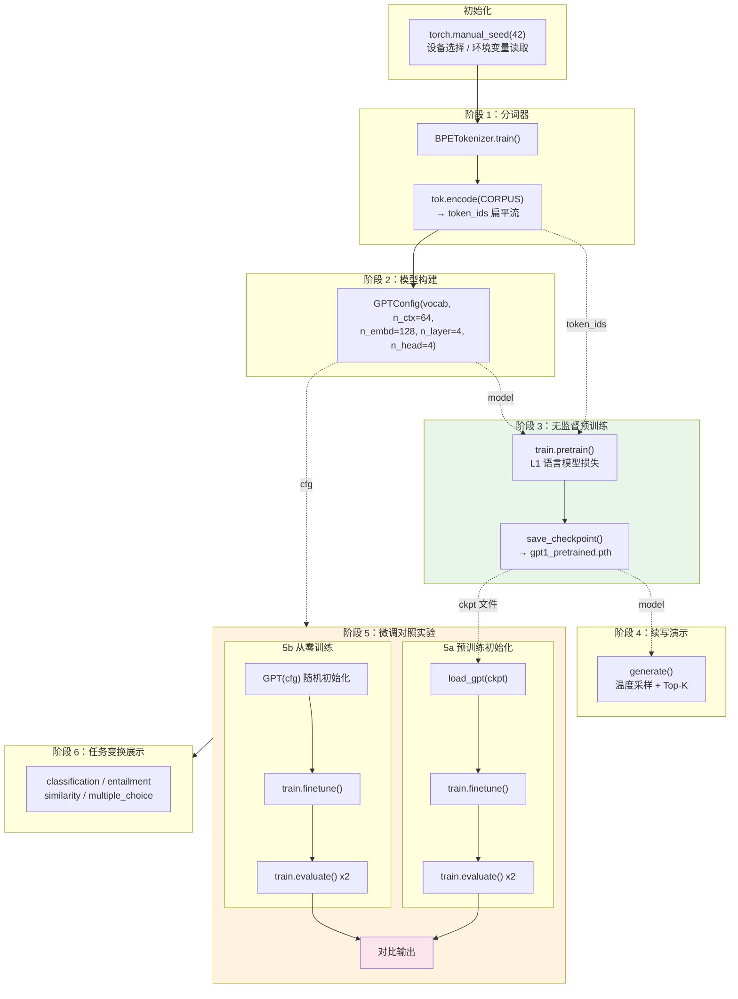
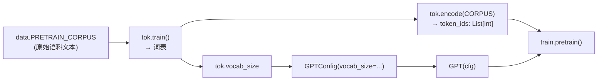

`main.py` 是整个 GPT-1 复现项目的唯一入口脚本，它将分词器训练、模型构建、无监督预训练、文本续写演示、有监督微调、对照实验评估以及任务输入变换展示串联为一条完整的六阶段流水线。本页聚焦于 **阶段的编排顺序、阶段间数据传递契约、以及对照实验的设计逻辑**，而各阶段的内部实现细节（学习率调度、损失函数、评估算法等）请参考对应的深度解析页面。

## 管线全局视图

下面的 Mermaid 流程图展示了 `main()` 函数的六阶段编排逻辑，以及阶段之间通过 checkpoint 文件和数据流实现解耦的关键设计：

图中实线箭头表示函数调用顺序，虚线箭头表示数据/模型在阶段间的传递路径。值得注意的是，预训练与微调之间通过 **checkpoint 文件**（而非内存对象）解耦——这一设计使得预训练和微调可以在不同时间、不同进程中独立执行。

Sources: [main.py](main.py#L101-L194)

## 初始化阶段：随机种子、设备与超参数

管线入口首先固定全局随机种子 `torch.manual_seed(42)`，保证从头运行的完整可复现性。随后通过 `pick_device()` 按 CUDA → MPS → CPU 的优先级探测计算设备，使脚本可在不同硬件环境下无缝运行。三个关键超参数通过环境变量注入，默认值为教学规模的小数字：

| 环境变量 | 默认值 | 用途 |
|---|---|---|
| `PRETRAIN_EPOCHS` | 8 | 无监督预训练轮数 |
| `FINETUNE_EPOCHS` | 60 | 下游微调轮数 |
| `BPE_VOCAB` | 300 | BPE 目标词表大小 |

这种环境变量驱动的设计使得用户无需修改代码即可调整实验规模——例如 `PRETRAIN_EPOCHS=8 FINETUNE_EPOCHS=30 BPE_VOCAB=300 python main.py`。但需注意一个隐含约束：词表大小变更会改变 `GPTConfig.vocab_size`，进而影响模型参数量，因此预训练与微调必须使用相同词表的分词器。

Sources: [main.py](main.py#L20-L25), [main.py](main.py#L101-L112)

## 阶段 1→2：分词器训练与模型构建的依赖契约

**阶段 1** 训练 BPE 分词器并编码语料。分词器以 `data.PRETRAIN_CORPUS` 为训练数据，经过 BPE 合并迭代后得到词表。随后用训练好的分词器对同一份语料执行 `tok.encode()`，生成扁平化的 `token_ids` 列表——这个一维整数序列是后续 `train.pretrain()` 的唯一直接输入。

**阶段 2** 构建模型，此处存在一个关键的编排依赖：`GPTConfig.vocab_size` 必须等于 `tok.vocab_size`。模型嵌入层的维度由分词器输出决定，二者形成强耦合。编排代码通过直接传递 `tok.vocab_size` 来保证一致性。其余超参数（`n_ctx=64`、`n_embd=128`、`n_layer=4`、`n_head=4`）固定为教学规模，远小于论文的 12 层 / 768 维 / 512 序列长度，但架构比例保持一致。

模型构建后立即打印参数量并与论文对比，帮助开发者直观理解教学规模与真实规模之间的差距。

Sources: [main.py](main.py#L114-L127), [model.py](model.py#L20-L31)

## 阶段 3：无监督预训练与 Checkpoint 持久化

`main()` 调用 `train.pretrain()` 执行语言模型预训练，将 `model`、`token_ids`、`block_size`（等于 `cfg.n_ctx`）和 `batch_size=32` 等参数传入。预训练内部使用 Adam 优化器（β2=0.98，对齐论文设定）配合线性 warmup + 余弦衰减的学习率调度。预训练的损失函数 L1、调度策略等内部细节详见 [无监督预训练目标 L1：下一个 Token 语言模型](20-wu-jian-du-yu-xun-lian-mu-biao-l1-xia-ge-token-yu-yan-mo-xing) 和 [学习率调度：线性 Warmup + 余弦/线性衰减](19-xue-xi-lu-diao-du-xian-xing-warmup-yu-xian-xian-xing-shuai-jian)。

预训练完成后，编排逻辑执行两个关键动作：

1. **Checkpoint 保存**：`save_checkpoint()` 将模型配置 `cfg` 和 `state_dict` 序列化为 `gpt1_pretrained.pth`。保存配置而不只保存权重，是因为加载时需要先重建正确结构的空模型再填充权重。
2. **损失曲线绘图**：`plot_losses()` 将训练历史 `(steps, loss)` 列表渲染为 PNG 图表。

预训练返回的 `history` 列表同时被 `main()` 用于打印最终 LM 损失，形成"训练→持久化→可视化"的闭环。

Sources: [main.py](main.py#L129-L139), [main.py](main.py#L47-L57)

## 阶段 4：预训练效果验证——文本续写

预训练完成后立即插入一个快速验证环节：对三个提示词（"the cat"、"the food was"、"the movie"）执行 `generate()` 续写。这一阶段虽然在功能上是"演示"，但在编排逻辑上扮演着 **预训练质量的即时反馈** 角色——如果模型尚未学到语言模式，续写文本会立刻暴露问题。

`generate()` 函数采用 **温度采样 + Top-K 截断** 策略：对最后一个位置的 logits 除以温度值、截取 Top-K 候选后做 softmax 采样，逐 token 续写直到生成指定数量或遇到特殊 token。其内部实现细节详见 [文本续写生成：温度采样与 Top-K 截断解码](25-wen-ben-xu-xie-sheng-cheng-wen-du-cai-yang-yu-top-k-jie-duan-jie-ma)。

Sources: [main.py](main.py#L28-L44), [main.py](main.py#L141-L145)

## 阶段 5：对照实验——预训练初始化 vs 从零训练

这是编排逻辑中最精妙的部分。`main()` 通过 **相同的微调超参数、不同的初始化来源**，设计了一组严格对照实验来验证生成式预训练的收益。

### 实验设计

| 维度 | 5a 预训练初始化 | 5b 从零训练 |
|---|---|---|
| **模型初始化** | `load_gpt(ckpt_path)` 加载预训练权重 | `GPT(cfg)` 随机初始化 (N(0, 0.02)) |
| **分类头** | `ClassificationHead(n_embd, n_classes)` 随机初始化 | 相同 |
| **微调函数** | `train.finetune()` | `train.finetune()` |
| **微调超参数** | epochs=60, lr=1e-3, lm_weight=0.5, batch_size=8 | 完全相同 |
| **评估方式** | `train.evaluate()` 在训练集 + 验证集 | 完全相同 |

唯一的自变量是 Transformer 主体的初始权重：5a 从预训练 checkpoint 加载，5b 使用随机初始化。两者共享完全相同的模型结构、分类头、微调算法和学习率调度，从而确保观察到的性能差异 **仅归因于预训练初始化**。

### 数据流

微调阶段的数据管线从 `data.split_data()` 开始：将 80 条情感数据（40 正/40 负）按 75/25 比例划分为训练集和验证集。微调目标 L3 = L2 + λ·L1 在分类损失之外引入辅助语言模型损失（λ=0.5），其详细推导见 [有监督微调目标 L3 = L2 + λ·L1：辅助语言模型损失](21-you-jian-du-wei-diao-mu-biao-l3-l2-l-l1-fu-zhu-yu-yan-mo-xing-sun-shi)。

### 结果对比输出

实验完成后，编排逻辑将两条路径的末轮损失、训练集准确率和验证集准确率以对齐格式打印，并调用 `plot_comparison()` 生成柱状对比图。这个对比实验的深入收益分析详见 [预训练初始化 vs 从零训练：对照实验设计与收益分析](24-yu-xun-lian-chu-shi-hua-vs-cong-ling-xun-lian-dui-zhao-shi-yan-she-ji-yu-shou-yi-fen-xi)。

Sources: [main.py](main.py#L147-L179), [train.py](train.py#L83-L131), [train.py](train.py#L134-L148)

## 阶段 6：论文 Figure 2 任务输入变换展示

流水线的最后一个阶段不涉及训练，而是演示论文 Figure 2 中四种下游任务的输入变换方式。编排逻辑依次调用 `data.classification_input()`、`data.entailment_input()`、`data.similarity_inputs()` 和 `data.multiple_choice_input()`，将构造好的 token 序列和 `[Extract]` 位置索引打印输出。这一步骤的编排意图是让开发者在一次运行结束时即可直观看到不同任务下序列拼接的形态差异，理解 GPT 如何用统一的"文本 → 隐藏表示 → 线性头"框架处理异构任务。四种变换的具体设计见 [论文 Figure 2 四种任务输入变换：分类、蕴含、相似度、多选](17-lun-wen-figure-2-si-chong-ren-wu-shu-ru-bian-huan-fen-lei-yun-han-xiang-si-du-duo-xuan)。

Sources: [main.py](main.py#L181-L189), [data.py](data.py#L195-L231)

## 编排设计的三个核心原则

**原则一：阶段间通过 checkpoint 文件解耦。** 预训练权重被保存为 `gpt1_pretrained.pth`，微调阶段通过 `load_gpt()` 重新加载而非直接复用内存中的对象。这一设计模拟了真实场景中"预训练与微调可能在不同环境执行"的需求，也使 checkpoint 的保存/加载逻辑得到了实际验证（详见 [模型持久化：Checkpoint 保存与加载](26-mo-xing-chi-jiu-hua-checkpoint-bao-cun-yu-jia-zai)）。

**原则二：对照实验共享函数调用保证唯一变量。** 5a 和 5b 调用完全相同的 `train.finetune()` 和 `train.evaluate()`，仅模型初始化来源不同。这种"共享路径 + 改变起点"的编排方式消除了因实现差异引入的混淆因素。

**原则三：每阶段即时反馈。** 预训练后立即续写（阶段 4），微调后立即评估并打印对比（阶段 5），任务变换后立即输出（阶段 6）。整个脚本一次运行即可获得预训练损失曲线、续写文本、准确率对比柱状图和任务变换示例四类产出，形成从"训练是否成功"到"效果如何"的完整反馈链。

Sources: [main.py](main.py#L101-L194)

## 延伸阅读

本页聚焦于 `main()` 的编排逻辑，以下页面深入各阶段的内部实现：

- [学习率调度：线性 Warmup + 余弦/线性衰减](19-xue-xi-lu-diao-du-xian-xing-warmup-yu-xian-xing-shuai-jian) — warmup 与衰减曲线的实现
- [无监督预训练目标 L1：下一个 Token 语言模型](20-wu-jian-du-yu-xun-lian-mu-biao-l1-xia-ge-token-yu-yan-mo-xing) — 预训练损失函数与采样策略
- [有监督微调目标 L3 = L2 + λ·L1：辅助语言模型损失](21-you-jian-du-wei-diao-mu-biao-l3-l2-l-l1-fu-zhu-yu-yan-mo-xing-sun-shi) — 微调联合损失的推导
- [模型评估：分类准确率计算](22-mo-xing-ping-gu-fen-lei-zhun-que-lu-ji-suan) — evaluate 函数的实现
- [预训练初始化 vs 从零训练：对照实验设计与收益分析](24-yu-xun-lian-chu-shi-hua-vs-cong-ling-xun-lian-dui-zhao-shi-yan-she-ji-yu-shou-yi-fen-xi) — 对照实验的深度分析
- [文本续写生成：温度采样与 Top-K 截断解码](25-wen-ben-xu-xie-sheng-cheng-wen-du-cai-yang-yu-top-k-jie-duan-jie-ma) — generate 函数的解码策略
- [模型持久化：Checkpoint 保存与加载](26-mo-xing-chi-jiu-hua-checkpoint-bao-cun-yu-jia-zai) — checkpoint 的序列化格式