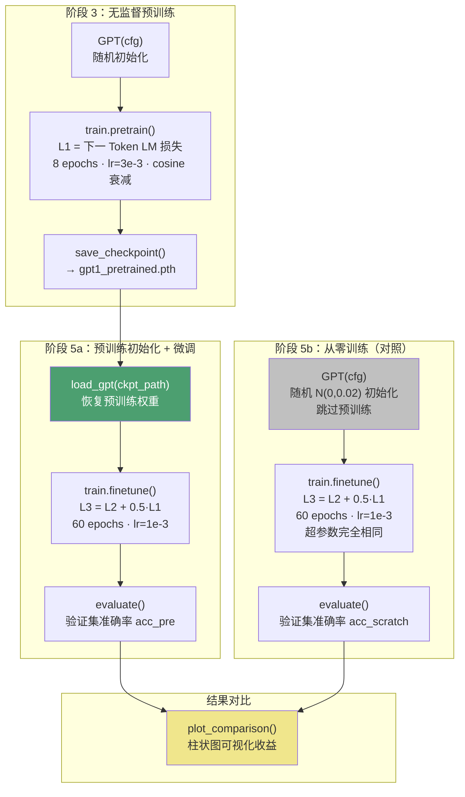

GPT-1 论文的核心论点——"生成式预训练为下游任务提供了有意义的初始化"——在这个项目中通过一组精心设计的对照实验直接验证。本文解析 `main.py` 第 5a/5b 阶段的实验编排逻辑：如何在**完全相同的架构、数据、超参数**下，仅改变模型权重的初始来源（预训练 vs 随机初始化），以隔离预训练的因果收益。

## 实验设计的科学原则：单变量控制

对照实验的有效性取决于**单一变量原则**——除"权重初始化来源"外，其余所有因素必须严格一致。项目通过以下机制保证这一点：

**固定随机种子**确保两次实验的数据划分、Dropout 采样、梯度更新路径具有相同的随机性起点。`main.py` 在入口处设定全局种子，微调函数内部每 epoch 打乱数据时也使用由该种子派生的随机状态。

**相同的模型架构**由同一个 `GPTConfig` 实例定义（4 层 / 128 维 / 4 头 / 上下文 64），两条实验路径都基于它构建模型。区别仅在于：路径 5a 通过 `load_gpt()` 加载预训练 checkpoint 恢复权重，路径 5b 则调用 `GPT(cfg)` 触发构造函数中的 `N(0, 0.02)` 随机初始化。

**相同的微调配方**包括学习率（`ft_lr=1e-3`）、训练轮数（`ft_epochs`）、批量大小（`batch_size=8`）、辅助 LM 损失权重（`lm_weight=0.5`）以及 warmup 比例。两者调用同一个 `train.finetune()` 函数，连 Adam 优化器的 betas 参数都是同一组 `(0.9, 0.999)`。

Sources: [main.py](main.py#L101-L107), [main.py](main.py#L148-L174), [train.py](train.py#L83-L96)

## 对照实验的全流程编排

下面的流程图展示了从预训练到两条平行微调路径的完整编排：



预训练阶段（阶段 3）产生一份 checkpoint，作为实验变量注入路径 5a；路径 5b 则刻意跳过预训练，直接从随机权重进入微调。两条路径在阶段 5 汇聚到完全相同的 `finetune → evaluate` 流程，最终通过 `plot_comparison()` 生成柱状对比图。

Sources: [main.py](main.py#L129-L139), [main.py](main.py#L154-L179)

## 预训练权重的加载与恢复

路径 5a 的关键操作是从磁盘恢复预训练权重。`load_gpt()` 函数从 checkpoint 字典中取出 `GPTConfig` 和 `state_dict`，重建模型结构后加载参数。这一过程保留了预训练阶段学习到的**词嵌入分布、注意力模式、以及前馈网络的非线性变换**——这些都是从大量无标注文本中习得的通用语言知识。

```python
# 路径 5a：预训练初始化
pre_model = load_gpt(ckpt_path, device)        # 恢复全部预训练权重
clf_pre = ClassificationHead(cfg.n_embd, n_classes)  # 分类头从零开始（预训练中不存在）
```

```python
# 路径 5b：从零训练（对照组）
scratch_model = GPT(cfg).to(device)             # N(0, 0.02) 随机初始化，无预训练知识
clf_scratch = ClassificationHead(cfg.n_embd, n_classes)  # 同样从零开始
```

值得注意的是，**两条路径的分类头都是随机初始化的**——预训练阶段不存在分类任务，因此 `ClassificationHead` 始终是全新的。这意味着实验测量的纯粹是 Transformer 主体预训练对分类性能的增益，排除了分类头初始化差异的干扰。

Sources: [main.py](main.py#L154-L174), [model.py](model.py#L185-L201)

## 变量隔离矩阵：什么相同、什么不同

为了清晰呈现实验的控制变量，下表逐项对比两条路径的关键要素：

| 实验要素 | 路径 5a（预训练初始化） | 路径 5b（从零训练） | 是否控制 |
|---|---|---|---|
| **模型架构** | GPTConfig(4层/128维/4头) | 同左（同一 `cfg` 实例） | ✅ 完全相同 |
| **Transformer 主体初始权重** | 预训练 checkpoint 恢复 | `N(0, 0.02)` 随机初始化 | ❌ **唯一变量** |
| **分类头初始权重** | `N(0, 0.02)` 随机初始化 | 同左 | ✅ 完全相同 |
| **训练数据** | `train_set`（75% 划分） | 同左（同一 `split_data` 调用结果） | ✅ 完全相同 |
| **验证数据** | `val_set`（25% 划分） | 同左 | ✅ 完全相同 |
| **学习率** | 1e-3 | 1e-3 | ✅ 完全相同 |
| **训练轮数** | 60 epochs | 60 epochs | ✅ 完全相同 |
| **批量大小** | 8 | 8 | ✅ 完全相同 |
| **辅助 LM 损失权重 λ** | 0.5 | 0.5 | ✅ 完全相同 |
| **优化器** | Adam (β=0.9, 0.999) | 同左 | ✅ 完全相同 |
| **LR 调度** | 线性 warmup + 线性衰减 | 同左 | ✅ 完全相同 |
| **梯度裁剪** | clip = 1.0 | 同左 | ✅ 完全相同 |

这张矩阵的核心信息是：**唯一的自变量是 Transformer 主体的权重来源**。这使得最终准确率差异可以完全归因于预训练提供的有意义初始化。

Sources: [main.py](main.py#L148-L174), [train.py](train.py#L83-L131)

## 预训练与微调的优化器配方差异

虽然两条微调路径的优化器配置完全一致，但预训练阶段本身采用了与微调不同的 Adam 配方，这体现了论文的训练策略分层：

| 配方要素 | 预训练（阶段 3） | 微调（阶段 5a & 5b） |
|---|---|---|
| **Adam β2** | 0.98 | 0.999 |
| **Adam ε** | 1e-9 | 1e-8 |
| **学习率** | 3e-3 | 1e-3 |
| **LR 衰减** | 余弦衰减 | 线性衰减 |
| **优化对象** | 仅 GPT 参数 | GPT 参数 + 分类头参数 |
| **损失函数** | L1（纯 LM 损失） | L3 = L2 + λ·L1 |

预训练使用更高的学习率（3e-3 vs 1e-3）和余弦衰减策略，以在无监督语料上快速收敛语言模型能力。微调阶段降为 1e-3 配合线性衰减，以更谨慎的步长适配下游任务，避免破坏预训练习得的表示。这种分层策略使得预训练模型在微调时既能有效适配，又不至于灾难性遗忘通用语言知识。

Sources: [train.py](train.py#L49-L58), [train.py](train.py#L83-L96)

## 收益量化：多维度指标对比

实验结果通过三个维度量化预训练收益，全部在同一输出窗口中并列展示：

**末轮微调损失**反映两条路径在收敛后的损失水平差异。预训练初始化的模型由于起点已经具备语言理解能力，微调损失通常更低且下降更快。

**训练集准确率**揭示模型对训练数据的拟合能力。从零训练的模型在相同轮数内可能尚未充分拟合，而预训练模型则能更快达到高训练准确率。

**验证集准确率**是最关键的泛化指标——它直接回答"预训练是否带来了不可通过微调弥补的泛化优势"。论文的核心发现正是在此：预训练初始化的验证准确率显著高于从零训练，且这一差距在小数据集上更为明显。

```python
print(f"  末轮损失:        预训练+微调 = {hist_pre[-1][1]:.3f}   "
      f"从零训练 = {hist_scratch[-1][1]:.3f}")
print(f"  训练集准确率:    预训练+微调 = {train_acc_pre:.2%}   "
      f"从零训练 = {train_acc_scratch:.2%}")
print(f"  验证集准确率:    预训练+微调 = {acc_pre:.2%}   "
      f"从零训练 = {acc_scratch:.2%}")
```

`plot_comparison()` 函数将验证准确率可视化为双色柱状图（预训练用绿色 `#4C9F70`，从零训练用灰色 `#C0C0C0`），直观呈现预训练的收益幅度。由于本项目使用内置的微型语料和小型模型，差异可能不如论文 117M 参数模型那样显著，但实验设计和分析方法完全一致。

Sources: [main.py](main.py#L176-L179), [main.py](main.py#L80-L98)

## 辅助 LM 损失在对照实验中的双重角色

两条微调路径都使用了 `L3 = L2 + 0.5·L1` 的复合损失（详见 [有监督微调目标 L3](21-you-jian-du-wei-diao-mu-biao-l3-l2-l-l1-fu-zhu-yu-yan-mo-xing-sun-shi)）。在对照实验的语境下，辅助 LM 损失扮演了一个微妙角色：

**对预训练初始化路径（5a）**，辅助 LM 损失起到**正则化**作用——约束模型在适配分类任务的同时不遗忘预训练习得的语言建模能力。这是一种"巩固"策略，微调后模型仍能生成连贯文本。

**对从零训练路径（5b）**，辅助 LM 损失则在有限的微调数据上同时承担**语言学习与分类学习**的双重负担。模型需要从零习得词序关系、语法结构等基础语言知识，同时拟合分类标签，这在小数据场景下是一个严峻挑战。

由于两条路径使用相同的 `lm_weight=0.5`，这一设计变量被完美控制。实验结果的差异纯粹反映预训练初始化带来的"先验知识"优势。

Sources: [main.py](main.py#L149), [train.py](train.py#L108-L123)

## 环境变量驱动的实验规模化

项目通过环境变量暴露关键超参数，便于在不同规模下重复实验或探索收益变化趋势：

| 环境变量 | 默认值 | 用途 |
|---|---|---|
| `PRETRAIN_EPOCHS` | 8 | 预训练轮数；增大可让语言模型更充分学习 |
| `FINETUNE_EPOCHS` | 60 | 微调轮数；增大可观察从零训练是否最终追上 |
| `BPE_VOCAB` | 300 | BPE 词表大小；影响分词粒度与模型容量 |

例如，将 `FINETUNE_EPOCHS` 设为 200 可以探索一个有趣问题：**从零训练是否在足够长的训练后能追平预训练初始化的性能？** 在论文的实验规模下（117M 参数、大规模语料），答案通常是否定的——但在这个微型复现中，由于模型容量小且数据有限，结果可能更接近。

```bash
PRETRAIN_EPOCHS=16  FINETUNE_EPOCHS=100  BPE_VOCAB=500  python main.py
```

Sources: [main.py](main.py#L1-L7), [main.py](main.py#L105-L107)

## 进一步阅读

- 要理解预训练阶段的语言模型损失计算细节，参见 [无监督预训练目标 L1：下一个 Token 语言模型](20-wu-jian-du-yu-xun-lian-mu-biao-l1-xia-ge-token-yu-yan-mo-xing)
- 要了解微调阶段 L3 = L2 + λ·L1 复合损失的完整推导，参见 [有监督微调目标 L3 = L2 + λ·L1：辅助语言模型损失](21-you-jian-du-wei-diao-mu-biao-l3-l2-l-l1-fu-zhu-yu-yan-mo-xing-sun-shi)
- 要查看预训练后的文本续写效果（验证语言建模能力），参见 [文本续写生成：温度采样与 Top-K 截断解码](25-wen-ben-xu-xie-sheng-cheng-wen-du-cai-yang-yu-top-k-jie-duan-jie-ma)
- 要了解 checkpoint 保存与加载的底层实现，参见 [模型持久化：Checkpoint 保存与加载](26-mo-xing-chi-jiu-hua-checkpoint-bao-cun-yu-jia-zai)