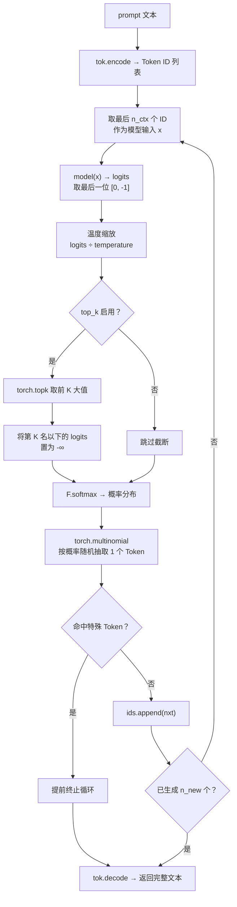
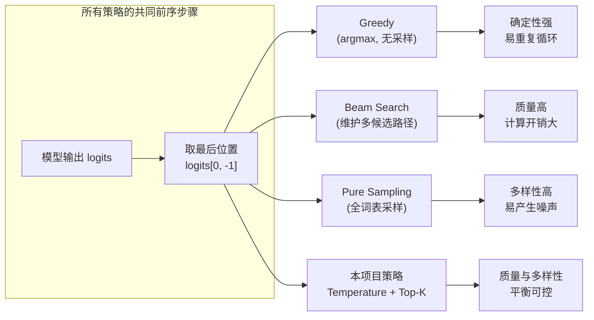

GPT-1 预训练完成后，语言模型具备了「预测下一个 Token」的能力。但仅凭原始 logits 选择 argmax 会产生重复且缺乏多样性的文本，而直接从全词表均匀采样又会陷入无意义的噪声。本页解析 `generate()` 函数如何通过**温度缩放（Temperature Scaling）**与 **Top-K 截断（Top-K Truncation）**两步操作，在质量与多样性之间取得平衡，实现可控的文本续写生成。

## 生成函数全景：自回归循环

文本生成是一个**自回归（autoregressive）**过程——每一步只预测一个新 Token，将其追加到序列末尾，再以扩展后的序列作为下一步的输入，循环往复直到达到目标长度或触发停止条件。整个循环被包裹在 `@torch.no_grad()` 装饰器下，因为生成阶段无需计算梯度，禁用自动微分可显著节省显存并加速推理。

```python
@torch.no_grad()
def generate(model, tok, prompt, n_new, device, temperature=0.8, top_k=20):
    model.eval()
    ids = tok.encode(prompt)
    n_ctx = model.cfg.n_ctx
    for _ in range(n_new):
        x = torch.tensor([ids[-n_ctx:]], dtype=torch.long, device=device)
        logits = model(x)[0, -1] / max(temperature, 1e-6)
        if top_k and top_k < logits.size(-1):
            v, _ = torch.topk(logits, top_k)
            logits[logits < v[-1]] = float("-inf")
        nxt = torch.multinomial(F.softmax(logits, dim=-1), 1).item()
        ids.append(nxt)
        if nxt in tok.special_to_id.values():
            break
    return tok.decode(ids)
```

Sources: [main.py](main.py#L28-L44)

下图展示了每一轮迭代中的完整数据流：



Sources: [main.py](main.py#L28-L44)

## 参数说明

| 参数 | 默认值 | 类型 | 作用 |
|---|---|---|---|
| `prompt` | — | `str` | 续写的起始文本，经 `tok.encode()` 转为 ID 列表 |
| `n_new` | — | `int` | 要生成的新 Token 数量上限 |
| `temperature` | `0.8` | `float` | 温度值，控制概率分布的尖锐程度 |
| `top_k` | `20` | `int` | 截断后保留的最高概率候选数，设为 `0` 或 `None` 则禁用截断 |

Sources: [main.py](main.py#L29)

## 上下文窗口截取：滑动窗口机制

生成循环的每一步，代码并未将完整历史序列送入模型，而是截取 `ids[-n_ctx:]`：

```python
x = torch.tensor([ids[-n_ctx:]], dtype=torch.long, device=device)
```

`n_ctx` 是模型配置中的最大上下文长度（本项目教学配置为 64，论文为 512）。当已生成的序列超过这一限制时，列表切片自动丢弃最早的 Token，仅保留最近的 `n_ctx` 个。这保证了无论续写多长，输入张量的形状始终满足模型 `forward` 中的断言 `T <= self.cfg.n_ctx`。

Sources: [main.py](main.py#L33-L35), [model.py](model.py#L143)

模型前向传播返回形状为 `(1, T, vocab_size)` 的 logits 张量，代码通过 `[0, -1]` 提取**最后位置的 logits 向量**——即模型对「下一个 Token」的原始预测分布，其维度为 `vocab_size`。

Sources: [model.py](model.py#L178-L179)

## 温度缩放：调节概率分布的尖锐度

获得 logits 后，第一步处理是除以温度值：

```python
logits = model(x)[0, -1] / max(temperature, 1e-6)
```

这里的 `max(temperature, 1e-6)` 是一个工程保护：防止用户传入 `temperature=0` 导致除零异常。温度的数学效果体现在 softmax 归一化之后。设原始 logits 为 $z_i$，则温度缩放后的 softmax 概率为：

$$p_i = \frac{\exp(z_i / T)}{\sum_j \exp(z_j / T)}$$

**温度 $T$ 对分布的影响**可以从两个极端理解：

| 温度范围 | 效果 | 行为特征 |
|---|---|---|
| $T \to 0^+$ | logits 被放大，分布趋于 one-hot | 等价于 **贪心解码（greedy / argmax）**，确定性最强，多样性最低 |
| $T = 1.0$ | 不改变原始 logits | 模型的**原始置信度分布**，忠实反映训练学到的统计规律 |
| $T > 1.0$ | logits 被压缩，分布趋于均匀 | 更**随机、多样**，但低概率 Token 出现频率增加，文本质量下降 |

本项目的默认值 `temperature=0.8` 是一个略偏保守的选择——比原始分布更尖锐，倾向于高质量候选，同时仍保留采样带来的多样性。

Sources: [main.py](main.py#L36)

## Top-K 截断：丢弃低概率噪声

温度缩放只调节分布形状，但**全部词表中的每一个 Token 仍保留非零概率**。对于词表中大量概率极低的 Token，即使温度适中也偶尔会被采样到，产生不连贯的噪声。Top-K 截断通过硬性剔除这些候选来解决这个问题：

```python
if top_k and top_k < logits.size(-1):
    v, _ = torch.topk(logits, top_k)
    logits[logits < v[-1]] = float("-inf")
```

操作分三步：

1. **`torch.topk(logits, top_k)`** 返回 logits 中最大的前 `top_k` 个值及其索引，其中 `v[-1]` 是这组中的最小值——即第 K 名的「门槛分数」。
2. **`logits < v[-1]`** 生成布尔掩码，标记所有低于门槛的候选位置。
3. **将这些位置置为 `float("-inf")`**，在后续 softmax 中它们将获得精确的零概率，彻底从采样池中移除。

之所以在 softmax **之前**进行截断而非之后，是因为直接将概率置零需要额外比较操作，而将 logits 置 `-∞` 让 softmax 自然产生零概率，更加简洁且数值上更精确。注意这一步操作在**温度缩放之后的 logits** 上进行——由于温度缩放保持 logits 的大小排序不变（除以正数不改变偏序），截断的 Top-K 集合不受温度影响，两个操作可以安全地串联。

Sources: [main.py](main.py#L37-L39)

## 多项式采样：从截断分布中抽取

经过温度缩放和 Top-K 截断后，logits 送入 softmax 得到概率分布，再由 `torch.multinomial` 按该分布随机抽取一个 Token：

```python
nxt = torch.multinomial(F.softmax(logits, dim=-1), 1).item()
```

`torch.multinomial(probabilities, num_samples=1)` 执行**有放回的加权随机抽样**——每个 Token 被选中的概率严格等于其 softmax 值。`.item()` 将结果从 PyTorch 标量张量转为 Python 整数，随后通过 `ids.append(nxt)` 追加到序列末尾。

这是**随机性（stochastic）解码**的核心环节：与贪心解码始终选择最高概率 Token 不同，多项式采样允许低概率候选以与其概率成正比的机会被选中，从而在多次运行中产生不同的续写结果。

Sources: [main.py](main.py#L40)

## 特殊 Token 早停机制

循环中内置了一个提前终止条件：

```python
if nxt in tok.special_to_id.values():
    break
```

`tok.special_to_id` 是分词器中特殊 Token 到 ID 的映射，包含 `[Pad]`、`[Start]`、`[Delim]`、`[Extract]` 四个标记。当模型生成出其中任何一个时，续写立即终止。这一设计的合理性在于：特殊 Token 在预训练语料中标记序列边界与任务结构，一旦它们出现在自然续写中，通常意味着模型认为语义单元已经结束，继续生成将进入不连贯的区域。

Sources: [main.py](main.py#L42-L43), [tokenizer.py](tokenizer.py#L14)

## 温度与 Top-K 的协同效应

温度和 Top-K 并非互相替代，而是**正交的两个控制维度**，下表对比了不同组合下的生成特性：

| 策略组合 | 特征 | 适用场景 |
|---|---|---|
| 低温度 + 小 Top-K | 高确定性、低多样性 | 事实性文本、代码补全 |
| 中温度 + 中 Top-K（本项目默认） | 质量与多样性的平衡折中 | 通用文本续写、创意辅助 |
| 高温度 + 大 Top-K | 高随机性、高多样性 | 头脑风暴、数据增强 |
| 温度=0（等效贪心） | 完全确定，始终选最高概率 | 可复现的基准测试 |

温度缩放改变了概率分布的**形状**（尖锐 vs 平坦），而 Top-K 截断改变了候选集合的**大小**（全词表 vs 精选子集）。两者串联的实际效果是：Top-K 先划定「合理候选池」，温度再决定「在池内如何分配注意力」。这使得即使在较高温度下，也不会采样到完全不相关的 Token，因为它们早已被截断机制排除。

Sources: [main.py](main.py#L36-L40)

## 实际调用示例

在 `main()` 函数的步骤 4 中，预训练完成后立即调用 `generate()` 展示续写效果：

```python
for prompt in ["the cat", "the food was", "the movie"]:
    text = generate(model, tok, prompt, n_new=12, device=device)
    print(f"  «{prompt}» -> {text}")
```

三个提示词分别对应预训练语料中出现的不同主题（动物、食物、电影），使用默认参数 `temperature=0.8, top_k=20` 生成 12 个新 Token。由于采样机制的存在，每次运行的续写内容不同，但受 Top-K 约束而保持语义连贯。

Sources: [main.py](main.py#L141-L145)

## 解码策略对比



Sources: [main.py](main.py#L28-L44)

本项目采用的 **Temperature + Top-K** 策略属于**核采样（Nucleus Sampling / Top-P）**家族的简化版本——Top-K 固定保留 K 个候选，而 Top-P 则保留累积概率超过阈值 P 的最小候选集，候选数量动态变化。对于教学规模的小型词表（约 300），固定 K 值已足够有效且实现简洁。

---

要了解模型权重如何保存和加载以支持生成后的持久化，请参阅 [模型持久化：Checkpoint 保存与加载](26-mo-xing-chi-jiu-hua-checkpoint-bao-cun-yu-jia-zai)。如需回顾完整的训练管线编排逻辑，请参阅 [完整训练管线：预训练 → 微调 → 评估的编排逻辑](23-wan-zheng-xun-lian-guan-xian-yu-xun-lian-wei-diao-ping-gu-de-bian-pai-luo-ji)。