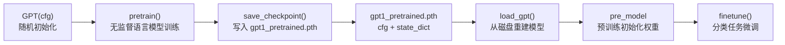

深度学习模型训练往往耗时漫长，如果训练中断或需要在其他流程中复用已训练权重，就需要一种可靠的序列化机制。本项目通过两个简洁函数——`save_checkpoint` 和 `load_gpt`——实现了 GPT-1 预训练权重的持久化，使预训练成果可以被独立保存、重新加载并投入下游任务微调。本文将逐一解析这两个函数的实现细节、Checkpoint 的数据结构设计，以及它们在整个训练管线中的编排方式。

## Checkpoint 的数据结构：配置与权重的二合一打包

本项目的 Checkpoint 并非简单地只保存权重张量，而是将**模型配置（GPTConfig）**与**模型权重（state_dict）**打包到一个 Python 字典中，再用 PyTorch 的 `torch.save` 序列化为 `.pth` 文件。这一设计的核心考量是**自包含性**：加载时无需外部传入模型结构信息，Check-point 自身就携带了重建模型所需的全部知识。

具体的字典结构如下表所示：

| 键名 | 值类型 | 作用 |
|------|--------|------|
| `"cfg"` | `GPTConfig`（dataclass） | 模型超参数：层数、隐藏维度、头数、词表大小、上下文长度等 |
| `"state_dict"` | `OrderedDict[str, Tensor]` | 全部可训练参数的张量映射（嵌入矩阵、注意力权重、LayerNorm 参数等） |

`GPTConfig` 是一个标准的 Python `@dataclass`，包含 `vocab_size`、`n_ctx`、`n_embd`、`n_layer`、`n_head` 以及各种 dropout 概率等字段。由于 dataclass 实例是可 pickle 的普通 Python 对象，`torch.save` 能够直接将其序列化进文件。这意味着无论词表大小如何变化、模型层数如何调整，加载时都能自动还原正确的网络结构。

Sources: [model.py](model.py#L20-L31), [main.py](main.py#L47-L56)

## save_checkpoint 函数详解

保存逻辑极其精简，仅一行核心代码：

```python
def save_checkpoint(model, path):
    torch.save({"cfg": model.cfg, "state_dict": model.state_dict()}, path)
```

`model.state_dict()` 是 PyTorch `nn.Module` 的标准方法，返回一个有序字典，键为参数的层路径名（如 `transformer.wte.weight`、`transformer.blocks.0.ln_1.weight`），值为对应的张量。这涵盖了模型中的**所有可学习参数**：token 嵌入矩阵、位置嵌入矩阵、每层 Block 中的 QKV 投影矩阵、FFN 权重、LayerNorm 的 gamma/beta 等。

需要注意的是，`state_dict()` 默认也会保存通过 `register_buffer` 注册的非参数张量。在本项目中，`CausalSelfAttention` 中的因果掩码 `mask` 就是通过 buffer 注册的，因此它也会被一并序列化。但由于掩码完全由 `n_ctx` 决定，加载后会从 `cfg` 中重新构建，所以它的持久化是冗余的但无害的。

`model.cfg` 是保存在 `GPT` 实例上的配置引用（`self.cfg = cfg`），保存 Checkpoint 时被一并写入文件，这是实现"配置自包含"的关键。

Sources: [main.py](main.py#L47-L48), [model.py](model.py#L169-L173), [model.py](model.py#L58-L60)

## load_gpt 函数详解

加载过程分为三步——**读取文件、重建模型、灌入权重**：

```python
def load_gpt(path, device):
    ckpt = torch.load(path, map_location=device, weights_only=False)
    cfg = ckpt["cfg"]
    model = GPT(cfg)
    model.load_state_dict(ckpt["state_dict"])
    return model.to(device)
```

**第一步**，`torch.load` 从磁盘反序列化整个字典。两个关键参数值得关注：

- `map_location=device`：张量在保存时可能位于 GPU 或 CPU，加载时通过此参数自动迁移到目标设备。本项目的 `pick_device()` 会自动选择 CUDA / MPS / CPU，`map_location` 确保无论文件是在哪种设备上保存的，都能无缝加载到当前可用设备上。
- `weights_only=False`：由于 Checkpoint 中嵌入了 `GPTConfig` dataclass 实例（而非纯张量），需要允许 PyTorch 加载任意可 pickle 的 Python 对象。若设为 `True`，则只能加载纯张量，会因无法反序列化 dataclass 而报错。

**第二步**，`GPT(cfg)` 用反序列化出的配置重新实例化模型。这一步会触发权重初始化（`N(0, 0.02)`），但随后立即被第三步覆盖，因此初始化值仅是瞬态的。

**第三步**，`model.load_state_dict(ckpt["state_dict"])` 将保存的权重张量逐键写入新建模型的对应位置。由于键名完全匹配（同一份代码构建的模型结构），此操作是严格的——任何键名不匹配都会直接报错，避免了静默的部分加载问题。

Sources: [main.py](main.py#L51-L56), [main.py](main.py#L20-L25)

## 完整生命周期：预训练 → 保存 → 加载 → 微调

下图展示了 Checkpoint 在训练管线中的完整流转路径：



在实际编排中，这个流程发生在 `main()` 函数的第 3 阶段和第 5 阶段之间。预训练完成后（第 136-138 行），模型立即被保存到 `gpt1_pretrained.pth`。随后在第 5a 步（第 156 行），通过 `load_gpt` 重新加载这份 Checkpoint 作为微调的初始化权重。这个"保存→加载"的往返看似冗余——内存中的模型已经是预训练好的——但它在架构上实现了两个重要目标：**可复现性**（任何人拿到 `.pth` 文件就能跳过预训练直接微调）和**对照实验的公平性**（加载的是一个干净的、未被任何后续操作污染的预训练模型）。

Sources: [main.py](main.py#L136-L138), [main.py](main.py#L154-L159)

## 设计决策：为何只保存 GPT 主体而非分类头

一个值得注意的设计选择是：Checkpoint 中**不包含** `ClassificationHead` 的权重。`save_checkpoint` 只调用 `model.state_dict()`，这里的 `model` 是 `GPT` 类的实例，而非包含分类头的更大的容器。

| 维度 | GPT 主体（已保存） | ClassificationHead（未保存） |
|------|-------------------|---------------------------|
| 角色 | 通用语言理解编码器 | 特定下游任务的分类器 |
| 复用范围 | 所有下游任务共享 | 仅当前分类任务 |
| 参数量占比 | 绝大多数（嵌入 + Transformer 层） | 极小（单层线性投影） |
| 加载方式 | `load_gpt()` 从 Checkpoint 恢复 | 每次微调前重新随机初始化 |

这一设计直接呼应了 GPT-1 论文的核心范式：**预训练一个通用模型，再针对每个下游任务微调专属的任务头**。预训练权重的价值在于其通用语言表示能力，而分类头是任务特定的，不应混入"通用资产"中。因此在第 5a 步中，我们看到加载预训练模型后，分类头是独立创建的：

```python
pre_model = load_gpt(ckpt_path, device)
clf_pre = ClassificationHead(cfg.n_embd, n_classes)   # 全新随机初始化
```

Sources: [main.py](main.py#L156-L157), [model.py](model.py#L185-L201)

## 深入理解：state_dict 的键名体系

理解 Checkpoint 内部结构有助于调试和迁移。`GPT.state_dict()` 产生的键名遵循 PyTorch 的层级命名规则，反映了模型的嵌套结构：

| 键名前缀 | 对应模块 | 典型参数 |
|---------|---------|---------|
| `transformer.wte` | Token 嵌入 | `.weight` (vocab_size × n_embd) |
| `transformer.wpe` | 位置嵌入 | `.weight` (n_ctx × n_embd) |
| `transformer.blocks.{i}.ln_1` | 第 i 层 Pre-LN | `.weight`, `.bias` |
| `transformer.blocks.{i}.attn` | 第 i 层注意力 | `.qkv.weight/bias`, `.proj.weight/bias`, `.mask` |
| `transformer.blocks.{i}.ln_2` | 第 i 层 Pre-LN | `.weight`, `.bias` |
| `transformer.blocks.{i}.ffn` | 第 i 层 FFN | `.fc1.weight/bias`, `.fc2.weight/bias` |
| `transformer.ln_f` | 末层 LayerNorm | `.weight`, `.bias` |

注意 `lm_head` 不出现在 state_dict 中，因为它通过权重绑定直接引用 `transformer.wte` 的权重矩阵——`LMHead` 模块本身没有任何独立参数。

Sources: [model.py](model.py#L113-L159), [model.py](model.py#L41-L76)

## 进一步阅读

- 要了解 Checkpoint 保存后完整管线如何编排，参见 [完整训练管线：预训练 → 微调 → 评估的编排逻辑](23-wan-zheng-xun-lian-guan-xian-yu-xun-lian-wei-diao-ping-gu-de-bian-pai-luo-ji)
- 要理解为什么从 Checkpoint 恢复的预训练模型优于从零开始训练，参见 [预训练初始化 vs 从零训练：对照实验设计与收益分析](24-yu-xun-lian-chu-shi-hua-vs-cong-ling-xun-lian-dui-zhao-shi-yan-she-ji-yu-shou-yi-fen-xi)
- 要了解加载后的预训练模型在文本生成中的应用，参见 [文本续写生成：温度采样与 Top-K 截断解码](25-wen-ben-xu-xie-sheng-cheng-wen-du-cai-yang-yu-top-k-jie-duan-jie-ma)
- 要了解权重组件在模型中的详细设计，参见 [整体设计：仅解码器 Transformer 的层叠结构](4-zheng-ti-she-ji-jin-jie-ma-qi-transformer-de-ceng-die-jie-gou)