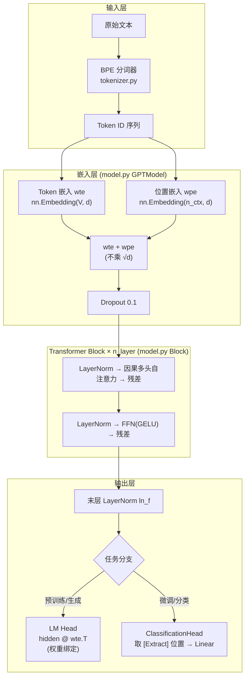
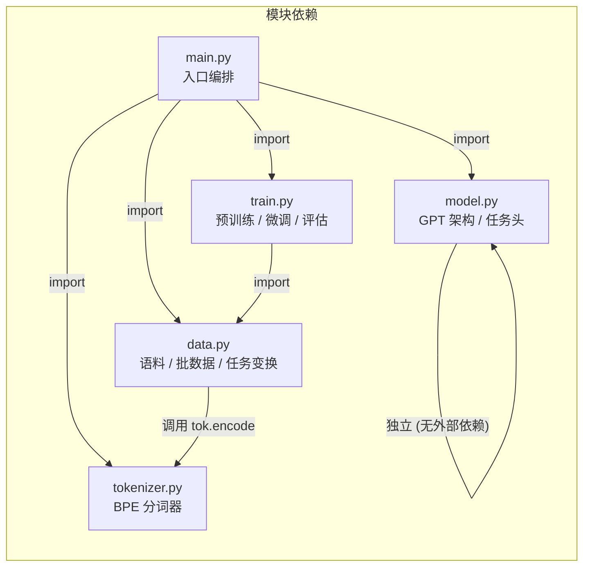

本文是 GPT-1 论文（*Improving Language Understanding by Generative Pre-Training*, Radford et al., 2018）与本项目代码之间的**桥梁文档**。我们将论文中每一个核心设计决策——从架构选择到训练配方——逐一映射到具体的源文件与行号，帮助你建立"论文公式 → 代码实现"的双向导航能力。对于初学者，建议将本页作为**查阅手册**：在阅读后续深度解析页面时随时回翻对照。

## 核心架构：论文设计 vs 代码实现

GPT-1 的核心主张是一个**两阶段框架**——先在大规模无标注语料上做语言模型预训练，再在下游任务上做有监督微调。下面的架构图展示了从输入文本到任务输出的完整数据流：

论文指定的架构参数与本项目教学配置的对比如下：

| 参数 | 论文配置 | 本项目教学配置 | 代码位置 |
|------|---------|--------------|---------|
| Transformer 层数 | 12 | 4 | [model.py](model.py#L26) `n_layer` |
| 隐藏维度 | 768 | 128 | [model.py](model.py#L25) `n_embd` |
| 注意力头数 | 12 | 4 | [model.py](model.py#L27) `n_head` |
| 最大序列长度 | 512 | 64 | [model.py](model.py#L24) `n_ctx` |
| FFN 内层维度 | 3072 (4×768) | 512 (4×128) | [model.py](model.py#L84) `4 * cfg.n_embd` |
| 总参数量 | ~117M | ~0.5M | [main.py](main.py#L126) `num_parameters()` |

Sources: [model.py](model.py#L20-L31), [main.py](main.py#L124-L127)

## 论文要点全景对照表

以下表格将论文中的每一项关键技术决策映射到本项目的具体实现位置，并标注论文中的相关公式或图表。这是本页的核心内容——一张从理论到实现的**精确导航图**。

### 模型架构

| 论文要点 | 论文出处 | 代码位置 | 关键差异/说明 |
|---------|---------|---------|-------------|
| 仅解码器 Transformer（自回归） | §3.1 | [model.py: GPTModel](model.py#L113-L148) | 无编码器、无交叉注意力，仅有因果自注意力 |
| Pre-LN 残差结构 | §3.1（对齐 OpenAI 官方实现） | [model.py: Block](model.py#L93-L110) | LayerNorm 在子层之前，非原始 Transformer 的 Post-LN |
| 末层额外 LayerNorm (ln_f) | §3.1 | [model.py: GPTModel.forward](model.py#L148) | Pre-LN 架构需要末尾再归一化，否则输出方差不可控 |
| 因果掩码（上三角 -inf） | §3.1 | [model.py: CausalSelfAttention](model.py#L59) `mask` | `torch.tril` 生成下三角掩码，注册为 buffer |
| QKV 统一投影 | 隐含于 OpenAI 实现 | [model.py: CausalSelfAttention](model.py#L54) `self.qkv` | 一个 `Linear(d, 3d)` 一次性投影，再 split |
| GELU 激活函数 | §3.1 | [model.py: GELU](model.py#L34-L38) | 替代 ReLU；`F.gelu` 调用 |
| **学习的**位置编码（非正弦） | §3.1 | [model.py: GPTModel](model.py#L123) `self.wpe` | `nn.Embedding(n_ctx, n_embd)`，训练中学习 |
| Token 嵌入**不乘** √d_model | 对齐 OpenAI 实现 | [model.py: GPTModel.forward](model.py#L145) | 原始 Transformer 做缩放，GPT 不做 |

Sources: [model.py](model.py#L1-L148)

### 权重初始化与参数共享

| 论文要点 | 论文出处 | 代码位置 | 关键差异/说明 |
|---------|---------|---------|-------------|
| 权重初始化 N(0, 0.02) | §3.1（对齐官方实现） | [model.py: _init_weights](model.py#L129-L139) | Linear/Embedding 用 `normal_(0, 0.02)`，LayerNorm γ=1/β=0 |
| LM 头与 Token 嵌入**权重绑定** | §3.1 | [model.py: LMHead](model.py#L151-L159) | `hidden @ self.wte.weight.t()`，共享同一个权重矩阵 |

Sources: [model.py](model.py#L129-L159)

### 分词

| 论文要点 | 论文出处 | 代码位置 | 关键差异/说明 |
|---------|---------|---------|-------------|
| BPE 子词分词 | §3.1 | [tokenizer.py: BPETokenizer](tokenizer.py#L27-L121) | 论文未给细节；本项目实现自包含最小 BPE |
| 字符级 OOV 回退 | 隐含于 BPE 性质 | [tokenizer.py: _encode_word](tokenizer.py#L82-L94) | 未见过的词回退到字符序列，天然支持任意输入 |

Sources: [tokenizer.py](tokenizer.py#L1-L152)

### 训练目标与优化

| 论文要点 | 论文公式/出处 | 代码位置 | 关键差异/说明 |
|---------|-------------|---------|-------------|
| **无监督预训练目标 L1** | L1 = −Σ log P(uᵢ \| uᵢ₋ₖ,...,uᵢ₋₁) | [train.py: pretrain](train.py#L49-L77) | 下一个 token 预测，交叉熵损失 |
| **微调目标 L3** = L2 + λ·L1 | §3.2 公式 | [train.py: finetune](train.py#L83-L131) | λ = 0.5（`lm_weight` 参数），辅助 LM 损失仅计真实位置 |
| 辅助 LM 目标仅计有效位置 | 隐含于论文 | [train.py: finetune](train.py#L114-L121) | 用 `valid` 掩码跳过 padding 位置 |
| Adam 优化器 β2=0.98（预训练） | §4（训练超参数） | [train.py: pretrain](train.py#L54) | `betas=(0.9, 0.98)`，ε=1e-9 |
| Adam 优化器 β2=0.999（微调） | §4 | [train.py: finetune](train.py#L92) | `betas=(0.9, 0.999)`，ε=1e-8 |
| 线性 warmup | §4 | [train.py: make_scheduler](train.py#L27-L43) | warmup_ratio=0.1，前 10% 步数线性升温 |
| 预训练余弦衰减 | §4 | [train.py: _cosine_lr](train.py#L27-L31) | warmup 后余弦衰减到 0 |
| 微调线性衰减 | §4 | [train.py: _linear_lr](train.py#L34-L37) | warmup 后线性衰减到 0 |
| 梯度范数裁剪 clip=1.0 | §4 | [train.py: pretrain](train.py#L69) / [finetune](train.py#L126) | `nn.utils.clip_grad_norm_` |

Sources: [train.py](train.py#L1-L131)

### 下游任务输入变换（论文 Figure 2）

| 论文要点 | 论文出处 | 代码位置 | 关键差异/说明 |
|---------|---------|---------|-------------|
| 特殊 token: [Start] [Delim] [Extract] | Figure 2 | [tokenizer.py: SPECIALS](tokenizer.py#L14) / [data.py: _special](data.py#L191-L192) | [Extract] 位置的隐藏表示送入任务头 |
| 分类任务输入变换 | Figure 2(a) | [data.py: classification_input](data.py#L195-L198) | `[Start] text [Extract]` |
| 文本蕴含输入变换 | Figure 2(b) | [data.py: entailment_input](data.py#L201-L205) | `[Start] 前提 [Delim] 假设 [Extract]` |
| 语义相似度输入变换 | Figure 2(c) | [data.py: similarity_inputs](data.py#L208-L216) | 两种顺序各一条，分别前向后求和（对称化） |
| 多项选择输入变换 | Figure 2(d) | [data.py: multiple_choice_input](data.py#L219-L231) | 每个候选答案一条序列，分别打分后 softmax |
| [Extract] 位置分类头 | §3.3 | [model.py: ClassificationHead](model.py#L185-L201) | `gather` 提取指定位置 → 线性分类 |

Sources: [data.py](data.py#L187-L231), [model.py](model.py#L185-L201)

### 数据与评估

| 论文要点 | 论文出处 | 代码位置 | 关键差异/说明 |
|---------|---------|---------|-------------|
| 预训练语料 (BooksCorpus) | §4 | [data.py: PRETRAIN_CORPUS](data.py#L19-L81) | 论文用 7000+ 本书；本项目内置 60 句小语料 |
| 下游分类数据 (SST-2 等) | §4 | [data.py: SENTIMENT_DATA](data.py#L87-L168) | 80 条情感二分类（40 正 / 40 负） |
| 语言模型批采样 | §3.1 | [data.py: lm_batch](data.py#L174-L184) | 从扁平 token 流随机截取 block_size 窗口 |
| 分类批 padding + 有效掩码 | 隐含于批处理 | [data.py: collate_classification](data.py#L237-L257) | padding 到 n_ctx，记录 `valid` 掩码与 `extract_pos` |
| 分类准确率评估 | §4 | [train.py: evaluate](train.py#L134-L148) | `argmax` 预测，统计正确比例 |

Sources: [data.py](data.py#L1-L267), [train.py](train.py#L134-L148)

### 生成与持久化

| 论文要点 | 论文出处 | 代码位置 | 关键差异/说明 |
|---------|---------|---------|-------------|
| 预训练 → 微调 → 评估管线 | §3 全文 | [main.py: main](main.py#L101-L194) | 完整两阶段编排 |
| 预训练 vs 从零训练对照 | §4.5 消融 | [main.py](main.py#L154-L178) | 加载预训练权重 vs 随机初始化，对比微调准确率 |
| 温度采样 + Top-K 截断生成 | 论文未详述 | [main.py: generate](main.py#L28-L44) | `temperature=0.8, top_k=20`，softmax 后多项采样 |
| Checkpoint 保存/加载 | 工程实践 | [main.py: save_checkpoint/load_gpt](main.py#L47-L56) | `torch.save` 保存 cfg + state_dict |

Sources: [main.py](main.py#L28-L194)

## 模块职责与依赖关系

理解五个文件之间的调用关系，是把握整个项目脉络的关键：

每个文件的职责边界清晰：

| 文件 | 行数 | 核心职责 | 对外暴露的主要接口 |
|------|------|---------|-------------------|
| [model.py](model.py) | 202 | GPT 架构定义 + 分类头 | `GPT`, `GPTConfig`, `ClassificationHead`, `LMHead` |
| [tokenizer.py](tokenizer.py) | 152 | BPE 分词训练与编解码 | `BPETokenizer` |
| [data.py](data.py) | 267 | 语料、批采样、任务变换、批整理 | `lm_batch`, `collate_classification`, `classification_input` 等 |
| [train.py](train.py) | 149 | 训练循环、学习率调度、评估 | `pretrain`, `finetune`, `evaluate`, `make_scheduler` |
| [main.py](main.py) | 195 | 管线编排、生成、可视化、持久化 | `main()`, `generate()`, `save_checkpoint()` |

## 特殊 Token 速查

本项目定义了四个特殊 token，它们在论文 Figure 2 的任务变换中扮演关键角色。理解它们的作用是阅读数据构建代码的前提：

| 特殊 Token | ID 位置 | 用途 | 代码定义 |
|-----------|--------|------|---------|
| `[Pad]` | 词表末尾第 1 | 批数据填充，使不等长序列对齐 | [tokenizer.py: SPECIALS](tokenizer.py#L14) |
| `[Start]`` | 词表末尾第 2 | 标记序列起始，所有任务变换的第一个 token | [tokenizer.py: SPECIALS](tokenizer.py#L14) |
| `[Delim]` | 词表末尾第 3 | 分隔两段文本（前提/假设、上下文/问题等） | [tokenizer.py: SPECIALS](tokenizer.py#L14) |
| `[Extract]` | 词表末尾第 4 | 其位置的隐藏表示送入任务分类头 | [tokenizer.py: SPECIALS](tokenizer.py#L14) |

Sources: [tokenizer.py](tokenizer.py#L13-L14), [data.py](data.py#L3-L7)

## 训练配方一览

论文对预训练和微调使用了不同的优化超参数。下表汇总了完整的训练配方，每项都标注了对应的代码行：

| 超参数 | 预训练 | 微调 | 代码位置 |
|--------|-------|------|---------|
| 学习率 | 3e-3（教学值，论文为 2.5e-4） | 1e-3（教学值） | [main.py](main.py#L133), [main.py](main.py#L148) |
| Adam β₁ | 0.9 | 0.9 | [train.py](train.py#L54), [train.py](train.py#L92) |
| Adam β₂ | **0.98** | **0.999** | [train.py](train.py#L54), [train.py](train.py#L92) |
| Adam ε | **1e-9** | **1e-8** | [train.py](train.py#L54), [train.py](train.py#L92) |
| Warmup 比例 | 0.1 | 0.1 | [main.py](main.py#L133), [main.py](main.py#L159) |
| 衰减策略 | 余弦衰减 | 线性衰减 | [train.py](train.py#L58), [train.py](train.py#L96) |
| 梯度裁剪 | 1.0 | 1.0 | [train.py](train.py#L69), [train.py](train.py#L126) |
| 辅助 LM 损失权重 λ | — | 0.5 | [train.py](train.py#L123) `lm_weight` |
| Batch Size | 32 | 8 | [main.py](main.py#L132), [main.py](main.py#L158) |
| Dropout | 0.1 (三处) | 0.1 (继承) | [model.py](model.py#L28-L30) |

Sources: [train.py](train.py#L49-L131), [main.py](main.py#L129-L174)

## 关键设计决策：为什么这样做

本节将论文中几个最容易被初学者忽略但至关重要的设计决策单独展开，帮助你理解"是什么"背后的"为什么"。

**为什么用 Pre-LN 而非 Post-LN？** 原始 Transformer 的残差结构是 `LayerNorm(x + Sublayer(x))`（Post-LN）。GPT-1 采用 `x + Sublayer(LayerNorm(x))`（Pre-LN），即在子层**之前**做归一化。这意味着残差路径上没有归一化操作，梯度可以更直接地流过深层网络，训练更稳定。代价是最终输出未经归一化，因此需要在堆叠末尾**额外加一层 LayerNorm**（`ln_f`）。[model.py: Block](model.py#L107-L110) 的 `forward` 方法清晰地体现了这一结构：`x = x + self.attn(self.ln_1(x))` 和 `x = x + self.ffn(self.ln_2(x))`。

Sources: [model.py](model.py#L93-L110), [model.py](model.py#L148)

**为什么 Token 嵌入不乘 √d_model？** 原始 Transformer 在将 token 嵌入送入编码器之前会乘以 √d_model，目的是让嵌入向量的尺度与位置编码相当。GPT-1 的位置编码是**可学习的**（`nn.Embedding`），其初始化尺度同样由 N(0, 0.02) 控制，因此无需额外缩放。[model.py](model.py#L145) 中直接写 `self.wte(idx) + self.wpe(pos)`，无任何缩放因子。

Sources: [model.py](model.py#L141-L148)

**为什么微调时要保留辅助 LM 损失？** 论文 §3.2 提出微调目标 L3 = L2 + λ·L1。如果仅用分类损失 L2 微调，模型可能"遗忘"预训练阶段学到的语言知识（灾难性遗忘）。辅助 LM 目标 L1 作为正则项，迫使模型在学会分类的同时**继续做语言建模**，从而保留通用语言能力、加速收敛并提升泛化。[train.py: finetune](train.py#L108-L123) 先计算分类损失 `l2`，再计算语言模型损失 `l1`，最后用 `loss = l2 + lm_weight * l1` 组合，其中 `lm_weight` 默认为 0.5。

Sources: [train.py](train.py#L108-L123)

## 推荐阅读路径

掌握了论文要点与代码的对应关系后，建议按以下顺序深入各个模块：

1. **从架构入手**：先读 [整体设计：仅解码器 Transformer 的层叠结构](4-zheng-ti-she-ji-jin-jie-ma-qi-transformer-de-ceng-die-jie-gou)，理解 GPT 的宏观骨架，再逐层深入 [因果多头自注意力](5-yin-guo-duo-tou-zi-zhu-yi-li-yan-ma-ji-zhi-yu-qkv-tou-ying)、[前馈网络与 GELU](6-wei-zhi-qian-kui-wang-luo-yu-gelu-ji-huo-han-shu)、[Pre-LN 残差块](7-pre-ln-can-chai-kuai-yu-mo-ceng-layernorm) 和 [嵌入层](8-qian-ru-ceng-token-qian-ru-xue-xi-de-wei-zhi-bian-ma-yu-dropout)。

2. **理解训练机制**：从 [无监督预训练目标 L1](20-wu-jian-du-yu-xun-lian-mu-biao-l1-xia-ge-token-yu-yan-mo-xing) 开始，再进入更有挑战性的 [微调目标 L3 = L2 + λ·L1](21-you-jian-du-wei-diao-mu-biao-l3-l2-l-l1-fu-zhu-yu-yan-mo-xing-sun-shi) 和 [学习率调度](19-xue-xi-lu-diao-du-xian-xing-warmup-yu-xian-xing-shuai-jian)。

3. **把握任务适配**：[论文 Figure 2 四种任务输入变换](17-lun-wen-figure-2-si-chong-ren-wu-shu-ru-bian-huan-fen-lei-yun-han-xiang-si-du-duo-xuan) 是连接预训练模型与下游任务的关键桥梁，理解它后就能读懂整个微调流程。

4. **跑通完整管线**：最后阅读 [完整训练管线](23-wan-zheng-xun-lian-guan-xian-yu-xun-lian-wei-diao-ping-gu-de-bian-pai-luo-ji) 和 [预训练 vs 从零训练对照实验](24-yu-xun-lian-chu-shi-hua-vs-cong-ling-xun-lian-dui-zhao-shi-yan-she-ji-yu-shou-yi-fen-xi)，亲手运行 `python main.py` 验证预训练的收益。