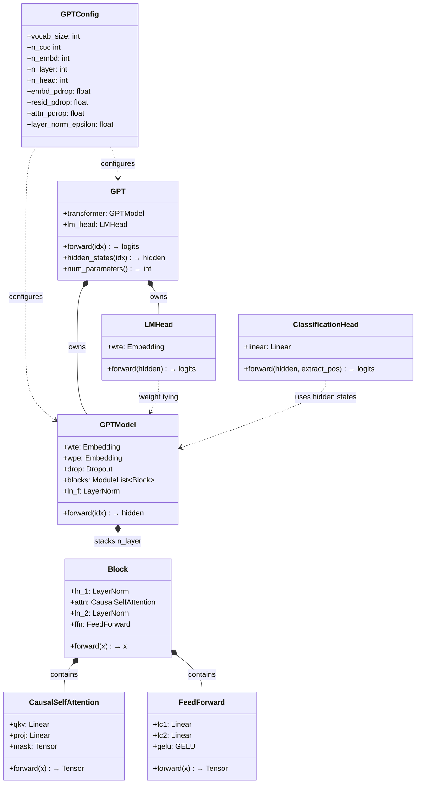
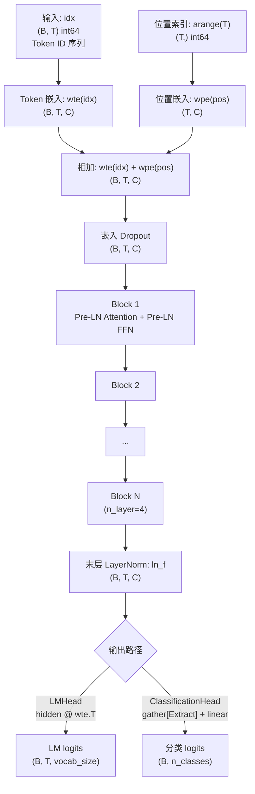
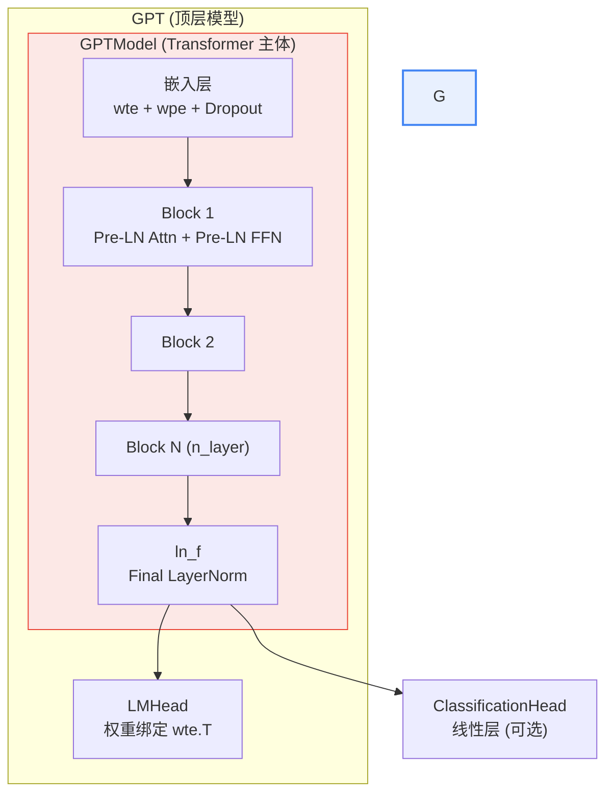

本页解析 GPT-1 复现项目中 `model.py` 的**顶层架构**——从配置类到完整的模型组装链路，阐明"仅解码器 Transformer"这一核心设计决策如何映射到具体的类层次结构与前向传播路径。后续页面将逐层深入各子模块的实现细节。

## 从原始 Transformer 到 GPT：砍掉编码器，只留解码

原始 Transformer（《Attention is All You Need》, 2017）是一个**编码器-解码器（Encoder-Decoder）**架构，专为机器翻译设计：编码器负责理解源语言，解码器负责生成目标语言。GPT-1 的关键洞察在于——对于通用语言理解任务，**仅保留解码器一侧**即可。这一决策的理论依据是：自回归语言模型（预测下一个 token）天然地蕴含了对语言的"理解"能力，无需额外的编码器路径。

在本实现中，"仅解码器"体现在三个可验证的结构特征上：

1. **因果掩码自注意力（Causal Masked Self-Attention）**——每个位置只能关注自身及之前的位置，严格禁止"窥视未来"，这是自回归生成的前提。`CausalSelfAttention` 类通过上三角 `-inf` 掩码实现这一约束。
2. **无交叉注意力子层**——标准 Transformer 解码器包含三个子层（Masked Self-Attention、Cross-Attention、Feed-Forward），GPT 的 Block 仅保留两个（Masked Self-Attention、Feed-Forward），去掉了与编码器交互的 Cross-Attention。
3. **自回归方向的数据流**——`forward(idx)` 接收完整的 token 序列，通过因果掩码确保位置 *i* 的输出仅依赖于位置 *0..i* 的输入。

Sources: [model.py](model.py#L1-L11), [README.md](README.md#L12-L15)

## 类层次结构：从超参数到完整模型

`model.py` 的类设计遵循**自底向上的组装哲学**——先定义最小功能单元，再通过组合构建完整模型。下面的类图展示了所有模块的依赖与嵌套关系：



整个模型的组装链路可以用一句话概括：**`GPTConfig` 驱动一切，`GPTModel` 堆叠 `Block`，`GPT` 在 `GPTModel` 上挂接 `LMHead`**。

| 类名 | 角色 | 关键依赖 | 详解页面 |
|---|---|---|---|
| `GPTConfig` | 超参数容器（dataclass） | 无 | 本页 |
| `GPTModel` | Transformer 主体：嵌入 + 堆叠 + LN | `Block` × n_layer | 本页 + [嵌入层详解](8-qian-ru-ceng-token-qian-ru-xue-xi-de-wei-zhi-bian-ma-yu-dropout) |
| `Block` | 单层解码块（Pre-LN 残差） | `CausalSelfAttention`, `FeedForward` | [Pre-LN 残差块](7-pre-ln-can-chai-kuai-yu-mo-ceng-layernorm) |
| `CausalSelfAttention` | 因果多头自注意力 | `nn.Linear`, `mask buffer` | [因果多头自注意力](5-yin-guo-duo-tou-zi-zhu-yi-li-yan-ma-ji-zhi-yu-qkv-tou-ying) |
| `FeedForward` | 位置前馈网络 | `GELU` | [位置前馈网络](6-wei-zhi-qian-kui-wang-luo-yu-gelu-ji-huo-han-shu) |
| `GPT` | 完整模型：主体 + LM 头 | `GPTModel`, `LMHead` | [语言模型头与权重绑定](9-yu-yan-mo-xing-tou-yu-quan-zhong-bang-ding-weight-tying) |
| `LMHead` | 隐藏向量 → 词表 logits | 共享 `wte` 权重 | [语言模型头与权重绑定](9-yu-yan-mo-xing-tou-yu-quan-zhong-bang-ding-weight-tying) |
| `ClassificationHead` | 隐藏向量 → 分类 logits | 无（独立线性层） | [分类头详解](10-fen-lei-tou-ji-yu-extract-wei-zhi-de-xian-xing-fen-lei) |

Sources: [model.py](model.py#L20-L31), [model.py](model.py#L93-L183)

## GPTConfig：一个 dataclass 驱动模型规模

`GPTConfig` 使用 Python `@dataclass` 定义，是整个模型的**唯一配置入口**。所有模块的构建函数都接收 `cfg: GPTConfig`，从同一配置对象读取所需超参数，确保全模型维度一致性。

| 参数 | 教学默认值 | 论文配置 | 含义 |
|---|---|---|---|
| `vocab_size` | 256（由 BPE 决定） | ~40000 | 词表大小 |
| `n_ctx` | 64 | 512 | 最大上下文窗口 / 序列长度 |
| `n_embd` | 128 | 768 | 嵌入维度与隐藏层维度 |
| `n_layer` | 4 | 12 | Transformer Block 层数 |
| `n_head` | 4 | 12 | 多头注意力头数 |
| `embd_pdrop` | 0.1 | 0.1 | 嵌入层 Dropout 率 |
| `resid_pdrop` | 0.1 | 0.1 | 残差路径 Dropout 率 |
| `attn_pdrop` | 0.1 | 0.1 | 注意力权重 Dropout 率 |
| `layer_norm_epsilon` | 1e-5 | 1e-5 | LayerNorm 数值稳定常数 |

一个关键的硬约束在 `CausalSelfAttention.__init__` 中被显式断言：`n_embd % n_head == 0`——每个注意力头的维度 `head_dim = n_embd // n_head` 必须是整数。教学配置中 128/4=32 维/头，论文配置中 768/12=64 维/头，两者均满足此约束。

Sources: [model.py](model.py#L20-L31), [model.py](model.py#L50)

## 前向传播：数据的完整流转路径

理解 GPT-1 的整体设计，最直观的方式是追踪一次前向传播中张量形状的逐级变化。以下是默认教学配置（`B=批次大小`, `T=序列长度`, `C=128`）下的完整数据流：



对应到代码，`GPT.forward` 的核心仅有四行：

```python
def forward(self, idx):
    return self.lm_head(self.transformer(idx))    # LM logits
```

而 `GPTModel.forward` 展开了内部的流转细节：

```python
def forward(self, idx):
    B, T = idx.shape
    pos = torch.arange(T, device=idx.device)
    x = self.drop(self.wte(idx) + self.wpe(pos))   # 嵌入层：token + position + dropout
    for block in self.blocks:                       # 层叠解码块
        x = block(x)
    return self.ln_f(x)                             # 末层 LayerNorm
```

一个容易被忽略但至关重要的设计决策：**token 嵌入不做 √d_model 缩放**。原始 Transformer 在嵌入后乘以 √(d_model) 以平衡嵌入和位置编码的量级，GPT-1 放弃了这一做法，因为位置编码也改为可学习的 Embedding（而非正弦），两者量级自然匹配。代码注释中明确标注了"不缩放 token 嵌入"。

Sources: [model.py](model.py#L113-L148), [model.py](model.py#L162-L179), [model.py](model.py#L1-L11)

## Block 堆叠：Pre-LN 残差的重复结构

GPT 的核心计算主体是 `Block` 的**同构重复**——每一层具有完全相同的结构和参数维度，仅在权重上不同。`GPTModel` 通过 `nn.ModuleList([Block(cfg) for _ in range(cfg.n_layer)])` 一次性创建所有层，前向传播中以 `for block in self.blocks` 顺序执行。

单个 `Block` 采用 **Pre-LN（Pre-Layer Normalization）** 残差结构，其前向计算可形式化为：

```
x = x + attn(ln_1(x))    # 子层 1：因果自注意力（先 LN 再注意力，残差连接）
x = x + ffn(ln_2(x))     # 子层 2：前馈网络（先 LN 再 FFN，残差连接）
```

这一设计的关键特征是 **LayerNorm 位于子层之前而非之后**（故称 "Pre-LN"）。与原始 Transformer 的 Post-LN 相比，Pre-LN 的梯度在残差主路径上可以直接回传到嵌入层，有利于深层网络的训练稳定性。由于所有 Block 末尾不归一化，`GPTModel` 在堆叠结束后额外追加一个 `ln_f`（Final LayerNorm）对输出做最终归一化。

Pre-LN 的具体设计动机和残差路径的细节属于专门的架构分析话题，详见 [Pre-LN 残差块与末层 LayerNorm](7-pre-ln-can-chai-kuai-yu-mo-ceng-layernorm)。

Sources: [model.py](model.py#L93-L110), [model.py](model.py#L125-L126), [model.py](model.py#L146-L148)

## 双输出路径：预训练与微调的统一入口

GPT-1 的架构设计精妙之处在于，**同一个 Transformer 主体可以服务两种截然不同的任务目标**，这正体现了"生成式预训练"范式的核心价值。`GPT` 类提供了两个公开方法来支持这一双路径设计：

| 方法 | 返回 | 用途 | 对应损失函数 |
|---|---|---|---|
| `forward(idx)` | LM logits `(B, T, vocab_size)` | 无监督预训练：预测下一个 token | L1（语言模型损失） |
| `hidden_states(idx)` | 隐藏向量 `(B, T, n_embd)` | 有监督微调：取隐藏表示送入任务头 | L2（任务分类损失） |

在微调阶段，`hidden_states` 返回的隐藏向量会被送入 `ClassificationHead`，该头从 `[Extract]` 位置提取一个 `(B, n_embd)` 的池化向量，经线性层映射为类别 logits。这种"共享主干 + 可换头部"的设计是 GPT 迁移学习能力的架构基础——预训练学到的语言表示可以无缝地对接到任意下游任务。

关于 LM 头的权重绑定机制和分类头的提取逻辑，分别详见 [语言模型头与权重绑定](9-yu-yan-mo-xing-tou-yu-quan-zhong-bang-ding-weight-tying) 和 [分类头：基于 [Extract] 位置的线性分类](10-fen-lei-tou-ji-yu-extract-wei-zhi-de-xian-xing-fen-lei)。

Sources: [model.py](model.py#L162-L179), [model.py](model.py#L185-L201)

## 教学规模 vs 论文规模：可缩放设计的价值

本实现的一个刻意设计选择是：**默认配置使用教学小规模（4 层 / 128 维 / 4 头），而非论文规模（12 层 / 768 维 / 12 头）**。这一选择使得整个训练管线可以在普通笔记本电脑上在几分钟内完成端到端运行，同时完整保留 GPT-1 的所有架构特征。

由于 `GPTConfig` 驱动所有模块的构建，从教学规模切换到论文规模只需修改几个参数值，无需改动任何代码逻辑。参数量随规模的变化大致如下：

| 配置 | 层数 | 隐藏维度 | 注意力头 | 估计参数量（不含词表） | 典型训练时间 |
|---|---|---|---|---|---|
| 教学默认 | 4 | 128 | 4 | ~0.4M | 数分钟 |
| 论文规模 | 12 | 768 | 12 | ~85M | 数天（需 GPU） |

这种可缩放性验证了一个重要的架构性质：GPT 的设计是**维度无关的**——`head_dim = n_embd // n_head`、FFN 内层 `4 * n_embd`、残差维度恒等于 `n_embd`，所有维度的耦合关系通过 `GPTConfig` 统一管理，不存在任何硬编码的维度常量。

Sources: [model.py](model.py#L20-L31), [README.md](README.md#L6-L8)

## 架构总结与后续阅读

本页梳理了 GPT-1 复现的**宏观架构骨架**：一个 `GPTConfig` 驱动的、由同构 `Block` 堆叠而成的仅解码器 Transformer，通过双输出路径统一服务预训练和微调两大目标。下图浓缩了这一架构的全貌：



要深入理解各子模块的具体实现，建议按以下顺序阅读：

1. [因果多头自注意力：掩码机制与 QKV 投影](5-yin-guo-duo-tou-zi-zhu-yi-li-yan-ma-ji-zhi-yu-qkv-tou-ying)——解码器最核心的组件
2. [位置前馈网络与 GELU 激活函数](6-wei-zhi-qian-kui-wang-luo-yu-gelu-ji-huo-han-shu)——每个 Block 的第二个子层
3. [Pre-LN 残差块与末层 LayerNorm](7-pre-ln-can-chai-kuai-yu-mo-ceng-layernorm)——残差结构与归一化策略
4. [嵌入层：Token 嵌入、学习的位置编码与 Dropout](8-qian-ru-ceng-token-qian-ru-xue-xi-de-wei-zhi-bian-ma-yu-dropout)——模型入口的表示学习
5. [语言模型头与权重绑定](9-yu-yan-mo-xing-tou-yu-quan-zhong-bang-ding-weight-tying)——预训练输出路径
6. [权重初始化策略 N(0, 0.02)](11-quan-zhong-chu-shi-hua-ce-lue-n-0-0-02-ji-qi-dui-xun-lian-wen-ding-xing-de-ying-xiang)——训练稳定性的起点