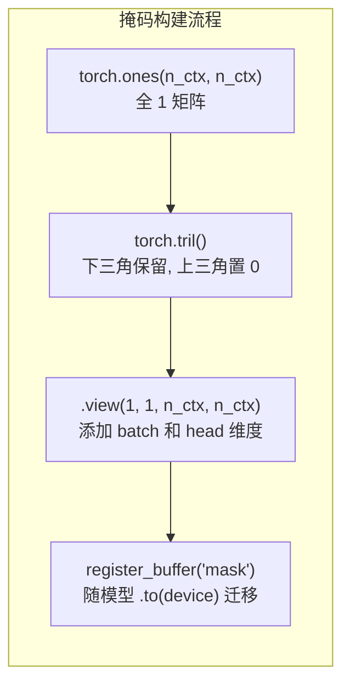
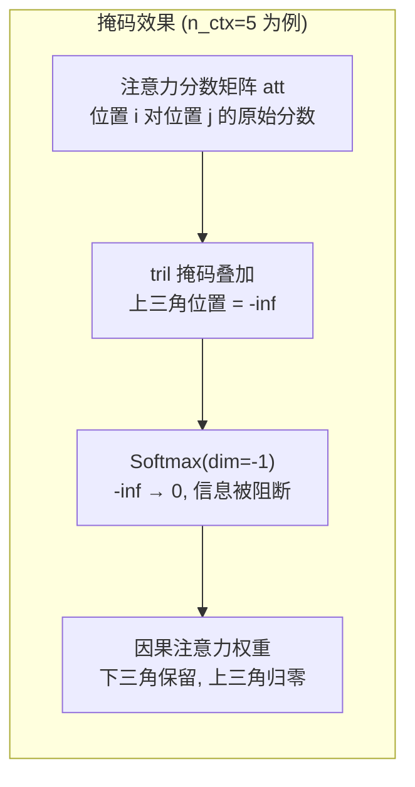
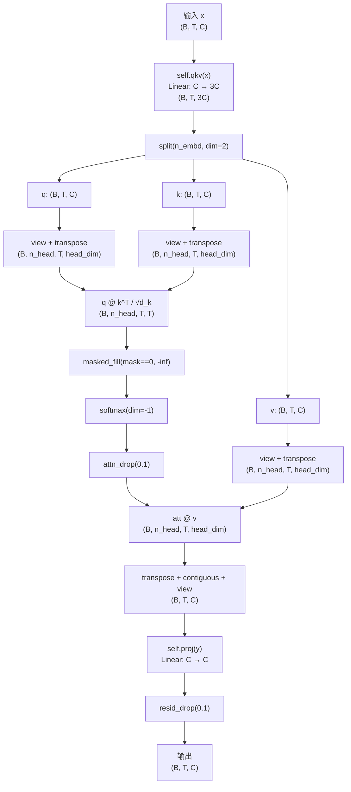

`CausalSelfAttention` 是 GPT-1 解码器中唯一的信息混合子层。它完成三项紧密耦合的任务：将输入投影为查询 (Q)、键 (K)、值 (V) 三路信号；在多头空间内计算缩放点积注意力；并通过上三角掩码施加**因果约束**——每个位置只能"看到"自身及更早的 token，从根本上杜绝了未来信息泄漏。本文逐行拆解 `model.py` 中这 36 行代码（L41–L76），揭示从张量形状到数学语义的每一个工程决策。

Sources: [model.py](model.py#L41-L76)

---

## 一、融合 QKV 投影：一次线性，三路输出

### 设计动机

原始 Transformer 论文中，Q、K、V 各自由独立的线性层 (`nn.Linear`) 生成，共三个权重矩阵。GPT-1 的实现（对齐 OpenAI 官方代码）采用一种**融合投影 (fused projection)** 策略：用一个 `nn.Linear(n_embd, 3 * n_embd)` 层一次性产出三倍宽度的输出张量，再沿特征维度 `split` 成三份。

```python
self.qkv = nn.Linear(cfg.n_embd, 3 * cfg.n_embd)     # 权重形状: (3*C, C)
```

这一做法在语义上与三个独立线性层完全等价（每个输出切片拥有独立的权重子块），但在工程上带来两个优势：**减少了一次内核启动开销**（尤其对 GPU 的 `GEMM` 调用而言），同时让 `model.apply(_init_weights)` 的权重初始化只需遍历一个 Linear 节点。

Sources: [model.py](model.py#L54-L55)

### Split 操作的精确语义

在 `forward` 中，融合投影后通过 `split(self.n_embd, dim=2)` 沿最后一维切成三段：

```python
q, k, v = self.qkv(x).split(self.n_embd, dim=2)      # 每段 (B, T, C)
```

`split` 按声明顺序切分，因此权重矩阵 `qkv.weight` 在行维度上的布局为 **[Q 的 C 行 | K 的 C 行 | V 的 C 行]**。这意味着 `qkv.weight[:C]` 对应查询投影，`qkv.weight[C:2C]` 对应键投影，`qkv.weight[2C:]` 对应值投影——如果你在调试时想单独提取某一路的权重，这就是切片的依据。

Sources: [model.py](model.py#L62-L64)

---

## 二、多头拆分：从 (B, T, C) 到 (B, n_head, T, head_dim)

### 维度重排的数学含义

注意力头的引入使得模型可以在不同的子空间中学习不同的关注模式。本实现中，`head_dim = n_embd // n_head`（教学配置下为 128 // 4 = 32，论文配置为 768 // 12 = 64），且构造函数中通过断言强制 `n_embd % n_head == 0` 保证整除。

```python
q = q.view(B, T, self.n_head, self.head_dim).transpose(1, 2)
#   (B, T, C) → view → (B, T, n_head, head_dim) → transpose(1,2) → (B, n_head, T, head_dim)
```

这里有两层操作值得拆解：

| 操作 | 输入形状 | 输出形状 | 语义 |
|------|---------|---------|------|
| `view(B, T, n_head, head_dim)` | (B, T, C) | (B, T, n_head, head_dim) | 将 C 维向量按 `head_dim` 大小切分成 `n_head` 组 |
| `transpose(1, 2)` | (B, T, n_head, head_dim) | (B, n_head, T, head_dim) | 将头维度提到前面，使后续矩阵乘法在头维度上并行 |

`view` 而非 `reshape` 的使用是刻意的——`view` 要求张量在内存中连续，这保证了头之间的切分不会引入数据拷贝，而是一个零开销的内存重解释。**关键理解**：`view` 按 C 维的最后 `head_dim` 个元素归属同一个头，因此每个头处理的是嵌入向量的一个不重叠切片，而非对整个嵌入的某种混合。

Sources: [model.py](model.py#L50-L53), [model.py](model.py#L65-L68)

### 并行矩阵乘法的张量广播

Q、K、V 三者经过同样的重排后，均变为 `(B, n_head, T, head_dim)`。后续的 `q @ k.transpose(-2, -1)` 利用 PyTorch 的批量矩阵乘法（`torch.bmm` 的推广），在 `(B, n_head)` 这两个前导维度上并行执行 `n_head` 个独立的 `(T, head_dim) × (head_dim, T)` 矩阵乘法。每个头**完全独立地**计算自己的注意力分数，这正是"多头"的实质。

Sources: [model.py](model.py#L70)

---

## 三、缩放点积注意力与因果掩码

### 缩放因子的来源

```python
att = (q @ k.transpose(-2, -1)) / math.sqrt(self.head_dim)
```

缩放因子是 $\sqrt{d_k}$（此处 `d_k = head_dim`），而非 $\sqrt{d_{model}}$。这是因为点积在每个头内部独立计算，涉及的维度是 `head_dim` 而非整个 `n_embd`。缩放的目的是控制点积的方差：当 Q 和 K 的各分量独立同分布且均值为 0、方差为 1 时，点积 $q \cdot k = \sum_{i=1}^{d_k} q_i k_i$ 的方差为 $d_k$。随着 `head_dim` 增大，未缩放的注意力分数会进入 softmax 的饱和区，导致梯度消失。除以 $\sqrt{d_k}$ 将方差归一化回 1，使 softmax 的输入保持在合理的数值范围内。

Sources: [model.py](model.py#L69-L70)

### 因果掩码的构建与应用

掩码在 `__init__` 中预构建并注册为 buffer：

```python
mask = torch.tril(torch.ones(cfg.n_ctx, cfg.n_ctx)).view(1, 1, cfg.n_ctx, cfg.n_ctx)
self.register_buffer("mask", mask)
```



**为什么用 `register_buffer` 而非普通属性？** Buffer 是 `nn.Module` 状态字典的一部分，但**不参与梯度计算**。掩码是固定的结构常量（无需学习），但需要随 `.to(device)` 一起迁移到 GPU——如果用普通 Python 属性，在多设备场景下会因设备不一致而报错。

在前向传播中，掩码通过 `masked_fill` 施加到注意力分数上：

```python
att = att.masked_fill(self.mask[:, :, :T, :T] == 0, float("-inf"))
```



`self.mask[:, :, :T, :T]` 的切片操作很重要：预构建的掩码大小为 `n_ctx × n_ctx`（最大序列长度），而实际输入序列 `T` 可能更短。切片取前 `T` 行 `T` 列，使掩码自适应于任意 `T ≤ n_ctx` 的输入。`-inf` 而非 `-1e9` 的选择保证了 softmax 后被掩码位置的概率**严格为零**（`e^{-inf} = 0`），而非近似为零。

Sources: [model.py](model.py#L58-L60), [model.py](model.py#L71)

### 因果性对自回归生成的根本意义

因果掩码是 GPT 作为**自回归语言模型**的数学保证。在训练阶段，虽然整个序列 `x₁, x₂, ..., x_T` 作为一批同时输入（充分利用并行性），但因果掩码确保位置 `t` 的注意力输出**仅由** `x₁, ..., x_t` 决定。这使得训练时的并行前向传播与推理时的逐 token 生成在数学上完全等价——如果训练时允许位置 `t` 看到 `x_{t+1}`，模型会在训练中"作弊"，但在推理时（无未来 token 可看）表现崩塌。

Sources: [model.py](model.py#L42-L45)

---

## 四、注意力聚合与输出投影

### 加权求和与多头合并

```python
att = F.softmax(att, dim=-1)
att = self.attn_drop(att)
y = att @ v                                  # (B, n_head, T, head_dim)
y = y.transpose(1, 2).contiguous().view(B, T, C)
```

softmax 在最后一个维度（key 维度）上归一化，使每个 query 位置对所有可见 key 的注意力权重之和为 1。`attn_drop`（`Dropout(0.1)`）作用于注意力权重本身而非 Q/K/V，这在训练时随机丢弃部分注意力连接，是一种正则化手段。

多头的合并过程是拆分的逆操作：`transpose(1, 2)` 将头维度移回第三轴，然后 `.contiguous().view(B, T, C)` 将 `n_head` 个头的结果拼接回完整的 `n_embd` 维向量。**`contiguous()` 是必须的**——`transpose` 返回的张量在内存中不连续，`view` 要求连续内存布局，缺少这一步会抛出运行时错误。

Sources: [model.py](model.py#L72-L75)

### 输出投影与残差 Dropout

```python
return self.resid_drop(self.proj(y))         # 输出投影 + 残差 dropout
```

`self.proj = nn.Linear(n_embd, n_embd)` 是**输出投影矩阵** $W^O$（对应原始 Transformer 论文中的 $W^O$），将多头拼接后的结果映射回模型维度，赋予各头输出之间混合的能力。如果没有这一层，多头的拼接只是各头结果的简单串接，缺少跨头的信息整合。

`resid_drop`（`Dropout(0.1)`）作用于投影输出，随后该结果将在 `Block.forward` 中与残差连接相加（详见 [Pre-LN 残差块与末层 LayerNorm](7-pre-ln-can-chai-kuai-yu-mo-ceng-layernorm)）。

Sources: [model.py](model.py#L55-L57), [model.py](model.py#L76), [model.py](model.py#L107-L110)

---

## 五、端到端数据流总览

下图展示了 `CausalSelfAttention.forward` 中张量形状的完整变换链：



### 关键参数一览

| 参数 | 教学配置 | 论文配置 | 说明 |
|------|---------|---------|------|
| `n_embd` (C) | 128 | 768 | 模型隐藏维度 |
| `n_head` | 4 | 12 | 注意力头数 |
| `head_dim` | 32 | 64 | 每头维度 = C / n_head |
| `qkv` 权重形状 | (384, 128) | (2304, 768) | 融合 QKV 投影 |
| `proj` 权重形状 | (128, 128) | (768, 768) | 输出投影 $W^O$ |
| `attn_pdrop` | 0.1 | 0.1 | 注意力权重 dropout |
| `mask` 形状 | (1, 1, 64, 64) | (1, 1, 512, 512) | 因果掩码 buffer |

Sources: [model.py](model.py#L20-L31), [model.py](model.py#L48-L60)

---

## 六、在 Block 中的集成

`CausalSelfAttention` 从不独立使用——它被包裹在 `Block` 的 Pre-LN 残差结构中。`Block.forward` 的第一行便是注意力子层：

```python
x = x + self.attn(self.ln_1(x))     # 先 LayerNorm，再注意力，再残差相加
x = x + self.ffn(self.ln_2(x))      # 前馈子层
```

`ln_1` 先对输入做层归一化，归一化后的结果送入 `CausalSelfAttention`。注意力的输出经过 `resid_drop` 后与原始输入 `x` 相加——这就是残差连接，使得梯度能够绕过注意力层直接回传到更早的层。关于 Pre-LN 设计的完整分析（包括它为何优于 Post-LN），请参阅 [Pre-LN 残差块与末层 LayerNorm](7-pre-ln-can-chai-kuai-yu-mo-ceng-layernorm)。

Sources: [model.py](model.py#L93-L110)

---

## 延伸阅读

- **注意力层的上游输入**：嵌入层如何为注意力提供 `(B, T, C)` 张量，参见 [嵌入层：Token 嵌入、学习的位置编码与 Dropout](8-qian-ru-ceng-token-qian-ru-xue-xi-de-wei-zhi-bian-ma-yu-dropout)
- **注意力层的下游消费**：注意力输出如何被前馈网络进一步变换，参见 [位置前馈网络与 GELU 激活函数](6-wei-zhi-qian-kui-wang-luo-yu-gelu-ji-huo-han-shu)
- **残差结构的深入分析**：Pre-LN 的设计原理与末层 LayerNorm 的必要性，参见 [Pre-LN 残差块与末层 LayerNorm](7-pre-ln-can-chai-kuai-yu-mo-ceng-layernorm)
- **因果性的推理应用**：掩码如何保证自回归生成的正确性，参见 [文本续写生成：温度采样与 Top-K 截断解码](25-wen-ben-xu-xie-sheng-cheng-wen-du-cai-yang-yu-top-k-jie-duan-jie-ma)