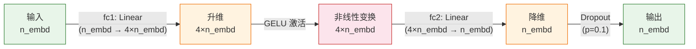
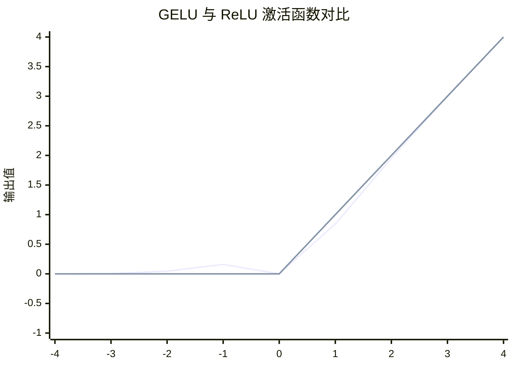

在 Transformer 的每个解码块中，自注意力子层负责捕捉序列中不同位置之间的依赖关系，而**位置前馈网络（Position-wise Feed-Forward Network, FFN）**则承担另一个互补的职责：对每个位置的隐藏向量进行独立的非线性特征变换。本页聚焦 GPT-1 实现中 FFN 的架构设计——两层线性投影以 **4× 扩展比**构成瓶颈结构，中间用 **GELU 激活函数**替代传统 ReLU——并解析这些选择如何影响模型的表征能力与训练稳定性。

Sources: [model.py](model.py#L1-L11)

## FFN 的位置独立性与瓶颈结构

### 位置独立性：逐 Token 的共享 MLP

位置前馈网络之所以称为"位置前馈"，是因为它对输入序列中的**每个位置独立施加同一个两层 MLP**，不同位置之间没有信息交互。用张量运算的语言来说，输入 `(B, T, n_embd)` 经过 FFN 后仍然是 `(B, T, n_embd)`——最后一个维度（特征维）被非线性变换，而序列维度 `T` 上的每个位置被完全并行地、等价地处理。这与自注意力子层形成鲜明对比：自注意力让不同位置之间进行信息混合，FFN 则对每个位置的表征做深度的特征精炼。

这种设计分工在 GPT 的 `Block` 类中清晰可见——注意力子层和前馈子层以残差连接的方式顺序串联：

```python
x = x + self.attn(self.ln_1(x))   # 子层1：跨位置信息混合
x = x + self.ffn(self.ln_2(x))    # 子层2：逐位置特征变换
```

Sources: [model.py](model.py#L107-L110)

### 4× 扩展比：先升维再降维的瓶颈设计

GPT-1 的 FFN 采用经典的**瓶颈结构**：第一层将隐藏维度从 `n_embd` 扩展到 `4 * n_embd`，经过 GELU 非线性激活后，第二层再压缩回 `n_embd`。在教学配置下，这意味着 `128 → 512 → 128`；在论文配置下则为 `768 → 3072 → 768`。

```python
class FeedForward(nn.Module):
    def __init__(self, cfg: GPTConfig):
        super().__init__()
        self.fc1 = nn.Linear(cfg.n_embd, 4 * cfg.n_embd)
        self.fc2 = nn.Linear(4 * cfg.n_embd, cfg.n_embd)
        self.gelu = GELU()
        self.drop = nn.Dropout(cfg.resid_pdrop)

    def forward(self, x):
        return self.drop(self.fc2(self.gelu(self.fc1(x))))
```



**为什么是 4 倍？** 这个比例沿袭自原始 Transformer 论文（Vaswani et al., 2017），其经验逻辑是：高维空间中的非线性变换能为模型提供更大的"工作内存"——先将信息展开到更宽的表示空间中进行复杂的模式匹配和特征组合，再将其压缩回原始维度。直观地说，第一层 `fc1` 充当**键值记忆库（key-value memory）**，将输入投影到多个可学习的模式探测器上；GELU 决定哪些模式被激活；第二层 `fc2` 则将激活的模式重新整合为统一的输出表征。研究表明，FFN 层承载了 Transformer 中大量的**事实性知识**存储功能，4× 扩展比为这种知识编码提供了充足容量。

Sources: [model.py](model.py#L79-L90)

## GELU 激活函数：高斯误差线性单元

### 从 ReLU 到 GELU 的演进

GPT-1 用 **GELU（Gaussian Error Linear Unit）** 替代了原始 Transformer 中的 ReLU。实现上，项目将其封装为一个简洁的模块，直接调用 PyTorch 内置的 `F.gelu`：

```python
class GELU(nn.Module):
    """高斯误差线性单元 (GELU)，GPT 用它替代 ReLU。"""
    def forward(self, x):
        return F.gelu(x)
```

GELU 的核心思想源自一个概率直觉：**一个神经元的激活值可以被视为对其输入乘以一个伯努利门控变量**，该门控以输入值的累积分布函数（CDF）为概率决定是否让信号通过。当输入服从标准正态分布时，GELU 的数学定义为：

$$\text{GELU}(x) = x \cdot \Phi(x) = x \cdot \frac{1}{2}\left[1 + \text{erf}\left(\frac{x}{\sqrt{2}}\right)\right]$$

其中 $\Phi(x)$ 是标准正态分布的累积分布函数，$\text{erf}$ 是误差函数。PyTorch 的 `F.gelu` 默认使用精确的 erf 公式计算（而非 tanh 近似），其 `approximate='none'` 参数即为论文标准实现。

Sources: [model.py](model.py#L34-L38)

### GELU 与 ReLU 的关键差异

| 特性 | ReLU | GELU |
|------|------|------|
| **数学形式** | $\max(0, x)$ | $x \cdot \Phi(x)$ |
| **在零点附近的行为** | 硬截断：$x < 0$ 输出恰好为 0 | **平滑过渡**：负值仍可部分通过 |
| **导数连续性** | 在 $x=0$ 处不可导 | 处处可导（平滑梯度） |
| **负值处理** | 完全抑制 | 小幅保留（如 $x=-1$ 时输出约为 $-0.159$） |
| **梯度消失风险** | 负区间梯度恒为 0（"死 ReLU"） | 负区间梯度非零，缓解死神经元问题 |
| **训练稳定性** | 激进裁剪可能导致信息丢失 | 平滑的非线性带来更稳定的优化轨迹 |

ReLU 的决策边界是"硬"的——正输入完全通过，负输入完全阻断。GELU 引入了一种"软门控"：对于较强的负输入，其输出趋近于零；但在零附近的过渡区域，它允许少量负信号通过，形成连续可导的曲线。这种平滑性减少了梯度的不连续点，使得优化器在训练初期更容易找到良好的下降路径。在自然语言处理任务中，GELU 的表现通常优于或等同于 ReLU，尤其是在深层模型和大规模训练场景下。



> 上图中注意 GELU 在 $x \approx -0.17$ 处有一处轻微的负谷（最小值约 $-0.17$），这是 GELU 区别于 ReLU 的标志性特征——它不是简单的"斩负为零"，而是一个具有微小负值波动的平滑函数。

Sources: [model.py](model.py#L34-L38)

## FFN 在 Block 中的整合：残差连接与 Dropout

### Pre-LN 残差路径中的 FFN

在 GPT-1 的 Pre-LN 架构中，FFN 作为每个 `Block` 的第二个残差子层存在。LayerNorm 在子层**之前**施加，对输入进行归一化后送入 FFN；FFN 的输出再通过残差连接加回原始输入：

```
x = x + ffn(ln_2(x))
```

这种设计意味着 FFN 接收的是经过 `ln_2` 归一化后的稳定输入，有利于线性层和 GELU 在一致的数值范围内工作。残差连接则确保了梯度可以不经过 FFN 直接回传，缓解深层网络中的梯度消失问题。

Sources: [model.py](model.py#L93-L110)

### FFN 输出端的 Dropout

FFN 的最后一层 `fc2` 之后接了一个 `Dropout(resid_pdrop)`，其中 `resid_pdrop = 0.1`。这个 dropout 位于**残差合并之前**——也就是说，它作用于 FFN 的输出本身，而非残差求和之后。在训练时，FFN 输出的每个元素有 10% 的概率被置零，迫使网络不过度依赖某些特定维度的特征。推理时 dropout 自动关闭，FFN 输出完整的变换结果。

```python
def forward(self, x):
    # 严格按计算顺序：fc1 → GELU → fc2 → Dropout
    return self.drop(self.fc2(self.gelu(self.fc1(x))))
```

注意 dropout 的位置选择是有意义的：它放在 `fc2` 之后而非 GELU 之后，意味着扩展维度（4×n_embd）上的正则化由 GELU 的平滑非线性隐式承担，而压缩后的输出维度上的正则化由显式的 Dropout 负责。这与 OpenAI 官方实现中 `resid_pdrop` 的语义一致——对残差路径上的子层输出进行统一正则化。

Sources: [model.py](model.py#L82-L90), [model.py](model.py#L29)

## 参数量与容量分析

FFN 是 GPT-1 模型中**参数量占比最大的组件之一**。以教学配置（`n_embd=128`）为例，单层 FFN 的参数量为：

| 组件 | 权重形状 | 参数量 |
|------|----------|--------|
| `fc1.weight` | (512, 128) | 65,536 |
| `fc1.bias` | (512,) | 512 |
| `fc2.weight` | (128, 512) | 65,536 |
| `fc2.bias` | (128,) | 128 |
| **单层 FFN 合计** | | **131,712** |

对比同层的自注意力子层（`qkv` + `proj`，约 98,560 参数），FFN 的参数量约为注意力的 **1.34 倍**。4 层模型中 FFN 总计约 526,848 参数，占据模型总参数的显著比例。这从侧面印证了 FFN 作为模型"知识存储"核心组件的地位——压缩到 4× 升维空间中的大量线性参数为模式记忆提供了物质基础。

在论文配置（`n_embd=768`）下，单层 FFN 的参数量跃升至约 4,722,432，12 层合计约 5,667 万——这与 GPT-1 总参数量约 1.17 亿（含嵌入层）的比例关系吻合。

Sources: [model.py](model.py#L82-L90), [model.py](model.py#L20-L31)

## 设计选择的论文依据

GPT-1 论文在模型架构部分明确指出，其网络结构与原始 Transformer 解码器基本一致，但用 GELU 替代了 ReLU。这一替换并非随意为之——GELU 由 Hendrycks 和 Gimpel（2016）提出，在 BERT、GPT 等大规模预训练模型中被广泛采用，已事实上成为现代 Transformer 的标配激活函数。

4× 扩展比同样是沿袭自原始 Transformer 论文的经验设置。虽然后续研究（如通过混合专家 MoE 或可变扩展比）探索了不同的容量分配策略，但 GPT-1 乃至后续的 GPT-2、GPT-3 均保持了这一经典比例，说明 4× 扩展在模型容量与计算效率之间取得了良好的平衡。

> **关于 GELU 的 tanh 近似**：PyTorch 的 `F.gelu(x)` 默认使用精确 erf 公式。部分框架（如早期 TensorFlow BERT）使用 `approximate='tanh'` 版本：$0.5x[1 + \tanh(\sqrt{2/\pi}(x + 0.044715x^3))]$。两者在数值上非常接近（最大差异约 $10^{-4}$），但对特定训练配方可能有细微影响。本项目使用精确版本，与 OpenAI 官方实现一致。

Sources: [model.py](model.py#L1-L11), [model.py](model.py#L34-L38)

## 延伸阅读

FFN 作为 `Block` 的核心子层之一，与自注意力子层和 Pre-LN 残差结构紧密协作。要理解 FFN 在完整解码块中的角色，建议结合以下页面阅读：

- [因果多头自注意力：掩码机制与 QKV 投影](5-yin-guo-duo-tou-zi-zhu-yi-li-yan-ma-ji-zhi-yu-qkv-tou-ying) — FFN 的互补子层，负责跨位置信息混合
- [Pre-LN 残差块与末层 LayerNorm](7-pre-ln-can-chai-kuai-yu-mo-ceng-layernorm) — LayerNorm 如何在 FFN 前施加归一化，以及残差连接的完整路径
- [权重初始化策略 N(0, 0.02) 及其对训练稳定性的影响](11-quan-zhong-chu-shi-hua-ce-lue-n-0-0-02-ji-qi-dui-xun-lian-wen-ding-xing-de-ying-xiang) — FFN 中 `fc1`/`fc2` 的权重如何被初始化