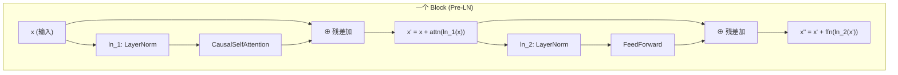
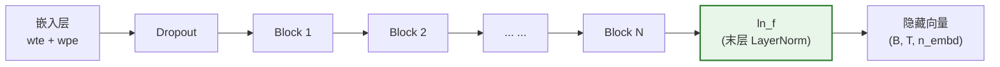

在 GPT-1 的架构中，每一个 Transformer 解码层（Block）的内部结构都遵循一种被称为 **Pre-LN**（Pre-LayerNorm）的残差设计范式：LayerNorm 被放置在子层（自注意力或前馈网络）**之前**，而非之后。这一选择深刻影响了梯度流动、训练稳定性以及模型的堆叠深度。与此同时，由于 Pre-LN 的特性使得最后一层 Block 的输出未经归一化，GPT 在 Block 堆叠的末尾额外增加了一层 **ln_f**（final LayerNorm），确保输出隐藏向量的数值分布处于可控范围。本文将深入解析这两处设计的实现细节、原理对比与训练意义。

Sources: [model.py](model.py#L1-L11)

## LayerNorm 的数学基础

LayerNorm（层归一化）对**单个样本的隐藏维度**进行归一化操作——这与 BatchNorm 对批次维度归一化的策略截然不同。对于隐藏向量 $\mathbf{x} \in \mathbb{R}^{d}$，LayerNorm 的计算过程如下：

$$\mu = \frac{1}{d}\sum_{i=1}^{d} x_i, \quad \sigma^2 = \frac{1}{d}\sum_{i=1}^{d}(x_i - \mu)^2$$

$$\hat{x}_i = \frac{x_i - \mu}{\sqrt{\sigma^2 + \epsilon}}, \quad y_i = \gamma_i \cdot \hat{x}_i + \beta_i$$

其中 $\gamma$ 和 $\beta$ 是可学习的缩放和平移参数，$\epsilon$ 是一个极小常数（本项目设为 `1e-5`），用于防止除零。LayerNorm 不依赖批次内其他样本，因此天然适用于变长序列和自回归生成场景——每个 token 位置的归一化都是独立计算的。

在 PyTorch 中，`nn.LayerNorm(cfg.n_embd, eps=cfg.layer_norm_epsilon)` 在最后一个维度（即 `n_embd=128`）上执行上述运算。GPT-1 的每一层 Block 内部包含两个独立的 LayerNorm 实例：`ln_1` 用于注意力子层前，`ln_2` 用于前馈子层前，二者各自维护独立的 $\gamma$ 和 $\beta$ 参数。

Sources: [model.py](model.py#L100-L105), [model.py](model.py#L31)

## Pre-LN vs Post-LN：架构对比

原始 Transformer（Vaswani et al., 2017）采用的是 **Post-LN** 结构——LayerNorm 放在残差连接**之后**：

```
# Post-LN (原始 Transformer)
x = LayerNorm(x + Sublayer(x))
```

而 GPT-1 采用的是 **Pre-LN** 结构——LayerNorm 放在残差连接**之前**，即子层**之前**：

```
# Pre-LN (GPT-1)
x = x + Sublayer(LayerNorm(x))
```

两种范式之间的差异可通过以下结构对比直观呈现：

| 特性 | Post-LN（原始 Transformer） | Pre-LN（GPT-1 及后续 GPT 系列） |
|---|---|---|
| **LayerNorm 位置** | 残差求和之后 | 子层输入之前 |
| **残差路径** | 经过 LayerNorm 变换 | 直接传递，无归一化 |
| **梯度流动** | 残差路径上有 LayerNorm 的非线性变换 | 残差路径形成"干净"直通通路 |
| **深层训练稳定性** | 需仔细的 warmup 策略 | 更容易收敛，对 warmup 更鲁棒 |
| **是否需要末层 LN** | 不需要（最后一层的输出已被归一化） | **需要**（最后一层输出未归一化） |

Pre-LN 的核心优势在于**梯度路径**。在 Post-LN 中，残差路径 $x + \text{Sublayer}(x)$ 的结果必须穿过 LayerNorm 的非线性变换才能传向下一层，反向传播时梯度需要穿过 LayerNorm 的 Jacobian 矩阵。而在 Pre-LN 中，残差连接构成了一条从输入到输出的**恒等映射通路**——梯度可以无损地沿着这条通路回传，这在深层网络（12 层甚至更多）中极大缓解了梯度消失问题。

下面的流程图展示了 GPT-1 Block 内部的数据流：



关键观察：输入 `x` 同时流向两条路径——一条经过 LayerNorm 进入子层，另一条直接到达残差加法节点。这意味着即使子层的梯度在反向传播中衰减，残差通路上的梯度仍然保持完整。

Sources: [model.py](model.py#L93-L110)

## Block 类的实现解析

`Block` 类是 Pre-LN 范式的直接代码体现，其 `forward` 方法仅用两行代码即完成了一个完整 Transformer 解码层的计算：

```python
def forward(self, x):
    x = x + self.attn(self.ln_1(x))    # 注意力子层
    x = x + self.ffn(self.ln_2(x))     # 前馈子层
    return x
```

两行代码各自封装了一个 **Pre-LN 残差单元**。以注意力子层为例，展开后的数据流为：输入 `x` → `ln_1` 归一化 → `CausalSelfAttention` 计算 → 残差加回原始 `x`。前馈子层结构完全对称，只是将注意力替换为 `FeedForward`，将 `ln_1` 替换为独立的 `ln_2`。

值得注意的是，`ln_1` 和 `ln_2` 是**完全独立的 LayerNorm 实例**，各自拥有独立的可学习参数 $\gamma$ 和 $\beta$。这一设计允许模型分别学习两处归一化所需的最优缩放和平移策略，而非共享同一组参数。

从张量形状的角度看，`Block` 的输入输出形状始终为 `(B, T, n_embd)`，其中 `B` 为批次大小、`T` 为序列长度、`n_embd` 为隐藏维度。Pre-LN 的归一化在 `n_embd` 维度上操作，不影响 `B` 和 `T` 维度的独立性，因此不同序列位置之间的计算互不依赖——这正是自回归生成得以逐 token 进行的基础。

Sources: [model.py](model.py#L93-L110)

## 末层 LayerNorm（ln_f）的必要性

在 `GPTModel` 的 `forward` 方法中，所有 Block 的输出在返回之前必须经过最后一层 LayerNorm：

```python
for block in self.blocks:
    x = block(x)
return self.ln_f(x)    # 末层 LayerNorm
```

**为什么需要 ln_f？** 这一问题的答案直接来自 Pre-LN 的结构特性。在 Post-LN 中，每个子层的输出都已经过 LayerNorm 归一化，因此最后一层的输出自然是归一化的。但在 Pre-LN 中，最后一层 Block 的最后一步操作是 `x = x + ffn(ln_2(x))`——残差加法的结果**未经归一化**，其数值分布可能偏离均值 0、方差 1 的范围。

如果直接将未归一化的隐藏向量送入下游任务头（语言模型头或分类头），会带来两个问题：一是数值尺度不确定，可能导致 logits 的量级不可控；二是下游线性层的输入分布不稳定，影响推理质量和微调收敛。`ln_f` 恰好弥补了这一缺口，将最后一层 Block 的输出重新归一化到标准化范围。



上图展示了 `ln_f` 在整个模型前向传播中的位置——它是 Block 堆叠与输出之间的**最后一道归一化屏障**。无论模型堆叠了多少层 Block（本项目默认 4 层，论文配置 12 层），`ln_f` 始终是唯一的、全局共享的实例。

Sources: [model.py](model.py#L113-L148), [model.py](model.py#L126)

## LayerNorm 的权重初始化

GPT-1 对 LayerNorm 参数的初始化策略遵循直觉性的默认设定：缩放参数 $\gamma$ 初始化为 **1**，平移参数 $\beta$ 初始化为 **0**。这一策略在 `_init_weights` 方法中实现：

```python
elif isinstance(module, nn.LayerNorm):
    nn.init.ones_(module.weight)   # γ = 1
    nn.init.zeros_(module.bias)    # β = 0
```

$\gamma = 1$ 和 $\beta = 0$ 的初始化意味着在网络训练的初始阶段，LayerNorm 的输出就是纯粹的标准归一化结果（零均值、单位方差），没有额外的缩放或平移。这使得初始前向传播的数值分布处于"最中性"的状态，梯度可以均匀地流向各层。随着训练推进，模型会根据需要自适应地调整 $\gamma$ 和 $\beta$，实现对不同层、不同维度特征的非均匀加权。

值得注意的是，本项目中 `ln_1`、`ln_2`（每层 Block 各一对）以及 `ln_f` 共计 $(2 \times n\_layer + 1)$ 个 LayerNorm 实例——本项目默认配置下为 9 个（$2 \times 4 + 1$），论文配置下为 25 个（$2 \times 12 + 1$）。`_init_weights` 通过 `self.apply()` 遍历所有子模块，确保每个 LayerNorm 实例都统一应用此初始化策略。

Sources: [model.py](model.py#L129-L139)

## layer_norm_epsilon 的作用

`GPTConfig` 中定义了 `layer_norm_epsilon: float = 1e-5`，这一参数在所有 LayerNorm 实例中一致使用。它的作用出现在 LayerNorm 的分母中：$\sqrt{\sigma^2 + \epsilon}$。当某个 token 的隐藏向量在所有维度上的值高度一致时（例如全零或全等），方差 $\sigma^2$ 趋近于零，此时 $\epsilon$ 防止除零错误并将输出约束到有限值。

`1e-5` 是 PyTorch `nn.LayerNorm` 的默认值，也是 Transformer 文献中最常见的选择。虽然理论上可以调整此参数，但在实践中它对模型性能的影响极小，通常不需要作为超参数进行搜索。

Sources: [model.py](model.py#L31), [model.py](model.py#L102), [model.py](model.py#L104), [model.py](model.py#L126)

## 完整数据流：从嵌入到输出的归一化轨迹

将所有组件串联起来，GPT-1 的一次前向传播中 LayerNorm 的参与轨迹如下：

| 阶段 | 操作 | 是否经过 LayerNorm | 说明 |
|---|---|---|---|
| 嵌入 | `wte(idx) + wpe(pos)` | 否 | Token 嵌入与位置嵌入直接相加 |
| Dropout | `self.drop(...)` | 否 | 嵌入层 Dropout |
| Block 循环 | `for block in blocks` | **每个子层前** | 共 $2 \times n\_layer$ 次 LN |
| 末层归一化 | `ln_f(x)` | **是** | 补偿 Pre-LN 的未归一化输出 |
| 下游任务头 | LM 头 / 分类头 | 否 | 直接消费 ln_f 的输出 |

整条数据流中，LayerNorm 共出现 $(2 \times n\_layer + 1)$ 次，每一次都独立维护自己的 $\gamma$ 和 $\beta$。这些参数与模型的其他参数一起，通过 Adam 优化器在训练过程中联合更新。

Sources: [model.py](model.py#L141-L148)

## 后续阅读

- 想了解 Block 内部注意力子层的完整实现，参见 [因果多头自注意力：掩码机制与 QKV 投影](5-yin-guo-duo-tou-zi-zhu-yi-li-yan-ma-ji-zhi-yu-qkv-tou-ying)
- 想了解前馈子层的 GELU 激活与维度扩展策略，参见 [位置前馈网络与 GELU 激活函数](6-wei-zhi-qian-kui-wang-luo-yu-gelu-ji-huo-han-shu)
- 想了解 `ln_f` 输出如何被语言模型头消费，参见 [语言模型头与权重绑定 (Weight Tying)](9-yu-yan-mo-xing-tou-yu-quan-zhong-bang-ding-weight-tying)
- 想了解所有参数（含 LayerNorm）的初始化策略全貌，参见 [权重初始化策略 N(0, 0.02) 及其对训练稳定性的影响](11-quan-zhong-chu-shi-hua-ce-lue-n-0-0-02-ji-qi-dui-xun-lian-wen-ding-xing-de-ying-xiang)