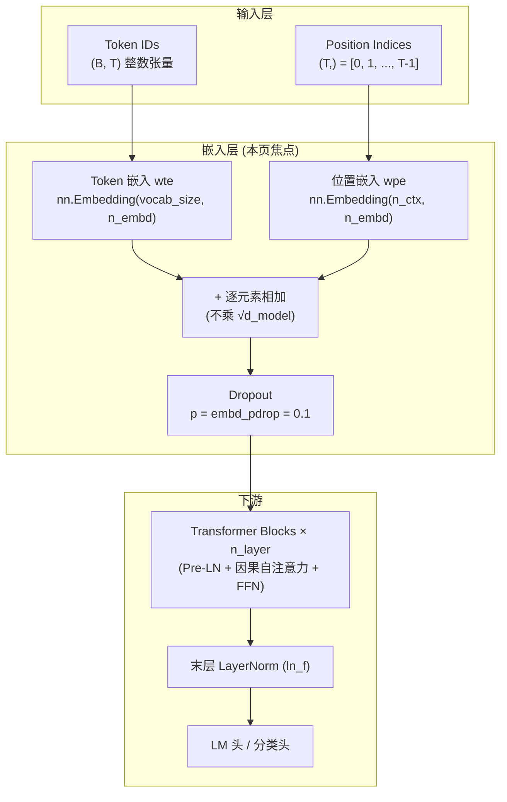

嵌入层是 GPT-1 接收离散 Token ID 序列并将其映射到连续向量空间的第一道工序。它由三个核心组件构成——**Token 嵌入** (`wte`) 将词表中的每个符号编码为稠密向量，**学习的位置编码** (`wpe`) 为每个序列位置赋予可训练的位置信息，以及一个 **Dropout** 层在嵌入求和后施加正则化。三者协同工作，将 `(B, T)` 的整数索引张量变换为 `(B, T, n_embd)` 的浮点张量，供后续 Transformer Block 消费。本页聚焦 `model.py` 中 `GPTModel` 的嵌入初始化与前向计算逻辑，剖析 GPT-1 与原始 Transformer 的关键设计差异。

## 架构总览：嵌入层在模型中的位置



Token 嵌入和位置嵌入各自是一个独立的查找表（`nn.Embedding`），二者维度相同（均为 `n_embd`），通过逐元素相加融合为最终的输入表示。Dropout 在求和之后、进入 Transformer Block 之前施加。整个嵌入层的参数定义集中在前向函数的三行代码中，简洁而精确。

Sources: [model.py](model.py#L141-L148)

## Token 嵌入 (wte)：从离散 ID 到稠密向量

Token 嵌入是嵌入层最基础的组件，它将分词器输出的整数 Token ID 转换为可被神经网络处理的连续向量。在 `GPTModel.__init__` 中，Token 嵌入被定义为一个标准的 PyTorch 嵌入层：

```python
self.wte = nn.Embedding(cfg.vocab_size, cfg.n_embd)  # token 嵌入
```

这里 `vocab_size` 由 BPE 分词器的词表大小决定（包含普通子词和特殊 Token），`n_embd` 是嵌入维度（教学配置 128，论文 768）。在论文规模下，仅 Token 嵌入本身就包含 `vocab_size × 768` 个参数——以 GPT-1 约 40,000 的词表计算，Token 嵌入约占 30M 参数，是模型中参数量最大的单一组件之一。

Token 嵌入的权重同时承担两项职责：在前向传播时将 Token ID 映射为输入向量；在语言模型头中作为输出投影矩阵的转置，将隐藏向量映射回词表 logits。这种 **权重绑定 (Weight Tying)** 设计在 `LMHead` 中实现，有效减少了参数冗余。这一机制的详细分析请参阅 [语言模型头与权重绑定 (Weight Tying)](9-yu-yan-mo-xing-tou-yu-quan-zhong-bang-ding-weight-tying)。

Sources: [model.py](model.py#L122), [model.py](model.py#L151-L159)

## 学习的位置编码 (wpe)：可训练的位置信号

GPT-1 采用 **学习的位置编码 (learned positional embeddings)**，而非原始 Transformer 中的正弦/余弦固定编码。这是一个重要的设计选择，在模块文档注释中明确标注：

> 学习的位置编码 (learned positional embeddings)，而非正弦。

位置嵌入同样使用 `nn.Embedding` 实现：

```python
self.wpe = nn.Embedding(cfg.n_ctx, cfg.n_embd)   # 学习的位置嵌入
```

其中 `n_ctx` 是最大序列长度（教学配置 64，论文 512）。在前向传播时，通过 `torch.arange(T)` 生成位置索引 `[0, 1, ..., T-1]`，再用 `wpe` 查表得到每个位置对应的向量：

```python
pos = torch.arange(T, device=idx.device)
```

### 学习式 vs 正弦式位置编码对比

| 特性 | 学习的位置编码 (GPT-1) | 正弦式位置编码 (原始 Transformer) |
|------|----------------------|--------------------------------|
| **参数** | 可训练，`n_ctx × n_embd` 个参数 | 无参数，由三角函数公式生成 |
| **外推能力** | 无——超出 `n_ctx` 的位置无法编码 | 天然支持任意长度 |
| **学习信号** | 通过反向传播自适应学习 | 固定不变 |
| **实验效果** | 在固定长度任务上通常略优 | 泛化性更好 |
| **适用场景** | 输入长度有上限的任务 | 需要灵活序列长度的场景 |

GPT-1 选择学习式编码的动机在于：论文的所有任务（语言建模、文本分类、蕴含、相似度、多选）都有明确的序列长度上限，固定 `n_ctx` 的设计已经足够。可训练的位置编码让模型能以数据驱动的方式发现最优的位置表示，而非依赖人工设计的正弦函数。

Sources: [model.py](model.py#L5), [model.py](model.py#L123), [model.py](model.py#L144)

## 嵌入融合与前向计算：相加而非缩放

GPT-1 嵌入层的核心计算只有一行代码，但其中蕴含着一个与原始 Transformer 的关键差异：

```python
x = self.drop(self.wte(idx) + self.wpe(pos))   # 不缩放 token 嵌入
```

### 关键设计决策：不乘 √d_model

原始 Transformer 在将 Token 嵌入与位置编码相加之前，会将 Token 嵌入乘以 $\sqrt{d_{\text{model}}}$，目的是使 Token 嵌入和位置编码的方差处于同一量级，避免位置信号被较大的嵌入值淹没。GPT-1 **放弃了这一缩放操作**——这在模块文档和行内注释中都有明确记录。

文档注释写道：

> token 嵌入不乘以 sqrt(d_model) (与原始 Transformer 不同，GPT 不做缩放)。

这一决策的影响在于：由于 GPT 的位置编码是学习的（而非固定的正弦编码），其数值范围已经通过反向传播自动调整到与 Token 嵌入相匹配的量级。相比之下，原始 Transformer 使用固定的正弦编码（值域为 $[-1, 1]$），而 Token 嵌入的初始化标准差为 0.02，需要通过缩放来平衡。GPT 的设计中，两个嵌入表都从 $N(0, 0.02)$ 初始化并联合训练，天然保持在同一尺度。

Sources: [model.py](model.py#L8), [model.py](model.py#L145)

## 嵌入层 Dropout：embd_pdrop 的作用

在 Token 嵌入与位置嵌入相加之后、进入 Transformer Block 之前，GPT-1 施加一层 Dropout 正则化：

```python
self.drop = nn.Dropout(cfg.embd_pdrop)
```

默认丢弃率为 `embd_pdrop = 0.1`，即训练时以 10% 的概率将嵌入向量中随机选择的维度置零，并对保留的维度乘以 $1/(1-p)$ 以保持期望值不变。这构成了嵌入层的正则化防线。

### 三种 Dropout 的分工

GPT-1 模型中有三处独立的 Dropout，各司其职：

| Dropout | 位置 | 配置字段 | 防护目标 |
|---------|------|---------|---------|
| **嵌入 Dropout** (`embd_pdrop`) | 嵌入层后、Block 前 | `cfg.embd_pdrop = 0.1` | 防止嵌入层过拟合训练数据的特定 Token-位置组合 |
| **注意力 Dropout** (`attn_pdrop`) | Softmax 后、加权求和前 | `cfg.attn_pdrop = 0.1` | 正则化注意力权重分布，防止过度依赖特定 Token |
| **残差 Dropout** (`resid_pdrop`) | 子层输出投影后、残差相加前 | `cfg.resid_pdrop = 0.1` | 正则化每个子层的贡献，增强残差连接的稳定性 |

三种 Dropout 在 `__init__` 中各自独立配置，在 `forward` 中于各自的计算位置触发。在推理时（`model.eval()`），所有 Dropout 自动关闭，模型使用完整的嵌入信号进行计算。

Sources: [model.py](model.py#L28-L30), [model.py](model.py#L56-L57), [model.py](model.py#L87), [model.py](model.py#L124)

## 权重初始化：嵌入层的 N(0, 0.02) 起点

嵌入层的初始化通过 `_init_weights` 静态方法统一处理。对于 `nn.Embedding` 模块（涵盖 `wte` 和 `wpe`），采用与 Linear 层相同的正态分布初始化：

```python
elif isinstance(module, nn.Embedding):
    nn.init.normal_(module.weight, mean=0.0, std=0.02)
```

这意味着 Token 嵌入和位置嵌入的每个查找表条目都从 $N(0, 0.02)$ 中独立采样。标准差 0.02 是 GPT 论文沿袭自 GPT-2 预设的经验值，其目的是让初始嵌入向量的 L2 范数足够小（约 $\sqrt{n_{\text{embd}}} \times 0.02$），避免在训练初期产生过大的激活值从而影响梯度流动的稳定性。

`_init_weights` 通过 `self.apply(self._init_weights)` 在模型构建时递归应用到所有子模块，确保嵌入表、线性层和 LayerNorm 都遵循统一的初始化规范。关于初始化策略对训练稳定性的完整影响分析，请参阅 [权重初始化策略 N(0, 0.02) 及其对训练稳定性的影响](11-quan-zhong-chu-shi-hua-ce-lue-n-0-0-02-ji-qi-dui-xun-lian-wen-ding-xing-de-ying-xiang)。

Sources: [model.py](model.py#L127), [model.py](model.py#L129-L139)

## 嵌入层参数量分析

理解嵌入层的参数占比对模型效率分析至关重要。以下基于 `GPTConfig` 默认值（`vocab_size=256`, `n_ctx=64`, `n_embd=128`）和论文配置（`vocab_size≈40000`, `n_ctx=512`, `n_embd=768`）的对比：

| 组件 | 教学配置参数量 | 论文配置参数量 | 计算公式 |
|------|-------------|-------------|---------|
| Token 嵌入 (`wte`) | 32,768 | ~30.7M | `vocab_size × n_embd` |
| 位置嵌入 (`wpe`) | 8,192 | ~393K | `n_ctx × n_embd` |
| 嵌入层总计 | 40,960 | ~31.1M | — |

值得注意的是，Token 嵌入的参数量远超位置嵌入——在论文配置下，Token 嵌入占比约 99%。这解释了为何 GPT-1 通过权重绑定将 LM 输出投影与 Token 嵌入共享，避免再引入一个等量级的独立输出矩阵。位置嵌入的参数量则与 `n_ctx` 成正比，当序列长度受限时其开销极小。

Sources: [model.py](model.py#L21-L31), [model.py](model.py#L122-L124)

## 下一步阅读

嵌入层将离散的 Token ID 转换为密集的连续向量后，数据流入 Transformer 主体。建议按以下顺序继续深入：

- **[整体设计：仅解码器 Transformer 的层叠结构](4-zheng-ti-she-ji-jin-jie-ma-qi-transformer-de-ceng-die-jie-gou)** — 理解嵌入层输出如何被多层 Block 逐层加工
- **[语言模型头与权重绑定 (Weight Tying)](9-yu-yan-mo-xing-tou-yu-quan-zhong-bang-ding-weight-tying)** — Token 嵌入权重的第二重身份：LM 输出投影
- **[权重初始化策略 N(0, 0.02) 及其对训练稳定性的影响](11-quan-zhong-chu-shi-hua-ce-lue-n-0-0-02-ji-qi-dui-xun-lian-wen-ding-xing-de-ying-xiang)** — 深入理解嵌入层初始化对整个训练过程的影响