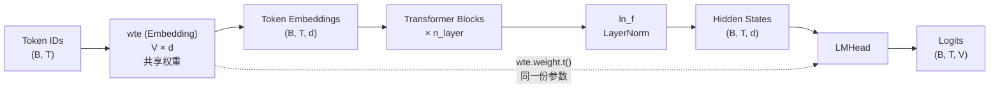

语言模型头（LM Head）是 GPT 从隐藏向量空间"解码"回离散词表空间的最后一跳。本项目的 LMHead 采用**权重绑定（Weight Tying）**设计——将输出投影矩阵与输入嵌入矩阵共享为同一份参数，这是 GPT-1 以及后续 GPT 系列的标准做法。本文聚焦 LMHead 的实现细节、权重绑定的数学原理，以及它在预训练和微调两条路径中的具体调用方式。

## 语言模型头的核心：一个不需要独立参数的线性投影

在标准的自回归语言模型中，最后一步需要将 Transformer 顶层输出的隐藏向量 $h \in \mathbb{R}^{d}$ 映射为词表大小的 logits 向量 $z \in \mathbb{R}^{V}$。朴素做法是引入一个独立的 `nn.Linear(d, V)` 层。然而 GPT-1 选择将这个投影矩阵**直接复用** token 嵌入矩阵 $E \in \mathbb{R}^{V \times d}$ 的转置，即 logits = $h \cdot E^\top$。

具体实现位于 `LMHead` 类中。它的构造函数只接收一个已有的 `nn.Embedding` 引用，不创建任何新的可学习参数；forward 中仅执行一次矩阵乘法：

```python
class LMHead(nn.Module):
    def __init__(self, wte: nn.Embedding):
        super().__init__()
        self.wte = wte

    def forward(self, hidden):
        return hidden @ self.wte.weight.t()   # (B, T, vocab_size)
```

这里的 `self.wte.weight` 是 `nn.Embedding` 内部的权重张量，形状为 `(vocab_size, n_embd)`。`.t()` 将其转置为 `(n_embd, vocab_size)`，再与隐藏向量 `(B, T, n_embd)` 做矩阵乘法，得到每个位置在全部词表上的 logits `(B, T, vocab_size)`。关键在于：`LMHead` 持有的是对 `wte.weight` 的**引用**而非拷贝，因此嵌入矩阵的任何梯度更新都会同时作用于"编码"（token → 向量）和"解码"（向量 → logits）两个方向。

Sources: [model.py](model.py#L151-L159)

## 权重绑定的组装：GPT 类中的引用传递

`GPT` 类是整个模型的顶层容器，负责将 `GPTModel`（Transformer 主体）与 `LMHead` 组装在一起。权重绑定的关键时刻发生在 `GPT.__init__` 中——`LMHead` 接收的正是 `GPTModel` 内部创建的那个 `wte` 嵌入层实例本身：

```python
class GPT(nn.Module):
    def __init__(self, cfg: GPTConfig):
        super().__init__()
        self.cfg = cfg
        self.transformer = GPTModel(cfg)
        self.lm_head = LMHead(self.transformer.wte)   # 权重绑定
```

由于 Python 中对象按引用传递，`self.transformer.wte` 和 `self.lm_head.wte` 指向的是**同一个** `nn.Embedding` 对象。这意味着 `model.parameters()` 遍历参数时，嵌入矩阵只会被计数一次——它不会因为同时出现在"嵌入"和"输出头"两个位置而被重复注册。

下面用 Mermaid 图示展示参数共享的数据流向（以下图示需要 Mermaid 渲染器支持）：



图中虚线箭头标注了权重绑定的核心：`wte.weight` 这一份参数同时服务于输入编码（实线上半段）和输出解码（实线下半段），形成一条对称的双向映射通路。

Sources: [model.py](model.py#L162-L179)

## 预训练路径：forward 的端到端 logits 输出

在预训练阶段，`GPT.forward(idx)` 将 token ID 序列一步到位地转换为 logits：

```python
def forward(self, idx):
    return self.lm_head(self.transformer(idx))    # LM logits
```

其中 `self.transformer(idx)` 经过嵌入、多层 Block 和末层 LayerNorm，输出隐藏向量 `(B, T, n_embd)`；`self.lm_head` 再将其投影为 `(B, T, vocab_size)`。训练循环中直接对这个 logits 计算交叉熵损失：

```python
logits = model(x)                               # (B, T, V)
loss = F.cross_entropy(logits.reshape(-1, logits.size(-1)), y.reshape(-1))
```

反向传播时，梯度同时从嵌入层路径（编码方向）和 LM 头路径（解码方向）回流到 `wte.weight`，二者叠加后由优化器执行一次统一更新。这种双向梯度信号使得嵌入矩阵在"理解词义"（编码）和"预测词语"（解码）两个目标上被**联合优化**。

Sources: [model.py](model.py#L178-L179), [train.py](train.py#L64-L66)

## 微调路径：辅助 LM 损失中的复用

在微调阶段，GPT-1 论文采用 $L_3 = L_2 + \lambda \cdot L_1$ 的联合目标——分类损失 $L_2$ 之外，额外引入同一序列上的语言模型损失 $L_1$ 作为辅助任务。这里 `LMHead` 被复用于计算辅助 LM 损失：

```python
hidden = model.hidden_states(x)              # (B, T, n_embd)
logits = classifier(hidden, extract_pos)      # 分类 logits
l2 = F.cross_entropy(logits, labels)          # 有监督分类损失

# 辅助 LM 损失：仅在被 padding 之外的真实位置计算
lm_logits = model.lm_head(hidden)            # (B, T, V)
shift_logits = lm_logits[:, :-1, :].reshape(-1, lm_logits.size(-1))
shift_targets = x[:, 1:].reshape(-1)
shift_valid = valid[:, 1:].reshape(-1)
if shift_valid.any():
    lm_losses = F.cross_entropy(shift_logits, shift_targets, reduction="none")
    l1 = (lm_losses * shift_valid).sum() / shift_valid.sum()
```

注意微调代码通过 `model.hidden_states(x)` 单独获取隐藏向量，然后将其分别送入 `classifier`（分类头）和 `model.lm_head`（语言模型头）。由于权重绑定，辅助 LM 损失 $L_1$ 的梯度仍然会通过 `lm_head.wte.weight` 流回到嵌入矩阵，确保微调过程中模型的通用语言能力不会急剧退化。这种设计在微调时尤其有价值——`ClassificationHead` 有自己独立的参数（一个简单的 `nn.Linear(n_embd, n_classes)`），但 LM 头始终与嵌入层共享，无需额外管理。

Sources: [train.py](train.py#L108-L123)

## 权重绑定 vs 独立输出层：设计权衡

下表对比两种方案的关键差异：

| 维度 | 权重绑定 (本项目) | 独立输出层 `nn.Linear(d, V)` |
|---|---|---|
| **参数量** | 嵌入矩阵 V×d 只算一份 | 额外增加 V×d 参数 |
| **梯度信号** | 编码+解码双向梯度，联合优化 | 两条路径各自独立更新 |
| **语义一致性** | 强制"相似的词有相似的嵌入和输出表示" | 嵌入和输出空间可能发散 |
| **正则化效果** | 参数减少约 1/3（对大词表），降低过拟合风险 | 参数更多，需要更多数据 |
| **实现复杂度** | 需引用传递，注意参数唯一性 | 直接声明即可 |
| **GPT/HuggingFace 惯例** | ✅ GPT-1/2/3 标准做法 | 早期部分模型采用 |

在本项目的教学规模下（`vocab_size=256, n_embd=128`），嵌入矩阵约 32K 参数，权重绑定节省的绝对量不大；但当论文规模的词表（如 BPE 词表 40K+）和隐藏维度（768）组合时，独立输出层将增加约 30M 额外参数，绑定带来的收益就十分显著了。

Sources: [model.py](model.py#L151-L173)

## 嵌入初始化与权重绑定的交互

权重绑定使得嵌入矩阵的初始化策略变得尤为关键——同一份参数同时承担编码和解码职责。本项目中嵌入层和所有 Linear 层统一采用 `N(0, 0.02)` 初始化：

```python
@staticmethod
def _init_weights(module):
    if isinstance(module, nn.Linear):
        nn.init.normal_(module.weight, mean=0.0, std=0.02)
    elif isinstance(module, nn.Embedding):
        nn.init.normal_(module.weight, mean=0.0, std=0.02)
```

标准差 0.02 是一个刻意偏小的值。如果嵌入矩阵作为 LM 头的投影矩阵使用，过大的初始方差会导致 logits 的方差爆炸，Softmax 输出趋近均匀分布，梯度信号微弱。0.02 的标准差确保了隐藏向量与嵌入矩阵相乘后，logits 保持在一个合理范围内，为训练初期的稳定梯度流提供了基础。这也是 GPT 系列论文中推荐的全局初始化标准。

Sources: [model.py](model.py#L129-L139)

## Checkpoint 持久化中的绑定关系

在模型保存与加载时，权重绑定体现为一个隐含约束。`save_checkpoint` 通过 `model.state_dict()` 序列化整个模型——由于 `transformer.wte.weight` 和 `lm_head.wte.weight` 是同一张量，PyTorch 的 `state_dict` 中只会在 `transformer.wte.weight` 路径下存储一份副本。加载时，`GPT(cfg)` 构造函数重新建立绑定关系（引用同一个 `wte`），`load_state_dict` 正确恢复权重后绑定关系自动生效。这意味着**不需要任何额外的持久化逻辑**来维护权重绑定，它完全由构造函数中的引用传递保证。

Sources: [main.py](main.py#L47-L56)

## 小结

权重绑定是 GPT-1 架构中一个看似简单但影响深远的设计决策。`LMHead` 类仅用一行 `hidden @ self.wte.weight.t()` 完成了从隐藏空间到词表空间的解码，没有任何独立参数；`GPT` 类通过引用传递在构造时确立绑定关系；预训练和微调两条路径共享同一份嵌入矩阵，确保语言模型的编码能力与解码能力被联合优化。对于理解 GPT 的参数效率和表示学习机制，权重绑定是不可或缺的一环。

**延伸阅读**：要了解嵌入层的完整构造（token 嵌入与位置嵌入的融合），参见 [嵌入层：Token 嵌入、学习的位置编码与 Dropout](8-qian-ru-ceng-token-qian-ru-xue-xi-de-wei-zhi-bian-ma-yu-dropout)。要了解 LM 损失在微调中的具体形式，参见 [有监督微调目标 L3 = L2 + λ·L1](21-you-jian-du-wei-diao-mu-biao-l3-l2-l-l1-fu-zhu-yu-yan-mo-xing-sun-shi)。关于嵌入参数的初始化细节及其对训练稳定性的影响，参见 [权重初始化策略 N(0, 0.02)](11-quan-zhong-chu-shi-hua-ce-lue-n-0-0-02-ji-qi-dui-xun-lian-wen-ding-xing-de-ying-xiang)。