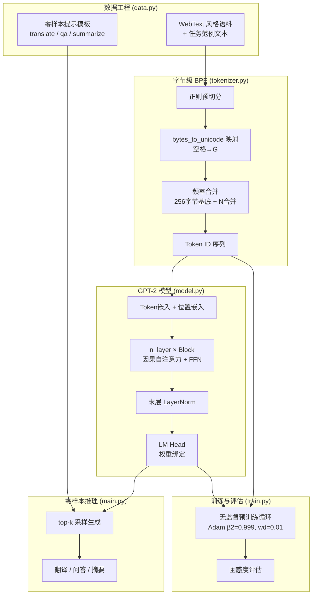
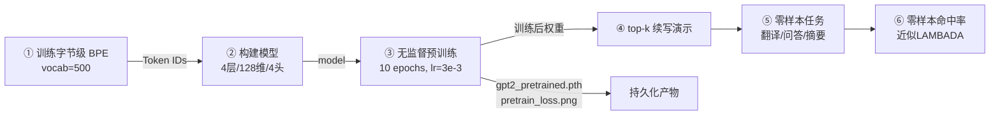
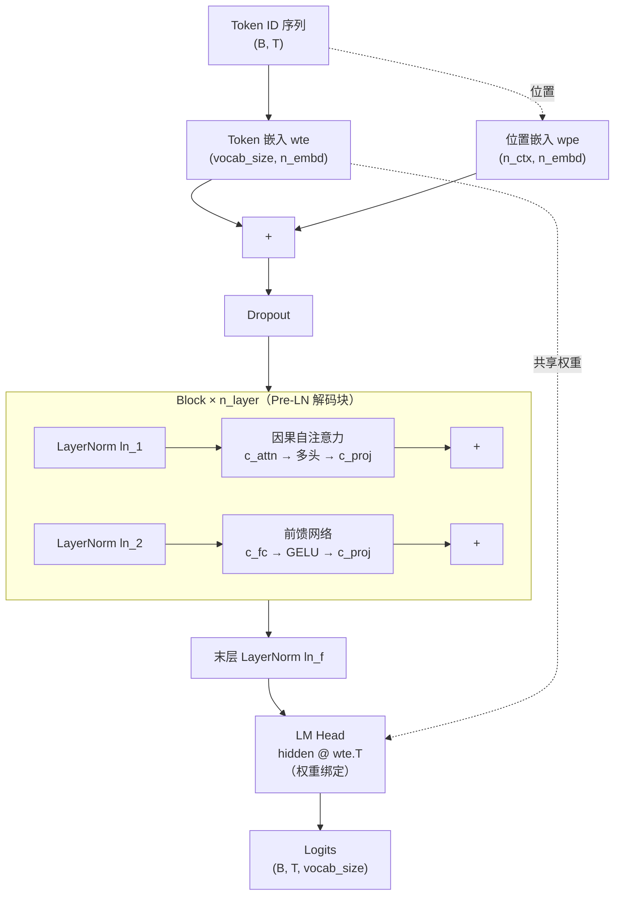

本项目以教学小规模、纯离线、单文件运行的方式，复现论文 *Language Models are Unsupervised Multitask Learners* (Radford et al., 2019) 的核心主张：**一个纯语言模型，无需任何下游微调，仅靠「把任务写成文本续写」就能零样本完成翻译、问答、摘要等多种任务——即"无监督多任务学习"**。整个项目由 5 个 Python 文件构成，覆盖了从字节级分词器、模型架构、训练循环到零样本推理的完整链路，架构、分词器、训练配方与生成方式均对齐论文与 OpenAI 官方实现 `openai/gpt-2`。

Sources: [README.md](README.md#L1-L9), [main.py](main.py#L1-L10)

---

## 核心思想：任务即文本续写

GPT-2 与 GPT-1 最根本的区别不在网络结构，而在**任务范式**。GPT-1 采用"预训练 → 有监督微调"两阶段，为每个下游任务设计专用任务头并更新参数。GPT-2 取消了微调阶段，不内置任何任务头——所有任务都通过自然语言提示词触发，模型只需"接着写下去"。

这个思想的简洁性令人震撼：翻译、问答、摘要被统一为同一件事——预测下一个 token。项目用三组提示模板实现这一理念：

| 任务类型 | 提示模板 | 期望续写 |
| --- | --- | --- |
| 翻译 | `translate to french , the cat :` | `le chat` |
| 问答 | `question : what is the capital of france ? answer :` | `paris` |
| 摘要 | `a fast red car drove down the street . tl ; dr :` | `a fast car drove .` |

这些模板并非人为注入的"程序逻辑"，而是模型在纯语言建模过程中自然学到的**文本模式**——只要训练语料中出现过类似格式的文本，模型就会在续写时复现这种模式。项目的教学小语料中刻意嵌入了上述格式的范例，使得机制可被直接验证；而论文级别的零样本泛化能力，则依赖 WebText（~40GB）量级数据的"涌现"。

Sources: [data.py](data.py#L83-L104), [main.py](main.py#L168-L180)

---

## 架构全景图

下面用 Mermaid 展示项目的整体数据流。从原始文本输入到零样本任务输出，经过**分词器 → 模型 → 训练 → 推理**四大环节，每个环节对应一个源文件：



理解这张图的关键在于：**数据流是一条单向管道，没有"微调"分支**。GPT-1 在预训练后会分叉出多个有监督训练路径（每个任务一个），而 GPT-2 的所有任务共用同一条"语言建模 → 文本续写"主干。

Sources: [main.py](main.py#L108-L192), [model.py](model.py#L190-L209)

---

## 项目文件结构

项目仅含 5 个源文件，职责清晰、单向依赖，无外部框架依赖（除 PyTorch 外）：

```
31_gpt2/
├── model.py        ← GPT-2 架构定义
│                     GPTConfig（4种规模预设）
│                     GELU（tanh 近似）
│                     CausalSelfAttention（多头因果自注意力）
│                     MLP（前馈网络）
│                     Block（Pre-LN 解码块）
│                     GPTModel（嵌入 + Block堆叠 + ln_f）
│                     LMHead（权重绑定语言模型头）
│                     GPT（对外接口）
│
├── tokenizer.py    ← 字节级 BPE 分词器
│                     bytes_to_unicode()（字节→可见字符映射）
│                     ByteBPETokenizer（train / encode / decode）
│
├── data.py         ← 数据组织与任务模板
│                     WEBTEXT_CORPUS（预训练语料）
│                     WEBTEXT_TASK_EXAMPLES（任务格式范例）
│                     lm_batch()（批次采样）
│                     translate_prompt / qa_prompt / summarize_prompt
│                     ZERO_SHOT_EVAL（零样本评估集）
│
├── train.py        ← 训练循环与评估
│                     pretrain()（无监督预训练）
│                     perplexity()（困惑度计算）
│                     _cosine_lr()（学习率调度）
│                     _split_decay_groups()（权重衰减分组）
│
├── main.py         ← 统一入口
│                     pick_device()（设备选择）
│                     generate()（top-k 采样生成）
│                     zero_shot_accuracy()（下一词命中率）
│                     main()（编排完整流程）
│
└── README.md       ← 项目说明与论文要点对照
```

模块间的调用关系为：`main.py` 导入 `model`、`tokenizer`、`data`、`train` 四个模块；`train.py` 导入 `data`；`model.py` 仅依赖 PyTorch。这种单向依赖结构确保了每个模块可独立理解。

Sources: [main.py](main.py#L17-L20), [train.py](train.py#L20-L20)

---

## GPT-2 与 GPT-1 的核心差异速览

GPT-2 在 GPT-1 的解码器 Transformer 基础上做了多项工程级改进。下表概括了本项目代码所体现的关键差异，帮助你快速建立整体认知：

| 维度 | GPT-1 | **GPT-2** | 代码位置 |
| --- | --- | --- | --- |
| **任务方式** | 预训练 → **有监督微调**（任务头 + 辅助 LM） | **无微调**，任务 = 文本续写（零样本） | 无任务头；[data.py](data.py#L83-L104) |
| **分词** | 字符/词级 BPE | **字节级 BPE**（无 OOV，支持任意 Unicode，空格→`Ġ`） | [tokenizer.py](tokenizer.py#L36-L53) |
| **上下文长度** | 512 | **1024** | [model.py](model.py#L25-L25) |
| **激活函数** | erf 精确 GELU | **tanh 近似 GELU** | [model.py](model.py#L52-L61) |
| **初始化** | N(0, 0.02) | 输出投影 **按 1/√(2·n_layer) 额外缩放** | [model.py](model.py#L151-L155) |
| **评估指标** | 分类准确率 | **困惑度 PPL** | [train.py](train.py#L96-L121) |
| **模型规模** | 1 个（117M） | **4 个**（124M / 355M / 774M / 1558M） | [model.py](model.py#L34-L49) |
| **训练数据** | BooksCorpus | **WebText**（Reddit karma ≥ 3 抓取） | [data.py](data.py#L16-L19) |
| **优化器 β2** | 0.98 | **0.999** + **权重衰减 0.01** | [train.py](train.py#L67-L67) |

这张表是后续各专题文档的导航索引——每一行差异都有对应的深度解析页面。对于初学者，最重要的是理解第一行（任务方式）的革命性变化：它重新定义了"一个模型做所有任务"的实现路径。

Sources: [README.md](README.md#L11-L24), [model.py](model.py#L1-L11)

---

## 运行流程：main.py 编排的六阶段管道

`main.py` 的 `main()` 函数编排了从分词器训练到零样本评估的完整演示流程，共六个阶段。下面的流程图展示了各阶段的输入输出和关键参数：



六个阶段的设计逻辑如下：

| 阶段 | 做什么 | 关键函数/组件 | 预期输出 |
| --- | --- | --- | --- |
| ① 训练分词器 | 在语料上训练 byte-level BPE | `ByteBPETokenizer.train()` | 词表大小、`Ġ` 编码演示 |
| ② 构建模型 | 实例化教学规模 GPT-2 + 展示论文 4 种规模 | `GPT(cfg)`, `GPTConfig.gpt2_{small,medium,large,xl}` | 参数量列表 |
| ③ 预训练 | 无监督语言模型训练 | `train.pretrain()` | LM 损失曲线 + 验证困惑度 PPL |
| ④ 续写演示 | top-k 采样生成 | `main.generate()` | 3 条续写示例 |
| ⑤ 零样本任务 | 翻译/问答/摘要提示续写 | `data.{translate,qa,summarize}_prompt` | 5 条零样本结果 |
| ⑥ 零样本评估 | argmax 下一词命中率 | `main.zero_shot_accuracy()` | 命中百分比 |

运行方式极其简单——`python main.py` 即可，可通过环境变量 `PRETRAIN_EPOCHS` 和 `BPE_VOCAB` 调节训练规模。

Sources: [main.py](main.py#L108-L192), [main.py](main.py#L31-L50)

---

## GPT-2 模型架构：解码器 Transformer

GPT-2 的模型主体是一个**仅解码器（decoder-only）的 Transformer**，结构上与 GPT-1 同构，但做了若干关键工程改进。以下架构图展示了数据在模型内部的前向传播路径：



模型架构的几个关键设计点：

**嵌入层**将 Token ID 映射为稠密向量，与学习到的位置嵌入相加后送入 Block 堆叠。**每个 Block**采用 Pre-LN 结构（先归一化再计算），包含一个多头因果自注意力子层和一个前馈子层，各子层后接残差连接。**因果掩码**确保每个位置只能看到自身及之前的 token——这是自回归语言模型的根本约束。**LM Head** 与 Token 嵌入共享权重（weight tying），将隐藏向量映射回词表维度得到 logits。**残差缩放初始化**是 GPT-2 相对 GPT-1 的独有改进：所有 `c_proj` 权重额外乘以 1/√(2·n_layer)，使深层残差路径的方差不发散。

Sources: [model.py](model.py#L136-L176), [model.py](model.py#L64-L133)

---

## 论文四种规模预设

GPT-2 论文定义了四种模型规模，本项目通过 `GPTConfig` 的静态工厂方法完整定义。教学运行时使用最小配置（4层/128维/4头），但代码中也实例化了四种论文规模用于展示参数量：

| 预设 | 层数 | 隐藏维度 | 注意力头数 | 上下文长度 | 约参数量 |
| --- | --- | --- | --- | --- | --- |
| **Small** | 12 | 768 | 12 | 1024 | ~124M |
| **Medium** | 24 | 1024 | 16 | 1024 | ~355M |
| **Large** | 36 | 1280 | 20 | 1024 | ~774M |
| **XL** | 48 | 1600 | 25 | 1024 | ~1558M |

所有四种配置共享同一套架构代码，仅超参数不同——这正是 Transformer 可缩放性的直接体现。上下文长度统一为 1024（GPT-1 为 512），更大的上下文窗口让模型能处理更长距离的文本依赖关系。

Sources: [model.py](model.py#L34-L49), [main.py](main.py#L139-L145)

---

## 无监督训练目标与评估指标

GPT-2 的训练目标与 GPT-1 完全相同——**标准的自回归语言模型交叉熵**，即预测序列中每个位置的下一个 token。数学表达为：

$$L = -\sum_i \log P(u_i \mid u_{i-k}, \ldots, u_{i-1})$$

不同之处在于训练配方和评估方式。GPT-2 使用 **Adam 优化器**（β1=0.9, β2=0.999, ε=1e-8），相比 GPT-1 的 β2=0.98 更依赖历史梯度。**权重衰减 0.01** 按 GPT-2 标准做法分组施加：LayerNorm 和 bias 参数不衰减，其余 2D 权重施加衰减。学习率采用**线性 Warmup + 余弦衰减**策略，梯度范数裁剪为 1.0。

评估指标从 GPT-1 的分类准确率改为**困惑度（Perplexity, PPL）**，计算公式为 PPL = exp(平均 token 负对数似然)。PPL 越低越好，1.0 表示完美预测。这一变化反映了 GPT-2 不再针对特定任务评估，而是衡量模型对语言的总体建模质量。

Sources: [train.py](train.py#L1-L13), [train.py](train.py#L61-L90)

---

## 零样本推理：top-k 采样与温度

训练完成后，模型通过 `generate()` 函数进行文本续写。该方法实现了 GPT-2 标准的 **top-k 采样生成**策略：在每一步，将 logits 除以温度值（temperature）进行缩放，然后只保留概率最高的 k 个 token 进行采样，抑制低概率尾部噪声。遇到 `<|endoftext|>` 特殊 token 时停止生成。

零样本任务演示和零样本命中率评估共享同一模型权重，不涉及任何参数更新。这正是"零样本"的含义：模型的任务能力完全来自预训练阶段的语言建模，推理时仅通过提示词激发。

Sources: [main.py](main.py#L31-L50), [main.py](main.py#L53-L72)

---

## 阅读导航：推荐的探索路径

本项目文档按照**从快速上手到深度解析**的递进结构组织。以下是推荐的阅读路径：

### 🔰 快速入门（先读这四篇）

1. **[快速启动：环境准备与一键运行](2-kuai-su-qi-dong-huan-jing-zhun-bei-yu-jian-yun-xing)** — 环境搭建与运行参数详解
2. **[GPT-2 与 GPT-1 的核心区别速查表](3-gpt-2-yu-gpt-1-de-he-xin-qu-bie-su-cha-biao)** — 逐维度差异对照
3. **[运行输出解读：从分词到零样本任务的完整演示流程](4-yun-xing-shu-chu-jie-du-cong-fen-ci-dao-ling-yang-ben-ren-wu-de-wan-zheng-yan-shi-liu-cheng)** — 六阶段输出的逐行解释

### 🏗️ 深度解析：模型架构（理解 GPT-2 的"骨架"）

4. **[解码器 Transformer 整体架构](5-jie-ma-qi-transformer-zheng-ti-jia-gou-qian-ru-block-dui-die-yu-mo-ceng-gui-hua)** — 从嵌入到 Block 堆叠的全貌
5. **[多头因果自注意力](6-duo-tou-yin-guo-zi-zhu-yi-li-qkv-rong-he-tou-ying-yin-guo-yan-ma-yu-can-chai-suo-fang)** — QKV 融合投影与因果掩码
6. **[前馈网络与 tanh 近似 GELU](7-qian-kui-wang-luo-yu-tanh-jin-si-gelu-ji-huo-han-shu)** — 为什么 GPT-2 不用精确 GELU
7. **[残差路径缩放初始化](8-can-chai-lu-jing-suo-fang-chu-shi-hua-1-2-n_layer-de-zuo-yong-yu-yuan-li)** — 1/√(2·n_layer) 的数学直觉
8. **[语言模型头与 Token 嵌入权重绑定](9-yu-yan-mo-xing-tou-yu-token-qian-ru-quan-zhong-bang-ding-ji-zhi)** — weight tying 的好处
9. **[四种模型规模预设](10-si-chong-mo-xing-gui-mo-yu-she-small-medium-large-xl-pei-zhi-xiang-jie)** — 从 Small 到 XL

### 🔤 深度解析：字节级 BPE 分词器

10. **[bytes_to_unicode 映射：空格为何变成 Ġ](11-bytes_to_unicode-ying-she-kong-ge-wei-he-bian-cheng-g)**
11. **[BPE 训练流程](12-bpe-xun-lian-liu-cheng-zheng-ze-yu-qie-fen-pin-lu-he-bing-yu-ci-biao-gou-jian)**
12. **[编码与解码：从文本到 Token ID 的无损往返](13-bian-ma-yu-jie-ma-cong-wen-ben-dao-token-id-de-wu-sun-wang-fan)**

### 🔥 深度解析：训练与评估

13. **[无监督语言模型预训练循环](14-wu-jian-du-yu-yan-mo-xing-yu-xun-lian-xun-huan-mu-biao-han-shu-yu-pi-ci-cai-yang)**
14. **[Adam 优化器配置](15-adam-you-hua-qi-pei-zhi-quan-zhong-shuai-jian-fen-zu-yu-b2-0-999-de-xuan-ze)**
15. **[学习率调度：线性 Warmup 与余弦衰减](16-xue-xi-lu-diao-du-xian-xing-warmup-yu-yu-xian-shuai-jian-ce-lue)**
16. **[困惑度（Perplexity）计算方法](17-kun-huo-du-perplexity-gpt-2-de-he-xin-ping-gu-zhi-biao-ji-suan-fang-fa)**

### 🎯 深度解析：零样本多任务与生成

17. **[零样本任务机制：提示词模板设计](18-ling-yang-ben-ren-wu-ji-zhi-fan-yi-wen-da-yu-zhai-yao-de-ti-shi-ci-mo-ban-she-ji)** — GPT-2 的灵魂
18. **[Top-k 采样生成](19-top-k-cai-yang-sheng-cheng-wen-du-suo-fang-yu-gai-lu-jie-duan-ce-lue)**
19. **[零样本评估方法与 LAMBADA 风格下一词命中率](20-ling-yang-ben-ping-gu-fang-fa-yu-lambada-feng-ge-xia-ci-ming-zhong-lu)**

### 📦 深度解析：数据工程

20. **[WebText 风格语料与任务范例的数据组织方式](21-webtext-feng-ge-yu-liao-yu-ren-wu-fan-li-de-shu-ju-zu-zhi-fang-shi)**
21. **[语言模型批数据采样与训练/验证集切分](22-yu-yan-mo-xing-pi-shu-ju-cai-yang-yu-xun-lian-yan-zheng-ji-qie-fen)**

建议初学者**先走完快速入门的三篇**，建立全局感性认知后再按模块深入。模型架构模块是理解 GPT-2 的"骨架"，建议优先阅读；零样本任务模块则是理解 GPT-2 "灵魂"的关键。