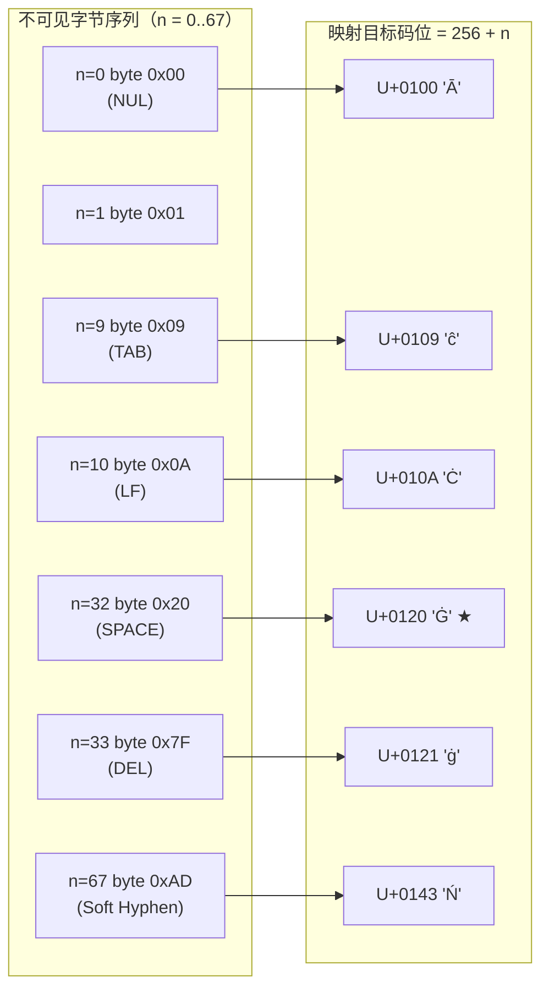

GPT-2 的分词器在将文本送入 BPE 合并之前，需要先把 UTF-8 字节流转换成一串「可视、可打印、无歧义」的 Unicode 字符。`bytes_to_unicode()` 就是完成这一步的核心函数——它把 0–255 共 256 个字节值逐一映射为不重复的 Unicode 字符，其中最著名的现象就是空格（字节 `0x20`）变成了 `Ġ`。本页将拆解该映射的设计动机、数学原理与代码实现，帮助你理解 GPT-2 词表中那些 `Ġ` 前缀从何而来，以及为什么这种设计保证了「任何字节都能被无损编码」。

Sources: [tokenizer.py](tokenizer.py#L1-L15)

## 设计动机：为什么需要字节到 Unicode 的间接映射

字节级 BPE 的基底词表是 256 个字节值（0x00–0xFF）。但 BPE 算法在实现上操作的是**字符串符号**，而不是原始字节。如果直接将字节当作字符处理，会遇到三个严重问题：

| 问题 | 举例 | 后果 |
|------|------|------|
| 控制字符不可见 | 字节 0x00（NUL）、0x01–0x1F（控制符）在文本中不可打印 | 无法用字符串直观表示，调试困难 |
| 空白符歧义 | 空格 `0x20`、制表符 `0x09`、换行 `0x0A` 在字符串中表现为空白 | BPE 合并后的 token 串无法区分「单词间空格」与「token 分隔符」 |
| 非拉丁字节混乱 | 字节 0xC0–0xFF 在 Latin-1 中对应各种重音字母 | 与可见 ASCII 混在同一编码空间，容易混淆 |

`bytes_to_unicode()` 的解决方案很优雅：**凡是人类眼睛已经能正常看到的字节，保持原样；凡是看不见或容易混淆的字节（含空格），映射到 U+0100 起始的 Latin Extended-A 区域**，保证整个映射结果都是「可见且唯一」的 Unicode 字符。

Sources: [tokenizer.py](tokenizer.py#L36-L53)

## 三段可见区间：188 个字节的"免映射"特权

函数首先识别出三类"天然可见"的字符范围，它们直接映射为自身：

```python
bs = (list(range(ord("!"), ord("~") + 1))     # 33–126: ASCII 可打印
      + list(range(ord("¡"), ord("¬") + 1))    # 161–172: Latin-1 补充（上段）
      + list(range(ord("®"), ord("ÿ") + 1)))   # 174–255: Latin-1 补充（下段）
```

Sources: [tokenizer.py](tokenizer.py#L43-L45)

具体来看：

| 区间 | 字节范围 | 字符数 | 示例 | 说明 |
|------|----------|--------|------|------|
| ASCII 可打印 | 33 (`!`) – 126 (`~`) | 94 | `A` `a` `5` `@` | 标准英文字母、数字、标点 |
| Latin-1 上段 | 161 (`¡`) – 172 (`¬`) | 12 | `¡` `¢` `£` `¬` | 倒感叹号、货币符号等 |
| Latin-1 下段 | 174 (`®`) – 255 (`ÿ`) | 82 | `®` `°` `é` `ÿ` | 注册商标、度数符、重音字母等 |
| **合计** | — | **188** | — | 这 188 个字节直接映射为自身 |

注意两个关键排除：字节 127（DEL）和字节 173（软连字符 `­`）虽然落在 Unicode 范围内，但它们在大多数终端中不可见或宽度为零，因此被归入"需要重映射"的类别。这使得可见集合恰好是 188 个，而非 190 个。

Sources: [tokenizer.py](tokenizer.py#L43-L45)

## 68 个不可见字节的重映射：256 + n 公式

对于剩下的 68 个字节（256 − 188 = 68），函数将它们追加到列表尾部，并按顺序赋予 `U+0100` 起始的 Unicode 码位：

```python
cs = bs[:]        # 先复制可见字节的原始码位
n = 0
for b in range(2 ** 8):       # 遍历 0–255
    if b not in bs:           # 如果该字节不在可见集合中
        bs.append(b)          # 追加字节值
        cs.append(2 ** 8 + n) # 映射到 U+0100 + n
        n += 1
return dict(zip(bs, [chr(c) for c in cs]))
```

Sources: [tokenizer.py](tokenizer.py#L46-L53)

映射公式为 **`目标码位 = 256 + n`**，其中 `n` 是该字节在"不可见字节序列"中的索引（从 0 开始）。不可见字节按 `0, 1, 2, …, 255` 的自然顺序排列，因此：



### 空格的数学推导

空格是字节 `0x20 = 32`。在 0–255 的遍历中，它前面恰好有 **32** 个不可见字节（字节 0 到 31），因此 `n = 32`。代入公式：

$$\text{目标码位} = 256 + 32 = 288 = \texttt{0x0120}$$

而 `chr(0x0120)` 正是 Unicode 字符 **`Ġ`**（拉丁扩展 A 中的「带圆点 G」，U+0120）。这就是空格变成 `Ġ` 的完整推导过程——不是任意选择，而是字节值 32 与 `256 + n` 公式共同决定的必然结果。

### 关键不可见字节的映射对照表

| 字节值 | ASCII 名称 | n | 目标码位 | 映射字符 | 含义 |
|--------|-----------|---|----------|---------|------|
| 0x00 | NUL | 0 | U+0100 | `Ā` | 字符串终止符 |
| 0x09 | HT | 9 | U+0109 | `ĉ` | 水平制表符 |
| 0x0A | LF | 10 | U+010A | `Ċ` | 换行符 |
| 0x0D | CR | 13 | U+010D | `č` | 回车符 |
| **0x20** | **SP** | **32** | **U+0120** | **`Ġ`** | **空格** |
| 0x7F | DEL | 33 | U+0121 | `ġ` | 删除符 |
| 0xAD | SHY | 67 | U+0143 | `Ń` | 软连字符 |

Sources: [tokenizer.py](tokenizer.py#L46-L53)

## 可逆性保证：双向映射的工程实现

`bytes_to_unicode()` 返回的是一个 `Dict[int, str]`（字节值 → Unicode 字符）。由于该映射是**双射**（每个字节值对应唯一字符，且无重叠），可以安全地构建逆映射：

```python
_BYTE_ENCODER = bytes_to_unicode()                           # int 字节 -> unicode 字符
_BYTE_DECODER = {v: k for k, v in _BYTE_ENCODER.items()}     # unicode 字符 -> int 字节
```

Sources: [tokenizer.py](tokenizer.pyL61-L62)

这两个字典在模块加载时一次性构建（`bytes_to_unicode` 被 `@lru_cache` 装饰，确保只计算一次），随后在整个分词器生命周期中被复用：

- **编码方向**（`encode` / `train`）：文本 → UTF-8 字节 → 用 `_BYTE_ENCODER` 逐字节映射为 Unicode 字符串 → 在该字符串上做 BPE
- **解码方向**（`decode`）：token 字符串 → 用 `_BYTE_DECODER` 还原回字节值 → 按 UTF-8 解码为文本

这种设计确保了编解码的**完全无损性**：任何文本（包括含空格、控制字符、emoji、二进制噪声的文本）经过 `encode → decode` 往返后都能精确还原。

Sources: [tokenizer.py](tokenizer.py#L61-L62), [tokenizer.py](tokenizer.py#L146-L165)

## 在分词管线中的位置


`bytes_to_unicode` 映射是正则预切分之后、BPE 合并之前的**唯一字符转换步骤**。它发生在 `encode` 方法的第 150 行和 `train` 方法的第 101 行，两处使用完全相同的逻辑：

```python
byte_str = "".join(self.byte_encoder[b] for b in chunk.encode("utf-8"))
```

其中 `chunk.encode("utf-8")` 将文本片段变为字节序列，`self.byte_encoder[b]` 逐字节查表。正是这一步，使得 `" world"` 中的空格变成了 `Ġ`，最终在 GPT-2 的词表中表现为带 `Ġ` 前缀的 token（如 `Ġworld`、`Ġthe` 等）。

Sources: [tokenizer.py](tokenizer.py#L97-L102), [tokenizer.py](tokenizer.py#L146-L153)

## 设计哲学总结

| 设计决策 | 目的 | 效果 |
|---------|------|------|
| 可见字节保持原样 | 兼容人类直觉 | ASCII 字母在词表中直接可见（如 `the` 就是 `the`） |
| 不可见字节偏移到 U+0100+ | 避免与控制符/空白混淆 | 空格 `Ġ` 不会与 token 分隔符混淆 |
| 选择 256 作为偏移量 | 恰好跳过整个 Latin-1 范围 | 映射后的字符落在 Latin Extended-A，无冲突 |
| 双射且 `lru_cache` 缓存 | 保证可逆性与性能 | 编解码无损，计算只执行一次 |

`bytes_to_unicode` 的精妙之处在于：用一个简单的数值偏移（256），在不依赖任何外部词表的前提下，解决了字节级 BPE 的可表示性问题。这使得 GPT-2 可以处理**任何字节序列**——从英文、中文到 emoji 再到二进制数据——而永远不会产生 `<unk>` 或 OOV（Out-of-Vocabulary）token。

Sources: [tokenizer.py](tokenizer.py#L36-L53)

## 延伸阅读

理解了 `bytes_to_unicode` 之后，你可以继续探索它在完整分词管线中的上下游：

- [BPE 训练流程：正则预切分、频率合并与词表构建](12-bpe-xun-lian-liu-cheng-zheng-ze-yu-qie-fen-pin-lu-he-bing-yu-ci-biao-gou-jian) — 查看正则预切分如何将文本切分为片段，再送入字节映射
- [编码与解码：从文本到 Token ID 的无损往返](13-bian-ma-yu-jie-ma-cong-wen-ben-dao-token-id-de-wu-sun-wang-fan) — 了解 `byte_encoder` / `byte_decoder` 在完整编解码流程中的协同工作