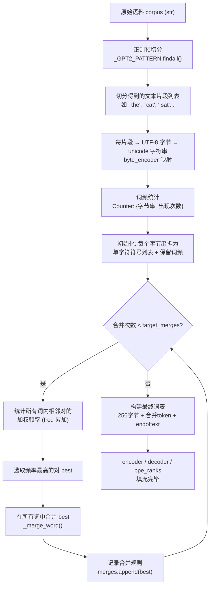
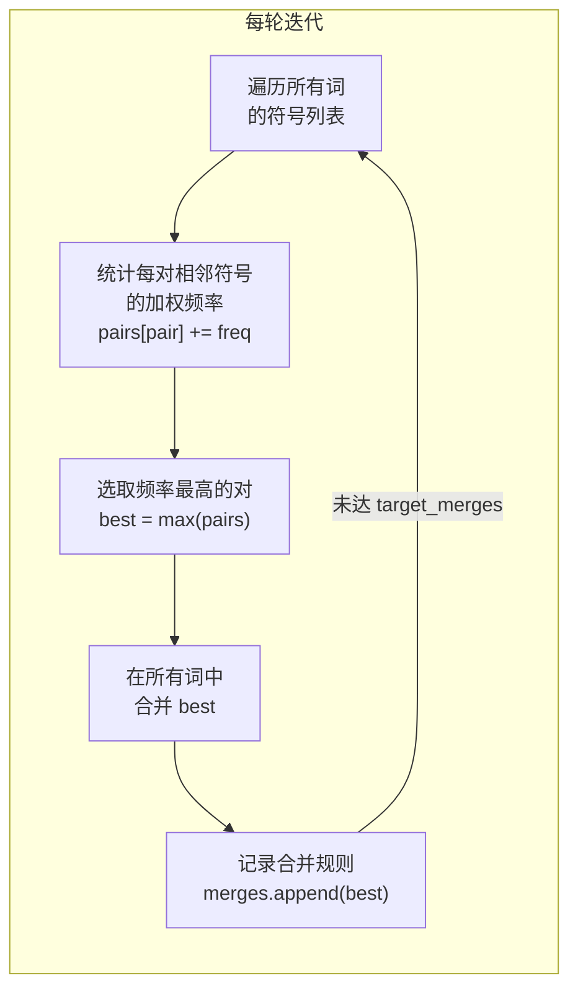
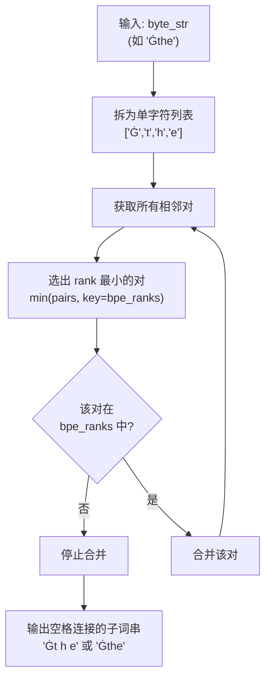

字节级 BPE（Byte Pair Encoding）是 GPT-2 分词器的核心算法。本页聚焦于 `ByteBPETokenizer.train()` 方法，完整解析从原始语料到可检索词表的全流程——正则预切分如何将连续文本切为有意义的片段、字节到 Unicode 字符的映射如何消除 OOV、频率驱动的贪心合并如何逐步构建子词表，以及最终词表的组成与索引方式。

## 整体训练管线鸟瞰

BPE 训练是一个确定性管线：输入是一段纯文本语料，输出是一个有序合并规则列表和一个 token→ID 映射表。整个过程不涉及任何随机性，相同输入始终产出相同词表。



从管线视角看，训练分为两大阶段：**预处理阶段**（步骤 A–F）完成语料的切分、字节映射与频率统计；**合并阶段**（步骤 G–K）反复执行"统计→选最优→合并"循环直到达到目标词表大小。最后一步（步骤 L–M）将合并结果固化为可持久化的查表结构。

Sources: [tokenizer.py](tokenizer.py#L90-L127)

## 正则预切分：GPT-2 标准 Pattern

BPE 不直接在整个语料上做字节对合并，而是先用正则表达式将文本切分为更小的片段（chunk），在每个片段内部独立训练。这一步被称为**预切分（pre-tokenization）**，其目的是防止跨词汇边界的无效合并——例如不让 "cat" 的词尾 "t" 与下一个词 "sat" 的词首 "s" 合并成一个无意义的 "ts"。

本实现使用 GPT-2 的标准正则模式，该模式按以下优先级逐个分支匹配：

| 正则分支 | 匹配目标 | 示例输入 | 示例输出 |
|---|---|---|---|
| `'s\|'t\|'re\|'ve\|'m\|'ll\|'d` | 英文缩写（撇号附着） | `"it's"` | `["it", "'s"]` |
| ` ?\p{L}+` | 可选前导空格 + 连续字母 | `" hello"` | `[" hello"]` |
| ` ?\p{N}+` | 可选前导空格 + 连续数字 | `" 123"` | `[" 123"]` |
| ` ?[^\s\p{L}\p{N}]+` | 可选前导空格 + 连续标点/符号 | `" !!"` | `[" !!"]` |
| `\s+(?!\S)` | 行尾空白（非贪婪，不吞最后一个非空白符） | `"a  \n"` | `["  \n"]` |
| `\s+` | 其余空白 | `" "` | `[" "]` |

**前导空格附着**是该模式的关键设计：空格不作为独立 token 而是依附到紧随其后的词上。这使得 "cat" 和 " cat"（句中位置）成为两个不同的序列起点，让模型能区分词首和词中——这对语言建模至关重要。注意 `\p{L}` 和 `\p{N}` 是 Unicode 属性类别，精确覆盖全语种字母和数字。实现优先加载第三方 `regex` 模块以获得精确的 Unicode 支持；若未安装则退化为 Python 标准库 `re` 的近似写法 `[^\W\d_]`（近似字母）和 `\d`（近似数字），足以覆盖教学和一般英文场景。

Sources: [tokenizer.py](tokenizer.py#L20-L33)

## 字节映射与词频统计

预切分完成后，每个文本片段经过两步转换变为 BPE 的训练单元：先用 UTF-8 编码为字节序列，再用 `bytes_to_unicode()` 映射为可见 Unicode 字符串。对于字节映射的完整原理（空格为何变成 `Ġ`），参见 [bytes_to_unicode 映射：空格为何变成 Ġ](11-bytes_to_unicode-ying-she-kong-ge-wei-he-bian-cheng-g)。

映射后，相同的内容片段被归并并统计出现次数。例如，语料中 20 次出现 `" the"` 片段，UTF-8 编码后为字节 `[0x20, 0x74, 0x68, 0x65]`，经 `byte_encoder` 映射后变为字符串 `"Ġthe"`，在 `word_freqs` Counter 中记录为 `{"Ġthe": 20}`。这个频率将在后续合并阶段作为权重——频率越高的片段，其内部字节对被合并的优先级越高。

```python
# tokenizer.py#L99-L102 — 核心转换与统计
for chunk in chunks:
    byte_str = "".join(self.byte_encoder[b] for b in chunk.encode("utf-8"))
    word_freqs[byte_str] += 1
```

此处 `word_freqs` 的 key 是字节映射后的 unicode 字符串（如 `"Ġthe"`），value 是该字符串在整个语料中的出现次数。这个 Counter 是 BPE 合并阶段的唯一数据源。

Sources: [tokenizer.py](tokenizer.py#L96-L105), [main.py](main.py#L120-L131)

## 频率驱动的贪心合并循环

合并循环是 BPE 算法的核心。初始化时，`word_freqs` 中的每个词被拆解为单字符符号列表（例如 `"Ġthe"` → `['Ġ', 't', 'h', 'e']`），同时保留其词频。然后进入反复迭代：



**加权频率**的精确含义是：某个符号对 `(a, b)` 的频率 = Σ（包含该对的词的词频）。如果 `"Ġt"` 出现在 `"Ġthe"`（频率 20）和 `"Ġtime"`（频率 5）中，那么符号对 `('Ġ', 't')` 的加权频率为 25。这一机制确保高频词中的符号对更优先被合并，从而使有限词表大小能覆盖最高频的语言模式。

每轮选取频率最高的对 `best` 后，调用 `_merge_word()` 在所有词的符号列表中执行合并。该方法遍历 vocab 中的每个词，将所有相邻匹配对替换为拼接后的单个符号。以合并 `('Ġ', 't')` 为例：

| 词（映射后） | 合并前符号列表 | 合并后符号列表 | 词频 |
|---|---|---|---|
| `Ġthe` | `['Ġ','t','h','e']` | `['Ġt','h','e']` | 20 |
| `Ġtime` | `['Ġ','t','i','m','e']` | `['Ġt','i','m','e']` | 5 |
| `Ġtop` | `['Ġ','t','o','p']` | `['Ġt','o','p']` | 3 |

循环终止条件是合并次数达到 `target_merges = vocab_size - 256 - 1`（留出 256 字节基底和 1 个特殊 token），或者所有可能的符号对都已被耗尽（`pairs` 为空）。

Sources: [tokenizer.py](tokenizer.py#L104-L119), [tokenizer.py](tokenizer.py#L168-L183)

## 词表构建与索引分配

合并循环结束后，所有合并规则按执行顺序排列在 `merges` 列表中。最终词表按三层结构构建：

| 词表层级 | 来源 | 数量 | ID 范围 |
|---|---|---|---|
| **字节基底** | `bytes_to_unicode()` 的 256 个值 | 256 | 0 – 255 |
| **合并 Token** | `merges` 中每对 `(a, b)` 拼接为 `a + b` | `n_merges` | 256 – 256+n_merges-1 |
| **特殊 Token** | `<\|endoftext\|>` | 1 | 末位 |

三层按顺序拼接后构建 `encoder`（token 字符串 → ID）和 `decoder`（ID → token 字符串）双向查表。同时，`bpe_ranks` 记录每个合并对的优先级索引——**rank 越小表示该合并越早执行、优先级越高**。这在编码阶段用于贪心选择：当同一个词的符号序列中存在多个可合并对时，总是优先执行 rank 最小的合并。

```python
# tokenizer.py#L121-L127 — 词表固化
tokens = list(base_symbols) + [a + b for a, b in merges]
tokens.append(ENDOFTEXT)
self.encoder = {t: i for i, t in enumerate(tokens)}
self.decoder = {i: t for t, i in self.encoder.items()}
self.bpe_ranks = {pair: i for i, pair in enumerate(merges)}
```

以本项目默认的 `BPE_VOCAB=500` 为例，词表构成为 256 字节基底 + 243 个合并 token + 1 个 `<|endoftext|>` = 500。GPT-2 论文的完整配置则是 256 + 50000 + 1 = 50257。`main.py` 在训练后立即输出这一构成：

```
词表大小 = 500 (256 字节基底 + 243 合并 + <|endoftext|>)
```

Sources: [tokenizer.py](tokenizer.py#L119-L127), [main.py](main.py#L126-L127)

## 合并优先级与编码时的应用

训练产出的 `bpe_ranks` 在编码阶段（`_bpe()` 方法）用于将任意文本片段转换为子词序列。编码时的合并逻辑与训练时不同：训练阶段是全局频率驱动（选最高频对），编码阶段是**优先级驱动贪心**（在当前符号序列的所有可合并对中，选择 rank 最小的那个合并）。



这种贪心策略保证了编码与训练的一致性：如果训练时 `('Ġ','t')` 先于 `('t','h')` 被合并，那么编码时遇到同时存在这两个候选对的序列，也会先执行 `('Ġ','t')` 的合并。最终结果通过 `encoder` 查表映射为 Token ID。关于完整的编码-解码往返流程，参见 [编码与解码：从文本到 Token ID 的无损往返](13-bian-ma-yu-jie-ma-cong-wen-ben-dao-token-id-de-wu-sun-wang-fan)。

Sources: [tokenizer.py](tokenizer.py#L130-L143), [tokenizer.py](tokenizer.py#L56-L58)

## 关键设计决策总结

| 设计决策 | 原因 | 代码体现 |
|---|---|---|
| 预切分而非全文训练 | 防止跨词汇边界的无效合并 | `_GPT2_PATTERN.findall()` |
| 字节级而非字符级 | 任何 Unicode 字符都可还原为 256 字节，彻底消除 OOV | `chunk.encode("utf-8")` + `byte_encoder` |
| 加权频率统计 | 让高频词中的模式更优先合并，提升词表覆盖率 | `pairs[p] += freq` |
| 贪心选最高频对 | 贪心策略是 BPE 的标准做法，简单高效且效果良好 | `max(pairs, key=pairs.get)` |
| 合并优先级持久化为 rank | 编码时复用训练时学到的合并顺序 | `bpe_ranks = {pair: i ...}` |
| 词频缓存（`_cache`） | 同一词的 BPE 结果可复用，避免重复计算 | `self._cache[token] = out` |