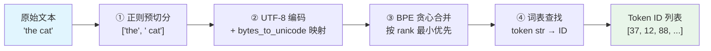
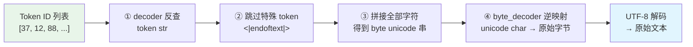
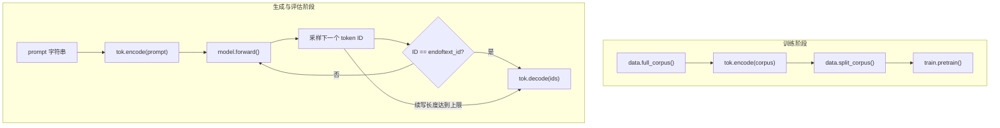

GPT-2 的分词器必须完成两个互补方向的任务：**编码**（encode）将任意文本字符串转换为模型能消费的整数 Token ID 序列，**解码**（decode）将 Token ID 序列无损还原为原始文本。这两个方向共同构成了字节级 BPE 的完整生命周期闭环。本文档深入解析 `ByteBPETokenizer` 中 `encode`、`decode` 及核心 `_bpe` 方法的数据流，揭示每一步转换背后的设计逻辑。

---

## 编码流水线全景：文本到 ID 的四级变换

编码过程并非一步到位，而是一条串联的四阶段管线。每个阶段都有明确职责，前一个阶段的输出恰好是后一个阶段的输入。

### 第一阶段：正则预切分

整个编码流程的入口是 `encode` 方法，它首先用 GPT-2 标准正则表达式将文本切分为词/数字/标点/空白等片段。正则的设计原则是：**空格附着到后词**（` ?\p{L}+` 中的可选空格前缀），这确保了 "the cat" 被切分为 `["the", " cat"]` 而非 `["the", " ", "cat"]`。这种设计避免了独立空白 token 的出现，使得同一个词在不同语境下（句首 vs. 句中）共享相同的字节表示，只在是否存在前导空格字节上有所区别。

对于每个切分出的 chunk，编码方法立即执行字节级转换：先将 chunk 用 UTF-8 编码为原始字节序列，再通过 `byte_encoder`（即 `bytes_to_unicode()` 的产物）逐字节映射为可见 Unicode 字符串。例如 `' cat'`（含前导空格）的 UTF-8 字节为 `[0x20, 0x63, 0x61, 0x74]`，经过映射后变为 `"Ġcat"`（0x20 → 'Ġ'）。这层映射是字节级 BPE 与传统字符级 BPE 的本质区别——**在字节层面操作意味着词表基底恰好是 256，覆盖所有可能的输入而永无 OOV**。

Sources: [tokenizer.py](tokenizer.py#L146-L153), [tokenizer.py](tokenizer.py#L61-L63)

### 第二阶段与第三阶段：BPE 合并引擎 `_bpe`

预切分和字节映射完成后，每个 chunk 的字节字符串进入 BPE 合并阶段。`_bpe` 方法是编码管线中最精密的组件——它接收一个字节 Unicode 字符串（如 `"Ġcat"`），返回一个以空格分隔的子词 token 串（如 `"Ġc at"` 或 `"Ġcat"`，取决于训练时学到的合并规则）。

合并算法采用**贪心策略**：反复扫描当前符号序列中的所有相邻对，选择 `bpe_ranks` 中优先级最高（rank 值最小）的那一对进行合并，直到没有任何可合并的相邻对为止。`bpe_ranks` 是一个字典，将训练阶段学到的每条合并规则映射到一个递增的整数索引——索引越小意味着该合并越早被学习（即在语料中出现频率越高），因此在编码时应优先应用。

关键的性能优化在于 `lru_cache` 和手动缓存 `self._cache` 的双重机制。`_bpe` 方法首先检查 `_cache` 字典中是否已有该 token 的合并结果，命中则直接返回。这在实际使用中至关重要，因为自然语言中高频词（如 "the"、"and"）会反复出现，缓存避免了重复的贪心合并计算。缓存键是原始字节字符串，值是空格分隔的子词串。

Sources: [tokenizer.py](tokenizer.py#L130-L143)

### 第四阶段：词表查找

`_bpe` 返回的空格分隔子词串被 `split(" ")` 拆分为单个 token 字符串，每个 token 字符串通过 `self.encoder` 字典查到对应的整数 ID。`encoder` 是 `{"token_str": id}` 映射，在训练完成后构建为 256 个字节基字符 + 学到的合并 token + `<|endoftext|>` 的连续编号。所有 chunk 的 ID 按顺序拼接，构成最终的 `List[int]` 输出。

Sources: [tokenizer.py](tokenizer.py#L146-L153)

---

## 解码流水线：从 ID 到文本的逆向重建

解码是编码的严格逆过程，但实现路径上有一个重要的结构性区别：**编码时按 chunk 独立处理再拼接 ID，解码时则一次性处理全部 ID**——因为解码不需要关心原始的 chunk 边界，只需把所有 token 的字节表示拼回完整文本。

`decode` 方法的实现分四步推进。首先遍历每个 ID，通过 `self.decoder` 字典（`encoder` 的逆映射）取出 token 字符串。其次，遇到特殊 token `<|endoftext|>` 直接跳过——特殊 token 是文档边界标记而非文本内容，不应出现在还原结果中。第三步将所有 token 字符串直接拼接为一个连续字符串。最后，逐字符通过 `byte_decoder`（`bytes_to_unicode()` 的逆映射）还原为原始字节值，组装为 `bytes` 对象后用 UTF-8 解码为 Python 字符串，`errors="replace"` 确保任何无效字节序列也不会导致崩溃。

Sources: [tokenizer.py](tokenizer.py#L155-L165)

### 为什么解码是无损的

解码的无损性建立在三个数学保证之上。第一，`bytes_to_unicode()` 是一个**双射函数**（256 个字节唯一映射到 256 个不同的 Unicode 字符），其逆映射 `byte_decoder` 精确还原每个字节。第二，BPE 合并操作本质上是字符串拼接（`pair[0] + pair[1]`），而 `split(" ")` 和 `join("")` 是严格互逆的字符串操作——只要合并后的 token 不包含空格字符本身（这在字节映射中已通过将空格 0x20 映射为 'Ġ' 来保证）。第三，UTF-8 编解码对完整字节序列是无损的。这三层保证叠加，使得 `decode(encode(text)) == text` 对任意文本成立。

唯一的不完美之处在于 `errors="replace"` 策略：如果 Token ID 序列被截断在多字节 UTF-8 字符的中间，解码时会产生替换字符 `�`。这在实际使用中极少发生，因为 BPE 训练阶段保证了常见多字节字符会被完整合并为单个 token。

Sources: [tokenizer.py](tokenizer.py#L36-L53), [tokenizer.py](tokenizer.py#L61-L63)

---

## 编码与解码的方法签名与参数对照

| 方法 | 输入 | 输出 | 核心依赖 | 复杂度特征 |
|------|------|------|----------|-----------|
| `encode(text)` | 任意 Python 字符串 | `List[int]` Token ID | `_GPT2_PATTERN`、`byte_encoder`、`_bpe`、`encoder` | 按 chunk 数线性，单 chunk 内 BPE 合并为 O(n²·m)，n=符号数，m=合并轮数 |
| `decode(ids)` | `List[int]` Token ID | Python 字符串 | `decoder`、`byte_decoder` | O(N) 线性于 ID 数量，无迭代 |
| `_bpe(token)` | 字节 Unicode 字符串 | 空格分隔子词串 | `bpe_ranks`、`_cache` | 首次 O(n²·m)，后续 O(1) 缓存命中 |

Sources: [tokenizer.py](tokenizer.py#L146-L165), [tokenizer.py](tokenizer.py#L130-L143)

---

## 编码与解码在实际管线中的调用

在项目的实际运行流程中，`encode` 和 `decode` 分别承担语料数字化和生成文本还原的职责，二者出现在完全不同的阶段：

在训练阶段，`main.py` 调用 `tok.encode(corpus)` 将整个 WebText 风格语料一次性转换为扁平的 Token ID 列表，再交给 `data.split_corpus()` 切分为训练集和验证集。这个一次性编码意味着编码的缓存命中率极高——高频词在整个语料中只做一次完整的 BPE 合并计算。

在生成阶段（`generate` 函数），编码和解码形成了一对闭环：`tok.encode(prompt)` 将用户输入的提示词转为 ID 序列作为模型输入的起始点，模型逐 token 采样生成新 ID 追加到序列末尾，最终 `tok.decode(ids)` 将完整的 ID 序列一次性还原为可读文本。特殊 token `<|endoftext|>` 的检测发生在采样之后、解码之前——如果模型生成了 `endoftext_id`，生成循环立即终止，解码时会自动跳过该 token。

Sources: [main.py](main.py#L32-L50), [main.py](main.py#L126-L133)

---

## 编码过程中的边界情况与设计决策

### `get_pairs` 的角色

在 `_bpe` 方法的每一轮迭代中，`get_pairs` 函数负责提取当前符号序列中的所有相邻对。这是一个纯函数，不依赖任何状态——给定相同的符号列表，总是返回相同的对集合。在编码（`_bpe`）和解码后的重新编码场景中，它都是确定性的。在编码时，`get_pairs` 提取的对通过 `bpe_ranks.get(p, float("inf"))` 查找优先级：不在合并表中的对获得无穷大 rank，保证它们永远不会被选中，从而自然终止合并循环。

Sources: [tokenizer.py](tokenizer.py#L56-L58), [tokenizer.py](tokenizer.py#L135-L139)

### `_merge_symbols` 的合并语义

`_merge_symbols` 是一个静态方法，负责在单次贪心选择后执行实际的符号列表合并。它的关键语义是：**一次性合并符号列表中所有出现的指定 pair**，而非只合并第一个出现的位置。这意味着如果某个字节串中出现了重复的相邻模式（如 `"aaa"` 中有两个 `"aa"` 对），合并会从左到右扫描，连续跳过已合并的符号。这种设计保证了 BPE 合并的确定性和一致性——相同的输入符号序列 + 相同的合并规则总是产生相同的输出。

Sources: [tokenizer.py](tokenizer.py#L185-L196)

### 空格处理的微妙之处

空格的编码路径值得特别关注。在正则预切分阶段，空格通过 ` ?` 前缀附着到后词，因此 `' cat'` 作为一个整体 chunk 进入字节映射。空格的字节值 0x20 被 `bytes_to_unicode` 映射为 'Ġ'（U+0120），这只是一个视觉上的替换标识，并不改变数据内容。在解码阶段，'Ġ' 通过 `byte_decoder` 精确还原回字节 0x20，再经 UTF-8 解码为空格字符。整个往返过程中空格不丢失、不变形，这正是 "the cat" 能无损往返的根本原因。

Sources: [tokenizer.py](tokenizer.py#L36-L53), [tokenizer.py](tokenizer.py#L61-L63)

---

## 完整往返示例追踪

以 `"the cat"` 为例，完整追踪编码到解码的每一步变换：

| 阶段 | 操作 | 输入 | 输出 |
|------|------|------|------|
| 编码-① | 正则预切分 | `"the cat"` | `["the", " cat"]` |
| 编码-② | UTF-8 + 字节映射 | `"the"` | `"the"`（可打印 ASCII 不变） |
| 编码-② | UTF-8 + 字节映射 | `" cat"` | `"Ġcat"`（0x20 → Ġ） |
| 编码-③ | BPE 合并 | `"the"` | `"th e"` 或 `"the"`（取决于训练学到的规则） |
| 编码-③ | BPE 合并 | `"Ġcat"` | `"Ġc at"` 或 `"Ġcat"`（取决于训练学到的规则） |
| 编码-④ | 词表查找 | 合并后 token | `List[int]` |
| 解码-① | decoder 反查 | `List[int]` | token 字符串列表 |
| 解码-②③ | 跳过特殊 + 拼接 | token 字符串列表 | `"th eĠcat"`（拼接后） |
| 解码-④ | byte_decoder + UTF-8 | `"th eĠcat"` → 字节 `[0x74,0x68,0x65,0x20,0x63,0x61,0x74]` | `"the cat"` ✓ |

关键洞察在于解码阶段：BPE 合并产生空格分隔的子词串（如 `"th e"`），`split(" ")` 和后续的 `join("")` 完美地执行了逆操作。空格分隔符本身不会出现在任何合并后的 token 内部，因为 GPT-2 的字节映射已将真正的空格（0x20）转换为 'Ġ'，消除了歧义。

Sources: [tokenizer.py](tokenizer.py#L146-L165), [main.py](main.py#L129-L130)

---

## 相关阅读

- **字节映射的详细原理**：空格为何变成 'Ġ' 的底层逻辑，请参阅 [bytes_to_unicode 映射：空格为何变成 Ġ](11-bytes_to_unicode-ying-she-kong-ge-wei-he-bian-cheng-g)
- **合并规则如何产生**：`bpe_ranks` 的来源——正则预切分、频率统计与贪心合并的完整训练流程，请参阅 [BPE 训练流程：正则预切分、频率合并与词表构建](12-bpe-xun-lian-liu-cheng-zheng-ze-yu-qie-fen-pin-lu-he-bing-yu-ci-biao-gou-jian)
- **编码结果如何输入模型**：Token ID 如何被组织为语言模型训练批次，请参阅 [语言模型批数据采样与训练/验证集切分](22-yu-yan-mo-xing-pi-shu-ju-cai-yang-yu-xun-lian-yan-zheng-ji-qie-fen)
- **解码在生成中的应用**：`decode` 如何将模型采样的 ID 序列还原为续写文本，请参阅 [Top-k 采样生成：温度缩放与概率截断策略](19-top-k-cai-yang-sheng-cheng-wen-du-suo-fang-yu-gai-lu-jie-duan-ce-lue)