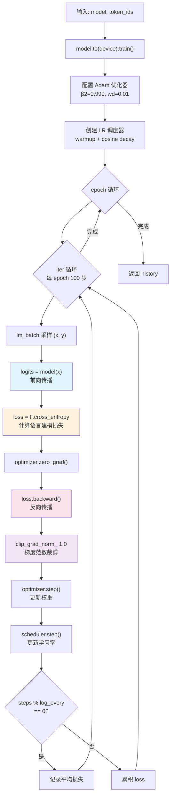

GPT-2 的核心训练哲学可以用一句话概括：**不区分任务，只做语言建模**。模型通过最大化「给定前文、预测下一个 token」的对数似然来学习一切——翻译、问答、摘要等能力全部从纯语言建模中自然涌现。本页深入解析这一预训练循环的三大支柱：**自回归目标函数**、**扁平 token 流上的批次采样**，以及**前向—反向—更新的完整循环结构**。关于 Adam 优化器配置细节（权重衰减分组、β2 选择），请参阅 [Adam 优化器配置：权重衰减分组与 β2=0.999 的选择](15-adam-you-hua-qi-quan-zhong-shuai-jian-fen-zu-yu-b2-0-999-de-xuan-ze)；关于学习率调度策略，请参阅 [学习率调度：线性 Warmup 与余弦衰减策略](16-xue-xi-lu-diao-du-xian-xing-warmup-yu-yu-xian-shuai-jian-ce-lue)；困惑度评估指标则在 [困惑度（Perplexity）：GPT-2 的核心评估指标计算方法](17-kun-huo-du-perplexity-gpt-2-de-he-xin-ping-gu-zhi-biao-ji-suan-fang-fa) 中专门展开。

---

## 自回归语言模型目标函数

GPT-2 的训练目标与 GPT-1 的预训练目标 L1 完全一致——即**标准的自回归条件对数似然最大化**。给定一个 token 序列 $U = (u_1, u_2, \ldots, u_n)$，模型优化以下负对数似然损失：

$$L = -\sum_{i=1}^{n} \log P(u_i \mid u_{i-k}, \ldots, u_{i-1})$$

其中 $k$ 为上下文窗口长度（即 `n_ctx`，GPT-2 为 1024）。这一目标函数的直觉是：**对于序列中的每一个位置，模型需要基于此前所有可见 token 的上下文，正确预测当前位置的 token**。因果掩码（causal mask）确保了信息的严格单向流动——位置 $i$ 只能看到 $j \leq i$ 的 token，这正是「自回归」的本质。值得注意的是，GPT-2 **没有** GPT-1 的任务专项微调目标 L2，也不使用任何对比学习或多任务加权损失——一切能力都隐含在这一简单的下一词预测目标中。

Sources: [train.py](train.py#L1-L12)

### 代码实现：交叉熵损失的形状变换

在实际代码中，上述目标函数通过 `F.cross_entropy` 实现。关键操作是将模型输出的三维 logits 张量 `(B, T, V)` 重塑为二维 `(B×T, V)`，同时将目标标签 `y` 从 `(B, T)` 展平为 `(B×T,)`，从而在**所有 batch × 所有时间步的所有 token 位置上**计算平均交叉熵：

```python
logits = model(x)                                    # (B, T, V)
loss = F.cross_entropy(
    logits.reshape(-1, logits.size(-1)),              # (B*T, V)
    y.reshape(-1)                                     # (B*T,)
)
```

`F.cross_entropy` 内部等价于先做 `log_softmax` 再取 `nll_loss`（负对数似然），默认 `reduction='mean'` 对所有 $B \times T$ 个位置取平均。这里 `y` 是 `x` 右移一位后的序列（即 $x$ 的每个位置预测下一个 token），这种偏移在批次采样阶段完成。

Sources: [train.py](train.py#L78-L79)

---

## 扁平 token 流上的批次采样

与需要预打包固定序列的数据加载器不同，GPT-2 训练采用了一种简洁高效的采样策略：**将整个语料编码为一条扁平的 token id 流，然后从中随机截取等长子序列**。`lm_batch` 函数完成了这一过程。

```mermaid
flowchart LR
    subgraph 扁平 Token 流
        direction LR
        t0["t₀"] --- t1["t₁"] --- t2["t₂"] --- t3["..."] --- t4["tₙ"]
    end
    subgraph 随机起点采样
        i1["i₁"] --- i2["i₂"] --- i3["i₃"]
    end
    subgraph 样本 1
        x1["x: t[i₁]...t[i₁+T]"]
        y1["y: t[i₁+1]...t[i₁+T+1]"]
    end
    subgraph 样本 2
        x2["x: t[i₂]...t[i₂+T]"]
        y2["y: t[i₂+1]...t[i₂+T+1]"]
    end
    扁平 Token 流 --> 随机起点采样
    随机起点采样 --> 样本 1
    随机起点采样 --> 样本 2
```

`lm_batch` 的核心逻辑如下：它从 `[0, n - block_size - 1)` 范围内随机抽取 `batch_size` 个起始索引，对每个索引 `i`，截取 `x = token_ids[i : i+T]` 作为输入，`y = token_ids[i+1 : i+1+T]` 作为标签——**注意 `y` 相对 `x` 恰好右移一位**，这正是自回归语言模型需要的「预测下一个 token」对齐方式。

Sources: [data.py](data.py#L70-L80)

### 采样策略的设计要点

| 设计选择 | 具体实现 | 设计意图 |
|---------|---------|---------|
| **起点随机性** | `torch.randint(0, n-block_size-1, (batch_size,))` | 每个 minibatch 覆盖语料的不同位置，增加梯度多样性 |
| **有重叠截取** | 不同样本的区间可以重叠 | 充分利用有限语料，避免数据浪费 |
| **标签偏移** | `y[i] = token_ids[i+1 : i+1+T]` | 天然实现「位置 $i$ 预测位置 $i+1$」的自回归对齐 |
| **确定性可控** | 传入外部 `generator` (seed=0) | 保证实验完全可复现 |
| **边界保护** | 上界 `n - block_size - 1` | 确保 `x` 和 `y` 都能完整截取 `block_size` 个 token |

这种「扁平流 + 随机窗口」采样方式在 GPT-2 官方实现中同样被采用，其优势在于无需预分桶、无需 padding，每个样本都是固定长度的密集张量。训练集与验证集的切分发生在 token 流层面——前 90% 用于训练，后 10% 用于困惑度评估——详见 [语言模型批数据采样与训练/验证集切分](22-yu-yan-mo-xing-pi-shu-ju-cai-yang-yu-xun-lian-yan-zheng-ji-qie-fen)。

Sources: [data.py](data.py#L126-L129), [data.py](data.py#L70-L80)

---

## 预训练循环的完整架构

`pretrain` 函数是整个训练流程的入口。它接收一个已初始化的模型和扁平化的 token id 列表，返回训练过程中每个记录点的 `(步数, 平均损失)` 历史。下图展示了循环的完整数据流：



Sources: [train.py](train.py#L61-L90)

### 循环层级：Epoch × Iteration

训练循环采用经典的**双层嵌套结构**——外层遍历 epoch，内层执行固定 100 步迭代。每一步迭代的输入数据都是通过 `lm_batch` 从扁平 token 流中独立采样的，这意味着同一个 epoch 内不会遍历全部数据，而是进行**有放回的随机采样**：

```python
iters_per_epoch = max(1, 100)     # 每 epoch 固定 100 步采样
max_iters = epochs * iters_per_epoch
warmup = max(1, int(warmup_ratio * max_iters))
```

在 `main.py` 的调用中，默认配置为 10 个 epoch、warmup_ratio=0.1，因此总迭代步数为 1000 步，前 100 步为线性 warmup。这种设计在教学复现场景下保证了快速收敛演示，同时保留了与论文一致的训练配方结构。

Sources: [train.py](train.py#L68-L70), [main.py](main.py#L149-L152)

---

## 前向—反向—更新：单步训练的四个阶段

训练循环的每一步迭代严格遵循以下顺序，每个阶段都有明确的职责边界：

**阶段一：前向传播与损失计算。** 采样得到的输入 `x` 被送入模型，经过嵌入层、多层 Transformer Block 和 LM Head 后输出 logits `(B, T, V)`。随后通过 `F.cross_entropy` 计算所有位置上的平均交叉熵损失。这一阶段**不更新任何参数**，只构建从输入到标量损失的完整计算图。

**阶段二：梯度清零与反向传播。** 在调用 `loss.backward()` 之前，必须先 `optimizer.zero_grad()` 清除上一步残留的梯度（PyTorch 默认梯度是累加的）。`backward()` 通过自动微分沿计算图反向传播，为每个需要梯度的参数计算出 $\partial L / \partial \theta$。

**阶段三：梯度裁剪。** 反向传播后，通过 `nn.utils.clip_grad_norm_(model.parameters(), 1.0)` 对**所有参数的梯度组成的整体向量**进行 L2 范数裁剪——如果全局梯度范数超过 1.0，则按比例缩小所有梯度使其范数恰好等于 1.0。这是 Transformer 训练中防止梯度爆炸的标准手段，GPT-1 和 GPT-2 均采用此策略。

**阶段四：参数更新与学习率步进。** `optimizer.step()` 应用 Adam 更新规则修改模型权重，随后 `scheduler.step()` 按照余弦调度策略调整下一步的学习率。**两个 step 的顺序至关重要**——必须先更新参数再调整学习率，以确保当前步使用的是正确的学习率值。

Sources: [train.py](train.py#L77-L84)

| 阶段 | 关键代码 | 作用 | 执行顺序约束 |
|------|---------|------|-------------|
| 前向传播 | `model(x)` → `F.cross_entropy` | 构建计算图，得到标量 loss | 必须在 backward 之前 |
| 梯度清零 | `optimizer.zero_grad()` | 清除上一步梯度，避免累加 | 必须在 backward 之前 |
| 反向传播 | `loss.backward()` | 自动微分，计算所有参数梯度 | 必须在 clip 之前 |
| 梯度裁剪 | `clip_grad_norm_(..., 1.0)` | 全局 L2 范数裁剪至 ≤ 1.0 | 必须在 step 之前 |
| 参数更新 | `optimizer.step()` | Adam 更新权重 | 必须在 scheduler.step 之前 |
| 学习率步进 | `scheduler.step()` | 调整下一步的学习率 | 每轮迭代的最后一步 |

---

## 损失记录与训练监控

训练循环通过**滑动窗口平均**机制记录损失历史：维护一个 `running` 累积器，每 `log_every`（默认 50）步将累积值除以步数并追加到 `history` 列表，然后重置累积器。这种方式产生的损失曲线比逐步记录更平滑，更易于观察整体下降趋势。

```python
running += loss.item()
steps += 1
if steps % log_every == 0:
    history.append((steps, running / log_every))
    running = 0.0
```

`main.py` 随后利用 `history` 中的 `(步数, 平均损失)` 对绘制预训练损失曲线并保存为 PNG 文件，让训练过程可视化。最终 LM 损失值和验证集困惑度（PPL）都会打印到控制台，作为模型质量的初步量化指标。

Sources: [train.py](train.py#L85-L89), [main.py](main.py#L153-L160)

---

## 从训练循环到零样本能力

理解 `pretrain` 循环的关键在于意识到它的**极简性**：整个函数没有任何任务标签、没有任何下游微调接口、没有任何对比学习信号。模型唯一被告知的事情就是「预测下一个 token」。然而正是这种极简目标，配合大规模语料和足够大的模型容量，最终涌现出了翻译、问答、摘要等零样本能力——这就是论文标题 *Language Models are Unsupervised Multitask Learners* 的实证含义。

训练完成后，模型权重被保存为 checkpoint（包含配置和状态字典），随后可以直接用于零样本生成和任务演示，无需任何额外训练阶段。这一从预训练到零样本推理的无缝衔接，是 GPT-2 相对于 GPT-1 的根本架构级区别——更多细节请参阅 [GPT-2 与 GPT-1 的核心区别速查表](3-gpt-2-yu-gpt-1-de-he-xin-qu-bie-su-cha-biao)。