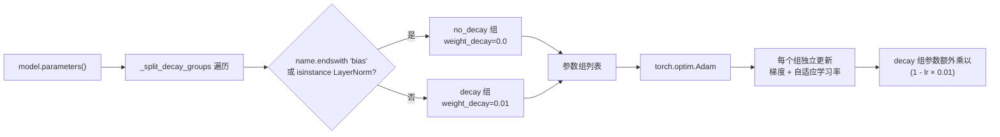
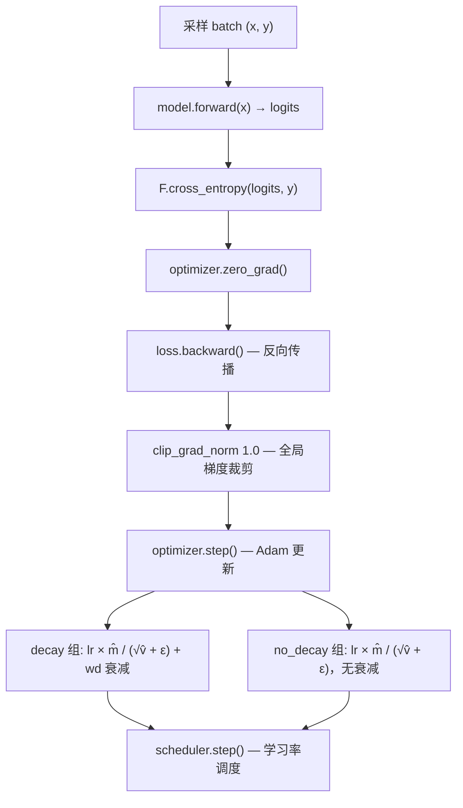

GPT-2 的训练配方在优化器层面做了两个精细决策：一是将参数按是否需要权重衰减拆分为两个独立分组，二是将 Adam 的 β2 从 GPT-1 的 0.98 调整为 0.999。这两个看似细微的配置差异，直接关系到深层 Transformer 在大规模语料上的训练稳定性与最终收敛质量。本页深入解析 `_split_decay_groups` 的分组逻辑、β2=0.999 的理论依据，以及完整优化器实例化链路。

## 参数分组策略：权重衰减的「选择性施加」

### 核心问题：为何不统一衰减

Adam 优化器中的权重衰减（weight decay）通过在每一步将参数乘以 `(1 - lr · weight_decay)` 来实现收缩，其本质是对应于 L2 正则化的梯度惩罚项。然而，并非所有参数都应承受同等的收缩压力。**偏置项（bias）和 LayerNorm 的仿射参数**在功能上完全不同于普通的权重矩阵——它们不参与乘法运算，而是充当平移或归一化校准的角色。对这些参数施加衰减，会迫使它们趋向零值，破坏归一化层的统计校准效果，最终损害模型表达能力。

GPT-2 的标准做法是：**LayerNorm 参数（`weight` 和 `bias`）以及所有线性层的 `bias` 不施加权重衰减**，仅对二维及以上的权重矩阵（`Linear.weight`、`Embedding.weight`）施加 0.01 的衰减。

Sources: [train.py](train.py#L9-L11)

### `_split_decay_groups` 的实现逻辑

```python
def _split_decay_groups(model: nn.Module, weight_decay: float):
    decay, no_decay = [], []
    for module in model.modules():
        for name, param in module.named_parameters(recurse=False):
            if not param.requires_grad:
                continue
            if name.endswith("bias") or isinstance(module, nn.LayerNorm):
                no_decay.append(param)
            else:
                decay.append(param)
    return [
        {"params": decay, "weight_decay": weight_decay},
        {"params": no_decay, "weight_decay": 0.0},
    ]
```

该函数遍历模型的每一个模块（`model.modules()` 是深度优先递归遍历），对每个模块调用 `named_parameters(recurse=False)` 以仅获取该模块直接拥有的参数（避免重复计数嵌套模块）。判定规则简洁而精确：

- **`name.endswith("bias")`**：捕获所有 `Linear` 层的 `bias` 参数，名称一律以 `"bias"` 结尾。
- **`isinstance(module, nn.LayerNorm)`**：捕获 LayerNorm 的 `weight`（gamma）和 `bias`（beta）两个参数，因为它们的维度虽为 1D（不触发 `bias` 后缀判定），但同样不应被衰减。

最终返回两个参数组字典，每组独立设定 `weight_decay` 值，交由 Adam 分别管理。

Sources: [train.py](train.py#L38-L55)

### GPT-2 模型中的参数分布

为了直观理解分组覆盖范围，下表列出本项目中 GPT-2 模型的参数类型及其分组归属：

| 参数类型 | 所属模块 | 维度 | 分组 | 典型实例 |
|:---|:---|:---|:---|:---|
| `Linear.weight` | `c_attn`, `c_proj`, `c_fc` | 2D | **decay** | 注意力 QKV 融合投影、输出投影、FFN 升维 |
| `Embedding.weight` | `wte`, `wpe` | 2D | **decay** | token 嵌入、位置嵌入 |
| `Linear.bias` | `c_attn`, `c_proj`, `c_fc` | 1D | **no_decay** | 各线性层的偏置 |
| `LayerNorm.weight` | `ln_1`, `ln_2`, `ln_f` | 1D | **no_decay** | 归一化缩放因子 (gamma) |
| `LayerNorm.bias` | `ln_1`, `ln_2`, `ln_f` | 1D | **no_decay** | 归一化平移因子 (beta) |

> **注意**：`LMHead` 通过权重绑定复用 `wte` 的嵌入矩阵（`hidden @ wte.weight.t()`），不会产生独立的可训练参数，因此不参与分组。

Sources: [model.py](model.py#L64-L99), [model.py](model.py#L102-L113), [model.py](model.py#L142-L176)

### 分组数据流



## β2=0.999 的选择：长程梯度二阶矩估计

### Adam 的二阶矩更新回顾

Adam 优化器维护两个指数移动平均（EMA）：一阶矩 $\hat{m}_t$（梯度均值）和二阶矩 $\hat{v}_t$（梯度未中心化方差），更新公式为：

$$m_t = \beta_1 \cdot m_{t-1} + (1 - \beta_1) \cdot g_t$$
$$v_t = \beta_2 \cdot v_{t-1} + (1 - \beta_2) \cdot g_t^2$$

参数更新时，步长由 $\hat{m}_t / (\sqrt{\hat{v}_t} + \epsilon)$ 决定。**β2 控制梯度方差估计的「记忆长度」**——其等效窗口大小约为 $1/(1-\beta_2)$ 步。

| β2 取值 | 等效记忆窗口 | 梯度方差估计特性 | 代表场景 |
|:---|:---|:---|:---|
| 0.9 | ~10 步 | 高方差、快速响应 | 小规模快速训练 |
| **0.98** | **~50 步** | **中等平滑** | **GPT-1 预训练** |
| **0.999** | **~1000 步** | **极度平滑、长程稳定** | **GPT-2 预训练** |

Sources: [train.py](train.py#L8-L9)

### GPT-1 → GPT-2 的 β2 调整动因

GPT-1 采用 β2=0.98，等效记忆窗口约 50 步。这一设置在 GPT-1 的训练规模（BookCorpus ~7000 本书、12 层模型）下是合理的——方差估计在中等窗口内即可充分平滑。

GPT-2 将 β2 提升至 0.999，等效窗口扩展至约 1000 步。这一调整的背后逻辑在于：

1. **模型深度与参数量大幅增长**：从 12 层（117M）到最深 48 层（1558M），不同层、不同位置的梯度尺度差异更加显著。更大的 β2 使二阶矩估计覆盖更多步的梯度信息，避免因短期梯度波动导致的自适应学习率震荡。

2. **训练步数更多**：GPT-2 在更大规模语料（WebText ~40GB）上训练更长时间，需要二阶矩估计在更长时间尺度上保持稳定，防止中后期训练中学习率过早或过晚衰减。

3. **避免有效学习率的过早收缩**：较小的 β2 会让 $v_t$ 更快地适应当前梯度幅值，可能在梯度暂时增大时过度缩小步长。β2=0.999 使 $v_t$ 维持一个长期均值，对偶发的梯度尖峰更具鲁棒性。

4. **ε=1e-8 的配合**：极小的 ε 值意味着分母几乎完全由 $\sqrt{\hat{v}_t}$ 主导，因此 $\hat{v}_t$ 的估计精度至关重要——更高的 β2 使该估计更平滑、更可靠。

Sources: [train.py](train.py#L65-L67)

### β2 与权重衰减分组的协同效应

β2=0.999 的长程平滑特性与「选择性权重衰减」策略形成协同：

- **decay 组**（权重矩阵）：长期稳定的自适应学习率确保衰减因子 `(1 - lr · 0.01)` 在每一步都以一致的节奏施加正则化压力，避免因学习率波动导致衰减强度忽强忽弱。
- **no_decay 组**（bias / LayerNorm）：完全不衰减意味着这些参数的更新完全由梯度和自适应学习率驱动，β2=0.999 确保它们获得平滑而可靠的步长估计，不会被短期梯度噪声所干扰。

## 优化器实例化与完整训练配方

### Adam 构造

```python
param_groups = _split_decay_groups(model, weight_decay)
optimizer = torch.optim.Adam(
    param_groups,
    lr=lr,               # 由调用方传入 (main.py 中为 3e-3 教学规模)
    betas=(0.9, 0.999),  # β1=0.9, β2=0.999
    eps=1e-8             # 数值稳定常数
)
```

`torch.optim.Adam` 接受参数组列表，每个组可独立设定 `weight_decay`。优化器在每次 `step()` 中，对每个参数组分别应用衰减系数和 Adam 更新规则。PyTorch 的 Adam 实现使用 **decoupled weight decay** 的变体形式——衰减项被直接加到参数上（而非加到梯度上），这与 AdamW 的行为一致。

> **教学规模说明**：`main.py` 中的学习率为 `3e-3`，远高于论文中 GPT-2 Small 的 `2.5e-4`。这是因为教学模型仅 4 层、128 维，参数量极小，需要更大的学习率才能在有限步数内收敛。

Sources: [train.py](train.py#L64-L67), [main.py](main.py#L149-L152)

### 梯度范数裁剪

在 `optimizer.step()` 之前，所有参数的全局梯度范数被裁剪至最大 1.0：

```python
nn.utils.clip_grad_norm_(model.parameters(), 1.0)
```

这与 β2=0.999 形成互补防御：β2 提供长期的方差估计平滑，而梯度裁剪则在单步层面截断异常大的梯度，防止梯度爆炸对参数造成不可逆的破坏。两者共同确保深层 Transformer 的训练稳定性。

Sources: [train.py](train.py#L81-L83)

### 完整单步训练流程



### GPT-1 与 GPT-2 优化器配置对比

| 配置项 | GPT-1 | GPT-2 | 差异说明 |
|:---|:---|:---|:---|
| 优化器 | Adam | Adam | 相同 |
| β1 | 0.9 | 0.9 | 相同 |
| **β2** | **0.98** | **0.999** | 窗口从 ~50 步扩至 ~1000 步 |
| ε | 1e-8 | 1e-8 | 相同 |
| **权重衰减** | **未显式提及** | **0.01** | GPT-2 显式引入选择性 L2 正则 |
| **权重衰减范围** | — | **仅权重矩阵，不含 bias/LayerNorm** | 分组管理 |
| 梯度裁剪 | 1.0 | 1.0 | 相同 |

Sources: [train.py](train.py#L8-L12)

## 延伸阅读

优化器配置是训练配方的核心一环，它与学习率调度、评估指标紧密关联：

- **学习率调度**：Adam 创建后即挂载 LambdaLR 调度器，采用线性 Warmup + 余弦衰减策略。详见 [学习率调度：线性 Warmup 与余弦衰减策略](16-xue-xi-lu-diao-du-xian-xing-warmup-yu-yu-xian-shuai-jian-ce-lue)。
- **训练循环全貌**：优化器嵌入在完整的预训练循环中，包括批次采样、前向传播、损失计算与梯度更新。详见 [无监督语言模型预训练循环：目标函数与批次采样](14-wu-jian-du-yu-yan-mo-xing-yu-xun-lian-xun-huan-mu-biao-han-shu-yu-pi-ci-cai-yang)。
- **困惑度评估**：训练完成后，使用困惑度（PPL）衡量模型质量，这是 GPT-2 论文的核心报告指标。详见 [困惑度（Perplexity）：GPT-2 的核心评估指标计算方法](17-kun-huo-du-perplexity-gpt-2-de-he-xin-ping-gu-zhi-biao-ji-suan-fang-fa)。