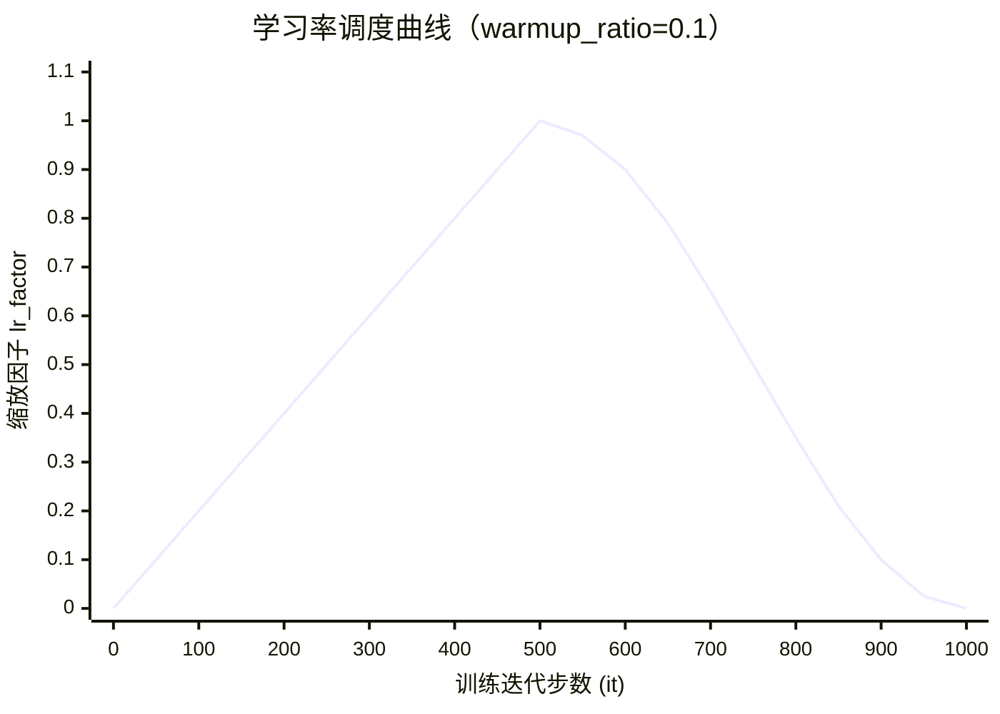
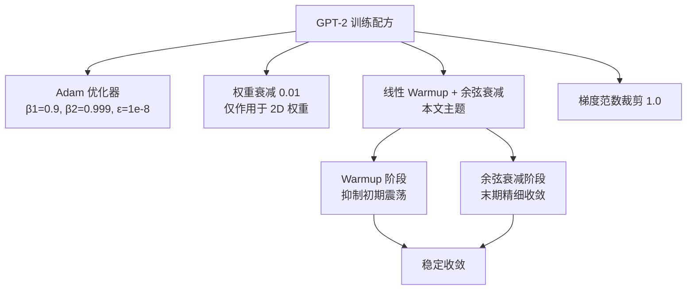

GPT-2 预训练采用经典的**两段式学习率调度**：训练初期通过线性 Warmup 将学习率从零逐步攀升至峰值，随后以余弦曲线平滑衰减至零。这一策略并非随意选择，而是 GPT-2 论文训练配方的核心组成部分——它直接决定了模型能否稳定收敛以及最终的语言建模质量。本文将深入剖析本项目 [train.py](train.py) 中该策略的完整实现，从数学公式到工程集成逐一拆解。

Sources: [train.py](train.py#L24-L35)

## 为什么需要学习率调度：第一性原理

在深度 Transformer 的训练初期，所有参数都是随机初始化的。如果此时直接施加峰值学习率，Adam 优化器的一阶矩和二阶矩估计尚未建立可靠统计，巨大的梯度噪声会导致参数剧烈震荡甚至发散。Warmup 阶段的核心目的就是为自适应优化器的统计量积累提供缓冲时间。而在训练后期，模型逐渐接近损失函数的局部最优点，过大的学习率会反复越过最优点，此时通过余弦衰减逐步减小步长，使模型能够精细地稳定在最优区域内。

GPT-2 的训练配方明确记录了这一选择：Adam 优化器配合线性 warmup 随后余弦衰减，同时施加梯度范数裁剪。这三个组件共同构成了训练稳定性的保障体系。

Sources: [train.py](train.py#L8-L12)

## 整体调度曲线：两段式架构



上图展示了当 `warmup_ratio=0.1` 时（即前 10% 的训练步数用于 warmup），学习率缩放因子的完整变化轨迹。前 100 步线性上升至峰值 1.0，此后按余弦曲线平滑下降，最终在训练结束时归零。实际学习率 = 峰值 `lr` × 缩放因子。

Sources: [train.py](train.py#L26-L30)

## 核心函数：_cosine_lr 逐行解析

整个调度策略的数学逻辑浓缩在仅 5 行代码的 `_cosine_lr` 函数中，它接收当前迭代步数 `it`、warmup 步数 `warmup`、总迭代步数 `max_iters`，返回一个 **[0, 1] 区间的乘性缩放因子**：

```python
def _cosine_lr(it, warmup, max_iters):
    if it < warmup:
        return it / max(1, warmup)                          # 线性 warmup
    progress = (it - warmup) / max(1, max_iters - warmup)
    return 0.5 * (1.0 + math.cos(math.pi * progress))       # 余弦衰减到 0
```

### 第一阶段：线性 Warmup（it < warmup）

当 `it` 小于 warmup 步数时，返回 `it / warmup`——一个从 0 到 1 线性增长的值。`max(1, warmup)` 的保护确保 warmup 步数为 0 时不会触发除零错误，此时缩放因子始终为 `it`（但 warmup 实际被 `max(1, ...)` 兜底为至少 1）。

从直觉上理解，第 0 步时缩放因子为 0（学习率为零，梯度更新被完全抑制），第 `warmup` 步时达到 1.0（使用峰值学习率）。这种渐进式启动给了 Adam 优化器足够的时间来建立一阶矩（动量）和二阶矩（自适应学习率分母）的可靠估计。

### 第二阶段：余弦衰减（it ≥ warmup）

进入衰减阶段后，首先计算训练进度 `progress`：

$$\text{progress} = \frac{it - \text{warmup}}{\max(1,\ \text{max\_iters} - \text{warmup})}$$

当 `it` 从 `warmup` 增长到 `max_iters` 时，`progress` 从 0 线性增长到 1。随后代入余弦公式：

$$\text{lr\_factor} = \frac{1}{2}\left(1 + \cos(\pi \cdot \text{progress})\right)$$

当 `progress = 0` 时，`cos(0) = 1`，因子为 1.0（与 warmup 结束点连续衔接）；当 `progress = 1` 时，`cos(π) = -1`，因子为 0.0（训练结束时学习率归零）。余弦曲线的特点是**衰减速度先快后慢再快**——在训练中段保持相对较高的学习率以持续探索，在末端快速收敛。

Sources: [train.py](train.py#L26-L30)

### 两阶段边界连续性

一个关键的设计细节值得注意：在 `it == warmup` 这个边界点上，warmup 分支返回 `warmup / warmup = 1.0`，而余弦分支在 `progress = 0` 时也返回 `0.5 × (1 + cos(0)) = 1.0`。两个阶段在交接点完美连续，不会产生学习率跳变。

| 迭代步数 `it` | 阶段 | progress | cos(π·progress) | lr_factor |
|:---:|:---:|:---:|:---:|:---:|
| 0 | warmup | — | — | 0.000 |
| 50 | warmup | — | — | 0.500 |
| 100 | warmup→衰减交界 | 0.000 | 1.000 | **1.000** |
| 300 | 衰减 | 0.222 | 0.346 | 0.673 |
| 550 | 衰减 | 0.500 | -0.045 | 0.478 |
| 800 | 衰减 | 0.778 | -0.843 | 0.079 |
| 1000 | 衰减（结束） | 1.000 | -1.000 | 0.000 |

> 上表以 `warmup=100`、`max_iters=1000` 为例计算。

Sources: [train.py](train.py#L26-L30)

## PyTorch 集成：LambdaLR 包装器

`make_scheduler` 函数将上述缩放因子函数封装为 PyTorch 原生的 `LambdaLR` 调度器，使其与训练循环无缝集成：

```python
def make_scheduler(optimizer, warmup: int, max_iters: int):
    return torch.optim.lr_scheduler.LambdaLR(
        optimizer, lambda it: _cosine_lr(it, warmup, max_iters))
```

`LambdaLR` 的工作机制是：在每次调用 `scheduler.step()` 时，将优化器的 `base_lr`（即创建优化器时传入的 `lr`）乘以 lambda 函数返回的缩放因子，得到当前步的实际学习率。这意味着 `_cosine_lr` 返回的是**乘性系数**，而非绝对学习率值——实际学习率 = `lr × _cosine_lr(it, warmup, max_iters)`。

Sources: [train.py](train.py#L33-L35)

## 超参数计算：warmup_ratio 的工程转换

在 `pretrain` 函数中，warmup 和总迭代步数并非直接传入，而是通过 `warmup_ratio`（比例）和 `epochs` 间接推导：

```python
iters_per_epoch = max(1, 100)                    # 每 epoch 固定 100 步
max_iters = epochs * iters_per_epoch             # 总步数 = epoch × 每epoch步数
warmup = max(1, int(warmup_ratio * max_iters))   # warmup 步数 = 比例 × 总步数
scheduler = make_scheduler(optimizer, warmup, max_iters)
```

以本项目的默认配置为例：

| 参数 | 值 | 来源 |
|:---|:---:|:---|
| `epochs` | 10（`PRETRAIN_EPOCHS` 默认值） | [main.py](main.py#L112) |
| `iters_per_epoch` | 100（硬编码） | [train.py](train.py#L68) |
| `max_iters` | 1000（10 × 100） | [train.py](train.py#L69) |
| `warmup_ratio` | 0.1（10%） | [main.py](main.py#L151) |
| `warmup` | 100（int(0.1 × 1000)） | [train.py](train.py#L70) |
| `lr`（峰值学习率） | 3e-3 | [main.py](main.py#L151) |

`max(1, ...)` 保护确保即使 `warmup_ratio=0` 或极端短的训练也不会导致 warmup 为零，从而避免了余弦阶段从 `progress` 为负开始计算的问题。

Sources: [train.py](train.py#L68-L71), [main.py](main.py#L148-L152)

## 训练循环中的调度集成

调度器在训练循环中的调用时序至关重要——必须遵循 `optimizer.step()` → `scheduler.step()` 的严格顺序：

```python
for _ in range(epochs):
    for _ in range(iters_per_epoch):
        # ... 前向传播、损失计算、反向传播 ...
        optimizer.step()      # ① 用当前学习率更新参数
        scheduler.step()      # ② 更新下一步的学习率
```

这个顺序意味着第 `it` 步使用的是第 `it-1` 步 `scheduler.step()` 设置的学习率。由于 LambdaLR 内部维护一个从 0 开始的步计数器，与 `_cosine_lr(it, warmup, max_iters)` 中的 `it` 参数完全对应，因此每个优化步骤使用的学习率因子与预期的调度曲线精确匹配。

Sources: [train.py](train.py#L75-L84)

## 与 GPT-2 论文训练配方的对齐

GPT-2 论文的标准训练配方（参见 [train.py](train.py#L8-L12) 的文档注释）包含四个相互关联的组件，学习率调度是其中之一：



在实际大规模训练中（如 GPT-2 的 117M 参数模型），论文使用的峰值学习率为 `5e-5`（远小于本项目的 `3e-3`），warmup 步数为前 10% 总步数。本项目在教学规模下将峰值学习率提高了约 60 倍，这是因为模型更小、数据更少，需要更激进的学习率才能在有限的训练步数内收敛。

Sources: [train.py](train.py#L8-L12), [main.py](main.py#L148-L152)

## 延伸阅读

学习率调度不是孤立存在的，它与优化器和训练循环的其他环节紧密耦合：

- **[Adam 优化器配置：权重衰减分组与 β2=0.999 的选择](15-adam-you-hua-qi-pei-zhi-quan-zhong-shuai-jian-fen-zu-yu-b2-0-999-de-xuan-ze)** — Warmup 的必要性源于 Adam 动量统计的冷启动问题，理解 Adam 的矩估计机制是理解 Warmup 价值的前提。
- **[无监督语言模型预训练循环：目标函数与批次采样](14-wu-jian-du-yu-yan-mo-xing-yu-xun-lian-xun-huan-mu-biao-han-shu-yu-pi-ci-cai-yang)** — 调度器的 `max_iters` 和 `iters_per_epoch` 直接决定了预训练循环的总步数。
- **[困惑度（Perplexity）：GPT-2 的核心评估指标计算方法](17-kun-huo-du-perplexity-gpt-2-de-he-xin-ping-gu-zhi-biao-ji-suan-fang-fa)** — 学习率调度的最终效果通过验证集困惑度来衡量，低困惑度意味着调度策略帮助模型更好地学习了语言分布。