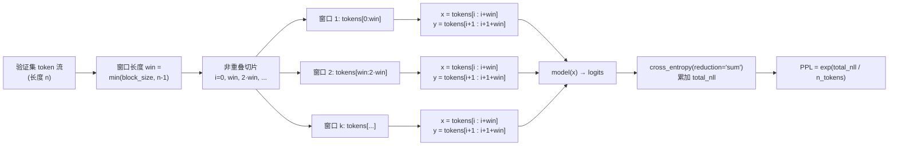
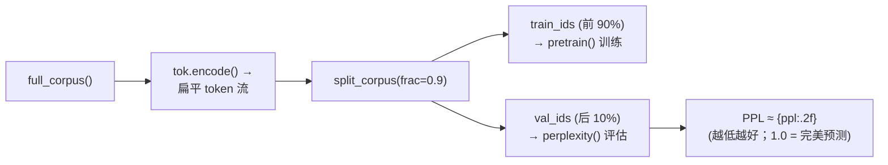

困惑度（Perplexity, PPL）是 GPT-2 论文中报告的核心语言建模评估指标，它将模型在整个测试序列上的负对数似然压缩为一个直观的标量——数值越低，说明模型对下一个 token 的预测越"不困惑"。本文将深入解析困惑度的数学定义、在本项目中的滑动窗口实现策略，以及它与训练损失的内在关系。

## 从语言建模目标到困惑度公式

GPT-2 的训练目标是标准的**自回归负对数似然**（与 GPT-1 的 L1 相同）：

$$L = -\sum_{i} \log P(u_i \mid u_{i-k}, \dots, u_{i-1})$$

困惑度在此基础上做了一次指数变换，将"总负对数似然"转化为"平均每个 token 的等效均匀分支数"：

$$\text{PPL} = \exp\left(\frac{1}{N} \sum_{i=1}^{N} \text{NLL}_i\right) = \exp\left(\frac{\text{total\_nll}}{n\_tokens}\right)$$

直觉上，PPL = K 意味着模型在每个位置"犹豫不决"于 K 个等效候选词之间。PPL = 1 表示完美预测，PPL = V（词表大小）表示完全随机猜测。对于真实规模的 GPT-2，在 WebText 测试集上报告的困惑度约为 17.48（Small）到 10.82（XL），这是论文中模型质量的主要量化依据。

Sources: [train.py](train.py#L1-L13)

## 滑动窗口评估策略：非重叠扫描与自适应窗口

困惑度的核心实现位于 `train.py` 的 `perplexity()` 函数。一个关键设计决策是**使用非重叠滑动窗口**而非随机采样批次——这确保评估时覆盖整个 token 流而不遗漏任何 token，使困惑度成为对验证集的**无偏估计**。



**自适应窗口长度**是这里的一个精巧处理。窗口被设为 `min(block_size, n - 1)`，其中 `block_size` 对应模型的上下文长度（`n_ctx`）。当验证序列比模型上下文短时，窗口自动缩小到 `n - 1`，确保即使在极短序列上也能完成评估，而不会因为序列不足以填充一个窗口而返回 `inf`。

Sources: [train.py](train.py#L96-L121)

## 逐行解析：`perplexity()` 函数的实现细节

下表将 `perplexity()` 函数的关键步骤与对应代码行一一映射：

| 步骤 | 代码行 | 说明 |
|------|--------|------|
| 推理模式 | `@torch.no_grad()` + `model.eval()` | 禁用梯度计算与 dropout，确保评估的确定性和内存效率 |
| 序列长度守卫 | `if n < 2: return float("inf")` | 少于 2 个 token 无法构成预测对，返回无穷大表示"完全困惑" |
| 自适应窗口 | `win = min(block_size, n - 1)` | 窗口取模型上下文长度与可用预测对数的较小值 |
| 非重叠遍历 | `for i in range(0, n - win, win)` | 步长等于窗口长度，保证无重叠；终点 `n - win` 确保最后一个窗口有完整目标 |
| 累加负对数似然 | `reduction="sum"` | 将窗口内所有 token 的 NLL 求和而非取均值，便于精确统计总 token 数 |
| 边界兜底 | `if n_tokens == 0:` | 当序列仅比窗口长 1 token 时，主循环不执行，手动取第一个窗口评估 |
| 指数变换 | `math.exp(total_nll / max(1, n_tokens))` | 将平均 NLL 转换为困惑度，`max(1, ...)` 防御除零 |

```python
@torch.no_grad()
def perplexity(model, token_ids, *, block_size: int, device: torch.device) -> float:
    model.to(device).eval()
    n = len(token_ids)
    if n < 2:
        return float("inf")
    win = min(block_size, n - 1)
    total_nll, n_tokens = 0.0, 0
    for i in range(0, n - win, win):
        x = torch.tensor([token_ids[i:i + win]], dtype=torch.long, device=device)
        y = torch.tensor([token_ids[i + 1:i + 1 + win]], dtype=torch.long, device=device)
        logits = model(x)
        nll = F.cross_entropy(logits.view(-1, logits.size(-1)), y.view(-1), reduction="sum")
        total_nll += nll.item()
        n_tokens += y.numel()
    # ...边界兜底...
    return math.exp(total_nll / max(1, n_tokens))
```

一个需要特别注意的实现细节是 **`reduction="sum"` 与 `reduction="mean"` 的区别**。训练循环中使用的是 `F.cross_entropy(logits.reshape(-1, V), y.reshape(-1))`（默认 `reduction="mean"`），返回的是当前 batch 的平均损失值用于反向传播。而困惑度函数显式使用 `reduction="sum"`，将窗口内所有 token 的 NLL 逐个累加，再除以全局 `n_tokens` 得到精确的"每个 token 平均负对数似然"。这避免了不同窗口因 token 数不同而引入的权重偏差。

Sources: [train.py](train.py#L96-L121), [train.py](train.py#L78-L79)

## 输入构造：x 与 y 的错位对齐

困惑度计算的核心是**自回归下一 token 预测**。对于每个窗口 `[i, i+win)`，输入 `x` 和目标 `y` 的构造如下：

| 张量 | 切片范围 | 含义 |
|------|----------|------|
| `x` | `token_ids[i : i+win]` | 模型输入：位置 `i` 到 `i+win-1` 的 token |
| `y` | `token_ids[i+1 : i+1+win]` | 预测目标：位置 `i+1` 到 `i+win` 的 token（整体右移一位） |

模型对 `x` 做前向传播后，输出 logits 的形状为 `(1, win, vocab_size)`。在因果掩码的保证下，logits 在位置 `t` 处仅依赖于 `x[0..t]`，恰好用于预测 `y[t]`。这意味着一个窗口内的**每一个位置都贡献一个有效的预测**，没有浪费。这通过 `logits.view(-1, V)` 和 `y.view(-1)` 展平后送入 `cross_entropy`，等价于计算 `win` 个 token 级别的负对数似然之和。

Sources: [train.py](train.py#L108-L114), [model.py](model.py#L208-L209)

## 验证集准备与困惑度调用时机

困惑度在**验证集**上计算，而非训练集。语料切分由 `data.py` 的 `split_corpus()` 完成，将扁平化的 token 流按 90:10 的比例前后分割——前 90% 用于训练，后 10% 专门用于困惑度评估。这种顺序切分（而非随机打乱）确保验证集的文本分布与训练集不同，使困惑度能反映模型的**泛化能力**而非记忆能力。



在 `main.py` 中，困惑度的调用发生在预训练完成**之后**，作为唯一的量化评估步骤：

```python
ppl = train.perplexity(model, val_ids, block_size=cfg.n_ctx, device=device)
print(f"  验证集困惑度 PPL ≈ {ppl:.2f}  (越低越好；1.0 = 完美预测)")
```

这意味着困惑度衡量的是**最终模型在未见数据上的综合语言建模质量**，是预训练阶段结束的"成绩单"。在教学规模下（4 层、128 维、500 词表、约 10 epoch），PPL 值会远高于论文报告值——这完全正常，因为真正有意义的 PPL 需要 WebText 量级（~40GB）的数据和数亿参数的模型才能达到。

Sources: [data.py](data.py#L126-L129), [main.py](main.py#L132-L156)

## `@torch.no_grad()` 与 `model.eval()`：评估模式的双重保障

困惑度函数的装饰器和函数体开头有两层关键控制：

```python
@torch.no_grad()          # 装饰器：禁用 autograd 记录计算图
def perplexity(model, ...):
    model.eval()           # 函数体：将所有子模块切换到评估模式
```

这两个操作解决不同的问题。`@torch.no_grad()` 在**计算层面**工作，阻止 PyTorch 构建反向传播所需的计算图，节省大量内存并加速推理。`model.eval()` 在**模块层面**工作，将所有 `nn.Dropout` 层从随机丢弃切换为恒等传递——这对 GPT-2 尤为重要，因为模型在嵌入层、注意力权重和残差路径上共有三处 dropout（`embd_pdrop`、`attn_pdrop`、`resid_drop`）。如果遗漏 `model.eval()`，dropout 的随机性会注入噪声，导致困惑度每次评估结果不可复现。

Sources: [train.py](train.py#L96-L102), [model.py](model.py#L79-L80)

## 训练损失 vs 困惑度：同一目标的不同投影

训练损失和困惑度本质上是**同一个语言建模目标的两种度量**，但服务于不同目的：

| 维度 | 训练损失（`pretrain()`） | 困惑度（`perplexity()`） |
|------|--------------------------|--------------------------|
| 数学定义 | 平均 token NLL（自然对数） | exp(平均 token NLL) |
| `reduction` | `mean`（隐含） | `sum` 后手动除以总 token 数 |
| 数据来源 | 训练集随机采样的 batch | 验证集全量非重叠扫描 |
| 梯度 | 需要（`loss.backward()`） | 不需要（`@torch.no_grad()`） |
| 用途 | 反向传播更新权重 | 监控泛化质量 |
| 模式 | `model.train()` | `model.eval()` |
| 直觉范围 | [0, +∞) 的对数空间 | [1, vocab_size] 的线性空间 |

两者的转换关系极其简洁：**PPL = exp(loss)**。当训练损失从 3.0 降到 2.0 时，困惑度从 $e^3 ≈ 20.1$ 降到 $e^2 ≈ 7.4$。指数变换使得困惑度在**接近 1 的优质模型区间**具有更高的数值分辨率——这正是实际评估中最关心的区域。

Sources: [train.py](train.py#L78-L89), [train.py](train.py#L96-L121)

## 如何解读困惑度数值

困惑度数值的解读需要结合**词表大小**这一上下文。在本项目的教学配置下，词表由 byte-level BPE 分词器决定（默认 500 个 token），而论文中的 GPT-2 使用 50257 的词表：

| 场景 | 理论 PPL 下界 | 理论 PPL 上界（随机） | 实际预期范围 |
|------|---------------|------------------------|--------------|
| 本项目（500 词表） | 1.0 | 500 | 教学规模下约 20–80 |
| GPT-2 Small（50257 词表） | 1.0 | 50257 | 论文报告 ~17.48 |
| GPT-2 XL（50257 词表） | 1.0 | 50257 | 论文报告 ~10.82 |

值得注意的是，**不同词表下的困惑度不可直接比较**。一个 500 词表的随机模型 PPL 为 500，而一个 50257 词表的随机模型 PPL 为 50257。因此困惑度的真正价值在于**同一词表、同一数据集下的纵向对比**——比如观察不同训练步数或不同模型配置下的 PPL 变化趋势。

Sources: [main.py](main.py#L113-L127), [main.py](main.py#L155-L156)

## 延伸阅读

- 困惑度所依赖的训练目标函数与批次采样机制，详见 [无监督语言模型预训练循环：目标函数与批次采样](14-wu-jian-du-yu-yan-mo-xing-yu-xun-lian-xun-huan-mu-biao-han-shu-yu-pi-ci-cai-yang)
- 困惑度评估所用的验证集切分方法，详见 [语言模型批数据采样与训练/验证集切分](22-yu-yan-mo-xing-pi-shu-ju-cai-yang-yu-xun-lian-yan-zheng-ji-qie-fen)
- 零样本评估的另一条路径——下一词命中率，详见 [零样本评估方法与 LAMBADA 风格下一词命中率](20-ling-yang-ben-ping-gu-fang-fa-yu-lambada-feng-ge-xia-ci-ming-zhong-lu)