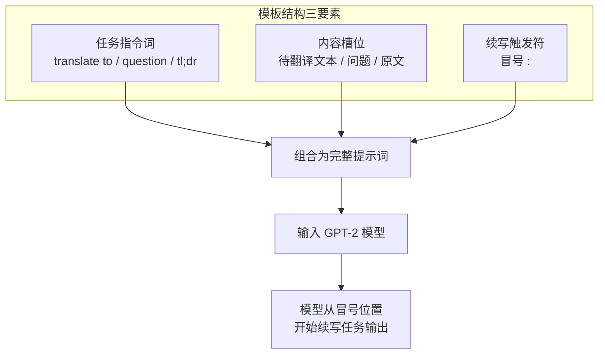

GPT-2 相对于 GPT-1 的根本性范式转变，不在于网络结构的调整，而在于**任务执行方式的彻底重构**——不再为每个下游任务设计专门的输出头或微调阶段，而是将翻译、问答、摘要等 NLP 任务统一表达为「自然语言文本续写」。本页深入解析这一机制的实现细节：从预训练语料中的任务范例注入，到三类提示词模板的设计原理，再到零样本推理与评估的完整链路。

## 核心思想：任务即文本续写

传统多任务学习范式为每个任务配备独立的分类头、解码器和标注数据集。GPT-2 论文（*Language Models are Unsupervised Multitask Learners*, Radford et al. 2019）提出一种更激进的方案：**一个纯语言模型即可在零样本条件下完成任意任务**，前提是训练语料中天然包含了这些任务的「文本化」形式。由于 WebText 包含了大量的网页内容——问答论坛、翻译页面、文章摘要——模型在纯语言建模过程中自然习得了「格式化的任务输入 → 合理的文本续写」这一映射。

本项目的教学实现用一份小型内置语料显式模拟了这一过程。模型架构中**不包含任何任务头**（`GPT` 类的 `forward` 仅返回 LM logits），所有任务能力均由提示词激发：

```python
# model.py — GPT 类只有语言模型头，无任务头
class GPT(nn.Module):
    """与 GPT-1 不同：不内置任何任务头，所有任务都通过提示词以零样本方式完成。"""
    def forward(self, idx):
        return self.lm_head(self.transformer(idx))  # LM logits
```

Sources: [model.py](model.py#L190-L209)

下图展示了从预训练到零样本任务的完整数据流：

```mermaid
flowchart LR
    subgraph 训练阶段
        A[WebText 风格语料<br/>+ 任务范例] --> B[Byte-level BPE<br/>分词器编码]
        B --> C[无监督语言建模<br/>L = -Σ log P u_i | context]
        C --> D[GPT-2 权重]
    end
    subgraph 推理阶段
        D --> E[提示词模板<br/>translate to french , the cat :]
        E --> F[模型前向传播<br/>仅语言模型头]
        F --> G[top-k 采样续写<br/>le chat]
    end
```

关键在于训练阶段与推理阶段共享**同一个模型、同一个前向函数、同一套 LM logits**。唯一的区别是输入——推理时用结构化的提示词替代了训练时从语料中随机截取的文本片段。

Sources: [main.py](main.py#L168-L180)

## 预训练语料中的任务范例注入

零样本能力的根基在于训练数据。本项目通过 `WEBTEXT_TASK_EXAMPLES` 显式构造了一批「任务即文本」的范例，将它们拼接进预训练语料，使模型在纯语言建模中自然见到各类任务的输入-输出格式：

```python
WEBTEXT_TASK_EXAMPLES = """
the capital of france is : paris
translate to french , the cat : le chat
translate to german , the cat : die katze
question : what is the capital of france ? answer : paris
a long and boring movie that many people left early . tl ; dr : a boring movie .
"""
```

这些范例覆盖了四种任务模式，且每种模式提供多条样本以强化格式关联。值得注意的是，这些范例**不是有监督的训练数据**——它们不附带标签，不经过任何任务头，而是作为普通文本进入交叉熵损失函数，与其他自然语言句子完全等价。模型的注意力机制在训练过程中学会了识别 `translate to ... , ... :` 这样的模式，并倾向于在冒号后生成对应的翻译结果。

Sources: [data.py](data.py#L43-L64)

下表总结了语料中注入的任务范例分类及其格式特征：

| 任务类型 | 示例行数 | 格式模板 | 冒号触发位置 |
|---------|---------|---------|------------|
| 事实补全 | 3 | `the capital of X is : Y` | `is :` |
| 翻译 | 4 | `translate to LANG , TEXT : TRANSLATION` | `: ` |
| 问答 | 3 | `question : ... ? answer : RESPONSE` | `answer :` |
| 摘要 | 3 | `TEXT tl ; dr : SUMMARY` | `tl ; dr :` |

`full_corpus()` 函数将通用语料与任务范例拼接为完整的训练输入，确保分词器的词汇分布同时覆盖自然语言和任务格式标记：

```python
def full_corpus() -> str:
    """拼接通用语料与任务范例，作为预训练输入。"""
    return WEBTEXT_CORPUS + WEBTEXT_TASK_EXAMPLES
```

Sources: [data.py](data.py#L62-L64)

## 三类提示词模板的逐行解析

GPT-2 论文中的零样本提示词设计遵循一个核心原则：**模板格式必须与模型在训练数据中见过的自然文本模式高度匹配**。本项目在 `data.py` 中实现了四个提示词构造函数，分别对应翻译、问答、摘要和通用补全。

### 翻译模板

```python
def translate_prompt(text: str, target_lang: str) -> str:
    """翻译任务：translate to french , the cat : le chat (格式同训练范例)。"""
    return f"translate to {target_lang} , {text} :"
```

模板 `translate to {target_lang} , {text} :` 与 `WEBTEXT_TASK_EXAMPLES` 中的翻译范例完全一致。冒号末尾留一个空格，模型从该位置续写翻译结果。注意逗号和冒号的精确位置——这些标点符号构成了模型识别任务边界的关键模式信号。当输入 `translate_prompt("the cat", "french")` 时，生成的完整提示词为 `translate to french , the cat :`，模型续写 ` le chat` 即完成翻译。

Sources: [data.py](data.py#L87-L89)

### 问答模板

```python
def qa_prompt(question: str) -> str:
    """问答任务：question : ... ? answer : (模型续写答案)。"""
    return f"question : {question} answer :"
```

问答模板在提示词中**同时包含问号和 `answer :` 关键词**，形成一个封闭的「问题区间」。问号标记问题的结束，`answer :` 作为信号触发模型生成答案。例如 `qa_prompt("what is the capital of france ?")` 生成 `question : what is the capital of france ? answer :`，模型续写 ` paris`。

Sources: [data.py](data.py#L92-L94)

### 摘要模板

```python
def summarize_prompt(text: str) -> str:
    """摘要任务：用论文风格的 'tl ; dr :' 触发模型生成摘要。"""
    return f"{text} tl ; dr :"
```

摘要模板使用了互联网社区中广泛流传的 `tl ; dr`（"too long; didn't read"）缩写。GPT-2 论文选择这一标记并非偶然——WebText 语料来自 Reddit，其中大量帖子包含 `tl;dr` 摘要，因此模型对该标记与摘要行为的关联有着充分的学习。在本项目中，训练范例同样遵循这一格式：`a long and boring movie that many people left early . tl ; dr : a boring movie .`

Sources: [data.py](data.py#L97-L99)

### 模板设计的共同特征



三个模板的设计遵循统一的「**指令词 + 内容 + 冒号触发**」三元结构。冒号 `:` 是关键的续写锚点——在英文标点分布中，冒号后跟随解释性内容是一种高频模式，模型对此有强烈的统计先验。

Sources: [data.py](data.py#L87-L104)

## 零样本推理：从提示词到任务输出

`main.py` 中的零样本演示部分展示了完整的推理流程。值得注意的是，零样本推理使用了**贪心解码**（`temperature=0.0, top_k=0`），而非续写示例中使用的温度采样：

```python
# ---- 5. 零样本任务：翻译 / 问答 / 摘要 (无任何微调) ----
demos = [
    ("翻译", data.translate_prompt("the cat", "french")),
    ("翻译", data.translate_prompt("the house", "french")),
    ("问答", data.qa_prompt("what is the capital of france ?")),
    ("问答", data.qa_prompt("what is the capital of japan ?")),
    ("摘要", data.summarize_prompt("a fast red car drove down the empty street at midnight .")),
]
for kind, prompt in demos:
    text = generate(model, tok, prompt, n_new=6, device=device, temperature=0.0, top_k=0)
    cont = text[len(prompt):].strip() or "(空)"
    print(f"  [{kind}] {prompt!r} -> {cont!r}")
```

`temperature=0.0` 意味着 softmax 输出退化为 argmax——模型在每一步选择概率最高的单个 token，输出完全确定。这与续写示例（第 4 步）的 `temperature=0.8, top_k=40` 形成对比。零样本任务选择贪心解码的原因是：**任务答案应当是唯一确定的**（"the cat" 的法语翻译只有 "le chat"），随机性反而会降低答案质量。

Sources: [main.py](main.py#L168-L180)

`generate` 函数的核心逻辑在每次循环中截取最后 `n_ctx` 个 token 作为上下文，前向传播后取最后一个位置的 logits，经过温度缩放和 top-k 截断后采样下一个 token：

```python
for _ in range(n_new):
    x = torch.tensor([ids[-n_ctx:]], dtype=torch.long, device=device)
    logits = model(x)[0, -1] / max(temperature, 1e-6)
    if top_k and top_k < logits.size(-1):
        v, _ = torch.topk(logits, top_k)
        logits[logits < v[-1]] = float("-inf")
    nxt = torch.multinomial(F.softmax(logits, dim=-1), 1).item()
    if nxt == tok.endoftext_id:
        break
    ids.append(nxt)
```

当 `temperature=0.0` 时，`max(temperature, 1e-6)` 防止除零，实际上将 logits 放大到极大值，使得 softmax 后概率分布退化为 one-hot，`torch.multinomial` 等价于 `argmax`。

Sources: [main.py](main.py#L32-L50)

## 零样本评估：下一词命中率

除生成式演示外，项目还实现了基于**下一词预测命中率**的定量评估（近似 LAMBADA / Children's Book Test）：

```python
ZERO_SHOT_EVAL = [
    (qa_prompt("what is the capital of france ?"), " paris"),
    (translate_prompt("the cat", "french"), " le"),
    ("the capital of france is :", " paris"),
    ("the sun rises in the", " east"),
    # ...
]
```

评估逻辑将每个 `(prompt, expected)` 对送入模型，比较 argmax 预测的下一个 token 与 `expected` 的第一个 token 是否一致。`zero_shot_accuracy` 函数通过 `tok.encode(prompt + expected)` 与 `tok.encode(prompt)` 的长度差来确定目标 token：

```python
target_id = full_ids[len(prompt_ids)]  # 正确的下一个 token
x = torch.tensor([prompt_ids[-model.cfg.n_ctx:]], device=device)
pred_id = int(model(x)[0, -1].argmax())
hits += int(pred_id == target_id)
```

注意翻译评估用 `" le"` 而非 `" le chat"` 作为期望值——因为 BPE 分词后 `" le chat"` 可能被编码为多个 token，而评估只检查第一个 token 的匹配。

Sources: [data.py](data.py#L112-L123), [main.py](main.py#L53-L72)

`main.py` 对评估结果有一段精辟的注释，界定了本教学实现与真实 GPT-2 零样本能力之间的边界：

> 这些提示多属训练分布，高命中说明模型已学会「提示→补全」的关联 —— 这正是 GPT-2 无监督多任务的机制。对训练时未见过的全新任务/语言，真正的零样本泛化需 WebText 量级（~40GB）数据才能涌现。

Sources: [main.py](main.py#L183-L188)

## 教学规模下的现实与局限

下表对比了本项目教学实现与论文级 GPT-2 在零样本能力上的差异：

| 维度 | 本项目教学实现 | 论文级 GPT-2 |
|------|-------------|-------------|
| 预训练语料 | ~2KB 内置文本（含任务范例） | ~40GB WebText |
| 任务范例来源 | 显式构造（`WEBTEXT_TASK_EXAMPLES`） | 网页中天然存在 |
| 翻译能力 | 仅限训练中见过的词对 | 多语言泛化 |
| 问答能力 | 仅限训练分布内的事实 | 广泛知识问答 |
| 摘要能力 | 格式模仿，语义有限 | 语义级压缩概括 |
| 零样本评估 | 训练分布内的下一词命中 | LAMBADA / CBT / 等标准基准 |

核心区别在于：教学实现的任务范例是**显式注入**的，模型表现出的"零样本"本质上是训练分布内的记忆复现。而真实 GPT-2 的零样本能力来自**大规模预训练的涌现效应**——模型在海量自然文本中泛化出了对未见任务的理解能力。

Sources: [main.py](main.py#L191-L192), [data.py](data.py#L17-L19)

---

理解了零样本任务的提示词模板设计后，可以继续探索两个相关主题：

- **生成策略**：零样本推理中提到的温度缩放和 top-k 截断的完整数学推导见 [Top-k 采样生成：温度缩放与概率截断策略](19-top-k-cai-yang-sheng-cheng-wen-du-suo-fang-yu-gai-lu-jie-duan-ce-lue)
- **评估体系**：LAMBADA 风格下一词命中率的详细计算方法和基准对比见 [零样本评估方法与 LAMBADA 风格下一词命中率](20-ling-yang-ben-ping-gu-fang-fa-yu-lambada-feng-ge-xia-ci-ming-zhong-lu)