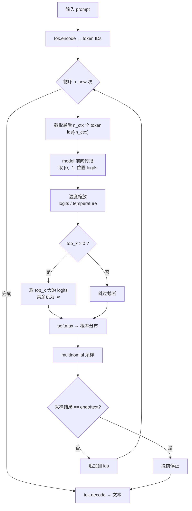

GPT-2 的文本生成采用**自回归逐 Token 采样**机制——每一步根据当前已生成序列预测下一个 Token 的概率分布，从中抽取一个 Token 追加到序列末尾，循环往复。与贪心解码（greedy，每步取 argmax）不同，GPT-2 引入**温度缩放**和 **Top-k 概率截断**两个超参数来控制生成的随机性和质量：温度调节分布的尖锐程度，Top-k 砍掉低概率长尾噪声。整个生成逻辑仅用一个 20 行的 `generate` 函数实现，却完整复现了 GPT-2 论文及 OpenAI 官方仓库的标准采样方式。[main.py](main.py#L31-L50)

## 自回归生成循环：上下文窗口截断与逐步推进

生成函数的核心是一个 `for _ in range(n_new)` 循环，每次迭代产生一个新 Token。在每次迭代中，模型只取**已生成序列的最后 `n_ctx` 个 Token**作为输入——通过 `ids[-n_ctx:]` 的切片操作实现滑动窗口截断。这一设计确保即便生成序列长度超过上下文窗口，模型也永远不会收到超长输入，避免触发 `forward` 中的序列长度断言。[main.py](main.py#L40-L41)

模型前向传播后，输出形状为 `(B, T, vocab_size)` 的 logits 张量，代码通过 `model(x)[0, -1]` 提取**批次中唯一样本的最后一个位置**的 logits 向量，形状为 `(vocab_size,)`——这正是模型对"下一个 Token"的原始预测分布。随后将该向量送入温度缩放和 Top-k 截断处理。如果采样到的 Token 是文档结束符 `<|endoftext|>`，循环提前终止；否则将该 Token ID 追加到 `ids` 列表，进入下一轮。[main.py](main.py#L41-L50)

Sources: [main.py](main.py#L31-L50)

## 温度缩放：锐化与平滑概率分布

温度（temperature）是控制采样随机性的第一道旋钮。代码中通过 `logits = model(x)[0, -1] / max(temperature, 1e-6)` 实现温度缩放——直接将 logits 除以温度值。[main.py](main.py#L42)

从数学角度看，温度缩放等价于改变 softmax 分布的"锐度"。设原始 logits 为 $z_i$，则温度 $T$ 下的采样概率为：

$$p_i = \frac{\exp(z_i / T)}{\sum_j \exp(z_j / T)}$$

温度的取值行为遵循以下规律：

| 温度 $T$ | 分布形态 | 生成效果 | 边界情况 |
|:---:|:---|:---|:---|
| $T \to 0^+$ | 接近 one-hot | 近似贪心解码（argmax） | $T=0$ 时代码用 `max(temperature, 1e-6)` 防 $\div 0$ |
| $T < 1$ | 比原始分布更尖锐 | 低随机性，更保守、更可预测 | $T=0.001$ ≈ 贪心 |
| $T = 1$ | 原始分布不变 | 模型的"自然"采样 | 基准参考点 |
| $T > 1$ | 比原始分布更平坦 | 高随机性，更多样但可能不连贯 | $T=2.0$ 时分布趋于均匀 |

代码中 `max(temperature, 1e-6)` 是一个关键的**数值保护措施**：当调用方传入 `temperature=0.0`（零样本任务演示中的贪心模式），直接除以零会引发异常，因此用极小值 $10^{-6}$ 替代，使 logits 被放大到极大值，softmax 后概率几乎集中在 argmax 对应的 Token 上——等价于贪心解码但保持了概率采样的代码路径统一。[main.py](main.py#L42)

Sources: [main.py](main.py#L42)

## Top-k 截断：抑制低概率尾部噪声

温度缩放改变了分布的形态，但**不会移除任何 Token**——即使概率极低的 Token 仍有非零的被采样机会。Top-k 策略直接从候选集中**物理移除**排名 $k$ 位之后的 Token，将它们的 logits 设为 $-\infty$，使其 softmax 概率严格为零。[main.py](main.py#L43-L45)

代码通过三步实现 Top-k 截断。第一步，判断是否启用截断：条件 `if top_k and top_k < logits.size(-1)` 确保只在 $k$ 是正整数且小于词表大小时才执行。第二步，`torch.topk(logits, top_k)` 返回值最大的 $k$ 个 logits，其中 `v[-1]` 是第 $k$ 大的值（即截断阈值）。第三步，将所有低于该阈值的 logits 设为 $-\infty$：`logits[logits < v[-1]] = float("-inf")`。[main.py](main.py#L43-L45)

这一操作的直观效果可以用一个具体例子说明：假设词表大小为 500，模型在某一步的 logits 经过温度缩放后，排名前 40 的 Token 概率总和已达 99.5%，剩余 460 个 Token 的概率仅占 0.5%。设 `top_k=40` 后，这 460 个低概率 Token 的概率被强制归零，剩余概率在 40 个候选中**自动重新归一化**（因为 softmax 中 $-\infty$ 的指数项为 0），有效消除了长尾噪声导致的意外生成。

| 参数 | 默认值 | 作用域 | 关闭条件 |
|:---|:---:|:---|:---|
| `temperature` | `0.8` | 分布锐度调节 | 设为极小值时退化为贪心 |
| `top_k` | `40` | 截断候选 Token 数 | 设为 `0` 时跳过截断 |
| `n_new` | 调用方指定 | 最大生成 Token 数 | 遇到 `<|endoftext|>` 提前终止 |

Sources: [main.py](main.py#L32-L45)

## 多项式采样：从截断分布中抽取 Token

经过温度缩放和 Top-k 截断处理后，代码执行两步操作完成 Token 选择。首先 `F.softmax(logits, dim=-1)` 将处理后的 logits 转换为合法的概率分布——被设为 $-\infty$ 的位置概率严格为 0，其余位置经指数化后自动归一化。随后 `torch.multinomial(probabilities, 1)` 从该分布中**按概率大小**抽取一个样本索引，`.item()` 将其从 PyTorch 张量转换为 Python 整数。[main.py](main.py#L46)

`torch.multinomial` 的行为是**按权重随机抽样**：概率为 0 的 Token 绝不会被选中，概率高的 Token 被选中的机会更大，但仍有随机性。这与 `torch.argmax` 的确定性选择形成对比——后者永远选概率最大的位置，导致同一提示词的生成结果完全可复现但缺乏多样性。这正是 GPT-2 采样生成与贪心解码的根本区别。

生成结束后，`tok.decode(ids)` 将完整的 Token ID 列表转换回字符串返回给调用方。整个函数用 `@torch.no_grad()` 装饰，禁用梯度计算以节省内存和加速推理——生成阶段不需要反向传播。[main.py](main.py#L31-L50)

Sources: [main.py](main.py#L46-L50)

## 两种生成模式：随机采样与确定性贪心

项目中 `generate` 函数被两种截然不同的模式调用，分别服务于"展示多样性"和"零样本任务执行"两种场景：

**随机采样模式**（默认参数）用于展示语言模型的续写能力。在主函数的"[4] 续写示例"阶段，三个提示词——`"the cat"`、`"the capital of france is :"`、`"the weather was"`——均使用默认参数 `temperature=0.8, top_k=40` 调用。温度 0.8 略微锐化分布使生成偏向高概率 Token，Top-k 40 在多数场景下足以覆盖合理的候选集，两者的组合在多样性和连贯性之间取得 GPT-2 论文推荐的平衡点。[main.py](main.py#L162-L166)

**确定性贪心模式**用于零样本任务演示。在翻译、问答、摘要任务中，代码显式传入 `temperature=0.0, top_k=0`：`temperature=0.0` 触发 `max(temperature, 1e-6)` 保护使 logits 被放大到极端值，softmax 近似 one-hot；`top_k=0` 使截断条件 `if top_k and ...` 为假从而跳过截断。两者叠加后 `multinomial` 采样在数学上退化为 `argmax`，确保每次运行结果完全一致——任务演示需要**可复现的确定性输出**，而非创意续写。[main.py](main.py#L177-L178)

| 调用场景 | temperature | top_k | 实际行为 | 设计意图 |
|:---|:---:|:---:|:---|:---|
| 续写示例（L165） | 0.8 | 40 | 温度采样 + Top-k 截断 | 展示模型的创造性续写能力 |
| 零样本任务（L178） | 0.0 | 0 | 近似 argmax 贪心 | 确保任务输出的可复现性 |

Sources: [main.py](main.py#L162-L178)

## 上下文窗口与停止条件

生成循环的两个边界条件决定了生成的上下文质量和终止时机。**输入截断**通过 `ids[-n_ctx:]` 实现：教学配置中 `n_ctx=128`，即使生成过程持续追加 Token，模型每步只看到最近的 128 个 Token。这一设计模拟了 GPT-2 论文配置中 `n_ctx=1024` 的上下文窗口限制——当序列超过窗口时，最早的上下文被自然"遗忘"，模型依靠近期上下文继续生成。[main.py](main.py#L39-L41)

**终止条件**有两道保险。第一道是**文档结束符检测**：`tok.endoftext_id` 是字节级 BPE 词表末尾追加的特殊 Token `<|endoftext|>`，模型在预训练中学习到它表示文档边界。当采样的 Token 等于此 ID 时，循环立即 `break`——这使模型能够自主判断文本应在何处结束，而非机械地生成满 `n_new` 个 Token。第二道是**固定步数**：循环最多运行 `n_new` 次，即使未遇到结束符也会在指定步数后停止。[main.py](main.py#L40-L49)

这两道终止条件在不同使用场景下各自发挥作用：续写示例中 `n_new=16` 作为硬性上限，防止生成过长；零样本任务中 `n_new=6` 保持任务输出简短精练。模型通过预训练学到的 `<|endoftext|>` 终止能力，则是 GPT-2 作为**无监督多任务学习器**在多种任务上自然适应的基础——模型"知道"何时该停止输出。

Sources: [main.py](main.py#L31-L50)

## 延伸阅读

生成函数的输入依赖语言模型头的 logits 输出，其权重绑定机制参见 [语言模型头与 Token 嵌入权重绑定机制](9-yu-yan-mo-xing-tou-yu-token-qian-ru-quan-zhong-bang-ding-ji-zhi)。生成函数服务的零样本任务提示模板设计参见 [零样本任务机制：翻译、问答与摘要的提示词模板设计](18-ling-yang-ben-ren-wu-ji-zhi-fan-yi-wen-da-yu-zhai-yao-de-ti-shi-ci-mo-ban-she-ji)。生成质量的评估方法参见 [零样本评估方法与 LAMBADA 风格下一词命中率](20-ling-yang-ben-ping-gu-fang-fa-yu-lambada-feng-ge-xia-ci-ming-zhong-lu)。