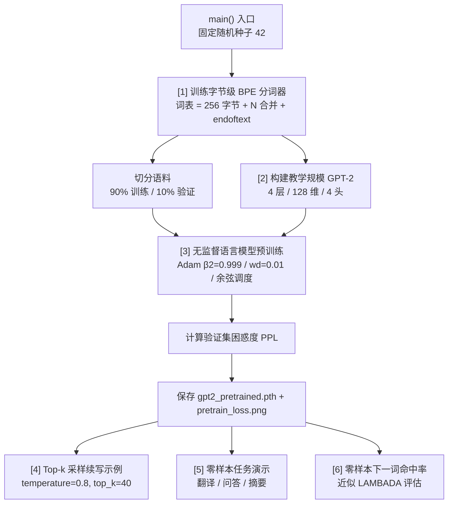

本页面向初次接触本项目的开发者，覆盖从安装依赖到一键运行 `main.py` 的全部步骤。项目采用**教学小规模**设计——4 层 Transformer、128 维隐藏维度、内置微型语料——无需下载任何外部数据集，在普通笔记本上数秒即可完成完整的「分词器训练 → 语言模型预训练 → 零样本任务演示」全流程。

## 环境要求

项目的**唯一硬依赖**是 Python 3.8+ 与 PyTorch；其余库为可选增强项，缺失时代码会自动降级，不会中断运行。

| 依赖 | 是否必须 | 作用 | 未安装时的行为 |
|------|---------|------|--------------|
| `torch` | ✅ 必须 | 模型构建、训练、推理 | 无法运行 |
| `regex` | ⬜ 可选 | 精确匹配 GPT-2 官方 Unicode 正则切分 | 自动退化为标准库 `re`，英文场景不受影响 |
| `matplotlib` | ⬜ 可选 | 绘制预训练损失曲线 `pretrain_loss.png` | 跳过绘图，控制台打印提示 |

Sources: [main.py](main.py#L88-L94), [tokenizer.py](tokenizer.py#L20-L33), [main.py](main.py#L87-L105)

安装命令如下，推荐使用虚拟环境隔离：

```bash
# 1. 创建虚拟环境（可选但推荐）
python -m venv .venv
source .venv/bin/activate    # Windows: .venv\Scripts\activate

# 2. 安装必须依赖（请根据你的平台选择 CUDA 或 CPU 版本，参见 pytorch.org）
pip install torch

# 3. 安装可选增强
pip install regex matplotlib
```

## 运行设备自动检测

项目通过 `pick_device()` 函数自动选择最优计算设备，按优先级依次探测 **CUDA（NVIDIA GPU）→ MPS（Apple Silicon）→ CPU**，你无需手动指定任何参数。

```python
def pick_device() -> torch.device:
    if torch.cuda.is_available():
        return torch.device("cuda")
    if getattr(torch.backends, "mps", None) and torch.backends.mps.is_available():
        return torch.device("mps")
    return torch.device("cpu")
```

由于模型规模极小（约几十万参数），即便在纯 CPU 上，整个六阶段流程也能在数秒内跑完。启动后第一行输出即显示当前设备：`device = cpu`（或 `cuda` / `mps`）。

Sources: [main.py](main.py#L23-L28), [main.py](main.py#L111-L118)

## 一键运行

项目入口为 `main.py`，无需任何命令行参数，直接执行即可：

```bash
python main.py
```

如果希望调整训练强度，可通过两个**环境变量**进行控制，无需修改源码：

| 环境变量 | 默认值 | 作用 | 推荐调参场景 |
|---------|--------|------|------------|
| `PRETRAIN_EPOCHS` | `10` | 语言模型预训练的轮数 | 增大可降低损失与困惑度，如 `20` |
| `BPE_VOCAB` | `500` | BPE 分词器的目标词表大小 | 增大可获得更精细的子词，如 `1000` |

组合使用示例：

```bash
PRETRAIN_EPOCHS=20 BPE_VOCAB=1000 python main.py
```

Sources: [main.py](main.py#L6-L9), [main.py](main.py#L112-L113), [README.md](README.md#L62-L70)

## 六阶段执行流程

`main()` 函数将 GPT-2 的核心研究流程编排为六个连续阶段，一条命令走完全部环节。以下流程图展示了各阶段的输入输出关系：



各阶段的职责与关键参数总结如下：

| 阶段 | 核心动作 | 关键参数 | 产出 |
|------|---------|---------|------|
| **[1] BPE 分词器** | 在内置语料上学习字节级合并规则 | `BPE_VOCAB` | `ByteBPETokenizer` 实例 |
| **[2] 模型构建** | 初始化 4 层教学规模 GPT-2 + 打印论文 4 种规模参考参数量 | n_ctx=128, n_embd=128, n_layer=4, n_head=4 | `GPT` 模型 |
| **[3] 预训练** | 无监督下一 token 语言模型训练 + 验证困惑度 | `PRETRAIN_EPOCHS`, lr=3e-3, batch_size=32 | 损失历史、`gpt2_pretrained.pth` |
| **[4] 续写** | 对三个提示词做 top-k 采样生成 16 个新 token | temperature=0.8, top_k=40 | 控制台输出 |
| **[5] 零样本任务** | 翻译/问答/摘要的提示词续写（无微调） | temperature=0.0（贪心）, top_k=0 | 控制台输出 |
| **[6] 评估** | argmax 预测下一 token 的命中率 | 10 条提示 | 命中率百分比 |

Sources: [main.py](main.py#L108-L192), [main.py](main.py#L136-L137), [main.py](main.py#L149-L152)

## 运行产出文件

执行完成后，项目目录下会自动生成两个产物文件，它们已在 `.gitignore` 中排除，不会被纳入版本控制：

| 文件 | 类型 | 说明 |
|------|------|------|
| `gpt2_pretrained.pth` | PyTorch checkpoint | 包含 `GPTConfig` 配置与模型权重，可通过 `load_gpt()` 函数重新加载 |
| `pretrain_loss.png` | PNG 图表 | 预训练损失曲线（安装 matplotlib 后生成） |

如果你希望加载已保存的检查点进行后续实验（如不同提示词的生成），可以使用以下代码：

```python
from main import load_gpt, generate, pick_device
from tokenizer import ByteBPETokenizer

device = pick_device()
model = load_gpt("gpt2_pretrained.pth", device)
tok = ByteBPETokenizer()
tok.train(data.full_corpus(), vocab_size=500)  # 需重新训练以对齐词表

text = generate(model, tok, "the cat", n_new=16, device=device)
print(text)
```

Sources: [main.py](main.py#L75-L84), [main.py](main.py#L157-L160), [.gitignore](.gitignore#L1-L5)

## 文件结构与模块职责

整个项目仅包含五个 `.py` 源文件，各司其职、依赖清晰：

```
31_gpt2/
├── main.py        ← 入口：编排六阶段流程（分词→预训练→续写→零样本）
├── model.py       ← GPT-2 架构：GPTConfig / GELU / Block / GPTModel / GPT
├── tokenizer.py   ← 字节级 BPE 分词器：bytes_to_unicode / train / encode / decode
├── data.py        ← 内置 WebText 风格语料 + 零样本任务提示模板 + 批数据采样
├── train.py       ← 无监督预训练循环 + 困惑度评估 + 学习率调度
└── README.md      ← 项目说明与论文对照表
```

| 模块 | 被谁调用 | 核心导出 |
|------|---------|---------|
| `model.py` | `main.py` | `GPT`, `GPTConfig`（含 `gpt2_small/medium/large/xl` 预设） |
| `tokenizer.py` | `main.py` | `ByteBPETokenizer` |
| `data.py` | `main.py`, `train.py` | `full_corpus()`, `seed_everything()`, `split_corpus()`, `lm_batch()`, 零样本提示模板 |
| `train.py` | `main.py` | `pretrain()`, `perplexity()` |

Sources: [main.py](main.py#L14-L20), [train.py](train.py#L20), [README.md](README.md#L55-L60)

## 常见问题速查

| 问题 | 原因 | 解决方案 |
|------|------|---------|
| `ModuleNotFoundError: No module named 'torch'` | 未安装 PyTorch | `pip install torch` |
| 输出中看到 `Ġ` 符号 | 正常现象——这是 `bytes_to_unicode` 将空格（0x20）映射为 U+0120 的产物 | 无需处理，详见 [bytes_to_unicode 映射](11-bytes_to_unicode-ying-she-kong-ge-wei-he-bian-cheng-g) |
| 控制台显示 `(未安装 regex…)` | 缺少 `regex` 库，退化为标准库 `re` | `pip install regex` 可完全对齐 GPT-2 的 Unicode 切分 |
| 控制台显示 `(未安装 matplotlib，跳过绘图)` | 缺少 `matplotlib` | `pip install matplotlib` 即可生成损失曲线图 |
| 零样本翻译/问答结果为空或无意义 | 教学语料极小（约 800 词），模型只学会了训练分布内的模式 | 正常现象——真正的零样本泛化需 WebText 量级（~40GB）数据才会涌现 |
| 运行速度慢 | 可能在使用 CPU 且环境变量设得过大 | 使用默认参数，或减少 `PRETRAIN_EPOCHS` |

Sources: [main.py](main.py#L122-L128), [main.py](main.py#L182-L188), [tokenizer.py](tokenizer.py#L26-L33), [README.md](README.md#L78-L80)

## 下一步阅读

完成首次运行后，建议按以下顺序深入理解各模块的实现细节：

- **理解运行输出**：[运行输出解读：从分词到零样本任务的完整演示流程](4-yun-xing-shu-chu-jie-du-cong-fen-ci-dao-ling-yang-ben-ren-wu-de-wan-zheng-yan-shi-liu-cheng)——逐行解释控制台输出的含义
- **了解架构全貌**：[项目总览：GPT-2 无监督多任务学习的核心思想](1-xiang-mu-zong-lan-gpt-2-wu-jian-du-duo-ren-wu-xue-xi-de-he-xin-si-xiang)——从研究视角理解 GPT-2 的设计哲学
- **对比演进**：[GPT-2 与 GPT-1 的核心区别速查表](3-gpt-2-yu-gpt-1-de-he-xin-qu-bie-su-cha-biao)——快速了解架构层面的关键差异