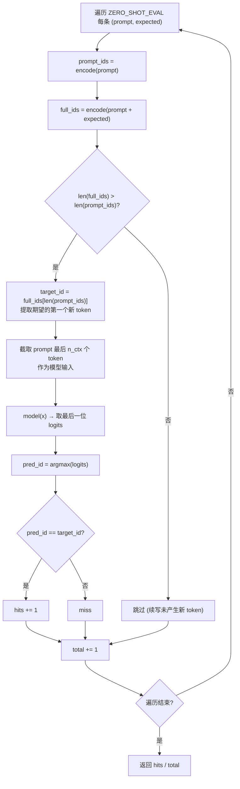

GPT-2 的革命性主张是：一个纯语言模型经过大规模无监督训练后，可以在**不做任何参数微调**的前提下完成下游任务。如何量化验证这一主张？本项目实现了一个近似 LAMBADA 风格的"下一词命中"评估方法，用最简形式展示了 GPT-2 论文核心评测范式的运作原理——给定提示词，比较模型贪心预测的下一个 token 与正确续写的第一个 token 是否一致，以此统计命中率。本文档深入解析这一评估机制的数据结构、算法流程、设计决策及其与真实 LAMBADA 基准的关系。

---

## 评估范式的理论基础：为什么是"下一词"

LAMBADA（LAnguage Modeling Broadened to Account for Discourse Aspects）是 Paperno 等人于 2016 年提出的基准数据集，其任务形式为：给定一段叙事文本作为上下文，要求模型预测文本的最后一个目标词。与一般的困惑度评估不同，LAMBADA 强调的是**长距离上下文推理能力**——目标词往往依赖跨越多个句子的语境信息，而非简单的局部 n-gram 统计。

Children's Book Test（CBT）则侧重于功能词（介词、连词等）和命名实体的预测能力。两类基准的共同本质都是：**给定前缀，评估模型对下一个 token 的预测准确率**。GPT-2 论文在 LAMBADA 上报告的 zero-shot 准确率为 63.24%（如表 3 所列），远超此前最佳的有监督方法，直接验证了"大规模语言模型天然具备零样本任务能力"这一核心论点。

本项目将这一范式最小化：不再依赖外部标注数据集，而是内置一组 `(prompt, expected)` 二元组，用 argmax 贪心解码替代概率排序，以最小代码量展示评估机制的完整流程。

Sources: [main.py](main.py#L53-L72), [data.py](data.py#L107-L123)

---

## 评估数据结构：ZERO_SHOT_EVAL 二元组

评估数据定义在 `data.py` 中，是一个 `(prompt, expected)` 元组列表，每条记录包含一个提示词前缀和期望的续写文本：

| 类型 | Prompt 示例 | Expected 续写 | 验证能力 |
|------|-------------|---------------|----------|
| 问答 | `"question : what is the capital of france ? answer :"` | `" paris"` | 事实知识提取 |
| 翻译 | `"translate to french , the cat :"` | `" le"` | 跨语言映射 |
| 补全 | `"the capital of japan is :"` | `" tokyo"` | 事实知识 |
| 补全 | `"the sun rises in the"` | `" east"` | 常识推理 |
| 补全 | `"honey is sweet and lemon is"` | `" sour"` | 语义关联 |

这些提示词的核心设计原则是：**prompt 与 expected 的拼接必须是语料中自然出现的连续文本**。例如 `"question : what is the capital of france ? answer : paris"` 正是 `WEBTEXT_TASK_EXAMPLES` 中的一行。这确保了模型在预训练中已"见过"这种文本模式，高命中率说明模型成功学到了"提示→补全"的关联映射——这正是无监督多任务学习的运作机制。

值得注意的是，expected 字符串都以空格开头（如 `" paris"` 而非 `"paris"`）。这不是偶然：在 GPT-2 的 BPE 分词器中，前导空格会被编码为词的一部分（以 `Ġ` 表示），因此 `" paris"` 和 `"paris"` 编码出的 token 序列完全不同。空格前缀确保了 expected 文本从 prompt 的末尾 token 自然延续为一个**新的独立 token**。

Sources: [data.py](data.py#L107-L123), [data.py](data.py#L45-L59)

---

## 评估算法：argmax 贪心下一词预测

`zero_shot_accuracy` 函数是评估的核心实现，其算法可分解为以下精确步骤：



### Token 边界提取的精巧设计

算法中最关键的步骤是目标 token 的提取。代码通过两次编码的长度差来实现：

```python
prompt_ids = tok.encode(prompt)        # 例如 [12, 45, 78]
full_ids = tok.encode(prompt + expected)  # 例如 [12, 45, 78, 203, 91]
target_id = full_ids[len(prompt_ids)]      # = 203，即 expected 的首个 token
```

这种方法利用了 BPE 分词器的**因果单调性**：对于 `encode(prompt)` 与 `encode(prompt + expected)`，前者一定是后者的前缀——因为 BPE 的正则预切分在每个边界上独立工作，prompt 末尾不会因为拼接 expected 而改变自身的 token 化结果（前提是 prompt 的最后一个 token 与 expected 的第一个 token 分属不同的预切分片段）。该假设在大多数情况下成立，但有一个边界条件需要守护：当 expected 太短、或者 prompt 末尾本身没有形成完整 token 时，`full_ids` 可能不会比 `prompt_ids` 更长，因此代码用 `if len(full_ids) <= len(prompt_ids): continue` 做防御性跳过。

### 贪心解码 vs. 概率生成

评估使用的是 `argmax` 贪心解码——取 logits 最大的那个 token 作为预测，而非概率采样。这与生成任务中的 top-k 采样策略形成鲜明对比：

| 维度 | 评估（本函数） | 生成（`generate` 函数） |
|------|----------------|------------------------|
| 解码方式 | `argmax`（确定性贪心） | `multinomial`（随机采样） |
| 温度 | 无（隐含 T=1） | `temperature=0.8` 缩放 |
| 截断 | 无（全词表搜索） | `top_k=40` 尾部截断 |
| 目标 | 可复现的准确率度量 | 多样性与质量平衡 |
| 重复运行 | 结果完全一致 | 每次不同 |

选择 argmax 的根本原因在于**评估的可复现性与可比性**：准确率指标要求对同一模型、同一输入产生确定的输出，概率采样引入的随机性会使得评估结果不可比较。这也是 LAMBADA 等标准基准采用"预测词出现在 top-N"或"exact match"而非"生成质量打分"的根本逻辑。

Sources: [main.py](main.py#L53-L72), [main.py](main.py#L31-L50)

---

## 模型前向路径：从 token 到 logits

评估的预测能力完全依赖模型的 forward 路径。`zero_shot_accuracy` 中调用 `model(x)[0, -1].argmax()` 这一表达式，浓缩了从输入到预测的完整计算链：

1. **输入构建**：`prompt_ids[-model.cfg.n_ctx:]` 截取提示词的最后 `n_ctx` 个 token，确保不超出上下文窗口。
2. **前向传播**：`model(x)` 返回 `(B, T, V)` 形状的 logits，其中 B=1（单条评估），T 为序列长度，V 为词表大小。
3. **提取末位**：`[0, -1]` 取 batch 中唯一序列的最后一个位置——即模型基于全部上下文对下一个 token 的预测分布。
4. **贪心决策**：`.argmax()` 在整个词表维度上取最大值索引，得到预测 token ID。

这条路径内部依次经过 token 嵌入、位置嵌入、多层 Transformer Block（因果自注意力 + 前馈网络）、末层 LayerNorm，最终通过语言模型头映射回词表维度。LM 头与 token 嵌入共享权重，这使得 logits 本质上是"当前位置隐藏向量与所有 token 嵌入的点积"——语义上是在度量"当前位置最像哪个 token"。

Sources: [main.py](main.py#L68-L70), [model.py](model.py#L190-L209)

---

## 评估上下文窗口截断策略

代码中 `prompt_ids[-model.cfg.n_ctx:]` 这一截断操作体现了 GPT-2 因果掩码模型的本质约束。模型的因果自注意力掩码是一个严格的下三角矩阵，位置 i 只能 attend 到位置 0..i。当输入序列超过 `n_ctx` 时，最前面（最早）的 token 会被截断，因为位置嵌入 `wpe` 最多只有 `n_ctx` 个。

在本项目的教学配置中 `n_ctx=128`，而 `ZERO_SHOT_EVAL` 中的 prompt 都很短（通常不超过 15-20 个 token），因此截断几乎不触发。但在真实 GPT-2（n_ctx=1024）的 LAMBADA 评估中，某些叙事文本段落可能接近或超过窗口长度，截断策略会显著影响结果——被截掉的上下文意味着模型丢失了关键的远距离信息，而这恰恰是 LAMBADA 设计来测试的能力。这也是为什么 GPT-2 将上下文长度从 GPT-1 的 512 扩展到 1024 的原因之一。

Sources: [main.py](main.py#L68-L69), [model.py](model.py#L169-L177)

---

## 评估指标解读与局限性

### 输出格式

评估结果以简洁的百分比形式呈现：

```
[6] 零样本「预测下一个 token」评估 (argmax，近似 LAMBADA/CBT):
  命中 100% (10 条提示)。
```

`hits / max(1, total)` 中的 `max(1, total)` 是防御性编程——防止 `ZERO_SHOT_EVAL` 为空时出现除零异常。

### 本项目评估的关键局限

代码注释中明确指出了这种教学实现的本质局限。下表系统性地对比了本项目与真实 GPT-2 评估的差异：

| 维度 | 本项目 | 真实 GPT-2 / LAMBADA |
|------|--------|---------------------|
| 评估集大小 | 10 条手工构造的提示 | LAMBADA 测试集 ~5,000+ 条 |
| 数据来源 | 预训练语料中已有的文本模式 | 全新、模型从未见过的叙事文本 |
| 词表大小 | ~500（教学级 BPE） | 50,257（完整字节级 BPE） |
| 模型规模 | 4 层 / 128 维 / 4 头 | 12-48 层 / 768-1600 维 |
| 训练数据 | ~20 行内联语料 | WebText ~40GB |
| 高命中率含义 | 学会了"提示→补全"关联模式 | 真正的零样本泛化到未见分布 |

最后一个维度最为关键：本项目中的评估提示几乎全部来自预训练语料的直接重现，因此高命中率只能证明模型学会了"在训练分布内的模式匹配"，而非真正的零样本泛化。**真正的零样本能力需要模型在训练时从未见过的任务格式和语言上表现出超越随机的预测能力**，这需要 WebText 量级的数据才能涌现。代码注释精确地揭示了这一区分，这对理解 GPT-2 的核心论点至关重要。

Sources: [main.py](main.py#L182-L188), [main.py](main.py#L70-L72)

---

## 评估机制与困惑度的互补关系

本项目的评估体系包含两个互补指标，它们从不同角度衡量语言模型的质量：

| 指标 | 困惑度 (PPL) | 下一词命中率 |
|------|-------------|-------------|
| 数学本质 | exp(平均 token NLL) | argmax 命中比例 |
| 粒度 | 连续概率分布的紧凑度 | 离散的 0/1 判定 |
| 评估范围 | 整个验证集 token 流 | 精选的提示-补全对 |
| 优势 | 覆盖面广、敏感于整体质量 | 直观、可解释、对接下游任务 |
| 局限 | 不直接反映任务完成质量 | 依赖评估集设计、粒度粗 |

困惑度衡量的是"模型对整个 token 序列的概率分布有多集中"——一个 PPL=1.0 的模型能完美预测每个 token。但 PPL 的高低与"能否完成特定任务"之间存在非线性关系：PPL 从 50 降到 40 可能不会提升任务命中率，而从 10 降到 5 却可能带来质的飞跃。下一词命中率则直接测量模型在特定任务提示上的表现，是连接语言建模质量与下游任务能力的桥梁。

GPT-2 论文同时报告了困惑度（在 WebText/LAMBADA/CBWT 等数据集上）和任务准确率，正是这种互补性的体现。本项目的双指标设计——`perplexity` 函数评估整体语言建模质量，`zero_shot_accuracy` 函数评估特定任务提示上的预测能力——复刻了这一评估哲学。

Sources: [main.py](main.py#L155-L156), [main.py](main.py#L184-L185), [train.py](train.py#L96-L121)

---

## 扩展阅读

- [困惑度（Perplexity）：GPT-2 的核心评估指标计算方法](17-kun-huo-du-perplexity-gpt-2-de-he-xin-ping-gu-zhi-biao-ji-suan-fang-fa) — 深入理解与之互补的连续概率评估指标
- [零样本任务机制：翻译、问答与摘要的提示词模板设计](18-ling-yang-ben-ren-wu-ji-zhi-fan-yi-wen-da-yu-zhai-yao-de-ti-shi-ci-mo-ban-she-ji) — 了解评估数据所依赖的提示词模板构造原理
- [Top-k 采样生成：温度缩放与概率截断策略](19-top-k-cai-yang-sheng-cheng-wen-du-suo-fang-yu-gai-lu-jie-duan-ce-lue) — 对比评估中 argmax 与生成中概率采样的不同解码策略
- [语言模型头与 Token 嵌入权重绑定机制](9-yu-yan-mo-xing-tou-yu-token-qian-ru-quan-zhong-bang-ding-ji-zhi) — 理解 argmax 操作所依赖的 logits 计算路径