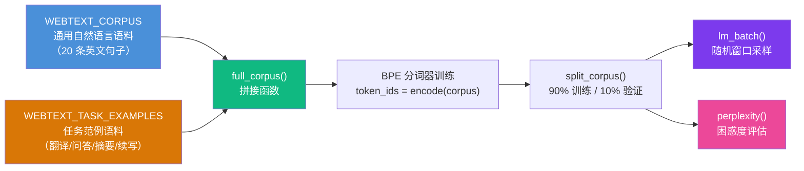
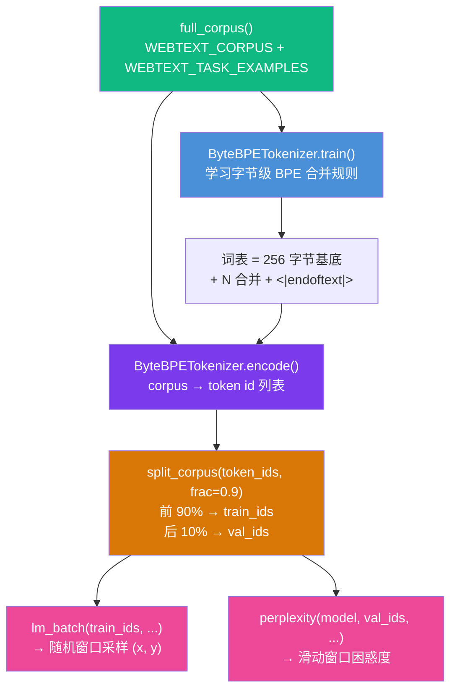
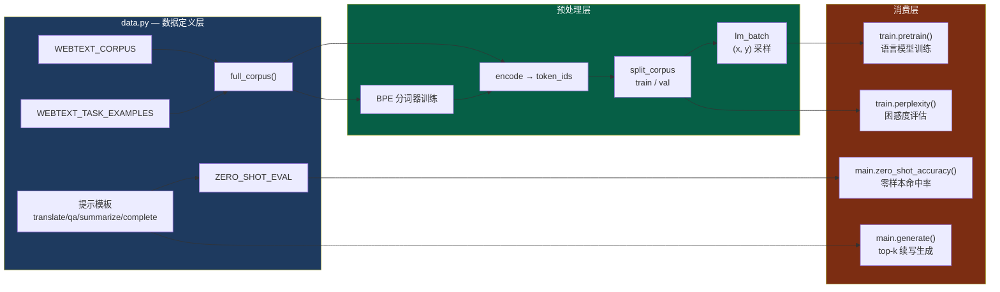

GPT-2 的革命性思想——**无监督多任务学习**——在数据层面有一个精巧的设计：它不做任何有监督微调，而是把翻译、问答、摘要等任务统统写成**自然语言文本续写**的格式，混入语言模型的预训练语料中。本文深入剖析本项目中数据是如何被组织成「WebText 风格通用语料 + 任务范例」的双层结构，以及零样本提示模板与评估集是如何与这套语料协同工作的。

## 设计哲学：两层语料的互补结构

本项目将数据组织为两个部分：一份模仿真实 WebText 的**通用自然语言语料**，以及一份**任务范例语料**。前者提供语言的统计规律和世界知识（如"法国的首都是巴黎"），后者让模型在纯语言建模训练中自然见到翻译、问答、摘要的任务格式。二者拼接后共同作为预训练输入，使分词器、词表分布与零样本提示模板共享同一套词汇空间。



这并非随意拼凑。**通用语料**构建了模型对基本语言模式和世界事实的理解；**任务范例**则确保模型见过"任务 = 文本续写"这一映射格式。在真实 GPT-2 中，这种映射并不来自人工编写的范例——而是隐含在 WebText 约 40GB 的自然网页文本中（网页中天然包含问答、翻译片段等）。本项目通过显式注入任务范例来**模拟**这一效果，使得在极小数据规模下也能演示无监督多任务机制。

Sources: [data.py](data.py#L1-L19)

## 第一层：WebText 风格通用语料

`WEBTEXT_CORPUS` 是一段精心设计的小型英文文本，由 20 条语法完整的短句组成。其内容覆盖自然语言描述（猫坐在垫子上、女人走进图书馆）、常识知识（水的沸点是 100 摄氏度、法国的首都是巴黎）、以及多语言基础（她在家说英语在学校说法语）。每条句子以 `.` 结尾，词频分布被设计得偏向高频常用词（the, and, is, a 等），以便在小词表（默认 500）下 BPE 合并能有效地捕获有意义的子词单元。

真实 WebText 的来源是 Reddit 上 karma ≥ 3 的外链网页文本，OpenAI 的筛选标准确保了内容质量（社区认可度高），这也解释了为什么 GPT-2 能在零样本任务上获得显著优于随机的表现——高质量、大规模的自然语言覆盖使模型隐式学会了多种任务格式。本项目将其缩小到可在数秒内完成训练的规模，牺牲了泛化能力但保留了架构演示的完整性。

Sources: [data.py](data.py#L21-L42)

## 第二层：任务范例语料

`WEBTEXT_TASK_EXAMPLES` 是整个无监督多任务设计的**数据核心**。它包含三种任务格式，每一种都以纯文本形式呈现，模型只需"接着写下去"即可完成：

| 任务类型 | 语料中的格式范例 | 对应提示模板函数 | 模型预期行为 |
|---------|----------------|----------------|------------|
| **翻译** | `translate to french , the cat : le chat` | `translate_prompt(text, lang)` | 在 `:` 后续写翻译结果 |
| **问答** | `question : what is the capital of france ? answer : paris` | `qa_prompt(question)` | 在 `answer :` 后续写答案 |
| **摘要** | `a long and boring movie ... tl ; dr : a boring movie .` | `summarize_prompt(text)` | 在 `tl ; dr :` 后续写摘要 |
| **知识补全** | `the capital of france is : paris` | `complete_prompt(prefix)` | 续写常识事实 |

值得注意的是，任务范例中的某些内容与通用语料**刻意重叠**——例如"法国的首都是巴黎"同时出现在两层语料中，这种设计在小数据场景下确保模型有足够的上下文来建立"提示 → 补全"的关联，而非依赖大规模数据的统计涌现。

Sources: [data.py](data.py#L43-L59)

## 语料拼接与预处理流水线

`full_corpus()` 函数将两层语料简单字符串拼接——通用语料在前，任务范例在后。这个拼接结果随后被用于两个关键路径：**BPE 分词器训练**（学习合并规则）和**语言模型预训练**（生成训练/验证的 token 流）。



在 `main.py` 的实际调用中，分词器先在完整语料上训练，然后将同一语料编码为 token id 流，再通过 `split_corpus` 按 90/10 比例切分。**分词器训练用的是完整语料**（训练 + 验证），这与工业实践一致——词表是数据无关的前处理步骤；但 **困惑度评估只使用验证集的 token 流**，确保评估指标反映泛化能力而非记忆能力。

Sources: [data.py](data.py#L62-L64), [main.py](main.py#L120-L133)

## 零样本提示模板：任务到文本的统一映射

四种提示模板函数是连接"任务"与"语言模型续写"的桥梁。每个函数接收结构化参数（如待翻译文本、目标语言），输出一段**与训练范例格式完全一致**的自然语言字符串：

- **`translate_prompt("the cat", "french")`** → `"translate to french , the cat :"` — 模型在此处续写翻译结果
- **`qa_prompt("what is the capital of france ?")`** → `"question : what is the capital of france ? answer :"` — 模型续写答案
- **`summarize_prompt("a fast red car ...")`** → `"a fast red car ... tl ; dr :"` — 模型续写摘要
- **`complete_prompt("the cat")`** → `"the cat"` — 通用前缀续写，无固定格式

**格式一致性**是这里的关键原则。模板生成的提示字符串与 `WEBTEXT_TASK_EXAMPLES` 中的训练范例在标点、空格、措辞上严格对齐——例如翻译模板用 `translate to {lang} , {text} :`（逗号和冒号前都有空格），问答模板用 `question : ... answer :`（不含问号后空格）。如果提示格式与训练分布偏离，模型在小数据量下的表现会急剧下降。

Sources: [data.py](data.py#L83-L104)

## 零样本评估集：下一词命中测试

`ZERO_SHOT_EVAL` 是一个 `(prompt, expected)` 元组列表，共 10 条，用于计算零样本"预测下一个 token"的 argmax 命中率。评估逻辑是：将 prompt 编码为 token id 序列，将 prompt + expected 也编码，取二者的长度差位置作为**目标 token id**，再比较模型 argmax 输出的 token id 是否与目标一致。

| # | 任务类型 | 提示词 | 期望续写 | 说明 |
|---|---------|-------|---------|------|
| 1-3 | 问答 | `question : what is the capital of {country} ? answer :` | ` paris` / ` tokyo` / ` rome` | 首都知识问答 |
| 4-5 | 翻译 | `translate to french , the {word} :` | ` le` / ` la` | 法语翻译 |
| 6-7 | 知识补全 | `the capital of {country} is :` | ` paris` / ` tokyo` | 格式化事实 |
| 8 | 常识 | `the sun rises in the` | ` east` | 自然语言续写 |
| 9 | 常识 | `honey is sweet and lemon is` | ` sour` | 味觉常识 |
| 10 | 常识 | `a dog is an animal and a cat is an animal` | ` too` | 句子补全 |

这套评估设计近似 **LAMBADA**（预测段落的下一个词）和 **Children's Book Test**（从上下文预测缺失词）的思想。`main.py` 中的说明也明确指出：这些提示大多属于训练分布，高命中率验证的是模型已学会"提示 → 补全"的关联机制；真正的零样本泛化（对训练时完全未见过的任务或语言）需要 WebText 量级的数据才能涌现。

Sources: [data.py](data.py#L107-L123), [main.py](main.py#L53-L72)

## 训练/验证集切分策略

`split_corpus()` 的实现极其简洁——对扁平化的 token id 流做**前 90% / 后 10% 的顺序切分**，不做随机打乱。这是一个设计上的有意选择：

```python
def split_corpus(token_ids, frac=0.9):
    k = int(len(token_ids) * frac)
    return token_ids[:k], token_ids[k:]
```

由于语料拼接顺序是 `WEBTEXT_CORPUS`（通用语料）在前、`WEBTEXT_TASK_EXAMPLES`（任务范例）在后，切分后**验证集主要由任务范例的后半部分构成**。这意味着验证集上的困惑度不仅反映通用语言建模质量，也部分反映模型对任务格式的拟合程度。在更大规模的实验中，通常会在文档边界（`<|endoftext|>` 标记处）进行切分以避免文档被截断，但本项目的教学规模下顺序切分已足够。

Sources: [data.py](data.py#L126-L129)

## 端到端数据流总结



整个数据组织可以归纳为三个层次：**定义层**（`WEBTEXT_CORPUS` + `WEBTEXT_TASK_EXAMPLES` + 模板 + 评估集）→ **预处理层**（BPE 训练 → 编码 → 切分 → 批采样）→ **消费层**（预训练循环 / 困惑度 / 零样本评估 / 生成演示）。定义层是核心——它决定了模型将学到什么知识、以什么格式理解任务，以及在零样本场景下如何被"激活"。

---

**下一步阅读**：

- 了解批数据采样的详细机制（随机窗口、目标位移），请阅读 [语言模型批数据采样与训练/验证集切分](22-yu-yan-mo-xing-pi-shu-ju-cai-yang-yu-xun-lian-yan-zheng-ji-qie-fen)
- 了解零样本提示模板背后的理论动机，请阅读 [零样本任务机制：翻译、问答与摘要的提示词模板设计](18-ling-yang-ben-ren-wu-ji-zhi-fan-yi-wen-da-yu-zhai-yao-de-ti-shi-ci-mo-ban-she-ji)
- 了解 BPE 分词器如何处理这套语料，请阅读 [BPE 训练流程：正则预切分、频率合并与词表构建](12-bpe-xun-lian-liu-cheng-zheng-ze-yu-qie-fen-pin-lu-he-bing-yu-ci-biao-gou-jian)