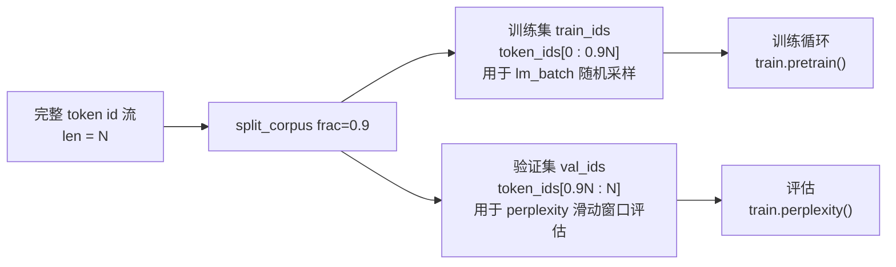
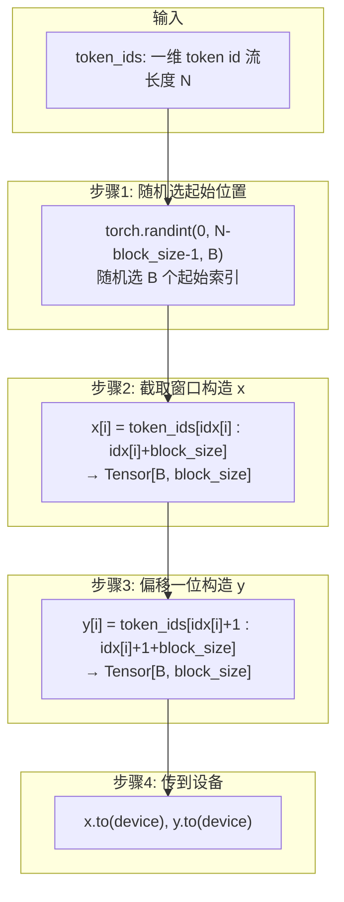
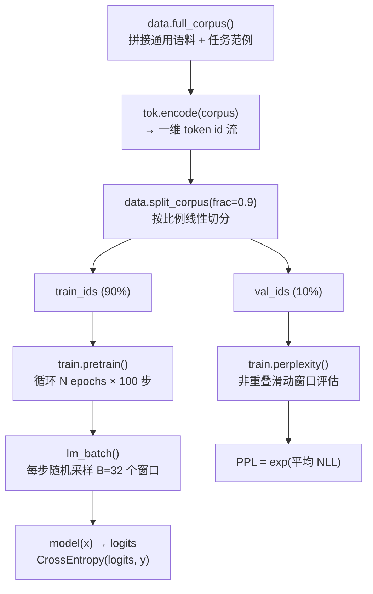

本页聚焦 GPT-2 数据管道中两个关键环节：**如何将整份语料编码后的扁平 token id 流切分为训练集与验证集**，以及**如何从训练集中随机采样一个批次的语言模型训练数据**。这两者是预训练循环运转的「数据引擎」——前者划定了学习与评估的边界，后者决定了每个优化步所见的样本如何构造。

## 扁平 token 流：一切操作的起点

在本项目中，所有语料（通用英文文本 + 任务范例）首先拼接为一段完整字符串，然后经 byte-level BPE 分词器编码为**一维的 `List[int]` token id 流**。这不是按句子组织的列表，也不是按文档切分的嵌套结构，而是一个纯粹的、线性的整数序列。

```python
# main.py 中的调用链
corpus = data.full_corpus()                        # str：通用语料 + 任务范例拼接
train_ids, val_ids = data.split_corpus(tok.encode(corpus), frac=0.9)
```

`tok.encode(corpus)` 返回的扁平 token id 流会被直接传入 `split_corpus`，后续的批采样函数 `lm_batch` 也直接在这个一维列表上操作。这种设计有一个重要含义：**GPT-2 的语言模型训练并不依赖文档边界**——它学习的是「给定前文 token，预测下一个 token」的通用分布，而文档之间的分隔符（`<|endoftext|>`）本身也是语料中的一个 token，模型会自然学会在它出现时重置上下文。

Sources: [main.py](main.py#L125-L133), [data.py](data.py#L62-L64)

## 训练/验证集切分：按 token 流线性分割

`split_corpus` 函数完成了训练/验证集的划分，其逻辑极其简洁——按比例在线性 token 流上切一刀：

```python
def split_corpus(token_ids: List[int], frac: float = 0.9) -> Tuple[List[int], List[int]]:
    k = int(len(token_ids) * frac)
    return token_ids[:k], token_ids[k:]
```

函数接收完整的 token id 列表和一个比例参数 `frac`（默认 `0.9`，即前 90% 训练、后 10% 验证），计算分割点 `k = int(len(token_ids) * frac)`，然后返回两个切片。整个过程用一张图即可概括：



这里有几个值得注意的设计决策：

**为什么按比例线性切分而非随机打散？** 因为自然语言存在内在的顺序结构。线性切分使得训练集和验证集覆盖了语料的不同段落，验证集衡量的是模型对「未见过那段文本」的泛化能力。这与 GPT-2 原始论文使用 WebText 数据集的做法一脉相承——论文将文档按不同来源/时间划分，避免训练集与评估集的信息泄露。

**为什么是 token 级别而非文档级别？** 对于教学规模的迷你语料（仅几百个 token），文档级别切分会导致验证集样本太少无法评估。在真实 WebText（约 40GB）的规模下，token 级与文档级切分的差异可忽略不计。

**`frac` 参数的灵活性与默认值**，如下表所示：

| 参数 | 类型 | 默认值 | 作用 | 说明 |
|---|---|---|---|---|
| `token_ids` | `List[int]` | — | 编码后的完整语料 token id 流 | 由 `tok.encode(corpus)` 生成 |
| `frac` | `float` | `0.9` | 训练集占比 | `int()` 截断确保分割点为整数；剩余部分自动用于验证 |

Sources: [data.py](data.py#L126-L129), [main.py](main.py#L132-L133)

## 批数据随机采样：从一维流中抽取训练样本

`lm_batch` 是训练循环中每一步都会调用的核心函数。它从扁平 token id 流中随机选取 `batch_size` 个起始位置，每个位置截取长度为 `block_size` 的窗口，构造出 `(x, y)` 样本对。

### 函数签名与返回值

```python
def lm_batch(token_ids: List[int], block_size: int, batch_size: int,
             device: torch.device, generator: torch.Generator):
    """从扁平 token id 流中随机采样一个 batch 的语言模型数据。
    返回 (x, y)：x 为 (B, block_size) 输入，y 为 x 右移一位的下一个 token。
    """
```

| 参数 | 类型 | 含义 |
|---|---|---|
| `token_ids` | `List[int]` | 训练集的扁平 token id 流 |
| `block_size` | `int` | 窗口长度（等于模型上下文长度 `n_ctx`） |
| `batch_size` | `int` | 每步采样的样本数（本项目中为 32） |
| `device` | `torch.device` | 张量放置的目标设备 |
| `generator` | `torch.Generator` | 控制随机性的 PRNG，保证可复现 |
| **返回 x** | `Tensor[B, block_size]` | 模型输入 |
| **返回 y** | `Tensor[B, block_size]` | 目标标签（x 右移一位） |

### 采样流程详解



逐行解析核心代码：

```python
n = len(token_ids)
idx = torch.randint(0, max(1, n - block_size - 1), (batch_size,), generator=generator)
x = torch.stack([torch.tensor(token_ids[i:i + block_size], dtype=torch.long) for i in idx])
y = torch.stack([torch.tensor(token_ids[i + 1:i + 1 + block_size], dtype=torch.long) for i in idx])
return x.to(device), y.to(device)
```

**第一行**——获取 token 流长度 `n`。**第二行**——随机采样 `batch_size` 个起始位置，上界设为 `n - block_size - 1`（取 `max(1, ...)` 防止极短语料产生非法上界）。这个上界保证每个窗口的 x 和 y 都能完整截取到 `block_size` 个 token，不会越界。**第三行**——对每个起始位置 `i`，截取 `token_ids[i : i+block_size]` 作为模型输入序列。**第四行**——对同一个起始位置，截取 `token_ids[i+1 : i+1+block_size]` 作为目标序列。这正是语言模型的**自回归目标**：y 就是 x 向右平移一位的结果。

### x 与 y 的偏移关系：语言模型的核心训练信号

理解 x 和 y 的偏移关系是理解整个语言模型训练的关键。以下用一个具体的小例子展示：

```
token_ids = [10, 20, 30, 40, 50, 60, 70, 80]   (n=8, block_size=4)

假设随机选中起始位置 i=2:

  x = token_ids[2:6]  = [30, 40, 50, 60]
  y = token_ids[3:7]  = [40, 50, 60, 70]

位置对齐：
  x[0]=30 → 预测 → y[0]=40
  x[1]=40 → 预测 → y[1]=50
  x[2]=50 → 预测 → y[2]=60
  x[3]=60 → 预测 → y[3]=70
```

也就是说，对于 x 中的每个位置 `t`，模型需要根据 `x[0..t]` 的全部 token（由因果掩码保证看不到未来）来预测 `y[t]`。一个长度为 `block_size` 的窗口内，**每个 token 位置都贡献了一次预测训练信号**——这就是语言模型高效利用数据的方式：一段文本的每个位置都在同时训练。

### `max(1, n - block_size - 1)` 的防御性设计

当语料非常短（token 数接近或小于 `block_size`）时，`n - block_size - 1` 可能为负数或零。`max(1, ...)` 确保随机采样的上界至少为 1，使得 `torch.randint(0, 1, ...)` 始终返回 0。这意味着在极短语料下，所有 batch 都会从位置 0 开始截取——虽然信息量有限，但不会崩溃。

Sources: [data.py](data.py#L70-L80), [train.py](train.py#L77-L79)

## 随机种子与可复现性

数据采样中的随机性（`lm_batch` 内的起始位置选择）由 `torch.Generator` 精确控制，而全局随机状态则由 `seed_everything` 统一初始化：

```python
def seed_everything(seed: int = 42):
    """固定随机种子以保证可复现。"""
    random.seed(seed)
    torch.manual_seed(seed)
```

在训练循环中，`lm_batch` 接收一个独立的 `torch.Generator` 实例（`manual_seed(0)`），与全局种子分离。这意味着即便其他代码修改了全局随机状态，批采样的随机序列也不受干扰：

```python
# train.py pretrain() 中：
gen = torch.Generator(device="cpu").manual_seed(0)
# ...
x, y = lm_batch(token_ids, block_size, batch_size, device, gen)
```

这种**局部 Generator** 的设计有两个好处：第一，同一训练配置下，每一步采样的 batch 完全确定，实验可精确复现；第二，如果将来需要做数据增强或对比实验，只需更换 Generator 的种子即可得到不同的采样序列，互不干扰。

Sources: [data.py](data.py#L132-L136), [train.py](train.py#L72), [main.py](main.py#L109)

## 在完整管线中的位置

将批采样与切分放入整体训练管线中，可以清晰看到数据的流动路径：



训练集 `train_ids` 只流向 `lm_batch` → `pretrain`，验证集 `val_ids` 只流向 `perplexity` 评估。两条路径互不交叉，确保评估时使用的数据从未参与训练，从而困惑度指标反映的是真正的泛化能力。

在 `main.py` 中，切分发生在分词器训练完成后、模型构建之前：

```python
train_ids, val_ids = data.split_corpus(tok.encode(corpus), frac=0.9)
# → train_ids 喂入 train.pretrain(model, train_ids, ...)
# → val_ids   喂入 train.perplexity(model, val_ids, ...)
```

Sources: [main.py](main.py#L132-L156), [train.py](train.py#L61-L90), [train.py](train.py#L96-L121)

## 参数速查总表

下表汇总了数据采样与切分中涉及的所有关键参数及其取值：

| 来源 | 参数 | 取值 | 含义 |
|---|---|---|---|
| `main.py` 调用 `split_corpus` | `frac` | `0.9` | 训练集占 90%，验证集占 10% |
| `main.py` 调用 `pretrain` | `block_size` | `cfg.n_ctx` (= 128) | 窗口长度 = 上下文长度 |
| `main.py` 调用 `pretrain` | `batch_size` | `32` | 每步采样 32 个窗口 |
| `train.py` pretrain 内部 | `iters_per_epoch` | `100` | 每 epoch 采样 100 步 |
| `train.py` pretrain 内部 | `gen.manual_seed` | `0` | 批采样 Generator 种子 |
| `data.py` seed_everything | `seed` | `42` | 全局随机种子 |
| `lm_batch` 内部 | 采样上界 | `max(1, n - block_size - 1)` | 防止窗口越界 |

Sources: [main.py](main.py#L149-L152), [train.py](train.py#L68-L72), [data.py](data.py#L70-L80)

## 相关页面

- 了解 `lm_batch` 产生的数据如何被用于计算损失和反向传播，参见 [无监督语言模型预训练循环：目标函数与批次采样](14-wu-jian-du-yu-yan-mo-xing-yu-xun-lian-xun-huan-mu-biao-han-shu-yu-pi-ci-cai-yang)
- 了解验证集 `val_ids` 如何用于困惑度计算，参见 [困惑度（Perplexity）：GPT-2 的核心评估指标计算方法](17-kun-huo-du-perplexity-gpt-2-de-he-xin-ping-gu-zhi-biao-ji-suan-fang-fa)
- 了解切分前的语料如何组织，参见 [WebText 风格语料与任务范例的数据组织方式](21-webtext-feng-ge-yu-liao-yu-ren-wu-fan-li-de-shu-ju-zu-zhi-fang-shi)