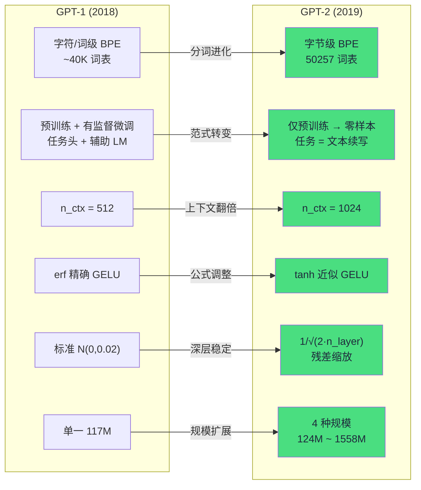

GPT-2 并非对 GPT-1 的架构革命，而是一次**系统性的工程进化**——同一个 Pre-LN 解码器骨架，但在分词、初始化、训练范式和模型规模上做出了精确调整，最终催生了「无监督多任务学习」这一全新范式。本页以速查表形式，逐一对比每一处变化，并标注代码中的精确位置，帮助初学者快速建立两代模型的全景认知。

## 全景对比：九大维度一览

下面的流程图从宏观视角展示了 GPT-1 到 GPT-2 的演进路径，绿色标注的是关键变化点：



Sources: [model.py](model.py#L1-L12), [tokenizer.py](tokenizer.py#L1-L15), [train.py](train.py#L1-L13)

---

## 区别一：分词器——从字符级 BPE 到字节级 BPE

GPT-1 使用字符/词级 BPE 分词，词表约 40K，仍存在遇到未登录词（OOV）时退化为基础字符的风险。**GPT-2 彻底转向字节级 BPE**：以 256 个字节为基底（而非字符），再在其上学习高频字节对合并。这意味着任何文本——无论何种语言、甚至二进制噪声——都能被编码，**永远不产生 `<unk>`**。GPT-2 的实际词表为 50257（256 字节 + 50000 合并 + 1 个 `<|endoftext|>` 特殊 token）。

一个直观的副作用是：GPT-2 词表中前导空格会被映射为 `Ġ`（U+0120），因为 `bytes_to_unicode()` 将不可打印字节 0x20 映射到了 U+0100 之后的位置。

Sources: [tokenizer.py](tokenizer.py#L1-L14), [tokenizer.py](tokenizer.py#L36-L53)

| 对比维度 | GPT-1 | **GPT-2** |
|:---|:---|:---|
| 分词单元 | 字符 / 子词 | **字节（0–255）** |
| 词表大小 | ~40,000 | **50,257** |
| OOV 处理 | 退化为字符 | **完全消除**（任何输入均可编码） |
| 特殊 token | 无统一方案 | **`<\|endoftext\|>`** 作为文档边界与结束符 |
| 空格表示 | 原始字符 | **`Ġ`**（U+0120，`bytes_to_unicode` 映射产物） |

> 💡 深入了解字节映射原理，参见 [bytes_to_unicode 映射：空格为何变成 Ġ](11-bytes_to_unicode-ying-she-kong-ge-wei-he-bian-cheng-g)；BPE 训练与编码细节，参见 [BPE 训练流程](12-bpe-xun-lian-liu-cheng-zheng-ze-yu-qie-fen-pin-lu-he-bing-yu-ci-biao-gou-jian) 和 [编码与解码](13-bian-ma-yu-jie-ma-cong-wen-ben-dao-token-id-de-wu-sun-wang-fan)。

---

## 区别二：任务范式——从微调到零样本（核心变化）

这是 **GPT-2 相对 GPT-1 最根本的范式转变**。GPT-1 采用两阶段策略：先无监督预训练，再为每个下游任务（分类、蕴含等）附加**任务头**并做**有监督微调**。GPT-2 完全抛弃了任务头和微调阶段——模型只有语言模型头，所有任务通过**把任务写成自然语言提示词**，让纯语言模型「接着写下去」来完成：

```
翻译:   translate to french , the cat :          →  le chat
问答:   question : what is the capital of france ? answer :   →  paris
摘要:   a fast red car drove down the street . tl ; dr :       →  a fast car drove .
```

在本项目中，这一变化直接体现为 `GPT` 类**不内置任何任务头**，语言模型头 `LMHead` 与 token 嵌入权重绑定，零样本任务模板定义在 `data.py` 中。

Sources: [main.py](main.py#L1-L5), [model.py](model.py#L190-L209), [data.py](data.py#L83-L99)

| 对比维度 | GPT-1 | **GPT-2** |
|:---|:---|:---|
| 训练阶段 | 预训练 + **有监督微调** | **仅预训练**（无微调） |
| 任务头 | 每任务独立的分类/回归头 | **无**——仅 LM 头 |
| 任务执行方式 | 针对每个任务微调参数 | **零样本提示续写**（无参数更新） |
| 核心思想 | 预训练初始化 + 微调适配 | **无监督多任务学习** |

> 💡 提示词模板设计，参见 [零样本任务机制](18-ling-yang-ben-ren-wu-ji-zhi-fan-yi-wen-da-yu-zhai-yao-de-ti-shi-ci-mo-ban-she-ji)。

---

## 区别三：上下文长度翻倍——从 512 到 1024

GPT-1 的最大上下文长度为 **512 个 token**，GPT-2 将其扩展到 **1024 个 token**。更长的上下文窗口意味着模型能"看到"更多历史信息，这对零样本任务尤其关键——更长的提示词才能充分表达复杂的任务指令。本实现中 `n_ctx` 在 `GPTConfig` 中定义，论文规模的四个预设均使用 1024。

Sources: [model.py](model.py#L25-L26), [model.py](model.py#L146)

---

## 区别四：GELU 激活函数——从 erf 精确版到 tanh 近似版

GELU（高斯误差线性单元）是 Transformer 前馈网络的激活函数。GPT-1 使用 PyTorch 默认的**精确 erf 版本**：`gelu(x) = x · Φ(x)`。GPT-2 改用 **tanh 近似版**，以匹配 OpenAI 官方权重：

```
gelu(x) = 0.5 · x · (1 + tanh(√(2/π) · (x + 0.044715 · x³)))
```

两种公式在数值上非常接近，但使用 tanh 近似的模型可以直接加载 OpenAI 发布的原始权重而无需微调。本实现在 `GELU` 类中严格按官方公式实现。

Sources: [model.py](model.py#L52-L61)

| 对比维度 | GPT-1 | **GPT-2** |
|:---|:---|:---|
| 公式 | `x · Φ(x)`（精确 erf） | `0.5x · (1 + tanh(√(2/π)·(x + 0.044715x³)))` |
| 动机 | 数学精确 | **匹配官方预训练权重** |

> 💡 公式的数学原理与实现细节，参见 [前馈网络与 tanh 近似 GELU 激活函数](7-qian-kui-wang-luo-yu-tanh-jin-si-gelu-ji-huo-han-shu)。

---

## 区别五：残差路径缩放初始化——稳定深层训练的关键

GPT-1 的所有权重统一用 `N(0, 0.02)` 初始化。**GPT-2 引入了额外的残差缩放**：注意力子层和前馈子层的输出投影（`c_proj`）权重按 **1/√(2·n_layer)** 额外缩放，即标准差变为 `0.02 / √(2·n_layer)`。

原理很直觉：每个 Block 有 2 条残差路径（注意力 + 前馈），当 Block 堆叠到 48 层（XL 规模）时，残差路径的方差会逐层累积。缩放因子确保深层网络中残差路径的方差不会发散，从而稳定训练。本实现中，缩放在 `GPTModel.__init__` 中对所有 `c_proj.weight` 参数应用。

Sources: [model.py](model.py#L150-L155)

| 对比维度 | GPT-1 | **GPT-2** |
|:---|:---|:---|
| 权重初始化 | 所有权重 `N(0, 0.02)` | Linear/Embedding `N(0, 0.02)`；**`c_proj` 额外 ÷ √(2·n_layer)** |
| 缩放对象 | 无 | 注意力 `c_proj` + 前馈 `c_proj` |
| 目的 | — | **防止深层残差方差发散** |

> 💡 缩放因子的数学推导与可视化分析，参见 [残差路径缩放初始化](8-can-chai-lu-jing-suo-fang-chu-shi-hua-1-2-n_layer-de-zuo-yong-yu-yuan-li)。

---

## 区别六：模型规模——从单一规格到四档预设

GPT-1 只有单一规模（117M 参数，12 层 / 768 维 / 12 头）。GPT-2 定义了**四档正式预设**，验证了语言建模能力随参数量持续提升（loss 单调下降，零样本性能持续上升）。本实现通过 `GPTConfig` 的四个静态工厂方法精确定义这些预设：

| 预设 | n_layer | n_embd | n_head | 参数量 |
|:---|:---:|:---:|:---:|:---:|
| Small | 12 | 768 | 12 | ~124M |
| Medium | 24 | 1024 | 16 | ~355M |
| Large | 36 | 1280 | 20 | ~774M |
| XL | 48 | 1600 | 25 | ~1558M |

> 注意：GPT-1 的 117M 与 GPT-2 Small 的 124M 结构相近，差异主要来自词表大小不同（~40K vs 50257）。

Sources: [model.py](model.py#L34-L49)

> 💡 各预设的详细配置，参见 [四种模型规模预设](10-si-chong-mo-xing-gui-mo-yu-she-small-medium-large-xl-pei-zhi-xiang-jie)。

---

## 区别七：优化器配置——Adam β2 与权重衰减

GPT-2 对优化器配方做了两处调整：

Sources: [train.py](train.py#L61-L67), [train.py](train.py#L38-L55)

| 对比维度 | GPT-1 | **GPT-2** |
|:---|:---|:---|
| Adam β2 | 0.98 | **0.999** |
| 权重衰减 | 未明确使用 | **0.01**，仅作用于 2D 权重（bias 和 LayerNorm 不衰减） |
| 梯度裁剪 | 未提及 | **1.0**（梯度范数裁剪） |

**β2 = 0.999** 意味着二阶动量的滑动平均更缓慢（接近 1），对梯度的长期趋势更敏感，适合大规模数据的稳定训练。**权重衰减分组**是 GPT-2 的标准做法：LayerNorm 的缩放参数和 bias 不施加正则化，避免过度约束模型的归一化能力。

> 💡 详细分析，参见 [Adam 优化器配置](15-adam-you-hua-qi-pei-zhi-quan-zhong-shuai-jian-fen-zu-yu-b2-0-999-de-xuan-ze) 和 [学习率调度](16-xue-xi-lu-diao-du-xian-xing-warmup-yu-yu-xian-shuai-jian-ce-lue)。

---

## 区别八：数据与评估——WebText 与困惑度

GPT-1 使用 BooksCorpus（约 5GB 书籍文本）。GPT-2 构建了全新的 **WebText** 数据集——从 Reddit 上 karma ≥ 3 的帖子中抓取的外链网页文本，规模约 40GB。WebText 的关键特征是**质量更高**（社区筛选）且**涵盖任务格式**（问答、翻译等自然出现的文本模式）。

评估指标方面，GPT-1 在下游任务上报告分类准确率；GPT-2 在多个零样本基准上报告**困惑度 PPL**（perplexity）和下一词命中率。

Sources: [data.py](data.py#L14-L20), [train.py](train.py#L93-L121), [main.py](main.py#L53-L72)

| 对比维度 | GPT-1 | **GPT-2** |
|:---|:---|:---|
| 预训练数据 | BooksCorpus（~5GB） | **WebText**（~40GB，Reddit karma ≥ 3） |
| 核心评估指标 | 下游任务分类准确率 | **困惑度 PPL** + 零样本命中率 |
| 基准任务 | GLUE / SQuAD 等（需微调） | LAMBADA / CBT / 翻译 / 问答等（**零样本**） |

> 💡 WebText 风格语料的数据组织，参见 [WebText 风格语料与任务范例的数据组织方式](21-webtext-feng-ge-yu-cao-liao-yu-ren-wu-fan-li-de-shu-ju-zu-zhi-fang-shi)；困惑度计算方法，参见 [困惑度（Perplexity）](17-kun-huo-du-perplexity-gpt-2-de-he-xin-ping-gu-zhi-biao-ji-suan-fang-fa)。

---

## 区别九：不变项——两代共享的架构基石

理解区别的同时，也要明确哪些**没有变**。GPT-2 继承了 GPT-1 的所有核心架构决策：

Sources: [model.py](model.py#L116-L133), [model.py](model.py#L136-L176)

| 共享特性 | 说明 |
|:---|:---|
| **Pre-LN 解码器** | 每层先 LayerNorm 再注意力/前馈（非 Post-LN） |
| **末层归一化 ln_f** | Block 堆叠后加一层 LayerNorm |
| **学习型位置编码** | `wpe` 可训练的位置嵌入（非正弦固定编码） |
| **因果自注意力** | 上三角掩码，只看左侧 token |
| **LM 头权重绑定** | 输出投影复用 token 嵌入矩阵 `wte` |
| **无监督 LM 目标** | `L = −Σ log P(uᵢ | u_{i−k}, ..., u_{i−1})` |

---

## 速查总表

以下表格汇总全部九大区别，方便快速查阅：

| # | 维度 | GPT-1 | **GPT-2** | 实现位置 |
|:---:|:---|:---|:---|:---|
| 1 | 分词 | 字符/词级 BPE (~40K) | **字节级 BPE (50257)** | [tokenizer.py](tokenizer.py#L1-L14) |
| 2 | 任务方式 | 预训练 + **微调** | **零样本**（无任务头） | [model.py](model.py#L190-L209), [data.py](data.py#L83-L99) |
| 3 | 上下文长度 | 512 | **1024** | [model.py](model.py#L25-L26) |
| 4 | 激活函数 | erf 精确 GELU | **tanh 近似 GELU** | [model.py](model.py#L52-L61) |
| 5 | 残差初始化 | N(0, 0.02) | **+ 1/√(2·n_layer) 缩放** | [model.py](model.py#L150-L155) |
| 6 | 模型规模 | 单一 117M | **四档 (124M~1558M)** | [model.py](model.py#L34-L49) |
| 7 | Adam β2 | 0.98 | **0.999 + 权重衰减 0.01** | [train.py](train.py#L61-L67) |
| 8 | 数据 / 评估 | BooksCorpus / 分类准确率 | **WebText / 困惑度 PPL** | [data.py](data.py#L14-L20), [train.py](train.py#L93-L121) |
| 9 | 特殊 token | 无统一方案 | **`<\|endoftext\|>`** | [tokenizer.py](tokenizer.py#L64) |

Sources: [model.py](model.py#L1-L12), [tokenizer.py](tokenizer.py#L1-L15), [train.py](train.py#L1-L13), [data.py](data.py#L1-L8), [main.py](main.py#L1-L5)

---

## 建议的下一步阅读

掌握以上区别后，建议按以下路径深入：

1. **理解整体架构** → [解码器 Transformer 整体架构](5-jie-ma-qi-transformer-zheng-ti-jia-gou-qian-ru-block-dui-die-yu-mo-ceng-gui-hua) —— 两代共享的解码器骨架细节
2. **深入分词器** → [bytes_to_unicode 映射](11-bytes-to-unicode-ying-she-kong-ge-wei-he-bian-cheng-g) → [BPE 训练流程](12-bpe-xun-lian-liu-cheng-zheng-ze-yu-qie-fen-pin-lu-he-bing-yu-ci-biao-gou-jian) → [编码与解码](13-bian-ma-yu-jie-ma-cong-wen-ben-dao-token-id-de-wu-sun-wang-fan)
3. **体验零样本范式** → [零样本任务机制](18-ling-yang-ben-ren-wu-ji-zhi-fan-yi-wen-da-yu-zhai-yao-de-ti-shi-ci-mo-ban-she-ji) → [运行输出解读](4-yun-xing-shu-chu-jie-du-cong-fen-ci-dao-ling-yang-ben-ren-wu-de-wan-zheng-yan-shi-liu-cheng)