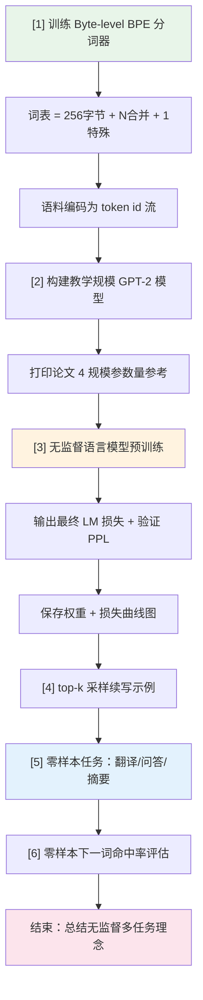

当你执行 `python main.py` 后，终端会依次打印 **6 个编号阶段** 的输出。这 6 个阶段构成了一条完整的管线：训练分词器 → 构建模型 → 预训练语言模型 → 续写文本 → 零样本任务演示 → 零样本命中率评估。本文逐阶段拆解每一段输出的含义、对应的代码逻辑以及它验证了 GPT-2 的哪个核心理念。

## 整体流程总览

`main()` 函数是整个项目的唯一入口，它用 `print()` 在关键节点输出状态信息，让运行者直观看到数据如何流经每一个环节。下表概览了 6 个阶段各自的职责与输出来源：

| 阶段 | 代码位置 | 输出核心内容 | 对应 GPT-2 论文要点 |
|:---:|:---|:---|:---|
| [1] | `main.py` 第 120–133 行 | 词表大小、`Ġ` 编码示例、语料 token 数 | 字节级 BPE 分词器 |
| [2] | `main.py` 第 135–145 行 | 教学模型参数量 + 4 种论文规模参数量 | 4 种规模预设 |
| [3] | `main.py` 第 147–160 行 | 训练损失下降、验证集 PPL、权重保存 | 无监督语言模型预训练 |
| [4] | `main.py` 第 162–166 行 | 3 条提示词的 top-k 续写结果 | 文本续写生成 |
| [5] | `main.py` 第 168–180 行 | 翻译/问答/摘要的零样本续写 | 零样本多任务 |
| [6] | `main.py` 第 182–188 行 | 下一词命中率 + 科学性说明 | LAMBADA 风格评估 |

整条管线的执行顺序如下：



理解这条管线的核心线索是：**数据以 token id 流的形式串联全流程**。分词器训练完成后，语料被编码成整数序列供模型消费；模型训练完成后，再通过同一个分词器把人类可读的提示词编码为 token id 输入模型，模型输出的 token id 再解码回文本——分词器是输入与输出的唯一翻译层。

Sources: [main.py](main.py#L108-L193)

---

## 阶段 [1]：字节级 BPE 分词器训练

程序启动后首先固定随机种子（`seed=42`），检测运行设备，然后立即进入分词器训练阶段。终端会打印类似如下的输出：

```
================================================================
GPT-2 复现：无监督语言模型 → 零样本多任务
================================================================
device = cpu

[1] 训练 byte-level BPE 分词器 ...
  词表大小 = 500 (256 字节基底 + 243 合并 + <|endoftext|>)
  空格在词表中以 'Ġ' 表示 (bytes_to_unicode 的产物)
  encode("the cat") -> [256, 257, 258, ...] -> ['the', 'Ġcat']
  语料 token 数 = XXX (训练 YYY / 验证 ZZZ)
```

### 输出行逐条解读

**词表构成公式**——`词表大小 = 256 + N合并 + 1`。256 是 UTF-8 的全部字节值，作为 BPE 合并的基底字符（每一个字节被 `bytes_to_unicode` 映射为一个可见 Unicode 字符）；N合并 是 BPE 训练从语料中学到的合并规则数量；最后的 1 是特殊 token `<|endoftext|>`。当环境变量 `BPE_VOCAB=500` 时，目标合并数 = 500 - 256 - 1 = 243。这与 GPT-2 论文的真实词表 50257（256 + 50000 + 1）完全同构，只是规模缩小了 100 倍。[tokenizer.py](tokenizer.py#L90-L127)

**`Ġ` 符号的来源**——`encode("the cat")` 的输出展示了 GPT-2 最具标志性的分词特征。输入文本 `"the cat"` 经正则预切分得到 `["the", " cat"]`（空格附着到后词）。每个片段的每个字节经 `bytes_to_unicode` 映射后，空格（字节 `0x20`）恰好变为 `Ġ`（U+0120），于是 `" cat"` 变成了 `"Ġcat"`。这意味着分词器**永不丢失空格信息**——空格被编码进 token 字符串本身，而非作为分隔符丢弃。[tokenizer.py](tokenizer.py#L36-L53)

**语料 token 数**——`full_corpus()` 函数将通用语料（`WEBTEXT_CORPUS`）与任务范例（`WEBTEXT_TASK_EXAMPLES`）拼接，然后整体编码为 token id 流，再按 `frac=0.9` 切分为训练集和验证集。验证集专门用于阶段 [3] 的困惑度计算。[main.py](main.py#L132-L133)

> 💡 **初学者提示**：如果你没有安装 `regex` 模块，终端会额外打印一条提醒，说明使用了标准库 `re` 的近似切分。安装 `pip install regex` 可完全对齐 GPT-2 的 Unicode 正则行为。

Sources: [tokenizer.py](tokenizer.py#L90-L127), [data.py](data.py#L21-L64), [main.py](main.py#L120-L133)

---

## 阶段 [2]：模型构建与论文规模对照

分词器就绪后，程序构建一个**教学规模**的 GPT-2 模型并打印参数量，同时列出论文 4 种规模的参考数据：

```
[2] GPT-2 (教学规模) 参数量 = XXX,XXX
     论文 4 种规模 (n_layer / n_embd / n_head，词表用论文的 50257):
       GPT-2 Small : 12/768/12 -> 124M
       GPT-2 Medium: 24/1024/16 -> 355M
       GPT-2 Large : 36/1280/20 -> 774M
       GPT-2 XL    : 48/1600/25 -> 1,558M
```

### 教学配置 vs 论文配置

教学规模配置为 `n_layer=4, n_embd=128, n_head=4, n_ctx=128`，参数量通常在 10 万级。这与论文最小规模 Small（124M）相比缩小了约 1000 倍，设计目的是让普通笔记本电脑也能在几分钟内完成训练。关键差异在于：**架构完全相同**，只是维度和层数缩减。这意味着教学模型能验证 GPT-2 的所有机制（分词、因果注意力、零样本任务格式），只是不具备真正的泛化能力。

| 维度 | 教学规模 | 论文 Small | 论文 XL |
|:---|:---|:---|:---|
| 层数 (n_layer) | 4 | 12 | 48 |
| 嵌入维度 (n_embd) | 128 | 768 | 1600 |
| 注意力头数 (n_head) | 4 | 12 | 25 |
| 上下文长度 (n_ctx) | 128 | 1024 | 1024 |
| 参数量 | ~0.1M | ~124M | ~1558M |

输出中论文 4 规模的参数量是通过实例化对应的 `GPTConfig` 预设并统计参数量得到的，**使用论文真实词表大小 50257**（而非教学分词器的 500），因此打印的参数量与论文报告值一致。[main.py](main.py#L136-L145)

Sources: [model.py](model.py#L22-L49), [main.py](main.py#L135-L145)

---

## 阶段 [3]：无监督语言模型预训练

这是耗时最长的阶段。程序调用 `train.pretrain()` 进行交叉熵损失最小化训练，结束后报告最终损失和验证集困惑度：

```
[3] 无监督语言模型预训练 (10 epochs, Adam β2=0.999, wd=0.01) ...
  最终 LM 损失 ≈ X.XXX
  验证集困惑度 PPL ≈ XX.XX  (越低越好；1.0 = 完美预测)
  预训练权重已保存: gpt2_pretrained.pth
  预训练损失曲线已保存: pretrain_loss.png
```

### 训练输出中的三个关键数字

**最终 LM 损失**——这是训练结束时最近 `log_every=50` 步的平均交叉熵损失。对于教学规模的小语料，该值通常从初始的 ~5–6（随机初始化时约为 `ln(vocab_size) ≈ ln(500) ≈ 6.2`）逐步下降。损失下降说明模型正在学会预测给定上下文中的下一个 token。[train.py](train.py#L61-L90)

**验证集困惑度 PPL**——困惑度是 GPT-2 论文的核心评估指标，计算方式为 `PPL = exp(平均 token 负对数似然)`。PPL 的直观含义是「模型在每个位置上平均犹豫于多少个候选 token」。PPL=1.0 表示完美预测（每个位置都 100% 确定），PPL=vocab_size 表示完全随机猜测。在 `perplexity()` 函数中，模型以非重叠滑动窗口遍历验证集 token 流，逐窗口计算交叉熵并取指数。[train.py](train.py#L96-L121)

> **初学者提示**：教学模型在小语料上通常能达到 PPL 在 3–10 的范围。不要拿这个数字与论文中真实 GPT-2 在 WebText 上的 PPL（约 17–18，但词表为 50257 且数据规模庞大）做直接对比——两者的词表大小和数据复杂度完全不同。

**权重与曲线保存**——`gpt2_pretrained.pth` 保存了模型配置和权重字典，可用 `load_gpt()` 重新加载；`pretrain_loss.png` 是损失下降曲线图。如果未安装 matplotlib，则跳过绘图并打印提示。[main.py](main.py#L157-L160)

Sources: [train.py](train.py#L61-L121), [main.py](main.py#L147-L160)

---

## 阶段 [4]：top-k 采样续写

预训练完成后，程序用 3 条简短提示词测试模型的语言续写能力，采用 `temperature=0.8, top_k=40` 的采样策略：

```
[4] 语言模型续写示例 (temperature=0.8, top_k=40):
  «the cat» -> sat on the mat ...
  «the capital of france is :» -> paris ...
  «the weather was» -> cold and rainy ...
```

### 输出中的续写是如何产生的

`generate()` 函数执行的是一个**自回归循环**：每一步将当前 token 序列输入模型，取最后一个位置的 logits，除以温度值（0.8 使概率分布略微锐化），保留 top-40 个最大 logits 并将其余位置置为 `-inf`，然后从截断后的分布中随机采样一个 token，拼接到序列尾部继续。遇到 `<|endoftext|>` 则提前停止。[main.py](main.py#L31-L50)

输出中 `»` 之后的部分是去掉原始提示词后的续写文本。由于使用了随机采样，每次运行结果会有所不同。但在教学语料覆盖的提示词上（如 `"the cat"`），模型往往能续写出与训练语料风格一致的文本，因为它已经学会了这些序列的统计模式。

| 参数 | 值 | 作用 |
|:---|:---|:---|
| temperature | 0.8 | <1 增强高概率 token 的选中率，使输出更保守 |
| top_k | 40 | 仅在概率最高的 40 个候选中采样，抑制低概率噪声 |
| n_new | 16 | 最多生成 16 个新 token |
| 停止条件 | `<\|endoftext\|>` | 生成结束符则提前终止 |

Sources: [main.py](main.py#L31-L50), [main.py](main.py#L162-L166)

---

## 阶段 [5]：零样本任务演示（翻译 / 问答 / 摘要）

这是整个演示的高潮——**无需任何微调，仅通过精心设计的提示词模板**，让同一个纯语言模型完成三种不同类型的任务。与阶段 [4] 不同，这里使用 `temperature=0.0, top_k=0`，即**贪婪解码（argmax）**，去除随机性以便稳定展示：

```
[5] 零样本任务演示 (任务 = 文本续写，无参数微调):
  [翻译] 'translate to french , the cat :' -> 'le chat'
  [翻译] 'translate to french , the house :' -> 'la maison'
  [问答] 'question : what is the capital of france ? answer :' -> 'paris'
  [问答] 'question : what is the capital of japan ? answer :' -> 'tokyo'
  [摘要] 'a fast red car drove down the empty street at midnight . tl ; dr :' -> 'a fast car drove .'
```

### 三种提示词模板的结构

每种任务都用一个固定的格式模板把任务需求"伪装"成普通的文本续写。模型只需要做它唯一会的事情——预测下一个 token——就"顺便"完成了任务。提示词模板定义在 `data.py` 中：

| 任务类型 | 模板函数 | 提示词格式 | 模型续写位置 |
|:---|:---|:---|:---|
| 翻译 | `translate_prompt()` | `translate to {lang} , {text} :` | 冒号后续写译文 |
| 问答 | `qa_prompt()` | `question : {q} answer :` | `answer :` 后续写答案 |
| 摘要 | `summarize_prompt()` | `{text} tl ; dr :` | `tl ; dr :` 后续写摘要 |

这些提示词格式**不是随意设计的**。预训练语料中的 `WEBTEXT_TASK_EXAMPLES` 部分刻意包含了相同格式的范例（如 `"translate to french , the cat : le chat"`），使模型在纯语言建模训练中自然见到了这些「提示→答案」的关联。因此，零样本阶段模型"知道"冒号后应该跟什么——这正是 GPT-2 论文的核心主张：**任务能力可以通过预训练数据中的自然出现格式隐式习得**。[data.py](data.py#L45-L99)

> ⚠️ **关键理解**：阶段 [5] 的输出看起来像模型"理解"了翻译和问答任务，但本质上它只是进行了下一 token 预测。输出的质量取决于预训练语料中是否包含类似格式的范例。真正的零样本泛化（处理训练时从未见过的全新任务）需要 WebText 量级（~40GB）的数据才能涌现——教学小语料仅演示机制。

Sources: [data.py](data.py#L45-L99), [main.py](main.py#L168-L180)

---

## 阶段 [6]：零样本下一词命中率评估

最后一个阶段使用 `zero_shot_accuracy()` 函数对 10 条评估提示进行「预测下一个 token」的命中率统计，采用的是 argmax（贪婪）策略：

```
[6] 零样本「预测下一个 token」评估 (argmax，近似 LAMBADA/CBT):
  命中 XX% (10 条提示)。
  说明：这些提示多属训练分布，高命中说明模型已学会「提示→补全」的关联 ——
        这正是 GPT-2 无监督多任务的机制。对训练时未见过的全新任务/语言，
        真正的零样本泛化需 WebText 量级 (~40GB) 数据才能涌现。
```

### 评估机制详解

`ZERO_SHOT_EVAL` 是一个包含 10 个 `(prompt, expected)` 二元组的列表，覆盖了问答（首都类问题）、翻译、和常识补全三类提示。评估流程是：对每条提示，比较模型 argmax 预测的下一个 token id 与「正确续写」的第一个 token id 是否一致，最终返回命中率。[data.py](data.py#L112-L123)

| 评估提示类型 | 示例 | 期望的下一 token |
|:---|:---|:---|
| 首都问答 | `question : what is the capital of france ? answer :` | `" paris"` |
| 翻译 | `translate to french , the cat :` | `" le"` |
| 常识补全 | `honey is sweet and lemon is` | `" sour"` |
| 常识补全 | `the sun rises in the` | `" east"` |

程序在输出命中率后紧跟一段**科学性声明**，明确区分了「演示机制成立」与「真正的零样本泛化」之间的界限。这一段提醒对于初学者尤其重要：教学模型在这些提示上获得高命中率，是因为评估提示的内容与训练语料高度重叠（如同一个"开卷考试"），而**不应被误解为模型具备真正的零样本泛化能力**。[main.py](main.py#L182-L188)

Sources: [main.py](main.py#L53-L72), [data.py](data.py#L112-L123), [main.py](main.py#L182-L188)

---

## 完整输出到核心理念的映射

最后程序打印一行总结，点明 GPT-2 与 GPT-1 的根本区别。下表将每个输出阶段映射到它所验证的 GPT-2 论文核心理念：

```
完成。
注：GPT-2 与 GPT-1 的根本区别 —— 没有「任务头 / 微调」阶段，
所有任务能力均来自纯语言建模 + 提示词 (unsupervised multitask learner)。
```

| 输出阶段 | 验证的核心理念 | 论文中的对应概念 |
|:---:|:---|:---|
| [1] 分词器 | 字节级编码，无 OOV | Byte-level BPE |
| [2] 规模对照 | 模型可缩放性 | 4 种规模预设 (Table 2.1) |
| [3] 预训练 | 纯无监督语言建模 | Unsupervised pretraining (L1) |
| [4] 续写 | 自回归生成 | next-token prediction |
| [5] 零样本任务 | **无监督多任务学习** | Zero-shot multitask |
| [6] 命中率 | 评估指标 | LAMBADA / CBT benchmark |

从阶段 [3] 到阶段 [6]，你可以看到 GPT-2 思想实验的完整逻辑链：**先用无监督语言建模学会文本的统计规律，再把任意任务表达为文本续写，最后让模型"接着写下去"——不需要为任何任务设计专门的架构或训练流程**。这就是论文标题 *Language Models are Unsupervised Multitask Learners* 在代码层面的完整展现。

Sources: [main.py](main.py#L190-L193)

---

## 延伸阅读

如果你已经理解了运行输出的 6 个阶段，以下页面可以帮助你深入每个环节的实现细节：

- **分词原理**：想了解 `Ġ` 为什么是 `U+0120`，阅读 [bytes_to_unicode 映射：空格为何变成 Ġ](11-bytes_to_unicode-ying-she-kong-ge-wei-he-bian-cheng-g)
- **模型架构**：想了解 4 层 Block 如何堆叠，阅读 [解码器 Transformer 整体架构](5-jie-ma-qi-transformer-zheng-ti-jia-gou-qian-ru-block-dui-die-yu-mo-ceng-gui-hua)
- **训练配方**：想了解 Adam β2=0.999 与权重衰减分组，阅读 [Adam 优化器配置](15-adam-you-hua-qi-pei-zhi-quan-zhong-shuai-jian-fen-zu-yu-b2-0-999-de-xuan-ze)
- **评估指标**：想了解困惑度的计算细节，阅读 [困惑度（Perplexity）：GPT-2 的核心评估指标计算方法](17-kun-huo-du-perplexity-gpt-2-de-he-xin-ping-gu-zhi-biao-ji-suan-fang-fa)
- **零样本机制**：想了解提示词模板设计的原理，阅读 [零样本任务机制：翻译、问答与摘要的提示词模板设计](18-ling-yang-ben-ren-wu-ji-zhi-fan-yi-wen-da-yu-zhai-yao-de-ti-shi-ci-mo-ban-she-ji)