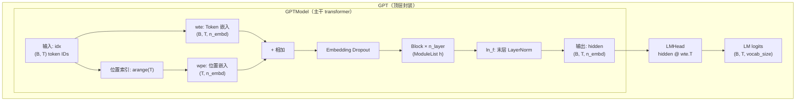
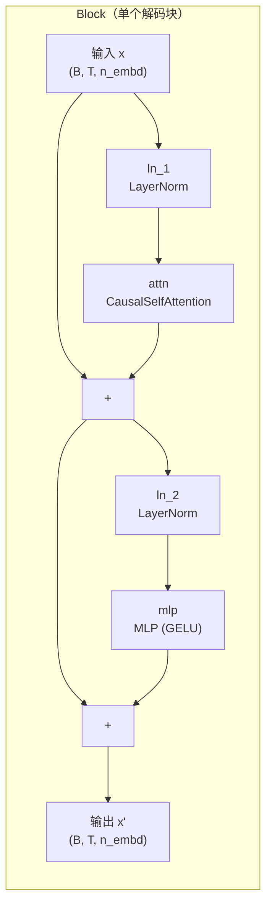
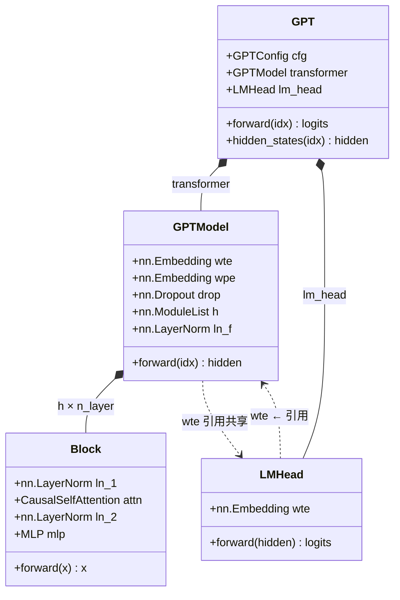

GPT-2 的骨架是一个 **仅解码器（decoder-only）Transformer**：输入 token ID 序列经过嵌入层转换为连续向量，再依次流过 $n_{\text{layer}}$ 个结构相同的解码块（Block），最终由一层 LayerNorm 归一化输出隐藏表示。整个数据通路可以用一条直线描述——嵌入 → 堆叠变换 → 末层归一化——但这条直线的每一个衔接点都承载着精心的设计决策。本文聚焦于这条主干通路的拓扑结构、张量形状演变与关键设计选择，不展开各子模块的内部机制（注意力、前馈、残差缩放等各有专页讨论）。

Sources: [model.py](model.py#L136-L176)

---

## 架构全景：从 Token ID 到隐藏向量

GPT-2 的模型代码分为三层组合：最外层的 `GPT` 类组装「主体 + 语言模型头」，中间的 `GPTModel` 实现嵌入→Block 堆叠→ln_f 的主干通路，各 `Block` 则封装注意力与前馈两个子层。这种分层设计使得「隐藏状态提取」（`hidden_states`）与「LM logits 计算」（`forward`）共享同一套主干计算，只需在末端选择是否接入 LM 头即可。

上述流程图中的每一个节点都对应 `GPTModel.forward` 中的一行代码。主干通路的输入是 `(B, T)` 形状的整数张量（$B$ 为批次大小，$T$ 为序列长度），输出是 `(B, T, n_embd)` 的浮点隐藏表示，维度全程保持不变——这是残差连接得以堆叠的前提。

Sources: [model.py](model.py#L136-L209)

---

## 嵌入层：Token 嵌入与位置嵌入的逐元素相加

GPT-2 使用**两个独立的嵌入表**，在输入端逐元素相加后送入 Dropout，形成一个同时携带「词义」和「位置」信息的连续表示。

**Token 嵌入（`wte`）** 是一个 `nn.Embedding(vocab_size, n_embd)` 查表操作，将离散的字节级 token ID 映射为 $n_{\text{embd}}$ 维向量。词表大小由字节级 BPE 分词器决定（256 字节基底 + 合并规则数 + 1 个 `<|endoftext|>` 特殊符），而非传统字符/词级 BPE 的词表。

**位置嵌入（`wpe`）** 同样是 `nn.Embedding(n_ctx, n_embd)`，但它是**可学习**的参数化嵌入（而非正弦/余弦固定编码）。位置索引由 `torch.arange(T)` 直接生成——第 $i$ 个位置取嵌入表的第 $i$ 行。`n_ctx`（默认 1024）限定了模型能处理的最大序列长度，序列一旦超出这个上限便需要截断（参见 `forward` 中的断言检查）。值得注意的是，token 嵌入和位置嵌入在相加时**没有额外的缩放系数**——与原始 Transformer 中对位置编码乘以 $\sqrt{d_{\text{model}}}$ 的做法不同，GPT-2 直接相加，因为两者的初始化方差同为 $N(0, 0.02)$，量级自然匹配。

| 嵌入组件 | 类 | 输入 | 输出形状 | 参数量（Small 配置） |
|---|---|---|---|---|
| Token 嵌入 `wte` | `nn.Embedding` | token ID `(B, T)` | `(B, T, 768)` | 50257 × 768 ≈ 38.6M |
| 位置嵌入 `wpe` | `nn.Embedding` | `arange(T)` `(T,)` | `(T, 768)` | 1024 × 768 ≈ 0.79M |
| Embedding Dropout | `nn.Dropout(0.1)` | 相加结果 | `(B, T, 768)` | 0 |

Sources: [model.py](model.py#L145-L148), [model.py](model.py#L169-L173)

---

## Block 堆叠：n_layer 个结构相同的解码块

`GPTModel` 使用 `nn.ModuleList` 将 $n_{\text{layer}}$ 个 `Block` 实例收集为属性 `self.h`（论文中的记法），在前向传播中按顺序逐层调用。每个 Block 的内部结构采用 **Pre-LN**（Pre-Layer Normalization）范式——归一化发生在子层计算**之前**，残差路径跳过归一化直接将输入加到子层输出上：

$$x = x + \text{attn}(\text{ln\_1}(x))$$
$$x = x + \text{mlp}(\text{ln\_2}(x))$$

这意味着每个 Block 内部有**两条独立的残差路径**（注意力子层一条、前馈子层一条），因此一个 $n_{\text{layer}}$ 层的模型共有 $2 \times n_{\text{layer}}$ 条残差跳连。主隐藏流在所有 Block 中始终保持 `(B, T, n_embd)` 的形状不变，这是残差连接能跨层传递梯度的几何基础。

Pre-LN 与 GPT-1 / 原始 Transformer 的 Post-LN 形成鲜明对比。在 Post-LN 中，残差先加再归一化（$x = \text{LN}(x + \text{sublayer}(x))$），深层网络的残差路径会被反复归一化打断，导致靠近输出的层梯度信号较弱。而 Pre-LN 让原始信号通过残差捷径**无损传播**到任意深度，归一化只作用于子层的输入预处理——这使得梯度可以在所有残差路径上畅通无阻地反向流动，极大提升了深层训练的稳定性。GPT-2 从 GPT-1 继承了这一设计选择，所有 4 种规模（12 层到 48 层）均使用 Pre-LN。

Sources: [model.py](model.py#L116-L133), [model.py](model.py#L142-L176)

---

## 末层归一化（ln_f）：输出前的统一量纲

在所有 Block 处理完毕后，`GPTModel.forward` 的最后一行执行了一次 `nn.LayerNorm`，标记为 `ln_f`（final layer norm）。这一层并非可选的附加操作，而是 **Pre-LN 架构的必然要求**：由于 Pre-LN 中每个子层的输出**未经归一化**就直接进入残差路径，经过多层堆叠后的隐藏表示在数值尺度上可能漂移到不一致的范围。`ln_f` 的作用是在进入 LM 头（线性投影到词表 logits）之前，将最后一个位置的隐藏向量重新拉回到零均值、单位方差的标准化空间，确保后续的 softmax 概率计算具有数值稳定性。

如果不加 `ln_f`，最后一层 Block 的输出仍处于「子层叠加后的原始尺度」，不同维度的方差可能差异很大，直接做线性投影会导致 logits 分布过于尖锐或过于平坦，影响生成质量和训练收敛。`ln_f` 的实现参数与 Block 内部的 LayerNorm 完全一致（`eps=1e-5`），遵循标准初始化（gamma=1, beta=0），没有任何特殊处理。

| LayerNorm 位置 | 在代码中的名称 | 作用域 | 出现次数 |
|---|---|---|---|
| Block 内注意力前 | `ln_1` | 每层 Block | $n_{\text{layer}}$ 次 |
| Block 内前馈前 | `ln_2` | 每层 Block | $n_{\text{layer}}$ 次 |
| **全部 Block 之后** | **`ln_f`** | **全局** | **1 次** |

Sources: [model.py](model.py#L149), [model.py](model.py#L176)

---

## 前向传播：完整的张量形状追踪

`GPTModel.forward` 接收 `(B, T)` 的 token ID 张量，输出 `(B, T, n_embd)` 的隐藏向量。以下是每一行代码对应的张量形状演变（以教学默认配置 $n_{\text{embd}}=128$ 为例）：

| 步骤 | 代码 | 形状 | 说明 |
|---|---|---|---|
| 输入 | `idx` | `(B, T)` | 整数 token ID |
| 位置索引 | `torch.arange(T)` | `(T,)` | `[0, 1, ..., T-1]` |
| Token 嵌入 | `self.wte(idx)` | `(B, T, 128)` | 查表 |
| 位置嵌入 | `self.wpe(pos)` | `(T, 128)` | 查表，广播相加 |
| 相加 + Dropout | `self.wte(idx) + self.wpe(pos)` | `(B, T, 128)` | 逐元素加 |
| Block 1 | `block_1(x)` | `(B, T, 128)` | Pre-LN + 两个残差子层 |
| Block 2 … n_layer | `block_n(x)` | `(B, T, 128)` | 形状不变 |
| 末层归一化 | `self.ln_f(x)` | `(B, T, 128)` | 最终隐藏表示 |
| **LM 头**（在 `GPT.forward` 中） | `self.lm_head(hidden)` | `(B, T, V)` | 投影到词表 logits |

关键观察：隐藏维度 `n_embd` 从嵌入层确定后就不再改变，贯穿所有 Block 直到 `ln_f`。形状变换只发生在最末端——LM 头将 `n_embd` 维隐藏向量映射到 `vocab_size` 维 logits。这种「等宽通道」设计是 Transformer 残差架构的标志性特征，使得层与层之间的信息流不需要任何维度适配。

Sources: [model.py](model.py#L169-L176), [model.py](model.py#L208-L209)

---

## 类组装关系：GPT → GPTModel → Block

代码层面的组合关系遵循清晰的职责分离原则。`GPT`（顶层）持有 `GPTModel`（主干）和 `LMHead`（输出头）两个子模块，并通过 `forward` 方法将二者串联。`GPTModel` 则持有嵌入表、Block 列表和 `ln_f`。这种三明治结构的关键设计在于 **权重共享**：`LMHead` 在构造时接收 `GPTModel.wte` 的引用，因此语言模型头的投影矩阵与 token 嵌入表共享同一份参数（详见 [语言模型头与 Token 嵌入权重绑定机制](9-yu-yan-mo-xing-tou-yu-token-qian-ru-quan-zhong-bang-ding-ji-zhi)）。

`GPT` 类额外提供了 `hidden_states` 方法，仅调用 `transformer(idx)` 而不接入 LM 头，用于零样本评估等需要直接访问隐藏表示的场景。`num_parameters` 方法则简单地遍历所有可训练参数求和。这三种入口（`forward`、`hidden_states`、`num_parameters`）覆盖了训练、评估和模型检查的全部使用需求。

Sources: [model.py](model.py#L136-L213)

---

## 进一步阅读

本文覆盖了 GPT-2 解码器 Transformer 的骨架——从嵌入层的双表相加，到 $n_{\text{layer}}$ 个 Pre-LN Block 的顺序堆叠，再到 `ln_f` 的最终归一化。要深入理解每个组件的内部机制，建议按以下顺序继续探索：

- **Block 内部的注意力子层**：QKV 融合投影、因果掩码与残差缩放的完整实现，参见 [多头因果自注意力](6-duo-tou-yin-guo-zi-zhu-yi-li-qkv-rong-he-tou-ying-yin-guo-yan-ma-yu-can-chai-suo-fang)。
- **Block 内部的前馈子层**：`c_fc → GELU → c_proj` 的 4× 内部扩展与 tanh 近似激活函数，参见 [前馈网络与 tanh 近似 GELU](7-qian-kui-wang-luo-yu-tanh-jin-si-gelu-ji-huo-han-shu)。
- **深层残差路径的稳定性**：`c_proj` 权重按 $1/\sqrt{2 \cdot n_{\text{layer}}}$ 额外缩放的数学动机，参见 [残差路径缩放初始化](8-can-chai-lu-jing-suo-fang-chu-shi-hua-1-2-n_layer-de-zuo-yong-yu-yuan-li)。
- **隐藏向量到 logits 的投影**：LM 头与 token 嵌入表共享参数的机制，参见 [语言模型头与 Token 嵌入权重绑定](9-yu-yan-mo-xing-tou-yu-token-qian-ru-quan-zhong-bang-ding-ji-zhi)。
- **模型规模的缩放维度**：从 Small（12 层/768 维）到 XL（48 层/1600 维）的四种预设配置，参见 [四种模型规模预设](10-si-chong-mo-xing-gui-mo-yu-she-small-medium-large-xl-pei-zhi-xiang-jie)。