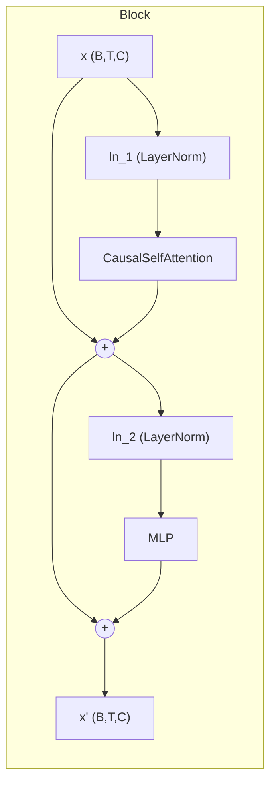
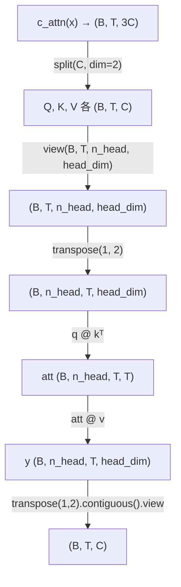

CausalSelfAttention 是 GPT-2 解码器中最核心的子模块——它决定了模型如何在序列内部传递信息、为何能做"自回归"生成、以及深层网络为何能稳定训练。本文将拆解 `c_attn` 融合投影的张量变换、因果掩码的数学语义、多头拆分与合体的维度舞蹈，以及 `c_proj` 权重的残差缩放初始化如何与 Block 的 Pre-LN 残差路径协同工作。

## 架构定位：Block 内的注意力子层

在深入注意力内部之前，先建立上下文坐标。GPT-2 的每个 Transformer Block 采用 **Pre-LN** 结构，注意力和前馈网络各自由 LayerNorm 包裹后接入残差连接。这意味着 CausalSelfAttention 接收的输入已经是归一化后的向量，而非原始嵌入。



注意力子层的残差公式为 `x = x + attn(ln_1(x))`，前馈子层同理。两条残差路径上的 `c_proj` 权重都会被残差缩放因子约束，保证深层堆叠时方差不会爆炸。

Sources: [model.py](model.py#L116-L133)

## QKV 融合投影：单次矩阵乘法的效率优势

GPT-2 的注意力投影并没有使用三个独立的 `nn.Linear`，而是用 **一个线性层 `c_attn`** 将输入从 `n_embd` 映射到 `3 × n_embd`，随后沿特征维度拆分成 Q、K、V 三份。这与 OpenAI 官方实现中的 `Conv1D` 模块在语义上完全等价，只是将三次 `Linear(x)` 合并为一次更大矩阵的乘法，减少了 kernel launch 开销和参数管理的复杂度。

```python
self.c_attn = nn.Linear(cfg.n_embd, 3 * cfg.n_embd)   # 融合 QKV
self.c_proj = nn.Linear(cfg.n_embd, cfg.n_embd)       # 输出投影 (残差缩放)
```

在 forward 阶段，`c_attn(x)` 输出形状为 `(B, T, 3·n_embd)`，通过 `.split(self.n_embd, dim=2)` 在最后一维均分为三块——Q 在前 `n_embd` 列，K 居中，V 居尾。这种 split 操作不会产生数据拷贝，仅仅是 view 级别的切片。

Sources: [model.py](model.py#L77-L78), [model.py](model.py#L87)

## 多头拆分：从 (B, T, C) 到 (B, n_head, T, head_dim)

拆分后的 Q/K/V 各自形状为 `(B, T, n_embd)`，需要进一步reshape 为多头布局。这里有一个微妙但关键的细节：**reshape 的维度顺序**。代码先 `view(B, T, n_head, head_dim)`，再 `.transpose(1, 2)` 将头维度提到第二维，得到 `(B, n_head, T, head_dim)`。



注意 `n_embd` 必须能被 `n_head` 整除（构造时有断言校验），因此 `head_dim = n_embd // n_head`。以默认教学配置为例：`n_embd=128, n_head=4`，则每个头处理 32 维子空间。以论文 Small 配置为例：`n_embd=768, n_head=12`，每个头 64 维。

头维度的提前提取（放到 batch 维之后）使得后续的 `q @ k.transpose(-2, -1)` 和 `att @ v` 可以利用 batched matmul 一次性计算所有头的注意力矩阵，无需循环。

Sources: [model.py](model.py#L71-L91)

## 缩放点积注意力与因果掩码

注意力分数的计算遵循标准公式 `Attention(Q,K,V) = softmax(QKᵀ/√d_k)·V`，但有两处 GPT-2 特有的处理：**缩放因子使用 `head_dim` 而非 `n_embd`**，以及 **上三角因果掩码**。

### 缩放因子的选择

```python
att = (q @ k.transpose(-2, -1)) / math.sqrt(self.head_dim)
```

缩放用的是 `sqrt(head_dim)` 而非 `sqrt(n_embd)`。这是因为每个头独立计算注意力，Q·K 的点积方差取决于 `head_dim` 而非总维度。如果使用 `sqrt(n_embd)` 作为分母，会导致过度缩放，softmax 输出过于均匀，注意力信号被稀释。

### 因果掩码：上三角置 -∞

```python
mask = torch.tril(torch.ones(cfg.n_ctx, cfg.n_ctx)).view(1, 1, cfg.n_ctx, cfg.n_ctx)
self.register_buffer("mask", mask)
```

因果掩码在 `__init__` 中预计算为 `(1, 1, n_ctx, n_ctx)` 的下三角矩阵（对角线及以下为 1，以上为 0），并注册为 buffer——这意味着它会自动随模型 `.to(device)` 迁移，但不参与梯度计算。在 forward 中，掩码被裁剪到实际序列长度 T：

```python
att = att.masked_fill(self.mask[:, :, :T, :T] == 0, float("-inf"))
```

被掩码的位置（未来 token 对应的上三角区域）填充 `-∞`，经过 softmax 后这些位置的权重变为精确的 0。这保证了 **位置 i 的输出只依赖于位置 0 到 i 的 token**——这是自回归语言模型的根本约束。

| 属性 | 说明 |
|---|---|
| 掩码形状 | `(1, 1, n_ctx, n_ctx)`，兼容 batch 和 head 维度的广播 |
| 预计算时机 | `__init__` 中一次性生成，避免每个 forward step 重建 |
| 注册方式 | `register_buffer`，随设备迁移但不参与优化 |
| 运行时裁剪 | `mask[:, :, :T, :T]` 适配可变序列长度 T |
| 掩码值 | 合法位置=1（保留），非法位置=0（填 `-∞`） |

### 注意力 Dropout

在 softmax 之后、与 V 相乘之前，注意力权重矩阵经过 `attn_drop`（`attn_pdrop=0.1`）进行 dropout。这意味着每个 forward 中，部分注意力连接被随机置零，防止模型过度依赖特定的 token-token 关系。

Sources: [model.py](model.py#L81-L83), [model.py](model.py#L92-L96)

## 多头合体与输出投影

注意力矩阵 `att` 与 V 相乘后得到 `y`，形状为 `(B, n_head, T, head_dim)`。要变回 `(B, T, n_embd)`，需要 **先 transpose 回头维度到末尾，再 contiguous 化后 view**：

```python
y = y.transpose(1, 2).contiguous().view(B, T, C)
return self.resid_drop(self.c_proj(y))
```

`.contiguous()` 是必须的——transpose 只改变 stride 信息而不复制数据，后续的 `.view()` 要求内存连续，因此需要显式触发一次拷贝。合体后，`c_proj` 将多头的拼接结果投影回 `n_embd` 维度空间，最后经过残差 dropout（`resid_pdrop=0.1`）输出。

| 步骤 | 操作 | 输入形状 | 输出形状 |
|---|---|---|---|
| 1 | `c_attn(x)` | (B, T, C) | (B, T, 3C) |
| 2 | `.split` + `view` + `transpose` | (B, T, 3C) | 3 × (B, n_head, T, head_dim) |
| 3 | `q @ kᵀ / √d` | (B, n_head, T, head_dim)² | (B, n_head, T, T) |
| 4 | `masked_fill` + `softmax` | (B, n_head, T, T) | (B, n_head, T, T) |
| 5 | `att @ v` | (B, n_head, T, T) · (B, n_head, T, head_dim) | (B, n_head, T, head_dim) |
| 6 | `transpose` + `contiguous` + `view` | (B, n_head, T, head_dim) | (B, T, C) |
| 7 | `c_proj` + `resid_drop` | (B, T, C) | (B, T, C) |

Sources: [model.py](model.py#L97-L99)

## 残差缩放初始化：c_proj 的 1/√(2·n_layer)

CausalSelfAttention 的 `c_proj`（以及 MLP 的 `c_proj`）在初始化阶段接受额外的权重缩放。这一逻辑不在 CausalSelfAttention 内部，而是在 `GPTModel.__init__` 中统一施加：

```python
for name, param in self.named_parameters():
    if name.endswith("c_proj.weight"):
        nn.init.normal_(param, mean=0.0, std=0.02 / math.sqrt(2 * cfg.n_layer))
```

分母中的 `2` 来源于每个 Block 包含两条残差路径（注意力 + 前馈），因此 `2 · n_layer` 是所有残差分支的总数。缩放的直觉是：当残差路径串联堆叠时，如果每条路径的输出方差保持不变，整体方差会随层数线性增长。通过将输出投影的权重标准差按 `1/√(2·n_layer)` 缩小，使得深层网络在初始化时各层残差的贡献接近于恒等映射——网络深度增加时，残差分支初始时"接近关闭"，主干信号得以无损传递。

这个设计是 GPT-2 相对 GPT-1 的重要稳定性改进之一。对于 Small 模型（`n_layer=12`），缩放因子为 `1/√24 ≈ 0.204`；对于 XL 模型（`n_layer=48`），缩放因子缩小到 `1/√96 ≈ 0.102`，深层网络的衰减更显著。

Sources: [model.py](model.py#L150-L155)

## 参数与计算量分析

以论文 Small 配置（`n_embd=768, n_head=12, n_layer=12`）为例，单个 CausalSelfAttention 的参数量如下：

| 参数 | 形状 | 参数量 |
|---|---|---|
| `c_attn.weight` | (768, 2304) | 1,769,472 |
| `c_attn.bias` | (2304,) | 2,304 |
| `c_proj.weight` | (768, 768) | 589,824 |
| `c_proj.bias` | (768,) | 768 |
| **单层注意力合计** | | **2,362,368** |

注意 `c_attn` 的参数量是 `c_proj` 的 3 倍——因为它输出的是 QKV 三份，而 `c_proj` 只输出一份。12 层叠加后，注意力子层总参数约 28.3M，占 Small 模型 124M 总量的约 23%。

注意力计算的主导开销是 `att @ v` 的矩阵乘法。对于序列长度 T，单头单层的 FLOPs 为 `O(T² · head_dim)`，n_head 个头并行则为 `O(T² · n_embd)`。当 T=1024 时，单个注意力矩阵有约 100 万个元素（含上三角的零），这也是 GPT-2 上下文长度受限为 1024 的计算瓶颈之一。

Sources: [model.py](model.py#L71-L99)

## 与 GPT-1 的对比要点

本实现中的 CausalSelfAttention 在核心机制上与 GPT-1 基本一致——都使用多头缩放点积注意力 + 因果掩码 + 残差连接。差异主要体现在工程细节和初始化策略上：

- **残差缩放**：GPT-2 新增 `1/√(2·n_layer)` 的 `c_proj` 权重缩放，GPT-1 无此机制。
- **上下文长度**：`n_ctx` 从 GPT-1 的 512 扩展到 1024，因果掩码矩阵大小翻倍。
- **Dropout 配置**：注意力 dropout (`attn_pdrop`) 和残差 dropout (`resid_pdrop`) 均为 0.1，与 GPT-1 保持一致。

关于 GPT-2 与 GPT-1 的全面差异对比，可参考 [GPT-2 与 GPT-1 的核心区别速查表](3-gpt-2-yu-gpt-1-de-he-xin-qu-bie-su-cha-biao)。

Sources: [model.py](model.py#L64-L99)

## 阅读建议

理解了 CausalSelfAttention 的内部机制后，以下页面将帮助你构建完整的知识链：

- **残差缩放的数学推导**：本文介绍了 `c_proj` 缩放的事实，但完整的方差分析和原理请阅读 [残差路径缩放初始化：1/√(2·n_layer) 的作用与原理](8-can-chai-lu-jing-suo-fang-chu-shi-hua-1-2-n_layer-de-zuo-yong-yu-yuan-li)
- **Block 整体结构**：注意力如何与 Pre-LN 和 MLP 组合成完整解码块，详见 [解码器 Transformer 整体架构：嵌入、Block 堆叠与末层归一化](5-jie-ma-qi-transformer-zheng-ti-jia-gou-qian-ru-block-dui-die-yu-mo-ceng-gui-hua)
- **前馈子层**：注意力的搭档 MLP 和 GELU 激活函数，详见 [前馈网络与 tanh 近似 GELU 激活函数](7-qian-kui-wang-luo-yu-tanh-jin-si-gelu-ji-huo-han-shu)
- **模型规模配置**：不同规模下 n_head 和 n_embd 的组合关系，详见 [四种模型规模预设：Small / Medium / Large / XL 配置详解](10-si-chong-mo-xing-gui-mo-yu-she-small-medium-large-xl-pei-zhi-xiang-jie)