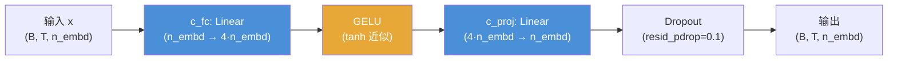
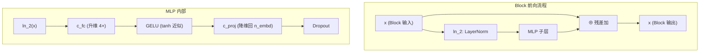

在 Transformer 解码器的每个 Block 中，多头因果自注意力负责建模序列内 token 间的交互关系，而紧随其后的**位置前馈网络（Position-wise Feed-Forward Network, MLP）**则承担逐位置的非线性特征变换。GPT-2 的 MLP 采用 **4× 内部扩展** 结构和 **tanh 近似 GELU** 激活函数——这两个设计选择共同决定了模型在每一层的表达能力与计算开销。本页将深入解析 `MLP` 类的维度编排、GELU tanh 近似的数学公式与工程动机，以及它们在 Block 残差路径中的集成方式。

## MLP 结构：c_fc → GELU → c_proj 的两阶段变换

GPT-2 的前馈网络由两个线性投影夹一个非线性激活构成，其数据流可概括为"升维—激活—降维"三步。

**升维投影 `c_fc`** 将隐藏维度从 `n_embd` 扩展到 `4 * n_embd`。这个 4 倍的扩展率直接沿袭自原始 Transformer 论文的设计，使中间层的维度远大于输入输出维度，为非线性激活函数提供更大的工作空间。以 GPT-2 Small 为例，`n_embd = 768` 时中间层达到 3072 维，`c_fc` 层单独就贡献了约 2.36M 参数（768 × 3072 + 3072）。**降维投影 `c_proj`** 将维度恢复回 `n_embd`，确保残差连接的形状匹配。`c_proj` 的权重在初始化阶段还会被额外的残差缩放因子 `1/√(2·n_layer)` 衰减（详见 [残差路径缩放初始化](8-can-chai-lu-jing-suo-fang-chu-shi-hua-1-2-n_layer-de-zuo-yong-yu-yuan-li)），以稳定深层堆叠时的方差传播。最终的 Dropout 层以 `resid_pdrop = 0.1` 的概率随机置零，起到正则化作用。

Sources: [model.py](model.py#L102-L113)

## tanh 近似 GELU：公式、精度与工程动机

GELU（Gaussian Error Linear Unit）是 ReLU 的平滑替代品，其精确数学定义为 `GELU(x) = x · Φ(x)`，其中 `Φ(x)` 是标准正态分布的累积分布函数（CDF），通过误差函数 `erf` 计算。然而，`erf` 在大多数硬件上没有高效的专用指令，其计算成本高于基本算术运算。GPT-2 官方实现选择了一个基于 `tanh` 的多项式近似公式：

$$\text{GELU}(x) \approx 0.5 \cdot x \cdot \left(1 + \tanh\!\left(\sqrt{\frac{2}{\pi}} \cdot \left(x + 0.044715 \cdot x^3\right)\right)\right)$$

这个近似公式在整个实数轴上的最大绝对误差约为 0.0001 量级，在工程精度上几乎不可区分。代码实现直接将该公式翻译为一行 PyTorch 表达式，其中 `torch.pow(x, 3.0)` 计算立方项，`math.sqrt(2.0 / math.pi)` 是预计算的常数 ≈ 0.7978。

Sources: [model.py](model.py#L52-L61)

### GELU 变体对比

| 特性 | 精确 GELU（erf） | tanh 近似 GELU | ReLU |
|---|---|---|---|
| **公式** | `0.5x(1 + erf(x/√2))` | `0.5x(1 + tanh(√(2/π)·(x + 0.044715x³)))` | `max(0, x)` |
| **导数在 x=0** | 平滑连续 | 平滑连续 | 不连续（不可导） |
| **负区间行为** | 微小负值输出（平滑过渡） | 微小负值输出（略有偏差） | 硬性截断为零 |
| **计算成本** | 较高（需 `erf` 特殊函数） | 较低（`tanh` + 基本算术） | 极低 |
| **使用方** | GPT-1（PyTorch 默认） | **GPT-2 官方实现** | 原始 Transformer |
| **梯度饱和风险** | 低 | 低 | 神经元死亡风险 |

GPT-1 使用的是 PyTorch 的 `nn.GELU()` 默认实现（精确 erf 版本），而 GPT-2 刻意改用 tanh 近似版本。这一选择的核心动机是**权重兼容性**：当加载 OpenAI 官方发布的 GPT-2 预训练权重时，必须使用与训练时完全一致的激活函数，否则微小的数值差异会逐层累积放大，导致推理输出不可复现。对于从头训练的场景，两种 GELU 变体在最终性能上几乎没有差异。

Sources: [model.py](model.py#L53-L56)

## Block 集成：Pre-LN 残差路径中的前馈子层

MLP 并非孤立运作，而是作为 Pre-LN Block 的第二个子层嵌入残差路径中。每个 Block 的前向计算遵循经典的 Pre-LN 范式：先对输入做 LayerNorm 归一化，再送入子层，最后通过残差连接与原始输入相加。

Block 的前向计算公式为 `x = x + self.mlp(self.ln_2(x))`，其中 `ln_2` 在 MLP 之前对输入进行归一化，确保进入 `c_fc` 的激活值具有稳定的均值和方差。这种 Pre-LN 结构相比 Post-LN（先子层后归一化）在深层模型中梯度更稳定，是 GPT-2 从 GPT-1 继承的关键架构特征。MLP 子层只对每个位置独立变换——`c_fc` 的权重在时间维度 `T` 上共享，不同 token 之间通过同一组参数做相同的非线性映射，这正是"position-wise"的含义。

Sources: [model.py](model.py#L116-L133)

## 前馈网络的参数开销分析

MLP 是 Transformer 中参数量最密集的组件之一。下表展示了四种 GPT-2 规模下 MLP 的参数分布：

| 模型规模 | n_embd | 内部维度 (4×) | c_fc 参数 | c_proj 参数 | MLP 总参数/层 |
|---|---|---|---|---|---|
| **Small** (124M) | 768 | 3,072 | 2,362,368 | 2,360,064 | 4,722,432 |
| **Medium** (355M) | 1,024 | 4,096 | 4,197,376 | 4,194,304 | 8,391,680 |
| **Large** (774M) | 1,280 | 5,120 | 6,555,136 | 6,551,296 | 13,106,432 |
| **XL** (1558M) | 1,600 | 6,400 | 10,241,600 | 10,235,600 | 20,477,200 |

（参数量计算：c_fc = n_embd × 4·n_embd + 4·n_embd；c_proj = 4·n_embd × n_embd + n_embd）

在 GPT-2 Small 的 12 层 Block 中，所有 MLP 合计约 56.7M 参数，占模型总参数量（124M）的约 46%。这说明前馈网络和注意力层各贡献了模型的近一半参数——理解 MLP 的维度编排对于把握模型规模与计算瓶颈至关重要。

Sources: [model.py](model.py#L107-L108), [model.py](model.py#L36-L49)

## 推荐阅读

- **[残差路径缩放初始化：1/√(2·n_layer) 的作用与原理](8-can-chai-lu-jing-suo-fang-chu-shi-hua-1-2-n_layer-de-zuo-yong-yu-yuan-li)** — MLP 的 `c_proj` 权重如何被额外缩放以稳定深层训练
- **[多头因果自注意力：QKV 融合投影、因果掩码与残差缩放](6-duo-tou-yin-guo-zi-zhu-yi-li-qkv-rong-he-tou-ying-yin-guo-yan-ma-yu-can-chai-suo-fang)** — Block 中另一个子层的结构与 MLP 的协作关系
- **[解码器 Transformer 整体架构：嵌入、Block 堆叠与末层归一化](5-jie-ma-qi-transformer-zheng-ti-jia-gou-qian-ru-block-dui-die-yu-mo-ceng-gui-hua)** — MLP 如何嵌入完整的 Block 堆叠与模型全景