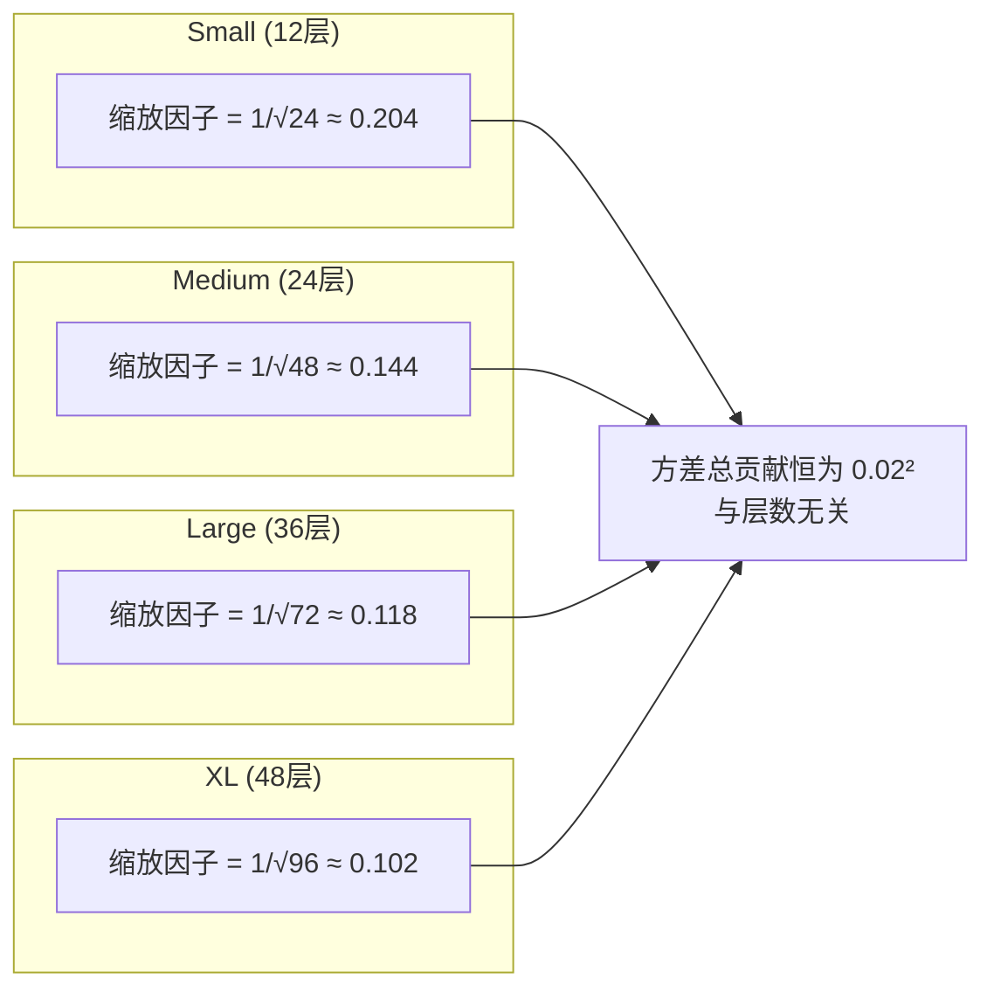

在深层 Transformer 的训练中，**残差连接**是让信号穿越数十层而不衰减的核心机制。然而残差路径并非"免费午餐"——如果每条残差支路的输出方差与层数成正比地累积，深层模型在初始化时的隐藏状态方差会随深度发散，导致梯度爆炸或表示退化。GPT-2 采用了一个优雅的数学技巧：将注意力子层和前馈子层的输出投影权重 `c_proj` 按因子 `1/√(2·n_layer)` 额外缩放，使深层残差路径的方差累积与层数无关。本文将拆解这一初始化策略的代码实现、作用范围与数学原理。

---

## 初始化的两阶段流程

GPT-2 的权重初始化分为**两个串行阶段**。第一阶段是通用初始化，通过 `self.apply(self._init_weights)` 对所有子模块统一赋值：`Linear` 和 `Embedding` 权重采样自 `N(0, 0.02)`，`LayerNorm` 的 gamma 置 1、beta 置 0。第二阶段是残差路径专属的缩放覆盖，遍历所有命名参数，将名称以 `c_proj.weight` 结尾的参数用更小的标准差 `0.02 / √(2·n_layer)` 重新采样。

```python
# 阶段一：通用初始化
self.apply(self._init_weights)

# 阶段二：残差路径缩放覆盖
for name, param in self.named_parameters():
    if name.endswith("c_proj.weight"):
        nn.init.normal_(param, mean=0.0, std=0.02 / math.sqrt(2 * cfg.n_layer))
```

两阶段设计的关键在于：先施加统一规则，再对关键路径做定向微调。第二阶段的 `normal_` 调用会完全覆盖第一阶段对同一参数的赋值——`c_proj.weight` 的最终标准差是 `0.02 / √(2·n_layer)`，而非 `0.02`。

Sources: [model.py](model.py#L150-L155)

---

## c_proj 的定位：残差路径上的"最后一道门"

要理解为何只缩放 `c_proj`，需要看清 Transformer Block 的内部数据流。每个 Block 包含两个子层，各有一条残差连接：

```
x = x + attn(ln_1(x))     # 子层 1：因果自注意力
x = x + mlp(ln_2(x))      # 子层 2：前馈网络
```

`c_proj` 恰好出现在每条残差支路**汇入主干之前**的位置——它是子层输出加回到残差流之前的最后一个线性变换。以下表格列出所有 `c_proj` 实例及其在数据流中的位置：

| 所属模块 | 参数名模式 | 输入/输出维度 | 残差连接中的角色 |
|---|---|---|---|
| `CausalSelfAttention.c_proj` | `h.{i}.attn.c_proj.weight` | `n_embd → n_embd` | 注意力输出投影，加回到 `x` |
| `MLP.c_proj` | `h.{i}.mlp.c_proj.weight` | `4·n_embd → n_embd` | 前馈输出投影，加回到 `x` |

注意被**排除**在缩放之外的线性层：注意力的 `c_attn`（QKV 融合投影）和 MLP 的 `c_fc`（升维投影）不参与残差加法，因此保持标准差 `0.02` 不变。这一选择性缩放精准地瞄准了"方差累积点"。

Sources: [model.py](model.py#L77-L78), [model.py](model.py#L107-L108), [model.py](model.py#L130-L133)

---

## 数学原理：为何分母是 √(2·n_layer)

### 问题建模

考虑初始化时残差流中某个位置的隐藏向量 `x`。在进入第一个 Block 之前，`x` 的方差记为 `Var(x₀)`。每经过一个子层的残差加法：

```
x_new = x + c_proj(sublayer_output)
```

其中 `c_proj(sublayer_output)` 是残差支路的贡献，记为 `Δx`。由于 `x` 和 `Δx` 在初始化时近似独立，方差相加：

```
Var(x_new) ≈ Var(x) + Var(Δx)
```

每个 Block 有 **2 条**残差路径（注意力 + 前馈），整个模型有 `n_layer` 个 Block，因此残差加法的总次数为 `2 · n_layer`。

### 不缩放时的方差发散

如果不做缩放，每个 `c_proj.weight` 的标准差为 `0.02`，则每条残差支路贡献的方差 `Var(Δx)` 正比于 `0.02²`。经过 `2 · n_layer` 次累加后：

```
Var(x_final) ≈ Var(x₀) + 2·n_layer · Var(Δx)
```

方差随层数线性增长。对于 GPT-2 XL（`n_layer=48`），最终方差约为基础方差的 **96 倍**，隐藏向量的数值范围急剧膨胀，严重威胁训练稳定性。

### 缩放后的方差守恒

将 `c_proj` 的标准差设为 `0.02 / √(2·n_layer)` 后，每条支路的方差变为：

```
Var(Δx) ∝ (0.02 / √(2·n_layer))² = 0.02² / (2·n_layer)
```

经过全部 `2 · n_layer` 次累加后，方差总增量为：

```
2·n_layer × 0.02² / (2·n_layer) = 0.02²
```

**结果与 `n_layer` 无关**——无论模型有 12 层还是 48 层，残差路径对主干的方差总贡献恒定为 `0.02²`。这就是分母中 `2` 和 `n_layer` 的精确含义：`2` 代表每层有两条残差路径，`n_layer` 代表层数，`√` 将方差缩放转化为标准差缩放。

以下 Mermaid 图直观展示了不同模型规模下的缩放因子：



Sources: [model.py](model.py#L8-L9), [model.py](model.py#L151-L155)

---

## 代码实现细节：命名约定驱动的精准匹配

缩放的实现依赖 PyTorch 的参数命名体系。`nn.Module.named_parameters()` 返回的参数名采用点号连接的层级路径，例如 `transformer.h.3.attn.c_proj.weight` 表示第 4 个 Block 中注意力模块的 `c_proj` 权重。代码通过 `name.endswith("c_proj.weight")` 进行匹配，这保证了：

- **注意力 `c_proj`**（`h.{i}.attn.c_proj.weight`）被匹配 ✓
- **MLP `c_proj`**（`h.{i}.mlp.c_proj.weight`）被匹配 ✓
- **注意力 `c_attn`**（`h.{i}.attn.c_attn.weight`）不匹配 ✗
- **MLP `c_fc`**（`h.{i}.mlp.c_fc.weight`）不匹配 ✗
- **LM Head**（复用 `wte.weight`）不匹配 ✗

这一命名匹配策略使得缩放范围恰好覆盖所有位于残差路径汇合点的线性层，而不影响子层内部的投影。实现简洁且语义精确。

Sources: [model.py](model.py#L153-L155), [model.py](model.py#L78), [model.py](model.py#L108)

---

## 与其他初始化策略的对比

| 策略 | 适用对象 | 核心思想 | 与 GPT-2 方式的关系 |
|---|---|---|---|
| **GPT-2 残差缩放** | `c_proj` 权重 | 按 `1/√(2·n_layer)` 缩小残差路径方差 | 本文主题 |
| GPT-2 通用初始化 | 所有 Linear/Embedding | `N(0, 0.02)` 统一小方差 | 残差缩放在其基础上的定向覆盖 |
| ReZero (Bachlechner et al.) | 残差连接 | 用可学习的标量替代 LayerNorm，初始为 0 | 更激进：初始时残差支路完全不输出 |
| SkipInit (Dehghani et al.) | 残差连接 | 用固定标量缩放残差支路，类似 BatchNorm 初始化 | 学习式 vs 固定式，GPT-2 选择固定式 |
| Fixup (Zhang et al.) | 深层残差网络 | 多层级缩放，无需 LayerNorm 也能训练极深网络 | 同属"缩小残差路径"家族，但数学推导路径不同 |

GPT-2 的方案可以视为 **SkipInit 的固定标量变体**——它不引入额外可学习参数，而是在初始化阶段一次性设置好方差守恒的条件，后续训练中权重自由更新。这种"初始化即正则"的设计在 Transformer 社区已成为事实标准，后续的 GPT-3、LLaMA 等模型均沿用了此策略。

Sources: [model.py](model.py#L150-L167)

---

## 深入阅读

- 想了解 `c_proj` 在注意力前向传播中的完整数据流，参见 [多头因果自注意力：QKV 融合投影、因果掩码与残差缩放](6-duo-tou-yin-guo-zi-zhu-yi-li-qkv-rong-he-tou-ying-yin-guo-yan-ma-yu-can-chai-suo-fang)
- 想了解 MLP 中 `c_proj` 的具体位置，参见 [前馈网络与 tanh 近似 GELU 激活函数](7-qian-kui-wang-luo-yu-tanh-jin-si-gelu-ji-huo-han-shu)
- 想了解不同模型规模下 `n_layer` 如何影响缩放因子大小，参见 [四种模型规模预设：Small / Medium / Large / XL 配置详解](10-si-chong-mo-xing-gui-mo-yu-she-small-medium-large-xl-pei-zhi-xiang-jie)
- 想了解整体初始化如何影响训练稳定性，参见 [Adam 优化器配置：权重衰减分组与 β2=0.999 的选择](15-adam-you-hua-qi-pei-zhi-quan-zhong-shuai-jian-fen-zu-yu-b2-0-999-de-xuan-ze)