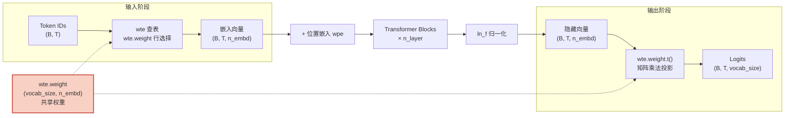

权重绑定（Weight Tying）是 GPT-2 架构中一个看似微小却影响深远的设计决策：语言模型输出层的投影矩阵与输入层的 Token 嵌入矩阵**共享同一组参数**。这一机制在减少模型参数量的同时，将"从词表到语义空间"和"从语义空间回到词表"这两条对称路径统一在同一组权重之上，构成了输入嵌入与输出投影之间的数学对偶关系。本文将深入解析本项目中权重绑定的实现细节、数学原理以及它对训练与推理的实际影响。

Sources: [model.py](model.py#L179-L209)

## 核心概念：一张矩阵的两个角色

在标准的语言模型中，存在两个维度为 `vocab_size × n_embd` 的大型参数矩阵。第一个是**输入嵌入矩阵**（`wte`），它通过查表操作将 Token ID 映射为密集的嵌入向量；第二个是**输出投影矩阵**（LM Head），它将 Transformer 末层的隐藏向量映射回整个词表的 logits 分布。如果不做绑定，这两个矩阵各自独立学习，参数量翻倍。

权重绑定的核心洞察在于：这两个操作本质上是**互逆的线性变换**。输入嵌入是"Token → 语义"方向的映射，输出投影是"语义 → Token"方向的映射。既然方向相反、维度对齐，使用同一矩阵的转置来分别执行这两个操作在数学上是自洽的——嵌入查表取矩阵的第 $i$ 行，而输出投影则是计算隐藏向量与每一列（即每一行的转置）的点积。

Sources: [model.py](model.py#L179-L187)

## 实现解析：引用传递而非参数复制

### LMHead 的构建

权重绑定在本项目中的实现极为精炼。`LMHead` 类不持有任何自己的可学习参数，而是在构造时接收外部传入的 `nn.Embedding` 对象引用：

```python
class LMHead(nn.Module):
    def __init__(self, wte: nn.Embedding):
        super().__init__()
        self.wte = wte                          # 存储引用，而非副本

    def forward(self, hidden):
        return hidden @ self.wte.weight.t()      # (B, T, n_embd) @ (n_embd, vocab_size)
```

这里的关键是 Python 的引用语义：`self.wte = wte` 保存的是 `GPTModel.wte` 对象的引用，而非对权重的深拷贝。两个 `self.wte` 指向同一个 `nn.Embedding` 实例，因此 `wte.weight` 是同一块内存。

Sources: [model.py](model.py#L179-L187)

### GPT 顶层组装：传递同一个 wte 对象

在 `GPT.__init__` 中，绑定关系通过一行代码确立：

```python
self.transformer = GPTModel(cfg)
self.lm_head = LMHead(self.transformer.wte)     # 权重绑定
```

`self.transformer.wte` 先被 `GPTModel` 在构造时创建为 `nn.Embedding(vocab_size, n_embd)`，随后同一个对象引用被传入 `LMHead`。从这一刻起，Transformer 主体中的嵌入查找和 LM 头中的输出投影操作在同一个 `(vocab_size, n_embd)` 权重张量上执行。

Sources: [model.py](model.py#L199-L203), [model.py](model.py#L142-L145)

### 前向传播的数据流

整个前向路径分为两个清晰阶段，`GPT.forward` 将它们串联：

```python
def forward(self, idx):
    return self.lm_head(self.transformer(idx))   # LM logits
```

下方的流程图展示了 Token ID 从输入到 logits 输出的完整路径，以及共享权重在其中扮演的双重角色：



图中橙色高亮的 `wte.weight` 是**唯一**参与两条路径的参数张量。在输入阶段，`nn.Embedding` 的前向逻辑从中按行索引取出 Token 对应的嵌入向量；在输出阶段，`LMHead` 将其转置后作为线性投影矩阵，计算隐藏向量与每个词表项的相似度。

Sources: [model.py](model.py#L169-L176), [model.py](model.py#L186-L187), [model.py](model.py#L208-L209)

## 参数节省量化分析

权重绑定最直接的收益是大幅减少参数量。以 GPT-2 论文的四种规模为例，Token 嵌入矩阵的大小为 `vocab_size × n_embd`，在未绑定的设计中，LM Head 会额外引入同等规模的独立投影矩阵：

| 模型规模 | n_embd | vocab_size | wte 参数量 | 未绑定 LM Head 额外参数 | 绑定后节省 | 节省占总量比 |
|---------|--------|------------|-----------|----------------------|-----------|-------------|
| Small (124M) | 768 | 50,257 | 38.6M | 38.6M + 0.05M(bias) | ~38.6M | ~23.8% |
| Medium (355M) | 1,024 | 50,257 | 51.5M | 51.5M + 0.05M(bias) | ~51.5M | ~12.7% |
| Large (774M) | 1,280 | 50,257 | 64.3M | 64.3M + 0.05M(bias) | ~64.3M | ~7.7% |
| XL (1558M) | 1,600 | 50,257 | 80.4M | 80.4M + 0.05M(bias) | ~80.4M | ~4.9% |

可以看到，模型规模越小，权重绑定带来的参数节省比例越显著。对于 GPT-2 Small，绑定的嵌入矩阵几乎占了总参数量的四分之一。这也解释了为什么权重绑定在小模型中更为关键。值得注意的是，本项目使用的是教学规模（`vocab_size=256`, `n_embd=128`），嵌入矩阵仅 32K 参数，节省效应不明显，但机制完全一致。

Sources: [model.py](model.py#L24-L28), [model.py](model.py#L36-L49), [main.py](main.py#L139-L145)

## 梯度流：同一权重接收双向信号

权重绑定不仅影响前向计算，更深刻地改变了反向传播的梯度结构。由于 `wte.weight` 同时参与嵌入查表（输入路径）和输出投影（输出路径），反向传播时它接收来自两条路径的梯度**累加**：

$$\frac{\partial \mathcal{L}}{\partial \mathbf{E}} = \underbrace{\frac{\partial \mathcal{L}}{\partial \mathbf{E}}\bigg|_{\text{embedding}}}_{\text{来自输入嵌入路径}} + \underbrace{\frac{\partial \mathcal{L}}{\partial \mathbf{E}}\bigg|_{\text{projection}}}_{\text{来自输出投影路径}}$$

其中 $\mathbf{E} \in \mathbb{R}^{V \times d}$ 是共享的嵌入矩阵。这种双向梯度信号实际上对嵌入矩阵形成了一种隐式的**正则化效果**：同一种 token 表示既要擅长"被查找"（输入侧需要区分不同 token），又要擅长"被匹配"（输出侧需要生成正确 token 的 logits）。两条目标的叠加使得嵌入矩阵学到更具泛化能力的表示。

在训练循环中，损失函数对 logits 计算 Cross-Entropy，梯度自然沿着输出投影路径回流到 `wte.weight`；同时，位置 0 的梯度信号沿着嵌入查表路径也回流到同一权重。PyTorch 的自动微分引擎自动处理这种共享参数的梯度累加，无需任何额外代码。

Sources: [train.py](train.py#L76-L84), [model.py](model.py#L208-L209)

## 优化器中的参数去重

一个值得关注的实现细节是：共享的 `wte` 权重在优化器参数组中**不会被重复计数**。PyTorch 的 `Module.named_modules()` 内部使用 `memo` 集合基于对象身份去重——尽管 `wte` 同时挂载在 `GPTModel`（`self.transformer.wte`）和 `LMHead`（`self.lm_head.wte`）两个路径下，它在模块树中只被遍历一次。因此 `train.py` 中的 `_split_decay_groups` 函数将 `wte.weight` 归入权重衰减组时，该参数只出现一次：

```python
def _split_decay_groups(model: nn.Module, weight_decay: float):
    decay, no_decay = [], []
    for module in model.modules():                    # named_modules 内部 memo 去重
        for name, param in module.named_parameters(recurse=False):
            ...
            if name.endswith("bias") or isinstance(module, nn.LayerNorm):
                no_decay.append(param)
            else:
                decay.append(param)                   # wte.weight 在此仅加入一次
```

`wte.weight` 是 2D 权重（非 bias，非 LayerNorm），因此归入施加权重衰减的 `decay` 组，与 GPT-2 的标准做法一致。

Sources: [train.py](train.py#L38-L55)

## 设计权衡：为什么选择绑定

权重绑定并非免费的午餐，它在带来好处的同时也存在潜在的代价。以下表格对比了绑定与非绑定两种策略的关键差异：

| 维度 | 权重绑定（GPT-2 采用） | 独立 LM Head（如部分 T5 实现） |
|------|----------------------|------------------------------|
| **参数量** | 嵌入矩阵仅一份，大幅节省 | 需要两份大矩阵，参数量翻倍 |
| **语义对偶性** | 输入/输出共享同一语义空间，表示一致 | 输入和输出可学到不同特征子空间 |
| **正则化效果** | 双向梯度形成隐式正则，降低过拟合风险 | 独立参数有更大容量，但更易过拟合 |
| **表达能力** | 嵌入空间受输出约束，可能限制表示灵活性 | 输出投影可学习更复杂的映射关系 |
| **初始化一致性** | `N(0, 0.02)` 同时服务两个角色 | 可对两个矩阵分别设计初始化方案 |
| **部署成本** | 仅需存储/加载一份嵌入矩阵 | 需额外存储 LM Head 权重 |

GPT-2 的设计者选择了绑定方案，其核心考量是：在词表高达 50,257 的字节级 BPE 设置下，嵌入矩阵本身就占据了可观的参数比例（Small 中约 31%），不绑定将使模型显著膨胀。同时，实验经验表明绑定方案在语言建模任务上的性能损失极小，性价比极高。

Sources: [model.py](model.py#L9), [model.py](model.py#L157-L164)

## 初始化：一个 N(0, 0.02) 服务两个角色

权重绑定还带来一个初始化层面的约束：由于 `wte.weight` 同时充当嵌入矩阵和输出投影矩阵，它只能接受**一套初始化方案**。本项目遵循 GPT-2 的标准做法，对所有 Linear 和 Embedding 权重统一使用 `N(0, 0.02)` 正态分布：

```python
@staticmethod
def _init_weights(module):
    if isinstance(module, nn.Linear):
        nn.init.normal_(module.weight, mean=0.0, std=0.02)
    elif isinstance(module, nn.Embedding):
        nn.init.normal_(module.weight, mean=0.0, std=0.02)
    ...
```

`GPTModel.__init__` 通过 `self.apply(self._init_weights)` 在模型构建完成后统一调用此初始化函数。由于 `wte` 是 `nn.Embedding` 实例，它被初始化为 `N(0, 0.02)`；而 `LMHead` 本身没有任何可学习参数（不包含 `nn.Linear`），因此不会对 `wte` 进行第二次初始化。这种设计保证了嵌入矩阵在被两条路径共享之前，拥有一致的初始分布。

Sources: [model.py](model.py#L157-L167), [model.py](model.py#L150)

## 小结

权重绑定是 GPT-2 架构中"小代码、大影响"的典型设计。通过将 `LMHead` 实现为对 `wte.weight` 转置矩阵的乘法运算，项目仅用 9 行代码就完成了嵌入与输出的参数共享。这一机制在前向计算中将 Token ID 到 logits 的完整路径统一在同一组权重之上，在反向传播中让嵌入矩阵接收双向梯度信号，在参数效率上为 GPT-2 Small 节省了约 38M 参数。理解这一机制，是把握 GPT-2 参数效率设计的关键一环。

了解嵌入与输出的共享机制后，可以继续阅读 [四种模型规模预设：Small / Medium / Large / XL 配置详解](10-si-chong-mo-xing-gui-mo-yu-she-small-medium-large-xl-pei-zhi-xiang-jie) 了解权重绑定在不同规模下的量化影响，或前往 [无监督语言模型预训练循环：目标函数与批次采样](14-wu-jian-du-yu-yan-mo-xing-yu-xun-lian-xun-huan-mu-biao-han-shu-yu-pi-ci-cai-yang) 探索绑定权重在训练循环中的梯度流动实践。